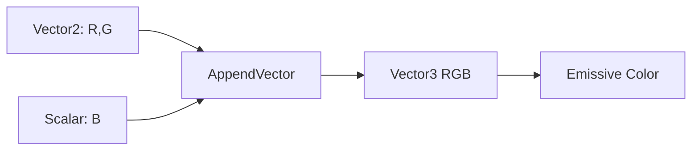

# 03.01 — Shader з абсолютного нуля: calculations, values і color data

## 1. Назва

**Shader з абсолютного нуля: calculations, values і color data.**

Урок вводить Material Editor як програму, що обчислює значення для поверхні, а не як набір «магічних» ефектів. Усі наступні графи спиратимуться на цей mental model.

## 2. Результат уроку

Після уроку ви зможете:

- пояснити різницю між material, shader і Material Graph;
- розрізнити vertex та pixel calculations;
- читати Scalar, Vector2, Vector3 і Vector4 як набори чисел;
- пояснити RGB і alpha як незалежні канали даних;
- передбачити вигляд grayscale mask для значень `0`, `0.5`, `1`, менше `0` і більше `1`;
- відрізнити linear data від sRGB-encoded color data на робочому рівні;
- використати HDR-значення в `Emissive Color`;
- створити й перевірити три мінімальні debug materials без готових functions.

Ключовий deliverable: `M_L03_01_ScalarDebug`, `M_L03_01_VectorDebug` і `M_L03_01_ValueTypeDebug`, а також таблиця спостережень для діапазонів і color data.

## 3. Орієнтовний час

**8 годин: 3 години теорії / 5 годин практики.**

- 45 хв — mental model shader/material;
- 45 хв — vertex і pixel calculations;
- 45 хв — value types, channels і masks;
- 45 хв — linear, sRGB, HDR та Emissive;
- 60 хв — controlled experiments;
- 150 хв — guided practice;
- 90 хв — exercises A/B і self-check.

## 4. Prerequisites

- пройдений mastery gate `G02`;
- створений UE 5.8 project і папки `/Game/SVFX/Core/Materials/` та `/Game/SVFX/Tests/`;
- уміння створити asset через Content Browser і зберегти його;
- жодне знання shader math не передбачається.

## 5. Нові терміни

- **Shader** — програма, яку GPU виконує для багатьох vertices або pixels/fragments.
- **Material** — Unreal asset, що описує властивості поверхні та генерує потрібні shader programs.
- **Material Graph** — node-based запис обчислень material.
- **Vertex** — точка mesh із position та іншими attributes.
- **Pixel/fragment calculation** — обчислення для видимого sample поверхні під час rasterization.
- **Scalar / float1** — одне число.
- **Vector2 / float2** — два числа, наприклад UV.
- **Vector3 / float3** — три числа, наприклад RGB або XYZ.
- **Vector4 / float4** — чотири числа, наприклад RGBA.
- **Channel** — один компонент vector: R, G, B або A.
- **Mask** — значення, що керує впливом; зазвичай `0` означає «ні», `1` — «повністю».
- **Linear value** — числове значення, з яким shader math працює пропорційно фізичній/математичній величині.
- **sRGB** — нелінійне кодування display-oriented color data.
- **HDR** — color/intensity data, що може перевищувати `1`.
- **Emissive Color** — material input для світного color contribution; значення понад `1` можуть створювати яскравий HDR output.

## 6. Навіщо ця тема потрібна VFX artist

Real-time VFX майже завжди керує числами: lifetime, opacity, color, UV, distortion, dissolve threshold, particle attributes. Якщо сприймати node лише за назвою, помилка перетворюється на вгадування. Якщо бачити тип і діапазон даних, можна передбачити результат до compile.

Три типові production-задачі вже зводяться до цього уроку:

1. mask `0–1` вирішує, де видно slash;
2. RGB vector задає колір вогню;
3. HDR multiplier робить core яскравішим за звичайний білий.

## 7. Теорія простими словами

Material Graph — це конвеєр чисел. Кожен node:

1. отримує одне або кілька значень;
2. виконує операцію;
3. передає результат далі.

GPU повторює ці обчислення у великій кількості. Vertex stage працює з vertices mesh. Pixel stage визначає видимий результат для surface samples. Не думайте, що Material Graph «малює картинку один раз»: він описує правило, яке виконується для поточної геометрії, camera і textures.

Scalar можна подати в color input. Unreal поширить одне число на потрібні color components: `0.25` виглядатиме як темно-сірий. Vector3 `(1, 0, 0)` виглядатиме червоним. Vector4 `(1, 0, 0, 0.5)` містить red RGB і alpha `0.5`, але alpha нічого не зробить, доки ви явно не використаєте його в обчисленні або material input.

Діапазон `0–1` — домовленість, а не стіна:

- `0` — чорний / нульовий вплив;
- `1` — білий / повний вплив;
- `0.5` — половинний numeric value;
- `-1` і `2` залишаються валідними числами всередині graph;
- display/output може clamp, tone-map або інтерпретувати їх залежно від input і render pipeline.

## 8. Детальні технічні пояснення

### Material і згенерований shader

Unreal компілює Material Graph у shader permutations, потрібні вибраним properties і platform. Сам node graph не виконується як Blueprint tick. Він стає shader code.

Матеріал може мати різні inputs залежно від `Material Domain`, `Blend Mode` і `Shading Model`. У цьому уроці всі debug materials мають:

- `Material Domain = Surface`;
- `Blend Mode = Opaque`;
- `Shading Model = Unlit`;
- `Two Sided = False`;
- output лише в `Emissive Color`.

Так ми прибираємо lighting зі спостереження: output показує числовий color result без Base Color lighting response.

### Vertex проти pixel calculations

Material input `World Position Offset` змінює vertex position і належить до vertex-stage мислення. `Emissive Color` і більшість surface color operations оцінюються для pixels/fragments. Якщо plane має лише чотири vertices, vertex deformation має чотири опорні значення, тоді як pixel color може показувати деталь, обмежену texture resolution і screen sampling.

Не кожен node дозволений або однаково поводиться в кожному shader stage. Цей урок не вчить переносити довільний pixel graph у WPO.

### Типи й автоматичне розширення

Material Editor показує тип output pin через tooltip і колір connector. Практично важливо запитувати:

- скільки components виходить;
- який semantic meaning кожного;
- який очікуваний діапазон;
- чи відбувається implicit conversion.

Scalar, поданий у `Emissive Color`, повторюється як grayscale RGB. Vector4, поданий у three-component color input, використовує сумісні color components; зайвий alpha не стає opacity автоматично.

**Потребує ручної перевірки в Unreal Engine 5.8.** Звірте tooltip типів pins і повідомлення compiler для конкретного 5.8.x build; офіційний Expressions Reference не є вичерпним.

### RGB, alpha і masks

RGB — не «три кольори текстури», а три числові канали. Їх можна використати як:

- видимий color;
- три незалежні grayscale masks;
- direction XYZ;
- довільний packed data vector.

Alpha — четвертий channel, не синонім прозорості. Прозорість виникає лише коли alpha або інше значення під’єднане до `Opacity`/`Opacity Mask` у material з відповідними properties.

### Linear і sRGB

Shader math має виконуватися над linear values. sRGB — спосіб кодувати display-oriented color так, щоб ефективніше використовувати precision для сприйняття людиною. Unreal texture setting `sRGB` повідомляє, чи texture sample слід декодувати як color data.

Робоче правило:

- painted color/albedo-like color зазвичай імпортується як sRGB color;
- masks, packed channels, normals і числові data textures не повинні проходити sRGB color decoding;
- остаточне setting завжди перевіряється за semantic data, не за extension файлу.

### HDR та Emissive

Vector color `(1, 0.2, 0)` має channel values у межах `0–1`. Якщо помножити intensity до `(10, 2, 0)`, це HDR output. Він може виглядати яскравіше й давати bloom за відповідних post-process settings. HDR не означає, що material освітлює scene як Light.

Bloom залежить від exposure/post-process, тому mastery перевіряється numeric parameter і stable material output, а не лише наявністю glow.

## 9. Візуальні або математичні приклади

| Дані | Як читати | Очікуваний debug color |
|---|---|---|
| Scalar `0` | `(0,0,0)` після grayscale expansion | black |
| Scalar `0.25` | `(0.25,0.25,0.25)` | темно-сірий |
| Scalar `1` | `(1,1,1)` | білий |
| Scalar `2` | HDR `(2,2,2)` | понад standard white до tone mapping |
| Vector3 `(1,0,0)` | RGB | червоний |
| Vector3 `(0,1,0)` | RGB | зелений |
| Vector3 `(0,0,1)` | RGB | синій |
| Vector4 `(1,0.5,0,0.2)` | RGBA data | Emissive використовує RGB; A не стає opacity сам |

Маска як коефіцієнт:

```text
result = effect * mask
mask = 0.0  → effect contributes 0%
mask = 0.5  → effect contributes 50%
mask = 1.0  → effect contributes 100%
```

У цьому уроці multiplication ще не будується як головний graph; формула лише пояснює роль mask і готує урок 03.02.

## 10. Controlled experiments

### Experiment 1 — scalar range

1. Створіть тимчасовий Unlit/Opaque material.
2. Під’єднайте `Constant` до `Emissive Color`.
3. Послідовно задайте `0`, `0.18`, `0.5`, `1`, `2`, `-1`.
4. Для кожного значення запишіть preview, numeric value і чи відрізняється preview від очікування.
5. Не робіть висновок про HDR лише за bloom; дивіться значення node.

### Experiment 2 — channel identity

1. Під’єднайте `Constant3Vector` до `Emissive Color`.
2. Перевірте `(1,0,0)`, `(0,1,0)`, `(0,0,1)`, `(1,1,1)`, `(0.5,0.5,0.5)`.
3. Поясніть кожен результат без слова «магічно».

### Experiment 3 — alpha is data

1. Створіть `Constant4Vector = (1,0,0,0)`.
2. Під’єднайте його RGB-compatible output до `Emissive Color`.
3. Змініть лише A з `0` на `1`.
4. У Opaque material visible RGB не повинен змінитися.
5. Зафіксуйте висновок: channel A не керує opacity без explicit connection і compatible Blend Mode.

### Experiment 4 — vertex density thought test

Порівняйте plane із 4 vertices та subdivided plane. Не будуйте WPO. Намалюйте, де існують vertex samples і де існують screen pixels. Поясніть, чому high-frequency vertex animation потребує достатньої geometry density.

## 11. Покрокова guided practice

### Graph A — `M_L03_01_ScalarDebug`

#### Material properties

- `Material Domain = Surface`
- `Blend Mode = Opaque`
- `Shading Model = Unlit`
- `Two Sided = False`
- `Use Material Attributes = False`

#### Повний node inventory

| Alias | Exact node | Type / value |
|---|---|---|
| `DebugValue` | `ScalarParameter` | Scalar; name `DebugValue`; default `0.5` |
| `MaterialOutput` | Main Material Node | root output |

#### Connections

```text
DebugValue.Output → MaterialOutput.Emissive Color
```

#### Пояснення branch

Єдина branch передає одне число в color input. Material Editor поширює scalar на RGB, тому preview стає grayscale. Graph навмисно мінімальний: якщо output неправильний, причина не захована в іншій math.

#### Проміжні checks

1. Не під’єднуючи node, переконайтеся, що preview Unlit material чорний.
2. Після connection `0.5` має дати рівномірний gray.
3. Змініть `DebugValue` на `0`, `1`, `4`. Material повинен compile без graph error.
4. Поверніть default `0.5` і збережіть.

### Graph B — `M_L03_01_VectorDebug`

#### Material properties

Такі самі, як Graph A.

#### Повний node inventory

| Alias | Exact node | Type / value |
|---|---|---|
| `DebugColor` | `VectorParameter` | Vector4; name `DebugColor`; default RGBA `(1.0, 0.1, 0.0, 1.0)` |
| `MaterialOutput` | Main Material Node | root output |

#### Connections

```text
DebugColor.RGB → MaterialOutput.Emissive Color
```

#### Пояснення branch

RGB components задають color. A зберігається в parameter, але не використовується. Це демонструє, що semantic meaning виникає через connection.

#### Проміжні checks

1. Set R/G/B по черзі в `1`, інші в `0`.
2. Set A в `0`, потім `1`; visible RGB має лишитися тим самим.
3. Set RGB `(4, 0.4, 0)`; preview стає HDR-orange, але bloom залежить від viewport/post-process.

### Graph C — `M_L03_01_ValueTypeDebug`

Цей graph показує, як зібрати Vector3 з Vector2 і Scalar.

#### Material properties

Такі самі, як Graph A.

#### Повний node inventory

| Alias | Exact node | Type / value |
|---|---|---|
| `RGValues` | `Constant2Vector` | Vector2 `(0.2, 0.7)` |
| `BlueValue` | `ScalarParameter` | Scalar; name `BlueValue`; default `0.1` |
| `ComposeRGB` | `AppendVector` | Vector2 + Scalar → Vector3 |
| `MaterialOutput` | Main Material Node | root output |

#### Connections

```text
RGValues.Output → ComposeRGB.A
BlueValue.Output → ComposeRGB.B
ComposeRGB.Output → MaterialOutput.Emissive Color
```

#### Пояснення branch

`AppendVector` не змішує values; він ставить components поруч. `(0.2,0.7)` плюс `0.1` утворюють `(0.2,0.7,0.1)`.

#### Проміжні checks

1. Preview `RGValues` як node preview: два components самі не мають повного RGB semantic.
2. Preview `ComposeRGB`: очікуйте green-dominant color.
3. Змініть `BlueValue` на `1`: output стає blue/magenta-shifted залежно від R/G.



## 12. Точні назви UE nodes, modules і settings

Використані exact Material Editor names:

- `ScalarParameter`
- `VectorParameter`
- `Constant`
- `Constant2Vector`
- `Constant3Vector`
- `Constant4Vector`
- `AppendVector`
- Main Material Node input `Emissive Color`
- material settings `Material Domain`, `Blend Mode`, `Shading Model`, `Two Sided`, `Use Material Attributes`

Keyboard shortcuts для створення nodes не є mastery requirement. **Потребує ручної перевірки в Unreal Engine 5.8.** Перевірте search labels, tooltip types і pin labels у конкретному 5.8.x.

## 13. Стартові значення параметрів

| Asset | Parameter | Type | Default | Safe study range |
|---|---|---|---:|---:|
| `M_L03_01_ScalarDebug` | `DebugValue` | Scalar | `0.5` | `-2…8` |
| `M_L03_01_VectorDebug` | `DebugColor` | Vector4 | `(1,0.1,0,1)` | RGB `0…8`, A `0…1` |
| `M_L03_01_ValueTypeDebug` | `BlueValue` | Scalar | `0.1` | `0…2` |

Study range не є production clamp. Його мета — побачити values inside і outside `0–1`.

## 14. Очікуваний результат кожного етапу

| Етап | Evidence | Очікуваний результат |
|---|---|---|
| Properties | screenshot Details | усі три materials — Surface/Opaque/Unlit |
| Scalar graph | graph + preview | uniform grayscale, керований `DebugValue` |
| Vector graph | graph + preview | RGB color змінюється незалежно; A не впливає |
| Value type graph | graph + preview | Vector2 + Scalar утворюють прогнозований Vector3 |
| Range test | observation table | студент описує `-1`, `0`, `0.5`, `1`, `>1` без плутанини |
| Compile/save | Content Browser evidence | немає compile errors; назви assets точні |

## 15. Самостійна вправа

### EX-L03-01-A — Value-type diagnostic set

Без копіювання guided graph створіть `M_EX_L03_01_ValueDiagnostic`.

**Завдання**

- Surface/Opaque/Unlit;
- зберіть RGB із `Constant2Vector` RG та `ScalarParameter` B;
- parameter має назву `B_Channel`;
- default `(R,G,B) = (0.15,0.55,0.9)`;
- output — `Emissive Color`;
- перевірте B у `0`, `0.5`, `1`, `3`.

**Обмеження**

- не використовуйте texture, function, Lerp або готовий material;
- graph має рівно одну connected data branch;
- кожен node має унікальний comment/alias у вашому connection list.

**Матеріали до здачі**

- material asset;
- screenshot properties;
- screenshot graph;
- чотири preview captures;
- список connections;
- 100–150 слів: що є Scalar, Vector2, Vector3 і чому A відсутній.

**Критерії приймання**

- RGB numeric result можна передбачити до compile;
- B змінює лише blue contribution;
- немає orphan nodes і compile errors.

## 16. Додаткова складніша вправа

### EX-L03-01-B — Linear, sRGB та HDR observation protocol

Створіть контрольований observation sheet, а не «красивий glow».

**Завдання**

1. Використайте `M_L03_01_VectorDebug`.
2. Перевірте RGB `(0.18,0.18,0.18)`, `(0.5,0.5,0.5)`, `(1,1,1)`, `(4,1,0.1)`.
3. Для кожного запишіть numeric input, preview description і чи є value SDR/HDR.
4. Імпортуйте одну маленьку color texture та її копію; в однієї залиште color-oriented `sRGB`, у другої вимкніть `sRGB`. Не будуйте фінальний texture material — лише порівняйте Texture Asset Editor preview і settings.
5. Поясніть, чому visual midpoint sRGB не слід автоматично вважати linear `0.5`.

**Обмеження**

- не змінюйте exposure між captures;
- не оцінюйте numeric correctness лише за bloom;
- запишіть exact UE 5.8.x build.

**Матеріали до здачі**

- таблиця мінімум із шести observations;
- два Texture Asset Editor captures;
- короткий висновок про color data проти mask data;
- рядок `Потребує ручної перевірки в Unreal Engine 5.8.` біля exact UI/settings, які ви бачили.

**Критерії приймання**

- HDR визначено за values, а не за post-process appearance;
- sRGB названо encoding/decoding concern, а не «режимом більш яскравої текстури»;
- жодна mask не оголошена sRGB color без semantic reason.

## 17. Три рівні підказок

### EX-L03-01-A

- **Hint 1 — напрямок:** спершу визначте, скільки components має кожне source value; зберіть три components лише в останньому node.
- **Hint 2 — exact nodes:** потрібні `Constant2Vector`, `ScalarParameter`, `AppendVector` і Main Material Node.
- **Hint 3 — майже повна структура:** RG ідуть у `AppendVector.A`, B — у `AppendVector.B`, output — у `Emissive Color`; перевірте, що parameter названий `B_Channel`.

Повне рішення після чесної спроби: [EX-L03-01-A](../EXERCISE_ANSWERS/L03-01_shader_mental_model_and_value_types_answers.md#ex-l03-01-a).

### EX-L03-01-B

- **Hint 1 — напрямок:** відокремте numeric truth від appearance; одна таблиця має містити input values і спостереження.
- **Hint 2 — exact settings:** у Texture Asset Editor знайдіть property `sRGB`; його розташування в UI: **Потребує ручної перевірки в Unreal Engine 5.8.**
- **Hint 3 — майже повний protocol:** зафіксуйте exposure, змінюйте лише material RGB; для texture copies змінюйте лише `sRGB`, а потім поясніть різницю між color і data semantics.

Повне рішення: [EX-L03-01-B](../EXERCISE_ANSWERS/L03-01_shader_mental_model_and_value_types_answers.md#ex-l03-01-b).

## 18. Типові помилки

- Називати Material Graph «картинкою», не пояснюючи calculations.
- Вважати, що alpha завжди означає transparency.
- Вважати `0–1` жорсткою межею для всіх internal values.
- Використовувати HDR і judge лише за bloom.
- Називати RGB тільки color, хоча channels можуть зберігати masks/data.
- Плутати Vector3 RGB із world-space XYZ без semantic context.
- Вважати sRGB «галочкою якості».
- Підключати Base Color у Unlit material і чекати той самий результат, що від Emissive.
- Залишати зайві orphan nodes, через що graph не відповідає connection list.

## 19. Troubleshooting

| Симптом | Імовірна причина | Перевірка | Виправлення |
|---|---|---|---|
| Preview чорний | node не connected або value `0` | trace connection до `Emissive Color` | відновіть connection; set `0.5` |
| Material реагує на light | `Shading Model` не `Unlit` або дивитесь інший asset | перевірте Details і asset name | set `Unlit`, Apply, Save |
| A змінює вигляд Opaque material | змінюється також RGB або інший graph | isolate `DebugColor.RGB` | disconnect зайві branches |
| HDR `4` виглядає як `1` | tone mapping/exposure/preview | порівняйте numeric value, зафіксуйте exposure | не використовуйте appearance як єдиний доказ |
| Compile type error | несумісне component count у конкретному connection | hover pins і compiler message | використайте `AppendVector`/component output свідомо |
| Texture copies виглядають однаково | content не показує midtones або asset не reloaded | перевірте settings і histogram-like variation | використайте texture з gradients/midtones |

Порядок діагностики:

1. точний asset;
2. material properties;
3. connection до root;
4. value і type node;
5. повідомлення compile;
6. context preview і exposure.

## 20. Performance considerations

- Мінімальні constant/parameter graphs дешеві, але мета уроку — correctness, не benchmark.
- Vector4 parameter не означає автоматично чотири окремі дорогі operations; cost визначає compiled math і usage.
- HDR values самі по собі не створюють Light actor, але можуть впливати на bloom і downstream post-processing.
- Unlit зручний для VFX і debug, однак translucency/overdraw у наступних уроках часто домінує над простою scalar math.
- Vertex operations виконуються за vertices, pixel operations — за covered samples; screen coverage може зробити простий pixel shader дорогим.
- Не робіть performance-висновків із Material Editor preview. Урок 03.08 вводить Shader Complexity, а block 10 — системне profiling.

## 21. Запитання для самоперевірки

1. Чим Material asset відрізняється від shader calculation?
2. Що означають Scalar, Vector2, Vector3 і Vector4?
3. Чому `(1,0,0,0)` не робить Opaque material прозорим?
4. Як виглядає Scalar `0.25`, під’єднаний до `Emissive Color`?
5. Чи може shader value бути більшим за `1` або меншим за `0`?
6. Чому RGB channel може бути mask, а не color?
7. Для чого texture property `sRGB` важлива shader math?
8. Що робить output HDR, і чому bloom не є достатнім доказом?
9. Чому vertex density важлива для vertex-stage deformation?
10. Навіщо debug material робити Unlit?

## 22. Відповіді на запитання

1. Material — Unreal asset із properties і graph; Unreal компілює його в потрібні shader programs/calculations.
2. Це значення з одним, двома, трьома й чотирма numeric components.
3. Alpha — лише data, доки не під’єднана до compatible opacity input; Opaque Blend Mode не використовує її як transparency.
4. Як рівномірний dark gray, бо scalar поширюється на RGB.
5. Так. `0–1` — типовий normalized range, не загальна заборона інших values.
6. Channel — число; semantic meaning визначає authoring і connection.
7. Color data потребує sRGB decoding до linear math, тоді як masks/data textures зазвичай не повинні нелінійно декодуватися.
8. Color/intensity components понад standard `1` є HDR; bloom залежить також від exposure і post-process.
9. Vertex shader має samples на vertices; недостатня geometry density не може відтворити high-frequency shape deformation.
10. Щоб lighting не маскував numeric color output.

## 23. Self-check checklist

- [ ] Я можу пояснити graph як data flow.
- [ ] Я розрізняю vertex і pixel calculations.
- [ ] Я називаю component count кожного value type.
- [ ] Я не вважаю alpha автоматичною прозорістю.
- [ ] Я прогнозую grayscale для scalar values.
- [ ] Я розумію, що internal values можуть виходити за `0–1`.
- [ ] Я відрізняю color data від mask/data texture.
- [ ] Я пояснюю sRGB без фрази «робить красивіше».
- [ ] Я визначаю HDR за numeric values.
- [ ] У трьох graphs немає orphan nodes.
- [ ] Мій connection list збігається з graph.
- [ ] Я записав exact UE 5.8.x build для manual checks.

## 24. Mastery criteria

Урок засвоєно, якщо без notes ви:

1. за 20 хвилин створюєте Surface/Opaque/Unlit debug material;
2. збираєте Vector3 із Vector2 і Scalar та до compile називаєте result;
3. правильно пояснюєте `-1`, `0`, `0.5`, `1`, `4`;
4. демонструєте, що alpha не є implicit opacity;
5. наводите правильний приклад sRGB color texture і linear mask data;
6. здаєте exercises A/B без compile errors;
7. відповідаєте щонайменше на 8 із 10 запитань;
8. connection lists однозначні й відповідають assets.

## 25. Підсумок

Shader — повторюване GPU calculation. Material Graph — явний data flow. Scalar і vectors — числа з різною кількістю components. RGB та alpha отримують meaning лише через usage. `0–1` корисний normalized range, але HDR і intermediate math можуть виходити за нього. Unlit Emissive debug material дає найчистіший перший інструмент для перевірки values.

## 26. Зв’язок із наступними уроками

У [03.02 — Material math і remapping](02_material_math_and_remapping.md) ці values почнуть взаємодіяти через Add, Subtract, Multiply, Divide, Lerp, Clamp, Saturate, OneMinus, Power, Abs, Sign, Min і Max. Збережіть три debug materials: вони стануть контрольними інструментами для проміжних outputs.

## 27. Офіційні джерела

- `MAT-01` — [Unreal Engine Materials](https://dev.epicgames.com/documentation/en-us/unreal-engine/unreal-engine-materials)
- `MAT-02` — [Material Editor User Guide](https://dev.epicgames.com/documentation/en-us/unreal-engine/unreal-engine-material-editor-user-guide)
- `MAT-03` — [Material Editor UI](https://dev.epicgames.com/documentation/en-us/unreal-engine/unreal-engine-material-editor-ui)
- `MAT-04` — [Material Inputs](https://dev.epicgames.com/documentation/en-us/unreal-engine/material-inputs-in-unreal-engine)
- `MAT-05` — [Using the Main Material Node](https://dev.epicgames.com/documentation/en-us/unreal-engine/using-the-main-material-node-in-unreal-engine)
- `MAT-06` — [Material Expressions Reference](https://dev.epicgames.com/documentation/en-us/unreal-engine/unreal-engine-material-expressions-reference)
- `MAT-10` — [Physically Based Materials](https://dev.epicgames.com/documentation/en-us/unreal-engine/physically-based-materials-in-unreal-engine)
- `ASSET-02` — [Texture Asset Editor](https://dev.epicgames.com/documentation/en-us/unreal-engine/texture-asset-editor-in-unreal-engine)
- [Constant Material Expressions](https://dev.epicgames.com/documentation/en-us/unreal-engine/constant-material-expressions-in-unreal-engine)

Дата перевірки URL: 2026-07-27. Version-sensitive UI та невичерпний перелік expressions: **Потребує ручної перевірки в Unreal Engine 5.8.**

## 28. Перелік рекомендованих скриншотів або схем

```text
Рекомендований скриншот 1:
Що відкрити: M_L03_01_ScalarDebug у Material Editor.
Що повинно бути видно: Details із Surface/Opaque/Unlit, ScalarParameter і connection до Emissive Color.
Яку область виділити: material properties, node alias DebugValue та Emissive Color pin.
```

```text
Рекомендований скриншот 2:
Що відкрити: M_L03_01_VectorDebug.
Що повинно бути видно: VectorParameter RGBA та RGB connection; preview із orange HDR color.
Яку область виділити: окремо RGB output і невикористаний A channel.
```

```text
Рекомендована схема:
Що показати: Scalar = 1 component; Vector2 = 2; Vector3 = 3; Vector4 = 4.
Навіщо: студент має бачити component count до знайомства зі складнішою math.
```

Не вигадуйте готові screenshots. Знімайте їх у конкретному UE 5.8.x build і записуйте номер build у caption.
