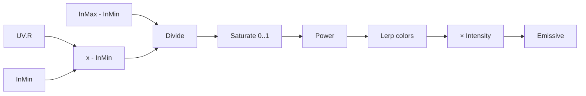

# 03.02 — Material math і remapping

## 1. Назва

**Material math і remapping: від арифметики до керованого color ramp.**

## 2. Результат уроку

Після уроку ви:

- читаєте `Add`, `Subtract`, `Multiply`, `Divide` як формули;
- розрізняєте scaling, offset і inversion;
- будуєте remap із довільного interval у `0–1`;
- використовуєте `LinearInterpolate`, `Clamp`, `Saturate`, `OneMinus`, `Power`, `Abs`, `Sign`, `Min` і `Max`;
- debug-ите кожну branch через тимчасовий output;
- створюєте `M_L03_02_RemapLab` і visual operation library.

## 3. Орієнтовний час

**8 годин: 2.5 години теорії / 5.5 години практики.**

- 60 хв — арифметика та порядок operations;
- 45 хв — normalized ranges і remap;
- 45 хв — Lerp, Clamp/Saturate, shaping nodes;
- 75 хв — контрольовані експерименти;
- 165 хв — керована практика;
- 90 хв — exercises A/B і review.

## 4. Prerequisites

- завершено 03.01;
- ви можете пояснити Scalar/Vector і `0–1`;
- assets 03.01 збережені як debug tools.

## 5. Нові терміни

- **Offset** — додавання/віднімання constant.
- **Scale** — множення/ділення на factor.
- **Remap** — перетворення value з одного range в інший.
- **Clamp** — обмеження між minimum і maximum.
- **Saturate** — clamp у `0–1`.
- **Interpolation** — отримання проміжного result між A і B.
- **Exponent** — степінь у `Power`; змінює distribution значень.
- **Signed value** — значення, що може бути negative, zero або positive.
- **Branch** — логічна частина graph із конкретною функцією.

## 6. Навіщо ця тема потрібна VFX-фахівцю

VFX artist постійно remap-ить lifetime, masks, distance, dot product і texture values. Без remap ефект прив’язаний до випадкового source range. Math дає art-directable controls:

- `Multiply` керує intensity або tiling;
- `Add` рухає threshold/offset;
- `OneMinus` міняє black/white roles;
- `Power` звужує glow core;
- `Lerp` фарбує grayscale mask двома colors;
- `Saturate` захищає normalized mask від overshoot.

## 7. Теорія простими словами

Node math не знає, що число є «вогнем», «opacity» чи «UV». Він виконує формулу component-wise.

```text
Add:      A + B
Subtract: A - B
Multiply: A × B
Divide:   A ÷ B
Lerp:     A × (1 - Alpha) + B × Alpha
```

Якщо `Alpha=0`, `Lerp` повертає A; якщо `1` — B; якщо `0.5` — midpoint. Alpha поза `0–1` extrapolates, якщо ви не обмежили його.

Remap `x` із `[inMin,inMax]` у `[0,1]`:

```text
t = (x - inMin) / (inMax - inMin)
normalized = saturate(t)
```

## 8. Детальні технічні пояснення

### Component-wise math покомпонентно

`Multiply(Vector3, Scalar)` масштабує кожен RGB component. `Add(Vector3, Vector3)` додає відповідні components. Несумісні dimensions можуть спричинити compiler error або implicit conversion; завжди перевіряйте pin types.

### Ролі arithmetic operations

- `Add`: offset, складання contributions.
- `Subtract`: difference, centering, видалення baseline.
- `Multiply`: mask, intensity і scale.
- `Divide`: normalization; denominator не повинен бути `0`.
- `Min`: component-wise нижчий result; зручно для intersection-like masks.
- `Max`: component-wise вищий result; зручно для union-like masks.

### Clamp і Saturate

`Clamp` має configurable Min/Max. `Saturate` — optimized/readable `Clamp(0,1)`. Не saturate-те все автоматично: negative або HDR intermediate values можуть бути потрібні далі.

### OneMinus

`OneMinus(x)=1-x`. У normalized mask black і white міняються ролями. Для `x=2` result `-1`; node не clamp-ить.

### Power

`Power(Base,Exp)` формує curve:

- `Exp > 1` стискає mid values до `0`;
- `0 < Exp < 1` підіймає mid values;
- negative base із fractional exponent може бути undefined/problematic.

Для normalized mask спочатку забезпечте non-negative range.

### Abs і Sign

- `Abs(-0.7)=0.7`.
- `Sign(-0.7)=-1`, `Sign(0)=0`, `Sign(0.7)=1`.

`Abs` корисний для distance від center line. `Sign` дає side classification, але створює hard discontinuity.

### Remap у довільний output range

Після normalized `t`:

```text
out = Lerp(outMin, outMax, t)
```

Так color ramp є тим самим remap, де `outMin` і `outMax` — Vector colors.

## 9. Візуальні або математичні приклади

| Operation | A | B/Exp | Результат |
|---|---:|---:|---:|
| Add | `0.2` | `0.3` | `0.5` |
| Subtract | `0.2` | `0.3` | `-0.1` |
| Multiply | `0.25` | `4` | `1` |
| Divide | `0.25` | `0.5` | `0.5` |
| OneMinus | `0.25` | — | `0.75` |
| Power | `0.5` | `2` | `0.25` |
| Abs | `-0.4` | — | `0.4` |
| Sign | `-0.4` | — | `-1` |
| Min | `0.2` | `0.7` | `0.2` |
| Max | `0.2` | `0.7` | `0.7` |

Приклад remap:

```text
x = 0.5, inMin = 0.2, inMax = 0.8
t = (0.5 - 0.2) / (0.8 - 0.2)
t = 0.3 / 0.6 = 0.5
```

## 10. Controlled experiments

### Experiment 1 — arithmetic cards

Для кожного node `Add`, `Subtract`, `Multiply`, `Divide`:

1. Створіть two `Constant` nodes.
2. Задайте values із таблиці секції 9.
3. Під’єднайте result до `Emissive Color`.
4. Перед compile обчисліть result вручну.
5. Збережіть screenshot і formula.

Для Divide окремо спробуйте denominator `0`, запишіть compiler/preview behavior, потім негайно поверніть `0.5`. Не використовуйте division by zero в deliverable.

### Experiment 2 — Lerp endpoints

`Constant3Vector A=(0,0,1)`, `B=(1,0,0)`, `Alpha=0`, `0.25`, `0.5`, `1`, `1.5`. Зафіксуйте extrapolation при `1.5`; потім додайте `Saturate` перед Alpha.

### Experiment 3 — curve shaping

Подайте gradient `TextureCoordinate.R` у `Power` і перевірте exponent `0.5`, `1`, `2`, `8`. Порівнюйте distribution, не лише average brightness.

### Experiment 4 — Min/Max masks

Створіть два scalar gradients `U` і `V`. `Min(U,V)` показує лише value, що нижче в кожному pixel; `Max(U,V)` — вище. Намалюйте очікуваний diagonal pattern до preview.

## 11. Покрокова керована практика

### Graph — `M_L03_02_RemapLab`

#### Material properties

- `Material Domain = Surface`
- `Blend Mode = Opaque`
- `Shading Model = Unlit`
- `Two Sided = False`
- `Use Material Attributes = False`

#### Повний node inventory

| Alias | Exact node | Type / default |
|---|---|---|
| `UV0` | `TextureCoordinate` | Coordinate Index `0`, UTiling `1`, VTiling `1` |
| `UChannel` | `ComponentMask` | R checked |
| `InMin` | `ScalarParameter` | default `0.2` |
| `InMax` | `ScalarParameter` | default `0.8` |
| `RemoveMin` | `Subtract` | — |
| `InputRange` | `Subtract` | — |
| `NormalizeRange` | `Divide` | — |
| `Clamp01` | `Saturate` | — |
| `CurvePower` | `ScalarParameter` | default `1.5` |
| `ShapeCurve` | `Power` | — |
| `LowColor` | `VectorParameter` | `(0.02,0.0,0.08,1)` |
| `HighColor` | `VectorParameter` | `(3.0,0.2,0.02,1)` |
| `ColorRamp` | `LinearInterpolate` | — |
| `Intensity` | `ScalarParameter` | default `1.0` |
| `ScaleHDR` | `Multiply` | — |
| `MaterialOutput` | Main Material Node | root |

#### Contract parameters

| Parameter | Type | Default | Призначення |
|---|---|---:|---|
| `InMin` | Scalar | `0.2` | source value, mapped на `0` |
| `InMax` | Scalar | `0.8` | source value, mapped на `1` |
| `CurvePower` | Scalar | `1.5` | формує normalized ramp |
| `LowColor` | Vector4 | `(0.02,0,0.08,1)` | color за Alpha `0` |
| `HighColor` | Vector4 | `(3,0.2,0.02,1)` | HDR color за Alpha `1` |
| `Intensity` | Scalar | `1` | фінальний scale HDR |

#### Точний список connections

```text
UV0.Output → UChannel.Input
UChannel.R → RemoveMin.A
InMin.Output → RemoveMin.B
InMax.Output → InputRange.A
InMin.Output → InputRange.B
RemoveMin.Output → NormalizeRange.A
InputRange.Output → NormalizeRange.B
NormalizeRange.Output → Clamp01.Input
Clamp01.Output → ShapeCurve.Base
CurvePower.Output → ShapeCurve.Exp
LowColor.RGB → ColorRamp.A
HighColor.RGB → ColorRamp.B
ShapeCurve.Output → ColorRamp.Alpha
ColorRamp.Output → ScaleHDR.A
Intensity.Output → ScaleHDR.B
ScaleHDR.Output → MaterialOutput.Emissive Color
```

#### Пояснення branches

1. **Source branch:** `UV0 → UChannel` дає horizontal `0–1` gradient.
2. **Normalize branch:** subtract `InMin`, divide by `InMax-InMin`.
3. **Safety branch:** `Saturate` обмежує normalized Alpha.
4. **Shape branch:** `Power` art-direct-ить distribution без зміни endpoints.
5. **Color branch:** `LinearInterpolate` remap-ить scalar у HDR RGB.
6. **Intensity branch:** final multiplier відокремлює color choice від brightness control.

#### Проміжні перевірки

Тимчасово під’єднуйте кожен output до `Emissive Color`, потім повертайте final connection:

| Debug output | Очікування |
|---|---|
| `UChannel.R` | плавно від чорного зліва до білого справа |
| `RemoveMin` | left region negative; visible output може clamp display |
| `NormalizeRange` | `0` at U=`0.2`, `1` at U=`0.8`, overshoot outside |
| `Clamp01` | black до `0.2`, ramp, white після `0.8` |
| `ShapeCurve` | ті самі endpoints, темніший midrange для exponent `1.5` |
| `ColorRamp` | purple-black → HDR orange |
| `ScaleHDR` | той самий hue path, intensity масштабовано |

#### Safety

`InMax` не повинен дорівнювати `InMin`. Для production architecture пізніше можна enforce minimum range; зараз parameter contract вимагає `InMax > InMin`.



## 12. Точні назви вузлів, модулів і налаштувань UE

- `Add`
- `Subtract`
- `Multiply`
- `Divide`
- `LinearInterpolate`
- `Clamp`
- `Saturate`
- `OneMinus`
- `Power`
- `Abs`
- `Sign`
- `Min`
- `Max`
- `TextureCoordinate`
- `ComponentMask`
- `ScalarParameter`
- `VectorParameter`
- Main Material Node: `Emissive Color`

**Потребує ручної перевірки в Unreal Engine 5.8.** Звірте labels pins (`Base`, `Exp`, `Alpha`, `Min`, `Max`) і node search names у своєму build.

## 13. Стартові значення параметрів

Використайте defaults із inventory. Додаткові controlled ranges:

| Parameter | Study range | Invalid або unsafe case |
|---|---:|---|
| `InMin` | `0…0.7` | `InMin >= InMax` |
| `InMax` | `0.3…1` | `InMax == InMin` |
| `CurvePower` | `0.25…8` | negative base + fractional exp |
| `Intensity` | `0…10` | judge лише за bloom |

## 14. Очікуваний результат кожного етапу

| Етап | Очікуваний результат |
|---|---|
| Arithmetic cards | manual result збігається з preview/numeric reasoning |
| Normalization | source interval `0.2–0.8` стає `0–1` |
| Saturation | немає Alpha extrapolation outside interval |
| Power | endpoints stable, midrange shaped |
| Color ramp | two-color HDR horizontal ramp |
| Final material | параметри змінюються без graph rewiring |
| Evidence | graph, connection list, six debug outputs |

## 15. Самостійна вправа

### EX-L03-02-A — Parameterized remap strip

Створіть `M_EX_L03_02_RemapStrip`, який:

- бере `TextureCoordinate.R`;
- remap-ить interval `0.25–0.75` у `0–1`;
- saturate-ить result;
- Lerp-ить від `Color_A=(0,0.1,1)` до `Color_B=(2,0,0.5)`;
- множить final color на `Intensity=2`;
- є Surface/Opaque/Unlit.

**Constraints:** тільки nodes уроків 03.01–03.02; `InMin` і `InMax` — Scalar Parameters; denominator не hardcode-ити; без orphan nodes.

**Deliverables:** asset, properties, full inventory, connection list, debug captures до/після Saturate, Material Instance із interval `0.4–0.6`.

**Acceptance:** endpoints правильні; instance не потребує graph edit; `InMax > InMin`; compile clean.

## 16. Додаткова складніша вправа

### EX-L03-02-B — Symmetric pulse shaper

Створіть `M_EX_L03_02_SymmetricPulse`:

- source — `TextureCoordinate.R`;
- center source навколо `Center=0.5`;
- distance from center через `Abs`;
- перетворіть center на white, edges на black через scale, `OneMinus`, `Saturate`;
- shape через `Power=3`;
- порівняйте `Min` і `Max` між shaped pulse та constant mask `0.35`;
- final output має selector `UseMax` як Scalar `0/1` через `LinearInterpolate`, не Static Switch.

**Обмеження:** parameters `Center`, `HalfWidth`, `Power`, `UseMax`; division на `HalfWidth`; `HalfWidth > 0`.

**Deliverables:** graph contract, three debug outputs, variants `UseMax=0/1`, explanation why `Sign` would create hard sides but не потрібен у final.

**Критерії приймання:** pulse symmetric; немає NaN або divide-by-zero; різницю Min/Max пояснено component-wise.

## 17. Три рівні підказок

### EX-L03-02-A

- **Hint 1:** запишіть формулу remap на папері до створення nodes.
- **Hint 2:** `Subtract`, другий `Subtract`, `Divide`, `Saturate`, `LinearInterpolate`, `Multiply`.
- **Hint 3:** numerator=`U-InMin`; denominator=`InMax-InMin`; normalized numerator/denominator → Saturate → Lerp Alpha.

[Повне рішення EX-L03-02-A](../EXERCISE_ANSWERS/L03-02_material_math_and_remapping_answers.md#ex-l03-02-a)

### EX-L03-02-B

- **Hint 1:** symmetric value виникає з absolute distance від center.
- **Hint 2:** `Subtract(U,Center) → Abs → Divide(HalfWidth) → OneMinus → Saturate → Power`.
- **Hint 3:** подайте pulse і `0.35` у `Min` та `Max`; `Lerp(Min,Max,UseMax)` обирає result.

[Повне рішення EX-L03-02-B](../EXERCISE_ANSWERS/L03-02_material_math_and_remapping_answers.md#ex-l03-02-b)

## 18. Типові помилки

- Міняти operands у `Subtract`.
- Hardcode-ити denominator замість `InMax-InMin`.
- Ділити на `0`.
- Clamp-ити source до subtract, змінюючи intended interval.
- Плутати `Lerp.Alpha` з opacity.
- Використовувати `Power` на negative values.
- Вважати `OneMinus` автоматичним clamp.
- Додавати зайві Saturate nodes «для безпеки» й втрачати HDR/intermediate data.
- Не debug-ити numerator і denominator окремо.

## 19. Troubleshooting

| Симптом | Причина | Виправлення |
|---|---|---|
| Ramp reversed | `InMin-InMax` або swapped Lerp colors | перевірте exact connection order |
| Усе black/white | `InMin≈InMax`, wrong U channel або Power extreme | debug source, numerator, denominator |
| Compile/invalid result | division by zero | enforce `InMax > InMin` |
| Lerp показує дивні colors outside interval | Alpha not saturated | `Saturate` before Alpha |
| Power дає artifacts | negative Base або invalid Exp | debug Base; normalize/saturate first |
| Instance controls не з’явились | використано Constant, не Parameter | замініть exact node type |

## 20. Performance considerations

- Basic arithmetic зазвичай дешева; texture samples і overdraw пізніше часто важливіші.
- `Saturate` виражає clamp `0–1` компактніше за general `Clamp`.
- Parameters не означають автоматично shader permutations; `Static Switches` у 03.08 — інший механізм.
- Не дублюйте однаковий remap graph багато разів у production; після розуміння формули винесіть його у прозору Material Function у 03.08.
- Спочатку correctness, потім Shader Complexity/compiled stats; не «оптимізуйте» видаленням debug logic, доки не маєте verified result.

## 21. Запитання для самоперевірки

1. Яка формула remap `[inMin,inMax] → [0,1]`?
2. Чому denominator не можна робити `0`?
3. Чим `Saturate` відрізняється від general `Clamp`?
4. Що повертає `Lerp` при Alpha `0`, `1`, `1.5`?
5. Як `Power` exponent `>1` змінює normalized gradient?
6. Чому `OneMinus(2)=-1`?
7. Для чого `Abs` корисний у symmetric mask?
8. Чим `Min` і `Max` відрізняються для двох masks?
9. Коли scalar множиться на Vector3, що відбувається?
10. Який debug order для remap branch?

## 22. Відповіді на запитання

1. `(x-inMin)/(inMax-inMin)`, за потреби потім Saturate.
2. Division by zero не має коректного finite result.
3. `Saturate` clamp-ить лише в `0–1`; `Clamp` має довільні Min/Max.
4. A, B і extrapolated value beyond B.
5. Mid values стають нижчими; endpoints `0/1` лишаються.
6. `OneMinus` виконує `1-x`, не clamp.
7. Він прибирає sign і перетворює left/right deviations на однакову distance.
8. `Min` бере нижчий component, `Max` — вищий.
9. Кожен vector component множиться на scalar.
10. Source → numerator → denominator → divide → saturation → shaping → final color.

## 23. Self-check checklist

- [ ] Я записую formula перед graph.
- [ ] Я прогнозую operand order.
- [ ] Уникаю zero denominator.
- [ ] Розрізняю Clamp і Saturate.
- [ ] Розумію Lerp endpoints/extrapolation.
- [ ] Debug-ю кожну remap branch.
- [ ] Power отримує valid Base.
- [ ] Parameters мають exact types/defaults.
- [ ] Connection list однозначний.
- [ ] Exercises A/B пройшли acceptance.

## 24. Mastery criteria

- За 30 хв відтворити remap без reference.
- Пояснити кожну operation і її input range.
- Побудувати color ramp із parameters.
- Знайти навмисно swapped operands і zero range.
- Завершити A/B, відповісти мінімум 8/10.
- Надати intermediate debug captures і clean connection list.

## 25. Підсумок

Arithmetic nodes утворюють керовані transformations. Remap нормалізує source interval, Saturate stabilizes mask, Power shapes distribution, Lerp переводить normalized control у новий range або color. Кожна branch повинна мати формулу, range contract і debug point.

## 26. Зв’язок із наступними уроками

У [03.03](03_procedural_math_and_threshold_masks.md) remapped gradients стануть hard/soft thresholds, radial distance й directional masks через Floor, Ceil, Frac, Step, SmoothStep, Distance, Length, Dot Product і Normalize.

## 27. Офіційні джерела

- [Material Expressions Reference](https://dev.epicgames.com/documentation/en-us/unreal-engine/unreal-engine-material-expressions-reference) (`MAT-06`)
- [Math Material Expressions](https://dev.epicgames.com/documentation/en-us/unreal-engine/math-material-expressions-in-unreal-engine)
- [Material Editor User Guide](https://dev.epicgames.com/documentation/en-us/unreal-engine/unreal-engine-material-editor-user-guide) (`MAT-02`)
- [Material Inputs](https://dev.epicgames.com/documentation/en-us/unreal-engine/material-inputs-in-unreal-engine) (`MAT-04`)

Дата перевірки: 2026-07-27. Exact pins/search labels: **Потребує ручної перевірки в Unreal Engine 5.8.**

## 28. Перелік рекомендованих скриншотів або схем

```text
Рекомендований скриншот 1:
Що відкрити: M_L03_02_RemapLab.
Що повинно бути видно: повний graph від UV.R до Emissive.
Яку область виділити: numerator, denominator, Saturate, Power та Lerp як окремі branches.
```

```text
Рекомендований скриншот 2:
Що відкрити: Material Instance remap lab.
Що повинно бути видно: InMin, InMax, CurvePower, LowColor, HighColor, Intensity.
Яку область виділити: parameter values і preview одночасно.
```

```text
Рекомендована схема:
Що показати: x → subtract minimum → divide range → saturate → shape → output remap.
Навіщо: формула має читатися без UE UI.
```
