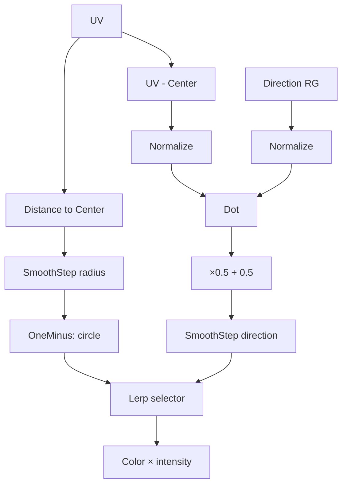

# 03.03 — Thresholds і процедурна математика масок

## 1. Назва

**Thresholds і процедурна математика масок: quantization, distance та direction.**

## 2. Результат уроку

Ви навчитеся:

- пояснювати `Floor`, `Ceil`, `Frac`, `Step` і `SmoothStep`;
- будувати hard і anti-aliased-like soft thresholds;
- вимірювати `Distance` та `Length`;
- використовувати `Normalize` і `DotProduct` для directional masks;
- розуміти range `-1…1` для dot normalized vectors;
- створити `M_L03_03_ThresholdLab` із radial та directional branches;
- перевіряти intermediate values до фінального color.

## 3. Орієнтовний час

**8 годин: 2.5 години теорії / 5.5 години практики.**

- 45 хв — Floor/Ceil/Frac;
- 45 хв — Step/SmoothStep;
- 60 хв — Distance/Length/Dot/Normalize;
- 75 хв — experiments;
- 165 хв — guided graph;
- 90 хв — exercises і retrieval.

## 4. Prerequisites

- 03.01–03.02;
- remap і `Saturate` без підглядання;
- розуміння Scalar/Vector2 і component-wise math.

## 5. Нові терміни

- **Threshold** — boundary, де value класифікується як lower/higher.
- **Quantization** — зменшення continuous range до discrete steps.
- **Fractional part** — частина після integer; її повертає `Frac`.
- **Hard edge** — миттєвий transition.
- **Soft edge / feather** — transition у finite interval.
- **Distance field-like value** — число, що описує distance до feature.
- **Vector length** — magnitude vector.
- **Normalized vector** — direction із length приблизно `1`.
- **Dot product** — міра alignment двох vectors.

## 6. Навіщо ця тема потрібна VFX-фахівцю

Threshold перетворює noise у dissolve, distance — у circle/ring, dot — у directional cone або facing mask. Ці operations створюють shapes без нової texture для кожної variation. Вони також є базою SDF-like masks уроку 03.05.

## 7. Теорія простими словами

- `Floor(2.8)=2`
- `Ceil(2.1)=3`
- `Frac(2.8)=0.8`
- `Step(edge,x)` дає hard `0/1` classification.
- `SmoothStep(min,max,x)` плавно переходить від `0` до `1`.
- `Length(v)` вимірює vector від origin.
- `Distance(a,b)` вимірює length `a-b`.
- `Normalize(v)` лишає direction і робить length `1` для non-zero vector.
- `Dot(a,b)` для normalized vectors: `1` same direction, `0` perpendicular, `-1` opposite.

## 8. Детальні технічні пояснення

### Floor, Ceil, Frac

Для positive UV:

```text
scaled = U × Repeats
cellIndex = Floor(scaled)
withinCell = Frac(scaled)
```

`Frac` повторює `0–1` ramp у кожній cell. На negative values поведінка пов’язана з floor, а не truncation toward zero; перевірте окремо.

### Step

Концептуальна форма HLSL:

```text
step(edge, x) = x < edge ? 0 : 1
```

Unreal node pin order/labels потрібно читати в editor, а не вгадувати. **Потребує ручної перевірки в Unreal Engine 5.8.** У connection lists цього курсу використано labels, показані Material Expression naming convention; звірте `X/Y` або equivalent pins у вашому build.

Hard `Step` може alias-итися під час movement або на thin geometry. Для visible edge часто потрібен feather через `SmoothStep`.

### SmoothStep

Концептуально:

```text
t = saturate((x - min) / (max - min))
smooth = t² × (3 - 2t)
```

Min має бути меншим за Max. Для inverted mask використайте `OneMinus` після SmoothStep.

### Distance і Length

`Distance(UV,Center)` еквівалентна `Length(UV-Center)`. Distance зручна для читання intent; Subtract+Length — для debug centered vector.

UV aspect ratio впливає на circle: на non-square surface/texture circle може виглядати ellipse. Aspect correction буде практикою 03.05.

### Normalize

Normalize не «робить values від 0 до 1». Він масштабує vector до unit length:

```text
normalize(v) = v / length(v)
```

Zero-length vector не має direction. Не покладайтеся на нього без перевірки; center pixel radial direction може бути singular/implementation-handled.

### Dot Product

Dot для Vector2:

```text
dot(a,b) = a.x*b.x + a.y*b.y
```

Якщо обидва normalized, result має зрозумілий angular meaning. Щоб remap-ити `-1…1` у `0…1`:

```text
dot01 = dot * 0.5 + 0.5
```

## 9. Візуальні або математичні приклади

| Input | Floor | Ceil | Frac |
|---:|---:|---:|---:|
| `0.2` | `0` | `1` | `0.2` |
| `1.0` | `1` | `1` | `0` |
| `2.75` | `2` | `3` | `0.75` |
| `-0.25` | `-1` | `0` | `0.75` |

Dot normalized directions:

| A | B | Dot |
|---|---|---:|
| `(1,0)` | `(1,0)` | `1` |
| `(1,0)` | `(0,1)` | `0` |
| `(1,0)` | `(-1,0)` | `-1` |
| normalized `(1,1)` | `(1,0)` | приблизно `0.707` |

## 10. Controlled experiments

### Experiment 1 — quantized bands

`TextureCoordinate.R × 5` подайте окремо у `Floor`, `Ceil`, `Frac`. Preview кожного output. Порахуйте cells і discontinuities.

### Experiment 2 — hard/soft threshold

Source `U`; threshold `0.5`. Порівняйте `Step` і `SmoothStep(0.45,0.55,U)` під час movement plane/camera. Запишіть edge stability.

### Experiment 3 — Distance versus Length

Побудуйте:

```text
Distance(UV, Center)
Length(UV - Center)
```

Тимчасово відніміть один result від іншого. Очікується near-zero difference у звичайному case.

### Experiment 4 — Normalize before Dot

Порівняйте Dot centered UV з Direction до/після Normalize. Без Normalize magnitude впливає на result; після Normalize переважно лишається angle.

## 11. Покрокова керована практика

### Graph — `M_L03_03_ThresholdLab`

#### Material properties

- Surface / Opaque / Unlit
- Two Sided `False`
- output: Emissive Color

#### Повний node inventory

| Alias | Exact node | Default |
|---|---|---|
| `UV0` | `TextureCoordinate` | index 0 |
| `Center` | `Constant2Vector` | `(0.5,0.5)` |
| `Radius` | `ScalarParameter` | `0.32` |
| `Feather` | `ScalarParameter` | `0.03` |
| `InnerEdge` | `Subtract` | — |
| `RadialDistance` | `Distance` | — |
| `CircleTransition` | `SmoothStep` | — |
| `CircleMask` | `OneMinus` | — |
| `CenteredUV` | `Subtract` | — |
| `RadialDirection` | `Normalize` | — |
| `DirectionXY` | `VectorParameter` | `(1,0,0,0)` |
| `DirectionRG` | `ComponentMask` | R,G |
| `UnitDirection` | `Normalize` | — |
| `Alignment` | `DotProduct` | — |
| `HalfScale` | `Constant` | `0.5` |
| `DotHalf` | `Multiply` | — |
| `HalfOffset` | `Add` | — |
| `DirSoftMin` | `ScalarParameter` | `0.65` |
| `DirSoftMax` | `ScalarParameter` | `0.75` |
| `DirectionMask` | `SmoothStep` | — |
| `ShowDirection` | `ScalarParameter` | `0` |
| `SelectMask` | `LinearInterpolate` | — |
| `DebugColor` | `VectorParameter` | `(1,0.1,0.01,1)` |
| `Colorize` | `Multiply` | — |
| `Intensity` | `ScalarParameter` | `2` |
| `FinalHDR` | `Multiply` | — |
| `MaterialOutput` | Main Material Node | — |

#### Точний список connections

```text
Radius.Output → InnerEdge.A
Feather.Output → InnerEdge.B
UV0.Output → RadialDistance.A
Center.Output → RadialDistance.B
InnerEdge.Output → CircleTransition.Min
Radius.Output → CircleTransition.Max
RadialDistance.Output → CircleTransition.Value
CircleTransition.Output → CircleMask.Input
UV0.Output → CenteredUV.A
Center.Output → CenteredUV.B
CenteredUV.Output → RadialDirection.Input
DirectionXY.RGBA → DirectionRG.Input
DirectionRG.RG → UnitDirection.Input
RadialDirection.Output → Alignment.A
UnitDirection.Output → Alignment.B
Alignment.Output → DotHalf.A
HalfScale.Output → DotHalf.B
DotHalf.Output → HalfOffset.A
HalfScale.Output → HalfOffset.B
DirSoftMin.Output → DirectionMask.Min
DirSoftMax.Output → DirectionMask.Max
HalfOffset.Output → DirectionMask.Value
CircleMask.Output → SelectMask.A
DirectionMask.Output → SelectMask.B
ShowDirection.Output → SelectMask.Alpha
SelectMask.Output → Colorize.A
DebugColor.RGB → Colorize.B
Colorize.Output → FinalHDR.A
Intensity.Output → FinalHDR.B
FinalHDR.Output → MaterialOutput.Emissive Color
```

**Pin note:** input label вузла `Normalize` і pin labels вузла `SmoothStep`: **Потребує ручної перевірки в Unreal Engine 5.8.** Якщо editor показує інший label, збережіть semantic connection: centered vector → Normalize; min/max/value → SmoothStep.

#### Пояснення branches

- Circle: distance from center проходить soft threshold і inversion.
- Direction: centered direction і parameter direction нормалізуються; Dot → `-1…1`; remap → `0…1`; SmoothStep формує cone-like side.
- Selector: `ShowDirection=0` обирає circle, `1` — direction; проміжні values виконують blend.
- Color: selected mask масштабує HDR debug color.

#### Проміжні перевірки

| Output | Очікуваний результат |
|---|---|
| `RadialDistance` | чорний center, світліше до corners |
| `CircleTransition` | black inside, white outside з feather |
| `CircleMask` | біле circle, чорне поза ним |
| `CenteredUV` | signed data; RGB preview не є intuitive mask |
| `Alignment` | signed alignment |
| `HalfOffset` | `-1…1` remapped to `0…1` |
| `DirectionMask` | soft directional lobe |



## 12. Точні назви вузлів, модулів і налаштувань UE

- `Floor`, `Ceil`, `Frac`
- `Step`, `SmoothStep`
- `Distance`, `Length`
- `DotProduct`, `Normalize`
- `TextureCoordinate`, `Constant2Vector`, `ComponentMask`
- math nodes із 03.02

`Step` і `SmoothStep` exact pin order/search results: **Потребує ручної перевірки в Unreal Engine 5.8.**

## 13. Стартові значення параметрів

| Parameter | Type | Default | Contract |
|---|---|---:|---|
| `Radius` | Scalar | `0.32` | `0.05…0.7` |
| `Feather` | Scalar | `0.03` | `>0`, `<Radius` |
| `DirectionXY` | Vector | `(1,0,0,0)` | RG must not both be zero |
| `DirSoftMin` | Scalar | `0.65` | `<DirSoftMax` |
| `DirSoftMax` | Scalar | `0.75` | `>DirSoftMin` |
| `ShowDirection` | Scalar | `0` | `0` circle, `1` direction |
| `DebugColor` | Vector | `(1,0.1,0.01,1)` | RGB |
| `Intensity` | Scalar | `2` | `0…10` |

## 14. Очікуваний результат кожного етапу

1. Quantization board: Floor, Ceil і Frac візуально розрізняються.
2. Threshold board: hard і soft edges порівняно.
3. Circle branch: параметризовані radius і feather.
4. Direction branch: rotation через `DirectionXY`.
5. Selector: перемикання circle і direction через scalar Lerp.
6. Evidence: сім intermediate outputs і notes до formulas.

## 15. Самостійна вправа

### EX-L03-03-A — Repeating threshold stripes

Створіть `M_EX_L03_03_Stripes`: `U × Repeats`, `Frac`, потім hard/soft threshold selector. Parameters: `Repeats=8`, `Threshold=0.5`, `Feather=0.04`, `UseSoft=1`.

**Constraints:** hard branch використовує `Step`; soft — `SmoothStep`; selector — `LinearInterpolate`; Surface/Opaque/Unlit.

**Матеріали до здачі:** inventory, connections, captures Frac, Step, SmoothStep і final, observation aliasing під час руху camera.

**Критерії приймання:** рівно 8 repeated cells; `UseSoft=0/1` працює; direction threshold пояснено.

## 16. Додаткова складніша вправа

### EX-L03-03-B — Directional cone mask

Побудуйте centered UV direction, Normalize, normalized parameter direction, Dot, remap `-1…1 → 0…1`, SmoothStep. Помножте directional result на soft circle radius `0.45`, щоб cone мав finite extent.

**Parameters:** `DirectionXY=(0,1)`, `ConeMin=0.75`, `ConeMax=0.85`, `Radius=0.45`, `Feather=0.04`.

**Матеріали до здачі:** повний contract, debug outputs Dot signed, remapped, cone, circle і final, rotation direction до чотирьох axes.

**Критерії приймання:** cone слідує за direction; zero vector відхилено; result finite і soft.

## 17. Три рівні підказок

### EX-L03-03-A

- **Hint 1:** repeating local coordinate — fractional part масштабованого U.
- **Hint 2:** `Multiply → Frac`; output одночасно подається в `Step` і `SmoothStep`.
- **Hint 3:** виконай Lerp hard/soft через `UseSoft`; перевір порядок edge/input Step у tooltip UE 5.8.

[Рішення A](../EXERCISE_ANSWERS/L03-03_procedural_math_and_threshold_masks_answers.md#ex-l03-03-a)

### EX-L03-03-B

- **Hint 1:** порівнюй directions, а не positions: спочатку center UV.
- **Hint 2:** два `Normalize` → `DotProduct` → `Multiply(0.5)` → `Add(0.5)` → `SmoothStep`.
- **Hint 3:** побудуй circle через `Distance` + `SmoothStep` + `OneMinus`, потім Multiply cone і circle.

[Рішення B](../EXERCISE_ANSWERS/L03-03_procedural_math_and_threshold_masks_answers.md#ex-l03-03-b)

## 18. Типові помилки

- Operands Step переплутано.
- У SmoothStep Min ≥ Max.
- `Frac` applied before scaling when repetitions потрібні.
- Dot without Normalize, тому magnitude змінює angle result.
- Normalize застосовано до zero vector.
- Normalize помилково вважається clamp `0–1`.
- Забуто remap Dot із `-1…1`.
- Circle inverted через відсутній OneMinus.
- Hard edge оцінено лише у static preview.

## 19. Troubleshooting

| Симптом | Перевірка | Виправлення |
|---|---|---|
| Неправильна кількість stripes | preview scaled U і Frac | виконай scale до Frac |
| Step inverted | перевір порядок pins | поміняй semantic edge і value |
| Soft mask повністю 0 або 1 | range Min/Max | переконайся, що Min < Max і source перетинає range |
| Direction змінює brightness із distance | branches Normalize | normalize обидва vectors |
| NaN або artifact у center | length radial vector дорівнює нулю | не покладайся на direction у center; зроби center mask finite |
| Circle став ellipse | aspect UV | виправ у 03.05; зараз тестуй square plane |

## 20. Performance considerations

- Hard Step дешевий, але може створювати aliasing; soft transition може покращити temporal stability.
- Normalize містить reciprocal length-like work; не повторюй identical branches Normalize.
- Procedural math може замінити texture sample, але «без texture» не означає автоматично дешевше за simple texture lookup; вимірювання буде пізніше.
- Dynamic selection branch через Lerp обчислює обидві branches; поточні branches мають study scale.
- Тонкі high-frequency stripes збільшують aliasing незалежно від arithmetic cost.

## 21. Запитання для самоперевірки

1. Що повертає Frac?
2. Чому scale ставлять до Frac для repetitions?
3. Чим Step відрізняється від SmoothStep?
4. Який contract SmoothStep Min/Max?
5. Чим Distance(a,b) пов’язана з Length(a-b)?
6. Що робить Normalize?
7. Який Dot two equal normalized directions?
8. Як remap-ити Dot `-1…1` у `0…1`?
9. Чому Dot без Normalize залежить від magnitude?
10. Чому hard threshold може alias-итися?

## 22. Відповіді на запитання

1. Fractional part відносно Floor.
2. Щоб кожна integer interval scaled coordinate стала окремою `0–1` cell.
3. Step має hard binary edge; SmoothStep має smooth transition interval.
4. Min < Max; Value проходить між ними.
5. Вони математично еквівалентні за відповідних types.
6. Зберігає direction і масштабує non-zero vector до unit length.
7. `1`.
8. `dot*0.5+0.5`.
9. Dot множить components, тому lengths впливають.
10. Discontinuity може нестабільно sampling-итися при motion/subpixel size.

## 23. Self-check checklist

- [ ] Floor/Ceil/Frac пояснено на negative і positive examples.
- [ ] Step pin order перевірено в UE 5.8.
- [ ] SmoothStep ranges valid.
- [ ] Distance/Length comparison виконано.
- [ ] Обидва Dot inputs normalized.
- [ ] Dot signed і remapped outputs captured.
- [ ] Zero direction rejected.
- [ ] Exercises complete.

## 24. Mastery criteria

- Створити repeating threshold за 20 хв.
- Створити circle і directional mask із clean branches.
- Назвати ranges кожного intermediate output.
- Виправити reversed Step та unnormalized Dot.
- 8/10 self-check і прийняті A/B.

## 25. Підсумок

Thresholds класифікують continuous data, Frac створює repetition, Distance/Length — spatial measures, Normalize+Dot — directional reasoning. Soft boundaries та explicit range contracts роблять masks керованими й debug-friendly.

## 26. Зв’язок із наступними уроками

[03.04](04_uv_coordinates_and_coordinate_spaces.md) рухатиме й обертатиме UV, а [03.05](05_procedural_shapes_polar_and_sdf_masks.md) збере з distance/dot/polar math shape library.

## 27. Офіційні джерела

- [Material Expressions Reference](https://dev.epicgames.com/documentation/en-us/unreal-engine/unreal-engine-material-expressions-reference)
- [Math Material Expressions](https://dev.epicgames.com/documentation/en-us/unreal-engine/math-material-expressions-in-unreal-engine)
- [Utility Material Expressions](https://dev.epicgames.com/documentation/en-us/unreal-engine/utility-material-expressions-in-unreal-engine)
- [Material Editor User Guide](https://dev.epicgames.com/documentation/en-us/unreal-engine/unreal-engine-material-editor-user-guide)

Дата: 2026-07-27. Step/SmoothStep pins і Normalize input label: **Потребує ручної перевірки в Unreal Engine 5.8.**

## 28. Перелік рекомендованих скриншотів або схем

```text
Рекомендований скриншот 1:
Що відкрити: M_L03_03_ThresholdLab.
Що повинно бути видно: circle і direction branches до selector.
Яку область виділити: SmoothStep ranges, Normalize nodes, Dot remap.
```

```text
Рекомендований скриншот 2:
Що відкрити: moving plane/camera test hard versus soft stripes.
Що повинно бути видно: однаковий repeat count, різна edge stability.
Яку область виділити: thin high-contrast boundaries.
```
