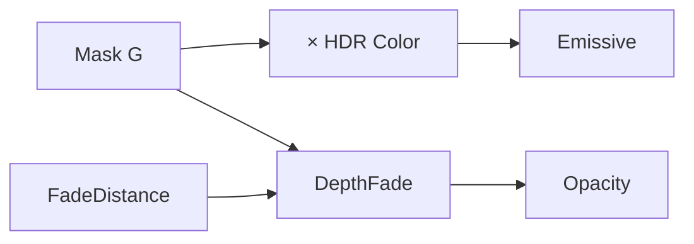

# 03.07 — Material properties, depth і translucency

## 1. Назва

**Material Domain, Blend Modes, Shading Models, depth і translucency: що material просить від renderer.**

## 2. Результат уроку

Ви:

- пояснюєте роль `Material Domain`, `Blend Mode`, `Shading Model`, `Two Sided`;
- порівнюєте Opaque, Masked, Translucent і Additive;
- правильно використовуєте `Emissive Color`, `Opacity`, `Opacity Mask`;
- будуєте depth-aware soft intersection через `DepthFade`;
- пояснюєте `SceneDepth` і `PixelDepth`;
- знаходите sorting та overdraw problems;
- тестуєте aliasing дрібних particles/cards;
- створюєте comparison scene і `M_L03_07_DepthFadeCard`.

## 3. Орієнтовний час

**8 годин: 2 години теорії / 6 годин практики.**

- 45 хв — domains/blending/shading;
- 35 хв — depth expressions;
- 40 хв — sorting/overdraw/aliasing;
- 80 хв — property comparison;
- 190 хв — guided depth-aware graph;
- 90 хв — exercises/review.

## 4. Prerequisites

- 03.01–03.06;
- texture mask або procedural circle;
- вміння output intermediate mask.

## 5. Нові терміни

- **Material Domain** — context, для якого material компілюється.
- **Blend Mode** — як source result комбінується з framebuffer/background.
- **Shading Model** — model і assumptions lighting.
- **Opaque** — surface без partial transparency.
- **Masked** — binary visible/discard за clip threshold.
- **Translucent** — partial transparency і blending.
- **Additive** — додає source light-like color до background.
- **Opacity Mask Clip Value** — threshold для Masked coverage.
- **Depth buffer** — stored depth used для visibility.
- **PixelDepth** — depth поточного shaded pixel.
- **SceneDepth** — sampled depth scene.
- **DepthFade** — helper для fading translucent intersections.
- **Sorting** — order drawing translucent primitives.
- **Overdraw** — кілька shaded transparent layers над тими самими screen pixels.

## 6. Навіщо ця тема потрібна VFX-фахівцю

Один і той самий mask може бути дешевим crisp Masked slash або soft Translucent smoke. Неправильний Blend Mode спричиняє black quads, sorting pops, excessive overdraw або invisible opacity. DepthFade прибирає hard card intersection, але translucency все одно має cost.

## 7. Теорія простими словами

Material properties — частина shader contract:

- Domain відповідає «де використовується».
- Blend Mode — «як змішується з тим, що вже намальовано».
- Shading Model — «як реагує на light».
- Two Sided — «чи малювати back faces».

Для більшості stylized sprite/card VFX:

- domain Surface;
- Unlit;
- Masked, Translucent або Additive залежно від edge/color/background needs;
- Emissive передає visible color;
- Opacity або Opacity Mask керує visibility.

## 8. Детальні технічні пояснення

### Material Domain

`Surface` — geometry surfaces. Інші domains, наприклад `Deferred Decal`, `Post Process`, `Light Function`, мають інші inputs і restrictions. Точні options/status: **Потребує ручної перевірки в Unreal Engine 5.8.** Блок 03 будує Surface materials; decal-specific production graph — 04.05.

### Blend Modes

- **Opaque:** повне coverage surface; opacity inputs unavailable/ignored.
- **Masked:** кожен sample проходить або не проходить clip test; binary coverage, depth-friendly.
- **Translucent:** виконує blend partial opacity; має sorting і overdraw.
- **Additive:** додає emissive contribution; чорний нічого не додає, background стає яскравішим, dark smoke відтворюється погано.

Інші modes можуть бути доступні. Не вибирайте mode лише за назвою; test background black/gray/white.

### Shading Model

`Unlit` прибирає standard lighting response й робить `Emissive Color` основним visible output. Lit models потрібні, коли VFX surface має lighting interaction. Unlit не означає zero cost.

### Two Sided

Plane має front/back. `Two Sided=True` дозволяє бачити обидві orientations, але збільшує potentially drawn faces. Краще виправити orientation, якщо back side не потрібен.

### Masked

Mask нижче `Opacity Mask Clip Value` discard-иться. Hard threshold може alias-итися. Dithered/temporal methods не вводяться як default без окремого platform test.

### Translucency і sorting

Translucent surfaces часто не записують/використовують depth як opaque в той самий спосіб, тому overlapping cards можуть draw in undesirable order. Sorting priority — fragile global fix; first reduce ambiguous overlaps і test camera angles.

### DepthFade

DepthFade порівнює depth translucent pixel із intersection opaque scene і виконує fade на `FadeDistance`. Типовий contract:

```text
InputOpacity → DepthFade.Opacity
FadeDistance → DepthFade.FadeDistance
DepthFade.Output → MaterialOutput.Opacity
```

Точні pins: **Потребує ручної перевірки в Unreal Engine 5.8.**

### SceneDepth і PixelDepth

- `PixelDepth` повертає значення відстані або глибини для поточного пікселя.
- `SceneDepth` бере sample depth scene за screen UV або current location залежно від input.

Units, mapping і support translucency треба перевірити. Використовуйте їх як measured data, а не grayscale art до remap.

### Overdraw

Залежно від pipeline/early rejection прозорий quad може виконувати shading для всієї своєї площі на екрані навіть там, де opacity майже нульова. Десять великих складених smoke cards можуть виконувати shading тих самих pixels десять разів. Режими `Shader Complexity`/`Quad Overdraw` допомагають із діагностикою, але точні modes/colors: **Потребує ручної перевірки в Unreal Engine 5.8.**

## 9. Візуальні або математичні приклади

| Mode | Mask `.3` | Depth write або order | Залежність від background |
|---|---|---|---|
| Opaque | ігнорується для visibility | standard opaque | surface замінює |
| Masked clip `.5` | sample відкидається | depth-friendly binary | partial blend відсутній |
| Translucent | 30% contribution | має concerns sorting | виконує blend |
| Additive | масштабує доданий light або color | sorting усе ще може мати значення | найсильніший на dark background, слабко відтворює dark color |

Concept depth fade:

```text
gap = SceneDepth - PixelDepth
fade ≈ saturate(gap / FadeDistance)
finalOpacity = baseMask × fade
```

`DepthFade` інкапсулює engine-compatible version; formula є mental model, а не обіцянкою exact implementation.

## 10. Controlled experiments

1. Застосуйте ту саму circle mask до Opaque, Masked, Translucent і Additive materials.
2. Перегляньте на чорному, 50% сірому й білому backgrounds.
3. Встановіть Two Sided false і true; переверніть plane.
4. Складіть stack із 1, 4 і 16 translucent cards; перевірте normal view і Shader Complexity.
5. Проведіть card крізь opaque cube; порівняйте без DepthFade і з `5`, `20`, `100`.
6. Масштабуйте card, доки edge не стане subpixel; порівняйте Masked hard edge і soft Translucent edge у motion.

## 11. Покрокова керована практика

### Scene для comparison

Створіть чотири planes або cards 100×100 cm на однаковій distance від camera. Використайте ту саму soft circle `T_L03_06_Packed_Data.G`.

### Graph A — `M_L03_07_Opaque`

Properties: Surface/Opaque/Unlit, Two Sided True.

Inventory: `VectorParameter Color=(1,.05,.01,1)`, `ScalarParameter Intensity=2`, `Multiply HDR`, Main Material Node.

```text
Color.RGB → HDR.A
Intensity.Output → HDR.B
HDR.Output → MaterialOutput.Emissive Color
```

Очікувано: повний rectangular card; mask не керує visibility.

### Graph B — `M_L03_07_Masked`

Properties: Surface/Masked/Unlit, Two Sided True, `Opacity Mask Clip Value=.5`.

Inventory: UV0; TextureSampleParameter2D MaskTexture; Color; Intensity; Multiply ColorHDR; Multiply MaskedColor; MaterialOutput.

```text
UV0.Output → MaskTexture.UVs
Color.RGB → ColorHDR.A
Intensity.Output → ColorHDR.B
MaskTexture.G → MaskedColor.A
ColorHDR.Output → MaskedColor.B
MaskedColor.Output → MaterialOutput.Emissive Color
MaskTexture.G → MaterialOutput.Opacity Mask
```

Очікувано: binary cutout на clip threshold.

### Graph C — `M_L03_07_Translucent`

Properties: Surface/Translucent/Unlit, Two Sided True.

Той самий inventory і connections, що у Masked, крім:

```text
MaskTexture.G → MaterialOutput.Opacity
```

Connection до Opacity Mask відсутній. Очікується soft alpha.

### Graph D — `M_L03_07_Additive`

Properties: Surface/Additive/Unlit, Two Sided True.

```text
UV0.Output → MaskTexture.UVs
Color.RGB → ColorHDR.A
Intensity.Output → ColorHDR.B
MaskTexture.G → AdditiveShape.A
ColorHDR.Output → AdditiveShape.B
AdditiveShape.Output → MaterialOutput.Emissive Color
MaskTexture.G → MaterialOutput.Opacity
```

Точний вплив input Opacity за вибраних implementation/settings Additive: **Потребує ручної перевірки в Unreal Engine 5.8.** Перевірте візуально й чисельно; core shape також множиться в Emissive.

### Graph E — `M_L03_07_DepthFadeCard`

#### Properties

- Surface
- Translucent
- Unlit
- Two Sided True
- інші translucency settings: defaults, якщо test не потребує іншого; запишіть фактичні.

#### Повний inventory

| Alias | Node | Default |
|---|---|---|
| `UV0` | `TextureCoordinate` | 0 |
| `MaskTexture` | `TextureSampleParameter2D` | packed data |
| `Color` | `VectorParameter` | `(1,.08,.01,1)` |
| `Intensity` | `ScalarParameter` | `3` |
| `HDRColor` | `Multiply` | — |
| `ShapeColor` | `Multiply` | — |
| `FadeDistance` | `ScalarParameter` | `30` cm study value |
| `IntersectionFade` | `DepthFade` | — |
| `MaterialOutput` | Main Material Node | — |

#### Connections

```text
UV0.Output → MaskTexture.UVs
Color.RGB → HDRColor.A
Intensity.Output → HDRColor.B
MaskTexture.G → ShapeColor.A
HDRColor.Output → ShapeColor.B
ShapeColor.Output → MaterialOutput.Emissive Color
MaskTexture.G → IntersectionFade.Opacity
FadeDistance.Output → IntersectionFade.FadeDistance
IntersectionFade.Output → MaterialOutput.Opacity
```

#### Branches і checks

- Mask керує silhouette і base opacity.
- Color та intensity незалежно керують HDR.
- DepthFade змінює opacity лише біля opaque intersection.
- Перевірте у debug base Mask, output DepthFade і final opacity.
- Перевірте cases без intersection, shallow intersection і deep crossing.



## 12. Точні назви вузлів, модулів і налаштувань UE

- `DepthFade`, `SceneDepth`, `PixelDepth`
- Main Material Node inputs `Emissive Color`, `Opacity`, `Opacity Mask`
- `Material Domain`, `Blend Mode`, `Shading Model`, `Two Sided`, `Opacity Mask Clip Value`
- view modes `Shader Complexity`, `Quad Overdraw` where available

All version-sensitive UI/options: **Потребує ручної перевірки в Unreal Engine 5.8.**

## 13. Стартові значення параметрів

| Parameter | Default | Study range |
|---|---:|---:|
| `Color` | `(1,.08,.01,1)` | RGB `0…4` |
| `Intensity` | `3` | `0…10` |
| `FadeDistance` | `30 cm` | `5…100` |
| Mask clip | `.5` | `.2…8` |

Convention world units Unreal і project scale треба підтвердити; `30` — study start, а не universal VFX value.

## 14. Очікуваний результат кожного етапу

- чотири cards показують відмінності modes на трьох backgrounds;
- behavior Two Sided записано;
- clip Masked є binary;
- Translucent має soft edge і evidence sorting або overdraw;
- Additive інакше освітлює background;
- DepthFade прибирає hard opaque intersection на обраній distance;
- capture Shader Complexity використовує ту саму camera.

## 15. Самостійна вправа

### EX-L03-07-A — Masked versus Translucent decision test

Побудуйте два materials з того самого procedural ring або texture mask. Один — Masked із clip `.5`; другий — Translucent. Перевірте три sizes, три backgrounds і motion.

**Матеріали до здачі:** обидва повні contracts, comparison 3×3, notes aliasing, sorting і complexity, recommendation для crisp slash проти smoke.

**Критерії приймання:** recommendation пов’язана з evidence; немає заяви, що один mode завжди кращий.

## 16. Додаткова складніша вправа

### EX-L03-07-B — Depth-aware translucent card

Побудуйте `M_EX_L03_07_DepthAware` із texture mask, HDR color, DepthFade і optional debug selector між base mask та faded mask. Перевірте FadeDistance `5,25,100`.

**Обмеження:** SceneDepth і PixelDepth можна візуалізувати в окремих diagnostics, але final opacity використовує `DepthFade`; sorting-priority «fix» без evidence заборонено.

**Матеріали до здачі:** повний graph, intersection captures, overdraw capture і analysis failure case із двома overlapping cards.

**Критерії приймання:** fade лише біля intersection; silhouette збережено на distance; limitation sorting визнано.

## 17. Три рівні підказок

### EX-L03-07-A

- **Hint 1:** зберігайте source mask, color і camera однаковими; змінюйте лише properties і output.
- **Hint 2:** Masked використовує `Opacity Mask`; Translucent використовує `Opacity`.
- **Hint 3:** під’єднайте ту саму mask до multiplication color і відповідного visibility input; узгоджено встановіть Unlit і Two Sided.

[Рішення A](../EXERCISE_ANSWERS/L03-07_material_domains_blending_depth_and_overdraw_answers.md#ex-l03-07-a)

### EX-L03-07-B

- **Hint 1:** DepthFade замінює base opacity output, а не emissive branch.
- **Hint 2:** mask → `DepthFade.Opacity`; scalar → `DepthFade.FadeDistance`; output → Opacity.
- **Hint 3:** виконайте Lerp base mask і faded output через `ShowFadeDebug`; final production state обирає faded.

[Рішення B](../EXERCISE_ANSWERS/L03-07_material_domains_blending_depth_and_overdraw_answers.md#ex-l03-07-b)

## 18. Типові помилки

- Alpha під’єднано до Opacity в Opaque.
- Graph Masked використовує Opacity замість Opacity Mask.
- Від black texture очікують затемнення scene в Additive.
- DepthFade під’єднано до Emissive.
- FadeDistance оцінено без context scale.
- Two Sided використано, щоб приховати неправильну orientation mesh.
- Sorting Priority підвищено без перевірки overlaps.
- Overdraw проігноровано, бо shader math проста.
- Screenshots Shader Complexity зроблено з різних cameras.

## 19. Troubleshooting

| Симптом | Перевірка | Виправлення |
|---|---|---|
| Повний black rectangle | Blend Mode, output або mask channel | перевір mask і behavior background |
| Pin opacity недоступний | Blend Mode | встанови compatible Translucent mode |
| Pin Opacity Mask недоступний | Blend Mode | встанови Masked |
| DepthFade не впливає | немає opaque intersection, неправильний pin або distance | проведи через opaque cube; перевір output у debug |
| Cards змінюють order із pop | overlap, camera або sort | зменш ambiguity, розділи layers, обережно перевір sort settings |
| White-hot complexity | stacked coverage | зменш area і count cards або opacity layers; виконай profiling |
| Masked edge shimmer | subpixel hard edge | збільш feather через content або mode choice, зменш frequency |

## 20. Performance considerations

- Opaque і Masked часто виграють від depth rejection; overdraw Translucent і Additive може домінувати.
- Masked усе одно має shader cost на covered geometry і trade-offs aliasing.
- Two Sided може збільшити rendered triangles.
- DepthFade додає depth-related work, але може покращити visual intersection; вимірюйте.
- Sorting — це problem correctness, а не лише cost.
- Пізніше використовуйте bounds і culling Niagara; material не може виправити excessive particle count.
- Порівнюйте `Shader Complexity` і `Quad Overdraw` на target-like content. Exact colors є diagnostic, а не універсальними milliseconds.

## 21. Запитання для самоперевірки

1. Чим керує Material Domain?
2. Яка різниця між Opacity і Opacity Mask?
3. Чому Additive погано показує dark smoke?
4. Що змінює Unlit?
5. Який cost і problem розв’язує Two Sided?
6. Яку problem розв’язує DepthFade?
7. Яка conceptual різниця SceneDepth і PixelDepth?
8. Чому translucency sorting дає failures?
9. Що таке overdraw?
10. Чому маленькі hard masked edges створюють aliasing?

## 22. Відповіді на запитання

1. Rendering context і доступними behavior та inputs.
2. Partial blend проти binary clip у Masked.
3. Він додає light або color; black нічого не додає замість затемнення background.
4. Прибирає standard lit shading response; Emissive керує visible color.
5. Render back faces; корисно для cards, але потенційно потребує більше work.
6. Hard intersection translucent surface з opaque scene geometry.
7. Current shaded pixel depth проти sampled scene depth.
8. Partial transparent layers не завжди можна правильно впорядкувати для всієї intersecting geometry і pixels.
9. Кілька shaded layers покривають ті самі screen pixels.
10. Boundary стає subpixel або discontinuous під час sampling і motion.

## 23. Self-check checklist

- [ ] Чотири modes використовують той самий source.
- [ ] Root visibility input правильний.
- [ ] Три backgrounds перевірено.
- [ ] Test Two Sided записано.
- [ ] Branch DepthFade ізольовано.
- [ ] Failure sorting зафіксовано.
- [ ] Captures complexity використовують ту саму camera.
- [ ] Немає universal claim про найдешевший mode.

## 24. Mastery criteria

- Оберіть Masked, Translucent або Additive за evidence.
- Побудуйте depth-aware card з нуля.
- Діагностуйте неправильний root input.
- Поясніть overdraw і sorting.
- Завершіть A/B і дайте правильні відповіді на 8/10 запитань.

## 25. Підсумок

Material properties визначають renderer contract. Visibility path, depth behavior і blending важливі так само, як graph math. DepthFade виправляє один symptom intersection, але не translucency sorting або overdraw.

## 26. Зв’язок із наступними уроками

[03.08](08_instances_functions_switches_and_debugging.md) перетворює перевірені branches на повторно використовувані Material Functions/Instances, проводить аудит permutations Static Switch і вводить системний shader debugging.

## 27. Офіційні джерела

- [Using the Main Material Node](https://dev.epicgames.com/documentation/en-us/unreal-engine/using-the-main-material-node-in-unreal-engine)
- [Material Inputs](https://dev.epicgames.com/documentation/en-us/unreal-engine/material-inputs-in-unreal-engine)
- [Depth Material Expressions](https://dev.epicgames.com/documentation/en-us/unreal-engine/depth-material-expressions-in-unreal-engine)
- [Utility Material Expressions](https://dev.epicgames.com/documentation/en-us/unreal-engine/utility-material-expressions-in-unreal-engine)
- [Material Expressions Reference](https://dev.epicgames.com/documentation/en-us/unreal-engine/unreal-engine-material-expressions-reference)
- [Guidelines for Optimizing Rendering for Real Time](https://dev.epicgames.com/documentation/en-us/unreal-engine/guidelines-for-optimizing-rendering-for-real-time-in-unreal-engine)

Дата 2026-07-27. Domains/modes/depth pins/view modes: **Потребує ручної перевірки в Unreal Engine 5.8.**

## 28. Перелік рекомендованих скриншотів або схем

```text
Рекомендований скриншот 1:
Що відкрити: four-card comparison on black/gray/white panels.
Що повинно бути видно: identical mask, different blend behavior.
Яку область виділити: card labels and background.
```

```text
Рекомендований скриншот 2:
Що відкрити: Shader Complexity/Quad Overdraw view on stacked cards.
Що повинно бути видно: 1/4/16 layer regions.
Яку область виділити: same screen area and camera.
```
