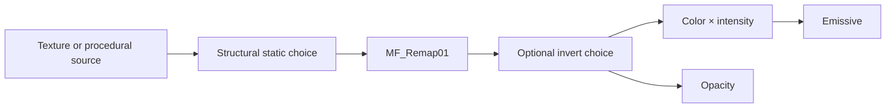

# 03.08 — Reusable material architecture і shader debugging

## 1. Назва

**Material Instances, Functions, Static Switches, permutations і systematic shader debugging.**

## 2. Результат уроку

Ви:

- відрізняєте Material, Material Instance і Dynamic Material Instance conceptually;
- створюєте transparent, inspectable `Material Function`;
- задаєте parameter contract і naming;
- використовуєте `StaticSwitchParameter` свідомо;
- рахуєте combinatorial switch variants;
- будуєте reusable master material без opaque mystery function;
- debug-ите branch від source до root;
- проводите basic Shader Complexity/permutation audit;
- створюєте `MF_L03_08_Remap01`, `M_L03_08_MasterDebug` і три instances.

## 3. Орієнтовний час

**7 годин: 1.5 години теорії / 5.5 години практики.**

- 35 хв — instances/functions;
- 30 хв — static switches/permutations;
- 25 хв — debugging method;
- 75 хв — function build/test;
- 170 хв — master/instances;
- 85 хв — exercises/audit.

## 4. Prerequisites

- 03.01–03.07;
- explicit remap formula;
- texture/procedural mask і Translucent material;
- connection-list discipline.

## 5. Нові терміни

- **Material Instance Constant (MIC)** — asset із overridden exposed parameters parent material.
- **Dynamic Material Instance (DMI/MID)** — runtime instance, parameters якого можна змінювати через gameplay code або Blueprint.
- **Material Function** — reusable graph із explicit inputs/outputs.
- **FunctionInput/FunctionOutput** — boundaries contract function.
- **Static parameter** — choice під час compile.
- **Static Switch Parameter** — обирає branch у compiled variant.
- **Permutation** — compiled combination static choices, platform і features.
- **Runtime parameter** — value, що змінюється без вибору static shader branch.
- **Orphan node** — node, який не впливає на output.
- **Isolation debugging** — тимчасовий output однієї intermediate branch.
- **Parameter contract** — name, type, default, valid range і semantic meaning.

## 6. Навіщо ця тема потрібна VFX-фахівцю

Без architecture кожен effect копіює graph і дрейфує. Надмірний «universal master» має десятки switches/permutations і стає важким. Мета — маленькі, зрозумілі families:

- common verified math у function;
- runtime art controls у instance;
- static switch лише для structural difference;
- debug outputs на branch boundaries.

## 7. Теорія простими словами

Material — recipe. Material Instance — набір дозволених overrides recipe. Function — шматок recipe з підписаними inputs/outputs. Static Switch — compiler обирає одну structural branch; це може створити окремі compiled variants.

Якщо є `n` independent Boolean switches, theoretical combinations:

```text
2^n
```

2 switches → 4; 5 → 32; 10 → 1024. Реальна compilation/caching залежить від usage/platform, але combinatorial risk реальний.

## 8. Детальні технічні пояснення

### Instances

`ScalarParameter`, `VectorParameter`, `TextureSampleParameter2D`, static parameters з’являються в instance groups. Instance не робить погано спроєктований parent дешевим автоматично.

Naming:

- noun + role: `MaskTexture`, `EdgeWidth`, `ColorCore`;
- units/range в description: `FadeDistanceCm`, `DirectionXY`;
- group: `01_Mask`, `02_Color`, `03_Animation`, `90_Debug`.

### Dynamic Material Instances

DMI створюється runtime і змінює supported non-static parameters. Full Blueprint integration у block 10; зараз важливо: DMI не може перетворити runtime scalar на compile-time Static Switch без variant selection/recreation behavior. Exact API workflow later.

### Functions

Хороша function має:

- одна зрозуміла responsibility;
- explicit typed inputs;
- predictable range;
- відсутність hidden scene dependency, якщо її не названо;
- preview values для authoring;
- description output.

`MF_L03_08_Remap01` не приховує formula: урок будує її вручну, а function стає reusable лише після mastery.

### Static Switches

Використовуйте, коли branches структурно відрізняються й одна з них має бути виключена під час compile. Не використовуйте static switch для continuous art value. Якщо Lerp достатній, а branches дешеві, runtime control може уникнути permutation explosion, але концептуально обчислює обидва inputs; compiled optimization може відрізнятися.

### Порядок debugging

1. Material properties.
2. Source asset або value.
3. UV або coordinate.
4. Raw mask.
5. Remap або threshold.
6. Color або intensity.
7. Opacity або depth.
8. Root output.
9. Instance overrides.
10. Scene або view mode.

### Shader stats і complexity

Material Editor stats, Platform Stats, Shader Complexity and compiled shader inspection UI can change. **Потребує ручної перевірки в Unreal Engine 5.8.** Capture build, feature level, quality, platform and view.

## 9. Візуальні або математичні приклади

Audit permutations:

| Switches | Теоретичні Boolean combinations |
|---:|---:|
| 0 | 1 |
| 1 | 2 |
| 2 | 4 |
| 3 | 8 |
| 5 | 32 |
| 8 | 256 |

Це не автоматично final shader count: існують додаткові engine і platform variants, а unused combinations можуть оброблятися інакше. Це design warning.

Architecture:



## 10. Controlled experiments

1. Створіть Scalar, Vector і Texture parameters та instance parent; перевірте grouping і defaults.
2. Змініть scalar в instance; зауважте, що parent graph не редагується.
3. Додайте один Static Switch, створіть True і False instances, спостерігайте compile та apply.
4. Задайте function input invalid range `InMax=InMin`; задокументуйте failure і відновіть значення.
5. Навмисно disconnect mask; дотримуйтеся debugging order.
6. Додайте orphan expensive-looking branch без connection; розрізніть graph clutter і compiled contribution, але приберіть її для clarity audit.

## 11. Покрокова керована практика

### Function — `MF_L03_08_Remap01`

#### Contract function

| Input | Type | Preview/default | Значення |
|---|---|---:|---|
| `Value` | Scalar | `.5` | source value |
| `InMin` | Scalar | `.2` | mapped на 0 |
| `InMax` | Scalar | `.8` | mapped на 1; має перевищувати InMin |
| Output `Result01` | Scalar | — | saturated remap |

#### Повний inventory

`FunctionInput Value`; `FunctionInput InMin`; `FunctionInput InMax`; `Subtract Numerator`; `Subtract Range`; `Divide Normalize`; `Saturate Result`; `FunctionOutput Result01`.

#### Connections

```text
Value.Output → Numerator.A
InMin.Output → Numerator.B
InMax.Output → Range.A
InMin.Output → Range.B
Numerator.Output → Normalize.A
Range.Output → Normalize.B
Normalize.Output → Result.Input
Result.Output → Result01.Input
```

`FunctionOutput` має один connector без label в офіційній документації; у connection list він названий documentation alias `.Input`. Точне відображення pins FunctionInput/Output і UI для input type: **Потребує ручної перевірки в Unreal Engine 5.8.** Semantic contract має збігатися.

#### Tests

| Value/InMin/InMax | Очікуваний результат |
|---|---:|
| `.2/.2/.8` | 0 |
| `.5/.2/.8` | .5 |
| `.8/.2/.8` | 1 |
| `0/.2/.8` | 0 після Saturate |
| `1/.2/.8` | 1 після Saturate |

### Master — `M_L03_08_MasterDebug`

#### Properties

- Surface / Translucent / Unlit
- Two Sided True

#### Повний inventory

| Alias | Node | Default |
|---|---|---|
| `UV0` | `TextureCoordinate` | 0 |
| `TilingXY` | `VectorParameter` | `(1,1,0,0)` |
| `TilingRG` | `ComponentMask` | RG |
| `ScaledUV` | `Multiply` | — |
| `MaskTexture` | `TextureSampleParameter2D` | packed data |
| `Center` | `Constant2Vector` | `(.5,.5)` |
| `RadiusDistance` | `Distance` | — |
| `Radius` | `ScalarParameter` | `.35` |
| `Feather` | `ScalarParameter` | `.04` |
| `InnerEdge` | `Subtract` | — |
| `CircleTransition` | `SmoothStep` | — |
| `CircleMask` | `OneMinus` | — |
| `UseTexture` | `StaticSwitchParameter` | True |
| `MaskMin` | `ScalarParameter` | `.1` |
| `MaskMax` | `ScalarParameter` | `.9` |
| `Remap01` | `MaterialFunctionCall` | `MF_L03_08_Remap01` |
| `InvertedMask` | `OneMinus` | — |
| `InvertMask` | `StaticSwitchParameter` | False |
| `Color` | `VectorParameter` | `(1,.05,.01,1)` |
| `Intensity` | `ScalarParameter` | `3` |
| `HDRColor` | `Multiply` | — |
| `ShapeColor` | `Multiply` | — |
| `OpacityScale` | `ScalarParameter` | `1` |
| `FinalOpacity` | `Multiply` | — |
| `MaterialOutput` | Main Material Node | — |

#### Connections

```text
TilingXY.RGBA → TilingRG.Input
UV0.Output → ScaledUV.A
TilingRG.RG → ScaledUV.B
ScaledUV.Output → MaskTexture.UVs
UV0.Output → RadiusDistance.A
Center.Output → RadiusDistance.B
Radius.Output → InnerEdge.A
Feather.Output → InnerEdge.B
InnerEdge.Output → CircleTransition.Min
Radius.Output → CircleTransition.Max
RadiusDistance.Output → CircleTransition.Value
CircleTransition.Output → CircleMask.Input
MaskTexture.R → UseTexture.A
CircleMask.Output → UseTexture.B
UseTexture.Output → Remap01.Value
MaskMin.Output → Remap01.InMin
MaskMax.Output → Remap01.InMax
Remap01.Result01 → InvertedMask.Input
InvertedMask.Output → InvertMask.A
Remap01.Result01 → InvertMask.B
Color.RGB → HDRColor.A
Intensity.Output → HDRColor.B
InvertMask.Output → ShapeColor.A
HDRColor.Output → ShapeColor.B
ShapeColor.Output → MaterialOutput.Emissive Color
InvertMask.Output → FinalOpacity.A
OpacityScale.Output → FinalOpacity.B
FinalOpacity.Output → MaterialOutput.Opacity
```

Static switch semantic: A is selected when parameter True, B when False. **Потребує ручної перевірки в Unreal Engine 5.8.** Confirm actual `A/B` labels and default checkbox; if UI uses True/False labels, document them.

#### Instances

- `MI_L03_08_Texture`: UseTexture True, InvertMask False.
- `MI_L03_08_Procedural`: UseTexture False, InvertMask False.
- `MI_L03_08_Procedural_Inverted`: False/True.

Згрупуйте parameters і додайте descriptions. Створіть таблицю enabled switches і теоретичних combinations для двох switches (4).

#### Protocol debug

Тимчасово подавайте в output по одному:

`ScaledUV`, texture R, CircleMask, output UseTexture, result Remap, output Invert, FinalOpacity, HDRColor. Після кожного capture відновлюйте exact root.

## 12. Точні назви вузлів, модулів і налаштувань UE

- `FunctionInput`, `FunctionOutput`, `MaterialFunctionCall`
- `StaticSwitchParameter`
- `ScalarParameter`, `VectorParameter`, `TextureSampleParameter2D`
- Material Instance Editor parameter groups/overrides
- Material Editor stats/Platform Stats and `Shader Complexity`

UI/pins/stats: **Потребує ручної перевірки в Unreal Engine 5.8.**

## 13. Стартові значення параметрів

Використовуйте defaults inventory. Contracts:

- `MaskMax > MaskMin`;
- `Feather > 0`, `<Radius`;
- `OpacityScale 0…1` unless intentional extrapolation;
- static parameters лише для structural variants;
- color RGB може бути HDR, але Intensity лишається окремо art-directable.

## 14. Очікуваний результат кожного етапу

- Function проходить п’ять numeric tests.
- Parent компілює variants texture, procedural і invert.
- Три instances відрізняються без duplication parent.
- Audit switches містить 4 theoretical combinations.
- Debug captures ізолюють кожну branch.
- Shader Complexity зафіксовано з тією самою geometry і camera.
- Hidden function і orphan node відсутні.

## 15. Самостійна вправа

### EX-L03-08-A — Reusable soft-threshold function

Створіть inputs `Value`, `Threshold`, `Feather`, `Invert` у `MF_EX_L03_08_SoftThreshold` (Static Bool input лише якщо exact workflow перевірено; інакше створіть окремі variants scalar output). Output — soft threshold `0–1`.

**Обмеження:** explicit ranges SmoothStep; без divide by zero; descriptions function; п’ять tests.

**Матеріали до здачі:** повний function graph, tests, один caller material і range contract.

**Критерії приймання:** threshold і feather predictable; inversion explicit; caller не має duplicated threshold math.

## 16. Додаткова складніша вправа

### EX-L03-08-B — Master family and permutation audit

Створіть parent, що підтримує texture або procedural mask і optional inversion через рівно два Static Switch Parameters, а також runtime color, intensity і opacity. Створіть усі чотири combinations switches як instances і виконайте audit.

**Обмеження:** без третього switch; parameters згруповано; orphan nodes відсутні; intermediate debug evidence; письмово порівняйте alternative dynamic Lerp.

**Матеріали до здачі:** parent contract, чотири instances, таблиця `2²=4`, captures shader complexity, recommendation щодо variants, які слід лишити.

**Критерії приймання:** кожна combination компілюється й працює; unused variants визначено; distinction static і runtime правильне.

## 17. Три рівні підказок

### EX-L03-08-A

- **Hint 1:** soft interval — це Threshold±Feather.
- **Hint 2:** Subtract/Add → SmoothStep; OneMinus для inverted output.
- **Hint 3:** expose normal і inverted outputs або verified static bool choice; перевірте below, start, middle, end і above.

[Рішення A](../EXERCISE_ANSWERS/L03-08_instances_functions_switches_and_debugging_answers.md#ex-l03-08-a)

### EX-L03-08-B

- **Hint 1:** перший switch обирає source, другий — normal або inverted.
- **Hint 2:** `UseTexture(textureR,circle)` → remap → `InvertMask(oneMinus,normal)`.
- **Hint 3:** чотири MICs TT/TF/FT/FF; той самий runtime contract Color, Intensity і Opacity; audit фактично потрібних combinations.

[Рішення B](../EXERCISE_ANSWERS/L03-08_instances_functions_switches_and_debugging_answers.md#ex-l03-08-b)

## 18. Типові помилки

- Function створено до розуміння formula.
- Hidden defaults або scene dependencies.
- Static Switch для кожного art control.
- Combinations switches плутають з exact final shader count.
- Від DMI очікують зміни static switch як scalar.
- Names parameters конфліктують або не мають units.
- Debug output не відновлено.
- Override instance не ввімкнено.
- Під час comparison редагують і parent, і instance.
- Orphan debug nodes не видалено.

## 19. Troubleshooting

| Симптом | Перевірка | Виправлення |
|---|---|---|
| Output function повністю чорний | preview або range input | перевір known values |
| Parameter instance відсутній | node не parameter, group або override | точний parameter type, Apply і Save |
| Неправильна switch branch | default або semantics A/B | виконай manual check і додай labels instances |
| Compile explosion | switches і combinations | видали або консолідуй structural options |
| Instance виглядає як default parent | checkbox override | увімкни override |
| Shader issue лише в одному variant | ізолюй combination switches | системно порівняй чотири MICs |

## 20. Performance considerations

- Material Instances покращують reuse і authoring, але не гарантують нижчий GPU cost.
- Static Switch може виключити unused branch із compiled variant, але множить permutations.
- Runtime Lerp уникає static permutations, але може обчислювати обидві branches.
- Abstraction function зазвичай не робить math безкоштовною; вона покращує reuse і readability.
- Cost texture і procedural branches відрізняється; порівнюйте actual compiled variant і scene.
- Shader Complexity — це screening tool, а не повний profiler.

## 21. Запитання для самоперевірки

1. Яка різниця між parent material і instance?
2. Що таке function contract?
3. Чому не слід ховати незасвоєну math у function?
4. Що змінює Static Switch?
5. Скільки combinations дають п’ять independent booleans?
6. Яка різниця між static і runtime parameter?
7. Чи можна безпечно вважати DMI setter для static switch?
8. Який debug order після неправильного opacity?
9. Чи function автоматично зменшує instruction cost?
10. Навіщо фіксувати platform і feature level?

## 22. Відповіді на запитання

1. Parent визначає graph і properties; instance перевизначає exposed parameters.
2. Typed inputs і outputs, ranges, semantics та defaults.
3. Це заважає reasoning і debugging та створює opaque dependency.
4. Structural branch або variant під час compile.
5. 32 theoretical combinations.
6. Static обирає compiled variant; runtime змінює data у variant.
7. Ні; ставтеся до них по-різному й перевіряйте runtime API.
8. source mask → remap → switch → opacity scale → root або property.
9. Ні; вона абстрагує й дає reuse graph.
10. Compilation, cost і options залежать від target.

## 23. Self-check checklist

- [ ] Formula function спочатку засвоєна.
- [ ] Inputs і outputs мають types та descriptions.
- [ ] П’ять tests пройдено.
- [ ] Рівно два switches.
- [ ] Audit 4 combinations завершено.
- [ ] Distinction runtime і static правильне.
- [ ] Debug outputs відновлено.
- [ ] Orphan nodes відсутні.
- [ ] Manual checks записано.

## 24. Mastery criteria

- Побудуйте function і parent з нуля за 60 хвилин.
- Поясніть кожну branch і function.
- Передбачте permutations.
- Діагностуйте неправильні instance або switch.
- Завершіть A/B і дайте правильні відповіді на 8/10.
- Пройдіть checklist material graph.

## 25. Підсумок

Reusable architecture спирається на перевірене розуміння. Functions expose contracts; instances expose art controls; static switches є обмеженим ресурсом structural choices. Виконуйте debug від source до root і audit variants замість побудови universal monolith.

## 26. Зв’язок із наступними уроками

[03.09](09_material_foundations_control_project.md) прибирає guided graph: три materials треба реконструювати за written specifications, а потім виконати audit із тією самою discipline debug і architecture.

## 27. Офіційні джерела

- [Creating and Using Material Functions](https://dev.epicgames.com/documentation/en-us/unreal-engine/creating-and-using-material-functions-in-unreal-engine)
- [Material Functions Overview](https://dev.epicgames.com/documentation/en-us/unreal-engine/unreal-engine-material-functions-overview)
- [Material Function Expressions](https://dev.epicgames.com/documentation/en-us/unreal-engine/material-function-expressions-in-unreal-engine)
- [Material Parameter Expressions](https://dev.epicgames.com/documentation/en-us/unreal-engine/material-parameter-expressions-in-unreal-engine)
- [Material Functions Reference](https://dev.epicgames.com/documentation/en-us/unreal-engine/unreal-engine-material-functions-reference)
- [Material Editor User Guide](https://dev.epicgames.com/documentation/en-us/unreal-engine/unreal-engine-material-editor-user-guide)
- [Material Expressions Reference](https://dev.epicgames.com/documentation/en-us/unreal-engine/unreal-engine-material-expressions-reference)

Дата 2026-07-27. Function/switch/stats UI: **Потребує ручної перевірки в Unreal Engine 5.8.**

## 28. Перелік рекомендованих скриншотів або схем

```text
Рекомендований скриншот 1:
Що відкрити: MF_L03_08_Remap01.
Що повинно бути видно: typed inputs, complete formula, Result01.
Яку область виділити: function contract and range.
```

```text
Рекомендований скриншот 2:
Що відкрити: four Material Instances side by side.
Що повинно бути видно: two static overrides and common runtime controls.
Яку область виділити: switch combination labels and previews.
```
