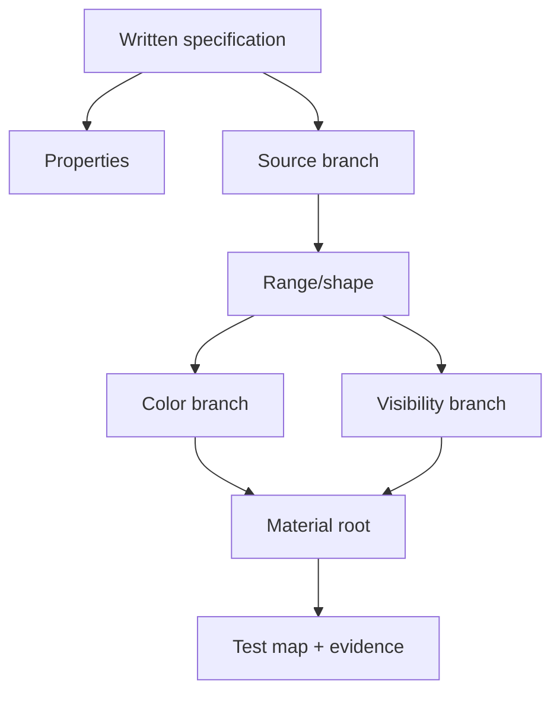

# 03.09 — Контрольний проєкт фундаменту Material Editor

## 1. Назва

**Material Foundations Control Project: три materials із письмових specifications без готового graph.**

## 2. Результат уроку

Ви самостійно:

- перекладаєте written visual/technical specification у graph;
- будуєте procedural mask, texture-driven animation і depth-aware translucency;
- документуєте properties, inventory, parameters і exact connections;
- debug-ите intermediate outputs;
- порівнюєте mode/cost/aliasing;
- створюєте reusable instances без зайвих switches;
- доводите готовність пройти критерій переходу `G03`.

Матеріали до здачі:

- `M_CP03_ProceduralRing`;
- `M_CP03_AnimatedTexture`;
- `M_CP03_DepthCard`;
- test map `L_CP03_MaterialFoundations`;
- evidence package й самооцінювання.

## 3. Орієнтовний час

**7 годин: 1 година планування/теорії / 6 годин практики.**

- 30 хв — specification parsing;
- 30 хв — test contract;
- 240 хв — build three materials;
- 60 хв — debugging;
- 45 хв — performance/instances;
- 45 хв — documentation/self-check.

## 4. Prerequisites

- 03.01–03.08 завершено;
- exercises A/B усіх попередніх уроків;
- `CHECKLISTS/MATERIAL_GRAPH_REVIEW.md`;
- під час першої спроби не використовується ready graph або tutorial.

## 5. Нові терміни

- **Written specification** — measurable graph requirements без picture of solution.
- **Graph contract** — properties + nodes + таблиця parameters + connections + assumptions ranges.
- **Acceptance test** — repeatable check, що визначає pass або fail.
- **Evidence package** — assets, screenshots, captures, tables і explanations.
- **Regression** — behavior, який працював раніше, ламається після change.
- **Control project** — integration task зі зменшеним guidance.

## 6. Навіщо ця тема потрібна VFX-фахівцю

Production task рідко надає готовий node graph. Artist отримує бажану поведінку, reference, constraints і target platform. Ключова навичка — перетворити задум на математику, яку можна перевірити, а не запам'ятати wiring зі screenshot.

## 7. Теорія простими словами

Розбирайте кожну specification у такому порядку:

1. **Де?** Material Domain.
2. **Як виконується blend?** Blend Mode.
3. **Як працює lighting?** Shading Model.
4. **Який source?** UV, math, texture або depth.
5. **Який range?** signed, `0–1`, HDR.
6. **Які controls?** parameters і defaults.
7. **Які outputs?** Emissive, Opacity або Opacity Mask.
8. **Як виконується debug?** intermediate outputs.
9. **Як виконується test?** camera, background, intersection і motion.
10. **Який risk cost?** samples, ALU, overdraw і permutations.

## 8. Детальні технічні пояснення

### Specification A — procedural ring

Обов’язковий behavior:

- centered ring у UV0;
- control aspect;
- параметризовані radius, half-width і feather;
- HDR color та intensity;
- binary coverage Masked із soft source threshold, clipped на `.5`;
- texture і function відсутні.

### Specification B — animated texture

- один sample packed data texture;
- sample channel B як directional або noise mask;
- UV tiling і Panner;
- normalized mask, сформована через `Power`;
- output Additive/Unlit;
- color та intensity незалежні від mask;
- exact setting sRGB або data задокументовано.

### Specification C — depth-aware card

- mask із channel G texture;
- Translucent/Unlit;
- HDR Emissive;
- base mask проходить через `DepthFade` до Opacity;
- parameter FadeDistance;
- evidence на трьох distances intersection.

### Правило без solution

Секції 11–17 містять процес, specifications і поступові hints, але не фінальний wiring. Повні переліки вузлів і connections наведені у файлі відповідей, який можна відкрити лише після першої спроби та evidence. Це зберігає вимогу карти «без готового graph», водночас курс усе одно містить повні рішення.

### Ручна перевірка

DepthFade pins, Panner Speed UI, Additive Opacity behavior, Texture Editor presets, Shader Complexity UI: **Потребує ручної перевірки в Unreal Engine 5.8.**

## 9. Візуальні або математичні приклади

Worksheet для planning:

| Material | Source | Normalization або shape | Color | Visibility |
|---|---|---|---|---|
| Ring | Length centered/aspect UV | Abs(distance-radius), SmoothStep, invert | mask × HDR color | Opacity Mask |
| Animated | texture B за panned UV | Power normalized mask | mask × HDR color | contribution Additive і Opacity перевірено |
| Depth card | texture G | DepthFade(base mask,distance) | mask × HDR color | faded Opacity |

Схема dependencies:



## 10. Controlled experiments

Перед final build:

1. Відтворіть formula remap на папері.
2. Передбачте values ring mask у center, на radius і поза ним.
3. Для 4× packed texture визначте selected channels B і G у Texture Asset Editor.
4. Передбачте direction panner для додатного X.
5. Намалюйте opacity DepthFade залежно від gap intersection.
6. Передбачте, який material має risks overdraw або aliasing.

Під час prediction на папері UE graph не відкривається.

## 11. Покрокова керована практика

### Етап 1 — test map

Створіть `L_CP03_MaterialFoundations`:

- neutral gray floor і wall;
- чорна, 50% сіра та біла background panels;
- три labeled stations plane;
- opaque cube, що перетинає station C;
- fixed camera bookmark або actor;
- один light лише за потреби для orientation scene; materials мають Unlit;
- fixed exposure для comparisons.

### Етап 2 — planning graph

Для кожної specification запишіть:

- material properties;
- type і range source;
- таблицю parameters;
- chain formula;
- root outputs;
- щонайменше чотири debug outputs;
- hypothesis performance.

### Етап 3 — build A

Будуйте від centered UV назовні. Перевірте у debug `CenteredUV`, `RadiusDistance`, `RingDistance`, `RingMask` і final Masked result. Не починайте color, доки mask не проходить test.

### Етап 4 — build B

Спочатку підтвердьте texture settings і channel. Перевірте у debug UV, panned UV, sample B, mask після Power і final Additive output.

### Етап 5 — build C

Перевірте у debug окремо base mask і HDR color, потім output DepthFade. Тестуйте на opaque cube з тією самою camera.

### Етап 6 — documentation

Створіть unique aliases і exact список connections для кожного graph. Будь-який пропущений connection означає incomplete deliverable.

### Етап 7 — performance pass

З тією самою camera:

- normal view;
- Shader Complexity або Quad Overdraw, де доступно;
- 1, 4 і 16 stacked cards для B/C;
- motion із subpixel size для A.

### Етап 8 — regression

Створіть один Material Instance для кожного parent і змініть кожен exposed parameter. Відновіть defaults і перевірте, що original captures усе ще збігаються.

## 12. Точні назви вузлів, модулів і налаштувань UE

Дозволені й очікувані exact nodes:

- common: `TextureCoordinate`, `ScalarParameter`, `VectorParameter`, `ComponentMask`, `Multiply`, `Add`, `Subtract`, `Divide`, `Saturate`, `OneMinus`, `Power`, `Abs`;
- ring: `Length`, `SmoothStep`;
- animated: `TextureSampleParameter2D`, `Panner`;
- depth: `DepthFade`;
- root inputs: `Emissive Color`, `Opacity`, `Opacity Mask`;
- properties: `Material Domain`, `Blend Mode`, `Shading Model`, `Two Sided`, `Opacity Mask Clip Value`.

No Static Switch is needed. Exact version-sensitive pins/settings: **Потребує ручної перевірки в Unreal Engine 5.8.**

## 13. Стартові значення параметрів

### A

`Center=(.5,.5)`, `Aspect=(1,1)`, `Radius=.32`, `HalfWidth=.045`, `Feather=.012`, `Color=(2,.04,.01,1)`, `Intensity=2`, clip `.5`.

### B

`Tiling=(1,2)`, `PanSpeed=(.12,0)`, `Power=2`, `Color=(.05,.3,2,1)`, `Intensity=3`.

### C

`Color=(1,.08,.01,1)`, `Intensity=3`, `FadeDistance=25`, `OpacityScale=1`.

## 14. Очікуваний результат кожного етапу

| Етап | Очікуваний результат |
|---|---|
| Test map | repeatable camera, background і intersection |
| A mask | centered adjustable ring, stable aspect |
| A final | crisp Masked ring без rectangle |
| B source | правильний linear data channel |
| B final | animated Additive pattern без UV jump |
| C base | soft mask видима далеко від geometry |
| C fade | soft intersection у tests 5, 25 і 100 |
| Performance | evidence, а не universal conclusion |
| Docs | усі graph contracts reproducible |

## 15. Самостійна вправа

### EX-L03-09-A — Build the three specifications

Побудуйте A/B/C без solution.

**Обмеження**

- exact names, properties і defaults наведено вище;
- без external tutorial або copied graph;
- без Material Function, крім functions, authored і повністю пояснених вами; для simplicity assessment використовуйте explicit nodes;
- виконайте debug mask до color;
- orphan nodes відсутні.

**Матеріали до здачі**

- три assets і по одній instance для кожного;
- повні contracts properties, inventory, parameters і connections;
- щонайменше чотири intermediate captures на кожен graph;
- normal і complexity views;
- письмові explanations branches.

**Критерії приймання**

- усі три materials компілюються й відповідають specs;
- кожну operation пояснено;
- parameters instance працюють;
- checks texture, depth і manual записано.

## 16. Додаткова складніша вправа

### EX-L03-09-B — Fault injection, diagnosis і constrained polish

Створіть duplicate кожного asset та інжектуйте один fault:

- A: приберіть aspect correction або неправильно invert SmoothStep;
- B: використайте неправильний channel або sRGB semantic;
- C: обійдіть DepthFade або під’єднайте його до неправильного root path.

Не відкриваючи answers:

1. виконайте diagnosis за intermediate outputs;
2. запишіть symptom, cause і fix;
3. відновіть correct graph;
4. створіть одну art-directed variation instance для кожного material без нового static switch;
5. поясніть change cost і readability.

**Матеріали до здачі:** шість captures до і після, log troubleshooting, три variations і final review checklist.

**Критерії приймання:** cause знайдено через data flow; random rewiring відсутній; variants зберігають parent contract.

## 17. Три рівні підказок

### EX-L03-09-A

- **Hint 1:** запишіть кожен pipeline source→shape→color або visibility.
- **Hint 2:** A використовує Length, Abs і SmoothStep; B — Panner, sample B і Power; C — sample G і DepthFade.
- **Hint 3:** ring mask A подається і в color, і в Opacity Mask; shaped B у B подається в color і Additive visibility; G у C подається в Opacity через DepthFade, а G×HDR — у Emissive.

[Повне рішення A](../EXERCISE_ANSWERS/L03-09_material_foundations_control_project_answers.md#ex-l03-09-a)

### EX-L03-09-B

- **Hint 1:** почніть із source і по черзі подавайте кожен intermediate в Emissive.
- **Hint 2:** перевіряйте properties → UV → raw mask → shaped mask → root visibility → instance overrides.
- **Hint 3:** у A порівняйте Length і RingDistance; у B перевірте Texture Editor, потім sample B; у C порівняйте base G з output DepthFade на intersection.

[Повне рішення B](../EXERCISE_ANSWERS/L03-09_material_foundations_control_project_answers.md#ex-l03-09-b)

## 18. Типові помилки

- Color побудовано до validation mask.
- Material property зі specification відсутня.
- Default parameter відрізняється від contract.
- Aspect «виправлено» лише через scaling mesh.
- Packed texture sampled як sRGB color.
- Speed або axis Panner вгадано.
- Additive оцінено лише на black background.
- DepthFade перевірено без opaque intersection.
- Debug connection не відновлено.
- Answer file відкрито до чесної спроби.
- Список connections лише підсумовує, а не відтворює graph.

## 19. Troubleshooting

Використовуйте цю fixed sequence:

1. правильні asset і instance;
2. properties;
3. source і value type;
4. UV і space;
5. raw mask;
6. shaping;
7. color і HDR;
8. visibility root;
9. depth і background;
10. performance view.

| Симптом | Перший decisive debug |
|---|---|
| Rectangular ring card | RingMask і Opacity Mask |
| Animated pattern static | PannedUV і settings Time або Panner |
| У B неправильні midtones color або mask | sRGB і channel texture |
| Depth card перетинає cube з hard clip | output DepthFade |
| MI не змінюється | checkbox override і parameter type |
| Complexity неочікувана | та сама camera, stack cards і source |

## 20. Performance considerations

- A Masked: aliasing, coverage, Two Sided і procedural ALU.
- B Additive: вибірка текстури + panner + overdraw; black areas усе ще можуть бути covered.
- C Translucent: operation texture або depth + overdraw і sorting.
- Instances не зменшують parent shader cost.
- Відсутність Static Switch означає, що урок не створює Boolean permutation explosion.
- Для comparison використовуйте те саме покриття екрана.
- Final pass є evidence, а не передчасною target-platform certification.

## 21. Запитання для самоперевірки

1. Який перший step перетворення spec на graph?
2. Чому mask будують до color?
3. Яка formula ring?
4. Чому A використовує Opacity Mask?
5. Чому texture masks у B мають sRGB Off?
6. Що керує motion B?
7. Чому C використовує output DepthFade для Opacity?
8. Що доводить instance?
9. Чому Static Switch не потрібен?
10. Яке evidence підтримує performance claim?

## 22. Відповіді на запитання

1. Виділити properties, sources, ranges, parameters, outputs і tests.
2. Errors visibility або shape стають однозначними.
3. `1-smoothstep(width-feather,width,abs(length(p)-radius))`.
4. Specification вимагає binary coverage Masked.
5. Це numeric data, а не sRGB color.
6. Coordinate Panner, Time і speed разом із tiling.
7. Він об’єднує base mask із fade scene intersection.
8. Exposed controls змінюють behavior без duplication parent graph.
9. Structural architecture не має optional branches; три focused parents зрозуміліші.
10. View modes із тією самою camera, stack tests, target-like conditions і задокументовані settings.

## 23. Self-check checklist

- [ ] Три specs розібрано до graph.
- [ ] Exact properties і defaults.
- [ ] Intermediate debug evidence.
- [ ] Повні inventories і connections.
- [ ] Orphan nodes відсутні.
- [ ] Semantic texture задокументовано.
- [ ] Depth test repeatable.
- [ ] Три instances перевірено.
- [ ] Log faults завершено.
- [ ] Checklist material review пройдено.

## 24. Mastery criteria

Підготовка до критерію переходу проходить, коли:

- усі три graphs працюють за written specs;
- кожну operation і range пояснено;
- intermediate outputs ізолюють faults;
- opaque ready function відсутня;
- evidence Shader Complexity і overdraw надано;
- A/B прийнято;
- щонайменше 8/10 answers правильні;
- самооцінювання називає одне technical і одне artistic improvement.

## 25. Підсумок

Material foundation — це не memorization nodes. Це переклад contract у data flow, доказ кожного range, вибір правильних renderer properties, documentation connections і testing failure modes.

## 26. Зв’язок із наступними уроками

Перейдіть до `03_MATERIAL_FOUNDATIONS/BLOCK_ASSESSMENT.md`. Після mastery gate `G03` block 04 додає dissolve, erosion, distortion, flow, gradient ramps, Fresnel, WPO і renderer-facing VFX materials.

## 27. Офіційні джерела

- [Unreal Engine Materials](https://dev.epicgames.com/documentation/en-us/unreal-engine/unreal-engine-materials)
- [Material Editor User Guide](https://dev.epicgames.com/documentation/en-us/unreal-engine/unreal-engine-material-editor-user-guide)
- [Material Inputs](https://dev.epicgames.com/documentation/en-us/unreal-engine/material-inputs-in-unreal-engine)
- [Material Expressions Reference](https://dev.epicgames.com/documentation/en-us/unreal-engine/unreal-engine-material-expressions-reference)
- [Math Material Expressions](https://dev.epicgames.com/documentation/en-us/unreal-engine/math-material-expressions-in-unreal-engine)
- [Coordinates Material Expressions](https://dev.epicgames.com/documentation/en-us/unreal-engine/coordinates-material-expressions-in-unreal-engine)
- [Depth Material Expressions](https://dev.epicgames.com/documentation/en-us/unreal-engine/depth-material-expressions-in-unreal-engine)
- [Material Parameter Expressions](https://dev.epicgames.com/documentation/en-us/unreal-engine/material-parameter-expressions-in-unreal-engine)
- [Texture Asset Editor](https://dev.epicgames.com/documentation/en-us/unreal-engine/texture-asset-editor-in-unreal-engine)
- [Guidelines for Optimizing Rendering for Real Time](https://dev.epicgames.com/documentation/en-us/unreal-engine/guidelines-for-optimizing-rendering-for-real-time-in-unreal-engine)

Дата 2026-07-27. Version-sensitive UI/settings: **Потребує ручної перевірки в Unreal Engine 5.8.**

## 28. Перелік рекомендованих скриншотів або схем

```text
Рекомендований скриншот 1:
Що відкрити: L_CP03_MaterialFoundations fixed camera.
Що повинно бути видно: A/B/C stations, backgrounds, opaque intersection cube.
Яку область виділити: labels and equal card sizes.
```

```text
Рекомендований скриншот 2:
Що відкрити: each material graph.
Що повинно бути видно: one full readable graph per capture.
Яку область виділити: source, shape, color, visibility comments.
```

```text
Рекомендований скриншот 3:
Що відкрити: Shader Complexity/Quad Overdraw.
Що повинно бути видно: same camera with 1/4/16 card stacks.
Яку область виділити: coverage comparison and build/quality caption.
```
