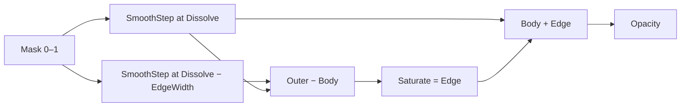

# 1. L04-01 — Dissolve, erosion і керований edge mask

| Поле | Значення |
|---|---|
| Блок | 04 — Stylized VFX Materials |
| Lesson ID | L04-01 |
| Цільова версія | Unreal Engine 5.8 |
| Артефакт уроку | `MF_VFX_DissolveEdge`, debug material і Translucent/Masked test instances |
| Mastery gate | Із чистого graph побудувати стабільні Body/Edge masks і пояснити кожну операцію |

## 2. Результат уроку

Після уроку ви без покрокового tutorial зможете:

- перетворити grayscale mask на керований dissolve;
- відокремити вузький edge band від основної body mask;
- контролювати threshold, edge width і softness незалежно;
- перевірити діапазони проміжних values;
- обрати Translucent або Masked presentation через візуальні й performance constraints;
- оформити logic як reusable Material Function.

Доказ: один function asset, два Material Instances, A/B capture й independent variation.

## 3. Орієнтовний час

| Частина | Години | Практика |
|---|---:|---:|
| Mental model і математика | 1.25 | 0 |
| Controlled experiments | 0.75 | 0.75 |
| Guided practice | 2.5 | 2.5 |
| Самостійні вправи | 2.0 | 2.0 |
| Debug, performance і retrieval | 1.5 | 0.75 |
| **Разом** | **8.0** | **6.0 (75%)** |

## 4. Prerequisites

| Потрібна навичка або asset | Де отримано | Як швидко перевірити |
|---|---|---|
| 0–1 masks і remapping | [L03-02](../03_MATERIAL_FOUNDATIONS/02_material_math_and_remapping.md) | Побудуйте `Saturate(A-B)` |
| `SmoothStep`, thresholds | [L03-03](../03_MATERIAL_FOUNDATIONS/03_procedural_math_and_threshold_masks.md) | Поясніть Min, Max і Value |
| Texture sampling і channels | [L03-06](../03_MATERIAL_FOUNDATIONS/06_texture_sampling_channels_and_flipbooks.md) | Preview R channel noise |
| Blend Modes і overdraw | [L03-07](../03_MATERIAL_FOUNDATIONS/07_material_domains_blending_depth_and_overdraw.md) | Порівняйте Masked і Translucent |
| Material Functions/Instances | [L03-08](../03_MATERIAL_FOUNDATIONS/08_instances_functions_switches_and_debugging.md) | Створіть function з float input/output |
| Mastery Gate G03 | [Block Assessment](../03_MATERIAL_FOUNDATIONS/BLOCK_ASSESSMENT.md) | Результат не нижче 80/100 |

## 5. Нові терміни

| Англійський термін | Українське пояснення | Практичний приклад | Glossary |
|---|---|---|---|
| Dissolve threshold | Межа, з якою порівнюється mask | `Mask > 0.35` лишається visible | [Dissolve](../02_GLOSSARY.md#stylized-vfx-materials-і-runtime-data) |
| Erosion | Зменшення visible region через рух threshold | Threshold 0→1 поступово «з’їдає» shape | [Erosion](../02_GLOSSARY.md#stylized-vfx-materials-і-runtime-data) |
| Edge band | Діапазон mask values біля threshold | Values 0.27–0.35 утворюють glow edge | [Edge mask](../02_GLOSSARY.md#stylized-vfx-materials-і-runtime-data) |
| Temporal stability | Відсутність небажаного flicker під час зміни параметра | Edge рухається плавно при Dissolve 0→1 | [Glossary](../02_GLOSSARY.md) |

## 6. Навіщо ця тема потрібна VFX-фахівцю

Dissolve — не «ефект зникнення», а універсальний спосіб керувати reveal, erosion, burn-away, charge fill, magical assembly, smoke breakup і end-of-life. У production одна й та сама logic часто має працювати на Sprite, Mesh і Ribbon materials.

Поганий dissolve видає себе трьома ознаками:

1. edge width змінюється разом із threshold;
2. glow з’являється поза visible opacity й обрізається;
3. mask flicker-ить через надто вузький edge, compression або mip loss.

Мета уроку — побудувати математично передбачувану систему, а не підбирати випадкові `Multiply` values.

## 7. Теорія простими словами

Уявіть terrain height map: black — низина, white — вершина. Threshold — рівень води. Усе вище води видно, нижче — приховано. Якщо рівень піднімається від 0 до 1, visible islands зменшуються.

Edge band — вузька смуга землі безпосередньо біля води. Щоб її отримати, створіть дві versions threshold:

- вузька body mask починається на поточному `Dissolve`;
- ширша outer mask починається трохи раніше: `Dissolve - EdgeWidth`;
- `Outer − Body` залишає лише смугу між ними.

Аналогія перестає бути точною там, де texture filtering, compression і `SmoothStep` змінюють переходи. Тому кожну mask треба preview-ити окремо.

## 8. Детальні технічні пояснення

### Body mask

Нехай:

- `m` — sampled mask, очікувано 0–1;
- `d` — dissolve threshold;
- `s` — softness, додатне мале число.

```text
Body = smoothstep(d - s, d + s, m)
```

- `m < d-s` → приблизно 0;
- `m > d+s` → приблизно 1;
- між ними — плавний перехід.

Збільшення `d` лишає visible лише вищі values mask, отже shape еродує. Збільшення `s` розширює transition і може зробити edge менш graphic, але стабільнішим при minification.

### Edge mask

```text
Outer = smoothstep((d - w) - s, (d - w) + s, m)
Edge  = saturate(Outer - Body)
```

`w` — `EdgeWidth`. Якщо `w = 0.08`, edge займає приблизно 0.08 mask-value range, а не 8% ширина в екранному просторі. У ділянках із steep texture gradient він буде візуально тоншим; у flat gradient — ширшим. Це очікувано.

### Final opacity

Якщо edge має бути visible поза body:

```text
Opacity = saturate(Body + Edge)
```

Якщо підключити лише `Body` до `Opacity`, зовнішня частина edge зникне незалежно від Emissive.

### Vertex і pixel work

У цьому graph вибірка текстури, `SmoothStep`, subtraction і color composition виконуються як pixel calculations. Вони повторюються для covered pixels. На великій кількості overlapping Translucent sprites головний ризик — overdraw, а не лише кількість math nodes.

## 9. Візуальні й математичні приклади

Для одного pixel:

```text
m = 0.31
d = 0.35
w = 0.08
s = 0.01
```

- Body transition лежить 0.34–0.36; `m=0.31` → Body ≈ 0.
- Outer threshold: `0.35−0.08=0.27`; transition 0.26–0.28; `m=0.31` → Outer ≈ 1.
- Edge = `saturate(1−0)=1`.
- Pixel є edge, але не body.

Для `m=0.50`: Body≈1, Outer≈1, Edge≈0.  
Для `m=0.10`: Body≈0, Outer≈0, Edge≈0.



## 10. Controlled experiments

### CE-L04-01-01 — Threshold без texture

- **Гіпотеза:** на LinearGradient threshold рухатиметься рівномірно.
- **Незмінні умови:** preview plane, `Softness=0.01`, `EdgeWidth=0.08`.
- **Змінювана величина:** `Dissolve`.
- **Тестові values:** 0.2, 0.5, 0.8.
- **Дії:** подайте `TextureCoordinate.R` як Mask у function.
- **Прогноз:** вертикальна boundary зміститься, edge band збереже value-width.
- **Спостерігати:** Body, Edge і Opacity по черзі через `Emissive Color`.
- **Висновок:** якщо edge зникає на частині range, перевірте subtraction order.

### CE-L04-01-02 — Softness і minification

- **Гіпотеза:** `Softness=0` або майже 0 дає жорсткіший, але менш стабільний distant edge.
- **Незмінні умови:** одна card на тестовій мапі, одна camera path.
- **Змінювана величина:** `Softness`.
- **Values:** 0.001, 0.015, 0.05.
- **Дії:** зробіть три Material Instances і capture з близької/далекої camera.
- **Очікувано:** 0.05 розмиває graphic band; 0.001 може alias/flicker залежно від texture/mips.
- **Висновок:** оберіть найменше значення, стабільне в ігровій камері.

## 11. Покрокова керована практика

### GP-L04-01 — Reusable dissolve function і test material

#### Крок 1 — Підготуйте assets

**Дія:** у `/Game/SVFX/Core/MaterialFunctions/` створіть Material Function `MF_VFX_DissolveEdge`; у `/Game/SVFX/Core/Materials/` — Material `M_VFX_Dissolve_Test`.  
**Навіщо:** function відділяє reusable mask logic від renderer-specific material.  
**Очікувано:** два assets без compile errors.  
**Перевірка:** вони знаходяться пошуком за exact name.  
**Якщо не вийшло:** перевірте, що створено саме Material Function, а не Material.

#### Крок 2 — Побудуйте Function inputs

Додайте `Function Input` nodes:

| Input Name | Input Type | Preview Value | Use Preview Value as Default |
|---|---|---:|---|
| `Mask` | Scalar | 0.5 | On |
| `Dissolve` | Scalar | 0.35 | On |
| `EdgeWidth` | Scalar | 0.08 | On |
| `Softness` | Scalar | 0.015 | On |

**Навіщо:** explicit function contract робить range і purpose видимими.  
**Очікувано:** input pins мають scalar type.  
**Перевірка:** preview compile не показує incompatible types.

#### Крок 3 — Body thresholds

Побудуйте `Dissolve − Softness` і `Dissolve + Softness`, подайте їх у `SmoothStep` разом із `Mask`.

**Очікувано:** output плавно переходить 0→1 навколо `Dissolve`.  
**Перевірка:** тимчасово підключіть Body до `Function Output`, preview з `Mask=0.2/0.35/0.6`.  
**Якщо не вийшло:** у `SmoothStep` Value має бути Mask, а не Dissolve.

#### Крок 4 — Outer thresholds і edge

1. `OuterCenter = Dissolve − EdgeWidth`.
2. `OuterMin = OuterCenter − Softness`.
3. `OuterMax = OuterCenter + Softness`.
4. `Outer = SmoothStep(OuterMin, OuterMax, Mask)`.
5. `Edge = Saturate(Outer − Body)`.

**Очікувано:** Edge = 1 лише у value band перед body.  
**Перевірка:** preview Edge при `Mask` slider 0→1.

#### Крок 5 — Outputs

Створіть три `Function Output`:

- `BodyMask` — Sort Priority 0;
- `EdgeMask` — Sort Priority 1;
- `CombinedMask` — Sort Priority 2, value `Saturate(Body+Edge)`.

Apply і Save.

#### Крок 6 — Material properties

Для `M_VFX_Dissolve_Test`:

| Property | Value |
|---|---|
| Material Domain | `Surface` |
| Blend Mode | `Translucent` |
| Shading Model | `Unlit` |
| Two Sided | On |

Створіть `Texture Sample Parameter 2D` із Parameter Name `MaskTexture` і призначте власний grayscale noise `T_VFX_Noise_Cloud_A` або equivalent із L03-06.

#### Крок 7 — Function call і colors

Додайте `Material Function Call` з `MF_VFX_DissolveEdge`, Scalar Parameters і Vector Parameters. Побудуйте:

```text
BodyColor × BodyMask
EdgeColor × EdgeMask × EdgeIntensity
сума → Emissive Color
CombinedMask → Opacity
```

#### Крок 8 — Material Instances

Створіть:

- `MI_VFX_Dissolve_Translucent`;
- duplicate parent material `M_VFX_Dissolve_Masked`, змініть `Blend Mode = Masked`, підключіть CombinedMask до `Opacity Mask`;
- `MI_VFX_Dissolve_Masked`.

Потребує ручної перевірки в Unreal Engine 5.8: exact display і default `Opacity Mask Clip Value` у встановленому 5.8.x. Для experiment зафіксуйте фактичне значення в журналі й не змінюйте між A/B.

#### Крок 9 — Test map

Розмістіть дві однакові cards поруч на neutral, bright і dark backgrounds. На лівій — Translucent instance, на правій — Masked.

**Очікувано:** silhouette/treatment різняться, але threshold position збігається.  
**Перевірка:** `Dissolve=0.35`, `EdgeWidth=0.08`, `Softness=0.015` на обох.

## 12. Точні назви nodes, properties і connections

### MG-L04-01-01 — `MF_VFX_DissolveEdge`

| Alias | Точна назва node | Name / тип | Value / property | Роль |
|---|---|---|---|---|
| `MaskIn` | `Function Input` | `Mask`, Scalar | Preview 0.5 | Source mask |
| `DissolveIn` | `Function Input` | `Dissolve`, Scalar | Preview 0.35 | Threshold |
| `WidthIn` | `Function Input` | `EdgeWidth`, Scalar | Preview 0.08 | Edge range |
| `SoftIn` | `Function Input` | `Softness`, Scalar | Preview 0.015 | Transition half-width |
| `BodyMin` | `Subtract` | — | — | d−s |
| `BodyMax` | `Add` | — | — | d+s |
| `BodyStep` | `SmoothStep` | — | — | Body mask |
| `OuterCenter` | `Subtract` | — | — | d−w |
| `OuterMin` | `Subtract` | — | — | center−s |
| `OuterMax` | `Add` | — | — | center+s |
| `OuterStep` | `SmoothStep` | — | — | Expanded mask |
| `EdgeSubtract` | `Subtract` | — | — | Outer−Body |
| `EdgeSat` | `Saturate` | — | — | 0–1 Edge |
| `CombinedAdd` | `Add` | — | — | Body+Edge |
| `CombinedSat` | `Saturate` | — | — | 0–1 opacity |
| `BodyOut` | `Function Output` | `BodyMask` | — | Output 1 |
| `EdgeOut` | `Function Output` | `EdgeMask` | — | Output 2 |
| `CombinedOut` | `Function Output` | `CombinedMask` | — | Output 3 |

```text
DissolveIn.Output → BodyMin.A
SoftIn.Output → BodyMin.B
DissolveIn.Output → BodyMax.A
SoftIn.Output → BodyMax.B
BodyMin.Output → BodyStep.Min
BodyMax.Output → BodyStep.Max
MaskIn.Output → BodyStep.Value
DissolveIn.Output → OuterCenter.A
WidthIn.Output → OuterCenter.B
OuterCenter.Output → OuterMin.A
SoftIn.Output → OuterMin.B
OuterCenter.Output → OuterMax.A
SoftIn.Output → OuterMax.B
OuterMin.Output → OuterStep.Min
OuterMax.Output → OuterStep.Max
MaskIn.Output → OuterStep.Value
OuterStep.Output → EdgeSubtract.A
BodyStep.Output → EdgeSubtract.B
EdgeSubtract.Output → EdgeSat.Input
BodyStep.Output → CombinedAdd.A
EdgeSat.Output → CombinedAdd.B
CombinedAdd.Output → CombinedSat.Input
BodyStep.Output → BodyOut.Input
EdgeSat.Output → EdgeOut.Input
CombinedSat.Output → CombinedOut.Input
```

### MG-L04-01-02 — `M_VFX_Dissolve_Test`

| Alias | Точна назва node | Parameter Name | Тип / Default | Роль |
|---|---|---|---|---|
| `MaskTex` | `Texture Sample Parameter 2D` | `MaskTexture` | Texture2D | Sample R |
| `DissolveP` | `Scalar Parameter` | `Dissolve` | 0.35 | Function threshold |
| `WidthP` | `Scalar Parameter` | `EdgeWidth` | 0.08 | Edge range |
| `SoftP` | `Scalar Parameter` | `Softness` | 0.015 | Smooth transition |
| `DissolveFn` | `Material Function Call` | — | `MF_VFX_DissolveEdge` | Body/Edge/Combined |
| `BodyColorP` | `Vector Parameter` | `BodyColor` | `(0.03,0.20,1.00,1)` | Linear color |
| `EdgeColorP` | `Vector Parameter` | `EdgeColor` | `(0.15,0.75,1.00,1)` | Linear color |
| `EdgeIntensityP` | `Scalar Parameter` | `EdgeIntensity` | 8.0 | HDR scale |
| `BodyMul` | `Multiply` | — | — | Body color |
| `EdgeColorMul` | `Multiply` | — | — | Edge × mask |
| `EdgeHDRMul` | `Multiply` | — | — | Edge × intensity |
| `EmissiveAdd` | `Add` | — | — | Final color |
| `MaterialOutput` | Main Material Node | — | — | Root |

```text
MaskTex.R → DissolveFn.Mask
DissolveP.Output → DissolveFn.Dissolve
WidthP.Output → DissolveFn.EdgeWidth
SoftP.Output → DissolveFn.Softness
BodyColorP.RGB → BodyMul.A
DissolveFn.BodyMask → BodyMul.B
EdgeColorP.RGB → EdgeColorMul.A
DissolveFn.EdgeMask → EdgeColorMul.B
EdgeColorMul.Output → EdgeHDRMul.A
EdgeIntensityP.Output → EdgeHDRMul.B
BodyMul.Output → EmissiveAdd.A
EdgeHDRMul.Output → EmissiveAdd.B
EmissiveAdd.Output → MaterialOutput.Emissive Color
DissolveFn.CombinedMask → MaterialOutput.Opacity
```

Для Masked parent останнє connection замініть:

```text
DissolveFn.CombinedMask → MaterialOutput.Opacity Mask
```

## 13. Стартові значення параметрів

| ID | Parameter | Тип | Start | Test low | Test high | Ефект зміни |
|---|---|---|---:|---:|---:|---|
| P01 | `Dissolve` | Scalar | 0.35 | 0.0 | 1.0 | Більше → менше visible region |
| P02 | `EdgeWidth` | Scalar | 0.08 | 0.02 | 0.20 | Більше → ширший value band |
| P03 | `Softness` | Scalar | 0.015 | 0.001 | 0.05 | Більше → м’якший transition |
| P04 | `EdgeIntensity` | Scalar | 8.0 | 1.0 | 20.0 | Більше → сильніший HDR emissive |
| P05 | `BodyColor` | Vector | `(0.03,0.20,1.00)` | — | — | Основний color |
| P06 | `EdgeColor` | Vector | `(0.15,0.75,1.00)` | — | — | Accent color |

`Dissolve` нижче 0 або вище 1 може бути корисний для гарантовано повного reveal/hide, але exact overscan залежить від mask min/max і EdgeWidth. Не вважайте `0` та `1` автоматично бездоганними end states — перевірте.

## 14. Очікуваний результат кожного етапу

| Після етапу | Очікувано | Перевірка |
|---|---|---|
| Body branch | White лише там, де Mask вище threshold | Preview через Emissive |
| Outer branch | White area трохи більша за Body | A/B preview |
| Edge branch | Вузька white band без negative values | Buffer visualization через Emissive |
| Combined | Body + edge у 0–1 | `Saturate` і grayscale preview |
| Translucent material | Soft transition, higher overlap risk | Gameplay card |
| Masked material | Hard coverage, інша aliasing behavior | Same camera |
| Instances | Parameters змінюються без parent edit | Material Instance Editor |

## 15. Самостійна вправа

### EX-L04-01-A — Радіальний reveal без dissolve texture

- **Завдання:** побудуйте expanding circular reveal на card із procedural radial mask.
- **Вхідні assets:** порожній Material, власна `MF_VFX_DissolveEdge`.
- **Обмеження:** не використовувати Texture Sample; center `(0.5,0.5)`; edge читається на bright/dark background.
- **Обов’язкові elements:** `TextureCoordinate`, center subtraction, `Length` або `Distance`, `OneMinus`, function call.
- **Deliverables:** Material Instance, 3 stills для Dissolve 0.25/0.5/0.75, graph connection list.
- **Acceptance:** reveal рухається від center назовні; edge не обрізаний opacity; parameters мають осмислені names.

## 16. Додаткова складніша вправа

### EX-L04-01-B — Vertex-biased mesh erosion

- **Завдання:** на власному slash mesh змістіть dissolve threshold за `Vertex Color.R`, щоб tip зникав раніше за base.
- **Обмеження:** одна noise texture; vertex color bias має окремий strength parameter; WPO не використовувати.
- **Обов’язкові elements:** `Vertex Color`, `Component Mask` R або R output, `Multiply`, `Add`/`Subtract`, function call.
- **Deliverables:** vertex-color debug view, final capture, explanation of threshold bias sign.
- **Acceptance:** зміна `VertexBiasStrength` від 0 до 0.3 передбачувано змінює order erosion; `0` повертає unbiased result.

## 17. Три рівні підказок

### EX-L04-01-A

<details>
<summary>Підказка 1 — напрямок мислення</summary>

Function очікує white regions як «вищі». Побудуйте value, що максимальне в center і зменшується до edges.
</details>

<details>
<summary>Підказка 2 — потрібні nodes</summary>

`TextureCoordinate`, `Constant2Vector (0.5,0.5)`, `Subtract`, `Length`, `Multiply` для radius scale, `OneMinus`, `Saturate`, `MF_VFX_DissolveEdge`.
</details>

<details>
<summary>Підказка 3 — майже повна структура</summary>

`CenteredUV = UV−0.5`; `Radial = saturate(1−length(CenteredUV)×2)`; Radial → Mask; function Combined → Opacity, Body/Edge → Emissive branches.
</details>

[Повне рішення EX-L04-01-A](../EXERCISE_ANSWERS/L04-01_dissolve_erosion_answers.md#ex-l04-01-a)

### EX-L04-01-B

<details>
<summary>Підказка 1 — напрямок мислення</summary>

Не змінюйте texture mask; змініть threshold per vertex/pixel data так, щоб R=1 отримував більший або менший effective Dissolve.
</details>

<details>
<summary>Підказка 2 — потрібні nodes</summary>

`Vertex Color`, `Multiply`, `Add` або `Subtract`, Scalar Parameter `VertexBiasStrength`, function call.
</details>

<details>
<summary>Підказка 3 — майже повна структура</summary>

`Bias = VertexColor.R × VertexBiasStrength`; `EffectiveDissolve = Dissolve + Bias`. Якщо tip зникає в неправильному order, інвертуйте R або замініть Add на Subtract й поясніть sign.
</details>

[Повне рішення EX-L04-01-B](../EXERCISE_ANSWERS/L04-01_dissolve_erosion_answers.md#ex-l04-01-b)

## 18. Типові помилки

| Помилка | Як виглядає | Чому | Як попередити |
|---|---|---|---|
| `Body − Outer` | Edge весь чорний | Subtraction order reversed | Preview operands, використовуйте `Outer − Body` |
| Opacity = Body | Glow edge обрізано | Edge лежить частково зовні body | Opacity = Saturate(Body+Edge) |
| Mask не 0–1 | End states неповні | HDR/data range не нормалізовано | Preview min/max, remap/saturate свідомо |
| EdgeWidth negative | Edge зникає або міняє side | Outer threshold стає вищим | Clamp parameter range в authoring convention |
| Softness 0 | Shimmer/alias на distance | Надто різкий threshold | Тестуйте gameplay scale і mips |
| sRGB data mask | Threshold distribution неочікувана | Color decode змінює values | Перевірте texture purpose/settings у UE 5.8 |
| Duplicate graphs | Variants розходяться | Logic скопійовано замість function | Один function contract + instances |

## 19. Troubleshooting

| Симптом | Діагностичний тест | Імовірна причина | Виправлення | Перевірка |
|---|---|---|---|---|
| Усе invisible | Body → Emissive, Dissolve=0 | Mask sample чорний/непризначений | Призначте texture, перевірте R | Body grayscale visible |
| Усе visible при Dissolve=1 | Preview Mask min/max | Texture не досягає 1 або edge overscan | Remap mask або підніміть end threshold | Full hide у documented range |
| Edge з обох боків хаотичний | Замініть mask на UV.R | Noise compression/mips | Перевірте texture settings | Linear gradient стабільний |
| Edge flicker-ить | Freeze camera; підвищіть Softness | Aliasing/minification | Softness/mips/texture resolution | Stable gameplay capture |
| Masked variant «стрибає» | Compare Opacity Mask input | Clip threshold додає binary cut | Налаштуйте mask/softness з урахуванням clip | Predictable silhouette |
| Material magenta/compile error | Відкрийте Compiler Results | Function input/output type mismatch | Scalar contracts, reconnect call | Clean compile |
| Parameters не видно в instance | Inspect node type/name | Constant замість Parameter | Convert to Parameter | Override checkbox visible |

## 20. Performance considerations

- Один sampled grayscale texture + кілька ALU operations зазвичай простіший за кілька independent noise samples, але verdict дає measurement.
- Translucent Material виконує pixel work для overlapping covered pixels; edge glow не зменшує overdraw сам по собі.
- Masked coverage може бути кращим для graphic hard shapes, але має інші aliasing/clip trade-offs.
- `Softness` не є performance optimization; це visual stability control.
- Reusable function не гарантує нижчий runtime cost — вона покращує authoring consistency. Після compilation її operations стають частиною shader.
- Для Medium/Low:
  - зберігайте один mask sample;
  - зменшуйте screen coverage/particle overlap;
  - за можливості використовуйте Masked variant для hard graphic layers;
  - не прибирайте contact/reveal meaning.

Test protocol:

1. 1 і 20 overlapping cards.
2. Одна camera, resolution і background.
3. Translucent vs Masked parent.
4. Shader Complexity + GPU capture.
5. Запишіть до й після; не перетворюйте результат на універсальний budget.

## 21. Запитання для самоперевірки

1. Чому `Outer − Body` утворює edge band?
2. Що змінюється при збільшенні `Dissolve`?
3. Чому `EdgeWidth=0.08` не означає 8% screen width?
4. Чому Opacity має містити Edge, якщо edge розташований зовні Body?
5. Яка роль `Softness`?
6. Що перевірити, якщо dissolve не доходить до повного hide?
7. Чому Material Function покращує production workflow, але не обов’язково runtime cost?
8. Який головний performance risk великої кількості Translucent dissolve sprites?

## 22. Відповіді

1. Outer використовує нижчий threshold і має більшу white area; віднімання вкладеної Body лишає різницю між boundaries.
2. Вищий threshold пропускає лише вищі mask values, тому visible region зменшується.
3. Width вимірюється в value space mask; spatial thickness залежить від gradient slope.
4. Emissive не робить pixel visible, якщо opacity його повністю відсікає.
5. Вона задає width плавного threshold transition, впливаючи на softness і temporal/minification stability.
6. Реальний min/max mask, sRGB/compression, edge overscan і threshold range.
7. Function організує й синхронізує logic; compiled shader усе одно виконує її operations.
8. Overdraw: shader виконується багато разів для тих самих screen pixels.

## 23. Self-check checklist

- [ ] `MF_VFX_DissolveEdge` має 4 inputs і 3 outputs із зрозумілими names.
- [ ] Body, Edge і Combined перевірено окремо.
- [ ] Connection list відповідає graph.
- [ ] Edge видно поза body й не обрізано Opacity.
- [ ] Translucent і Masked variants порівняно в однаковій scene.
- [ ] Independent exercise A завершено без solution.
- [ ] Independent exercise B має vertex-color debug view.
- [ ] На запитання дано щонайменше 7/8 правильних відповідей.
- [ ] Є performance A/B evidence.
- [ ] Assets відкриваються після restart без missing dependencies.

## 24. Mastery criteria

Урок пройдено, якщо:

1. з порожнього Material Function за 30 хв відтворено Body/Edge/Combined logic;
2. ви чисельно пояснюєте result для одного pixel;
3. `Dissolve`, `EdgeWidth` і `Softness` керуються незалежно;
4. radial exercise працює без Texture Sample;
5. mesh exercise використовує Vertex Color bias із правильним sign;
6. немає compile errors або unexplained warnings;
7. gameplay capture не має очевидного edge flicker;
8. performance verdict містить test conditions, а не «Masked завжди швидше».

## 25. Підсумок

- Dissolve — threshold над 0–1 mask.
- Дві близькі thresholds і subtraction створюють edge band.
- `Softness` керує transition, `EdgeWidth` — mask-value band.
- Final opacity має включати body й видимий edge.
- Function дає reusable contract для Sprite/Mesh/Ribbon variants.
- Blend Mode і screen overlap визначають значну частину практичного cost.

## 26. Зв’язок із наступними уроками

| Наступний урок | Що повторно використовується | Що зберегти |
|---|---|---|
| [L04-02](02_distortion_flow_and_fake_refraction.md) | Remapping, masks, instances, A/B workflow | `MF_VFX_DissolveEdge`, noise texture |
| [L04-03](03_gradient_mapping_hdr_and_stylized_color.md) | Body/Edge as color-coordinate data | Body/Edge debug captures |
| [L09-01](../09_EFFECT_ARCHETYPES/01_fire_impact_language.md) | Edge burn і erosion timing | Masked/Translucent variants |

## 27. Офіційні джерела

- [Material Expressions Reference](https://dev.epicgames.com/documentation/en-us/unreal-engine/unreal-engine-material-expressions-reference) — Epic Games, UE 5.8, доступ 2026-07-27.
- [Utility Material Expressions](https://dev.epicgames.com/documentation/unreal-engine/utility-material-expressions-in-unreal-engine) — Epic Games, UE 5.8, доступ 2026-07-27.
- [Material Blend Modes](https://dev.epicgames.com/documentation/unreal-engine/material-blend-modes-in-unreal-engine) — Epic Games, UE 5.8, доступ 2026-07-27.
- [Creating and Using Material Functions](https://dev.epicgames.com/documentation/en-us/unreal-engine/creating-and-using-material-functions-in-unreal-engine) — Epic Games, UE 5.8, доступ 2026-07-27.
- [Viewport Modes: Shader Complexity](https://dev.epicgames.com/documentation/en-us/unreal-engine/viewport-modes-in-unreal-engine) — Epic Games, UE 5.8, доступ 2026-07-27.

## 28. Рекомендовані скриншоти або схеми

```text
Рекомендований скриншот:
Що відкрити: MF_VFX_DissolveEdge.
Що повинно бути видно: inputs, Body branch, Outer branch, Edge subtraction, три outputs.
Яку область виділити: Outer − Body і Combined = Body + Edge.
```

```text
Рекомендований скриншот:
Що відкрити: test map у Shader Complexity та Lit view.
Що повинно бути видно: однакові Translucent і Masked cards на трьох backgrounds.
Яку область виділити: overlap region і distant edge.
```

