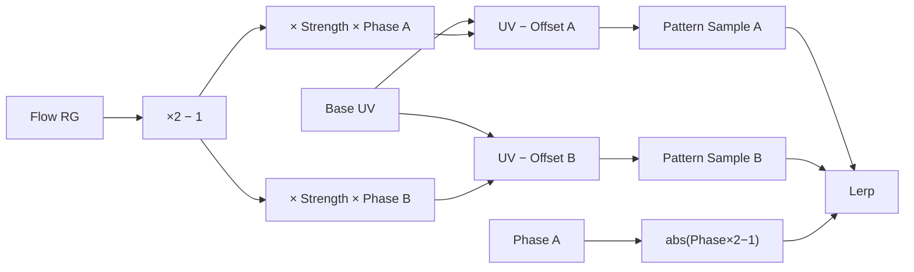

# 1. L04-02 — Distortion, flow maps і fake refraction

| Поле | Значення |
|---|---|
| Блок | 04 — Stylized VFX Materials |
| Lesson ID | L04-02 |
| Цільова версія | Unreal Engine 5.8 |
| Артефакт уроку | Dual-phase flow Material Function і два distortion Material Instances |
| Mastery gate | Побудувати direction-aware distortion без UV jumps і обґрунтувати Refraction/overdraw choice |

## 2. Результат уроку

Після уроку ви зможете:

- розпаковувати RG flow direction із 0–1 у −1…1;
- відрізняти UV distortion власної texture від screen-space refraction;
- створити dual-phase flow, що приховує reset `Frac`;
- керувати direction, speed і strength окремо;
- перевірити distortion field як color і vector;
- обмежити screen offset та провести gameplay/performance test.

Доказ: `MF_VFX_DualPhaseFlow`, `M_VFX_FlowSurface`, `M_VFX_ScreenDistortion`, два independent variants і A/B capture.

## 3. Орієнтовний час

| Частина | Години | Практика |
|---|---:|---:|
| Теорія coordinate offset і flow | 1.25 | 0 |
| Controlled experiments | 0.75 | 0.75 |
| Guided practice | 2.5 | 2.5 |
| Самостійні вправи | 2.0 | 2.0 |
| Troubleshooting/performance/rebuild | 1.5 | 0.75 |
| **Разом** | **8.0** | **6.0 (75%)** |

## 4. Prerequisites

| Навичка | Де отримано | Перевірка |
|---|---|---|
| UV, Panner, Frac і coordinate spaces | [L03-04](../03_MATERIAL_FOUNDATIONS/04_uv_coordinates_and_coordinate_spaces.md) | Побудуйте `Frac(UV*4)` |
| Texture channels і sRGB/data distinction | [L03-06](../03_MATERIAL_FOUNDATIONS/06_texture_sampling_channels_and_flipbooks.md) | Preview RG окремо |
| Translucency/depth/overdraw | [L03-07](../03_MATERIAL_FOUNDATIONS/07_material_domains_blending_depth_and_overdraw.md) | Назвіть cost driver |
| Reusable functions | [L03-08](../03_MATERIAL_FOUNDATIONS/08_instances_functions_switches_and_debugging.md) | Створіть float2 function input |
| Dissolve function/parameter discipline | [L04-01](01_dissolve_erosion_and_edge_control.md) | Поясніть function contract |

## 5. Нові терміни

| English term | Українське пояснення | Приклад | Glossary |
|---|---|---|---|
| Distortion field | Vector2 field, що зміщує sample coordinates | RG керує U/V offset | [Distortion](../02_GLOSSARY.md#stylized-vfx-materials-і-runtime-data) |
| Flow map | Texture, де RG кодує 2D direction | `(0.75,0.5)` → рух праворуч | [Flow map](../02_GLOSSARY.md#stylized-vfx-materials-і-runtime-data) |
| Signed direction | Direction зі складовими −1…1 | `(-0.5, 0.8)` | [Glossary](../02_GLOSSARY.md) |
| Phase | Нормалізована позиція в повторюваному циклі | `Frac(Time*Speed)` | [Glossary](../02_GLOSSARY.md) |
| Fake refraction | Керований artistic screen offset, не повна фізична simulation світла | Heat haze | [Fake refraction](../02_GLOSSARY.md#stylized-vfx-materials-і-runtime-data) |

## 6. Навіщо ця тема потрібна VFX artist

Distortion дає відчуття heat, water, force field, speed, magical pressure й void-space. Але це один із найчастіших джерел:

- screen-edge artifacts;
- background swimming;
- sorting surprises;
- надмірного overdraw;
- «noise, що просто їде», замість directed material motion.

Flow map потрібна, коли path має вигинатися локально. Звичайний `Panner` має одну global direction; flow texture може направити кожен pixel по-різному.

## 7. Теорія простими словами

Texture Sample читає картинку за адресою UV. Якщо перед читанням трохи змінити адресу, pixel візьме color із сусіднього місця. Це distortion.

```text
DistortedUV = BaseUV + Offset
```

Flow map зберігає Offset direction у colors:

- R=0.5 означає U direction 0;
- R=1 означає +1;
- R=0 означає −1;
- те саме для G/V.

Тому:

```text
SignedFlow = FlowRG × 2 − 1
```

Один `Frac(Time)` reset-иться з майже 1 до 0 й може дати visible pop. Dual-phase technique використовує дві samples на різних phases і crossfade, щоб одна sample приховувала reset іншої.

## 8. Детальні технічні пояснення

### Unpack

`FlowRG` — float2 у 0–1.

```text
SignedFlow = FlowRG * 2 - 1
```

Numerical example:

```text
FlowRG = (0.75, 0.25)
Signed = (0.5, -0.5)
```

Vector спрямований праворуч і вниз. `Normalize` тут не обов’язковий: magnitude може навмисно кодувати локальну strength. Якщо normalization увімкнути, майже всі non-zero directions матимуть однакову magnitude й втратиться частина map information.

### Phase A/B

```text
pA = frac(Time * Speed)
pB = frac(pA + 0.5)
```

`pB` на півциклу зсунута від `pA`.

```text
offsetA = SignedFlow * Strength * pA
offsetB = SignedFlow * Strength * pB
uvA = UV - offsetA
uvB = UV - offsetB
```

Minus означає, що texture content візуально рухається вздовж flow direction; Add дасть протилежний apparent motion. Це не «правильний» sign для всіх maps — зафіксуйте convention і перевірте arrow test.

### Crossfade

```text
blend = abs(pA * 2 - 1)
result = lerp(sampleA, sampleB, blend)
```

Коли одна phase ближча до reset, інша має іншу offset position. Two texture samples дорожчі за один Panner sample; technique виправдана, якщо jump помітний і directed flow важливий.

### Internal UV distortion vs screen refraction

- **Internal distortion:** змінює UV власної texture/flipbook. Передбачуваніша, не читає background.
- **Refraction/2D Offset:** викривляє scene behind translucent surface; залежить від renderer/path/platform.

Офіційні Material Properties UE 5.8 описують `2D Offset` як explicit screen offset, незалежний від resolution/aspect ratio. Exact UI label, доступність root input і поведінка для обраного Translucency path потребують перевірки у встановленому UE 5.8.x:

`Потребує ручної перевірки в Unreal Engine 5.8.`

## 9. Візуальний і математичний приклад

Для:

```text
UV = (0.40, 0.60)
FlowRG = (0.75, 0.50)
Strength = 0.04
pA = 0.25
```

```text
SignedFlow = (0.5, 0)
OffsetA = (0.5,0) * 0.04 * 0.25 = (0.005,0)
UVA = (0.395,0.60)
```

Sample зміщується лише на 0.005 UV. Якщо Strength підняти до 0.4, shift стане 0.05 і може виглядати як tearing, а не heat haze.



## 10. Controlled experiments

### CE-L04-02-01 — Sign і direction

- **Гіпотеза:** subtraction UV offset дасть apparent motion у direction map convention цього уроку.
- **Незмінні умови:** arrow/stripe pattern, FlowRG constant `(1,0.5)`, Strength 0.05, Speed 0.2.
- **Змінювана operation:** `UV−Offset` проти `UV+Offset`.
- **Очікувано:** рух змінює direction на протилежну.
- **Перевірка:** намалюйте arrow overlay; запишіть convention.

### CE-L04-02-02 — Single vs dual phase

- **Гіпотеза:** single `Frac` sample pop-не на wrap; dual-phase crossfade приховає reset.
- **Values:** Speed 0.25, Strength 0.08, 8 s capture.
- **Дії:** два instances поруч, один із SampleA, інший із final Lerp.
- **Спостерігати:** frames біля phase 0/1.
- **Висновок:** dual phase приймається лише якщо pop зменшився без неприйнятного blur.

## 11. Покрокова guided practice

### GP-L04-02 — `MF_VFX_DualPhaseFlow`

#### Крок 1 — Підготуйте textures

Потрібні:

- `T_VFX_Flow_A` — RG data map; neutral direction `(0.5,0.5)`;
- `T_VFX_Noise_Cloud_A` — grayscale tileable pattern.

У Texture Asset Editor перевірте `sRGB` і Compression Settings як data textures. Конкретна compression choice залежить від channel precision і platform:

`Потребує ручної перевірки в Unreal Engine 5.8.`

Debug requirement: flow neutral region має preview color приблизно `(0.5,0.5,0)`, а не black.

#### Крок 2 — Створіть function

`/Game/SVFX/Core/MaterialFunctions/MF_VFX_DualPhaseFlow`.

Function inputs:

| Input | Type | Preview |
|---|---|---:|
| `BaseUV` | Vector2 | `(0.5,0.5)` |
| `FlowRG` | Vector2 | `(0.5,0.5)` |
| `TimeValue` | Scalar | 0 |
| `Speed` | Scalar | 0.2 |
| `Strength` | Scalar | 0.05 |

Function outputs:

- `UV_A` Vector2;
- `UV_B` Vector2;
- `Blend` Scalar;
- `SignedFlow` Vector2 для debug.

#### Крок 3 — Unpack flow

`FlowRG × 2 − 1`. Preview SignedFlow через remap `SignedFlow×0.5+0.5`, інакше negative values стануть black.

#### Крок 4 — Phases

`TimeValue×Speed → Frac = PhaseA`; `PhaseA+0.5 → Frac = PhaseB`.

Перевірте preview із TimeValue 0, 1, 2.5.

#### Крок 5 — Offsets і UV

Для кожної phase:

1. SignedFlow × Strength.
2. Result × Phase.
3. BaseUV − result.

#### Крок 6 — Blend weight

`PhaseA×2 − 1 → Abs`. Output має 1 на phase 0/1 і 0 на 0.5.

#### Крок 7 — Flow surface material

Створіть `M_VFX_FlowSurface`:

| Property | Value |
|---|---|
| Material Domain | `Surface` |
| Blend Mode | `Translucent` |
| Shading Model | `Unlit` |
| Two Sided | On |

Sample Flow texture один раз у BaseUV. Function створює UV_A/B. Sample Pattern texture двічі. `Lerp(PatternA, PatternB, Blend)`.

Color:

```text
PatternResult × BodyColor × EmissiveIntensity → Emissive Color
PatternResult × OpacityScale → Opacity
```

Start: Speed 0.2, Strength 0.05, EmissiveIntensity 3, OpacityScale 0.7.

#### Крок 8 — Screen distortion material

Duplicate як `M_VFX_ScreenDistortion`. У Material properties оберіть compatible Translucent refraction configuration й `Refraction Method = 2D Offset`, якщо exact option доступна в UE 5.8.x.

Побудуйте low-strength offset:

```text
SignedFlow × ScreenStrength × CombinedMask → Refraction
```

Start `ScreenStrength=0.01`; test 0.002, 0.01, 0.03. Не починайте з великих values.

Потребує ручної перевірки в Unreal Engine 5.8: exact pin type та sign convention `2D Offset` у встановленому patch/RHI.

#### Крок 9 — Gameplay test

Перевірте:

- neutral/bright/detailed backgrounds;
- center і screen edge;
- moving camera;
- one card і 10 overlapping cards;
- close/far distance.

Запишіть не лише FPS, а Shader Complexity/overdraw і GPU capture за fixed test contract.

## 12. Точні nodes, settings і connections

### MG-L04-02-01 — `MF_VFX_DualPhaseFlow`

| Alias | Node | Name / value | Тип |
|---|---|---|---|
| `UVIn` | `Function Input` | `BaseUV` | Vector2 |
| `FlowIn` | `Function Input` | `FlowRG` | Vector2 |
| `TimeIn` | `Function Input` | `TimeValue` | Scalar |
| `SpeedIn` | `Function Input` | `Speed=0.2` | Scalar |
| `StrengthIn` | `Function Input` | `Strength=0.05` | Scalar |
| `Two` | `Constant` | 2.0 | Scalar |
| `One` | `Constant` | 1.0 | Scalar |
| `Half` | `Constant` | 0.5 | Scalar |
| `FlowTimesTwo` | `Multiply` | — | Vector2 |
| `SignedFlow` | `Subtract` | — | Vector2 |
| `TimeSpeed` | `Multiply` | — | Scalar |
| `PhaseA` | `Frac` | — | Scalar |
| `PhaseBAdd` | `Add` | — | Scalar |
| `PhaseB` | `Frac` | — | Scalar |
| `BaseOffset` | `Multiply` | — | Vector2 |
| `OffsetA` | `Multiply` | — | Vector2 |
| `OffsetB` | `Multiply` | — | Vector2 |
| `UVA` | `Subtract` | — | Vector2 |
| `UVB` | `Subtract` | — | Vector2 |
| `BlendDouble` | `Multiply` | — | Scalar |
| `BlendSigned` | `Subtract` | — | Scalar |
| `BlendAbs` | `Abs` | — | Scalar |
| `UVAOut` | `Function Output` | `UV_A` | Vector2 |
| `UVBOut` | `Function Output` | `UV_B` | Vector2 |
| `BlendOut` | `Function Output` | `Blend` | Scalar |
| `FlowOut` | `Function Output` | `SignedFlow` | Vector2 |

```text
FlowIn.Output → FlowTimesTwo.A
Two.Output → FlowTimesTwo.B
FlowTimesTwo.Output → SignedFlow.A
One.Output → SignedFlow.B
TimeIn.Output → TimeSpeed.A
SpeedIn.Output → TimeSpeed.B
TimeSpeed.Output → PhaseA.Input
PhaseA.Output → PhaseBAdd.A
Half.Output → PhaseBAdd.B
PhaseBAdd.Output → PhaseB.Input
SignedFlow.Output → BaseOffset.A
StrengthIn.Output → BaseOffset.B
BaseOffset.Output → OffsetA.A
PhaseA.Output → OffsetA.B
BaseOffset.Output → OffsetB.A
PhaseB.Output → OffsetB.B
UVIn.Output → UVA.A
OffsetA.Output → UVA.B
UVIn.Output → UVB.A
OffsetB.Output → UVB.B
PhaseA.Output → BlendDouble.A
Two.Output → BlendDouble.B
BlendDouble.Output → BlendSigned.A
One.Output → BlendSigned.B
BlendSigned.Output → BlendAbs.Input
UVA.Output → UVAOut.Input
UVB.Output → UVBOut.Input
BlendAbs.Output → BlendOut.Input
SignedFlow.Output → FlowOut.Input
```

### MG-L04-02-02 — `M_VFX_FlowSurface`

| Alias | Node | Parameter | Default |
|---|---|---|---|
| `UV0` | `TextureCoordinate` | — | Index 0 |
| `FlowTex` | `Texture Sample Parameter 2D` | `FlowTexture` | `T_VFX_Flow_A` |
| `TimeNode` | `Time` | — | — |
| `SpeedP` | `Scalar Parameter` | `FlowSpeed` | 0.2 |
| `StrengthP` | `Scalar Parameter` | `FlowStrength` | 0.05 |
| `FlowFn` | `Material Function Call` | — | `MF_VFX_DualPhaseFlow` |
| `PatternTexA` | `Texture Sample Parameter 2D` | `PatternTexture` | noise |
| `PatternTexB` | `Texture Sample Parameter 2D` | `PatternTexture` | same parameter name |
| `PhaseLerp` | `Linear Interpolate` | — | — |
| `ColorP` | `Vector Parameter` | `BodyColor` | `(0.05,0.35,1,1)` |
| `IntensityP` | `Scalar Parameter` | `EmissiveIntensity` | 3.0 |
| `OpacityP` | `Scalar Parameter` | `OpacityScale` | 0.7 |
| `ColorMul` | `Multiply` | — | — |
| `HDRMul` | `Multiply` | — | — |
| `OpacityMul` | `Multiply` | — | — |
| `MaterialOutput` | Main Material Node | — | — |

```text
UV0.Output → FlowTex.UVs
UV0.Output → FlowFn.BaseUV
FlowTex.RG → FlowFn.FlowRG
TimeNode.Output → FlowFn.TimeValue
SpeedP.Output → FlowFn.Speed
StrengthP.Output → FlowFn.Strength
FlowFn.UV_A → PatternTexA.UVs
FlowFn.UV_B → PatternTexB.UVs
PatternTexA.R → PhaseLerp.A
PatternTexB.R → PhaseLerp.B
FlowFn.Blend → PhaseLerp.Alpha
PhaseLerp.Output → ColorMul.A
ColorP.RGB → ColorMul.B
ColorMul.Output → HDRMul.A
IntensityP.Output → HDRMul.B
PhaseLerp.Output → OpacityMul.A
OpacityP.Output → OpacityMul.B
HDRMul.Output → MaterialOutput.Emissive Color
OpacityMul.Output → MaterialOutput.Opacity
```

## 13. Стартові значення

| Parameter | Type | Start | Low | High | Видимий ефект |
|---|---|---:|---:|---:|---|
| `FlowSpeed` | Scalar | 0.20 | 0.05 | 0.80 | Cycle швидший/повільніший |
| `FlowStrength` | Scalar | 0.05 | 0.01 | 0.15 | UV displacement |
| `ScreenStrength` | Scalar | 0.01 | 0.002 | 0.03 | Background offset |
| `EmissiveIntensity` | Scalar | 3.0 | 1.0 | 10.0 | HDR brightness |
| `OpacityScale` | Scalar | 0.70 | 0.2 | 1.0 | Coverage/blending |

Якщо `FlowSpeed` negative, direction cycle зміниться; перевірте phase/crossfade біля wrap. Якщо `FlowStrength` завелика, texture stretch і double-image стають очевидними.

## 14. Очікувані результати

| Етап | Очікувано | Перевірка |
|---|---|---|
| Flow unpack | Neutral RG=.5 дає SignedFlow 0 | Remap debug |
| Phase A/B | Offset на 0.5 cycle | Numeric preview |
| Single sample | Visible reset можливий | Frame step |
| Dual sample | Reset суттєво м’якший | 8 s loop capture |
| Internal flow | Pattern рухається по field | Arrow map |
| Screen distortion | Background зміщується мало й локально | Detailed grid behind card |
| Stress test | Cost зростає з overlap/coverage | Profiler evidence |

## 15. Самостійна вправа

### EX-L04-02-A — Directional heat haze

- **Завдання:** створіть narrow rising heat distortion із stronger center і zero edge.
- **Assets:** власна grayscale plume mask і flow map або procedural constant direction.
- **Обмеження:** `ScreenStrength ≤ 0.02`; edge fade обов’язковий; одна distortion card у gameplay camera.
- **Elements:** signed direction, animated phase, center mask, screen offset/refraction configuration.
- **Deliverables:** beauty capture на grid background, signed-flow debug, edge-mask debug, performance note.
- **Acceptance:** screen edge не дає obvious jump; silhouette не читається як opaque smoke.

## 16. Додаткова складніша вправа

### EX-L04-02-B — Packed water flow

- **Завдання:** один RGBA texture має містити Flow RG, Foam B і Opacity A; створіть flowing water ribbon/mesh material.
- **Обмеження:** один packed texture для field/masks, але two samples pattern дозволені; Foam має іншу color/intensity.
- **Elements:** channel extraction, dual-phase pattern, foam branch, combined opacity.
- **Deliverables:** channel sheet, connection list, close/far gameplay captures.
- **Acceptance:** direction змінюється локально, Foam не «пливе» окремо від потрібної structure, channels пояснені.

## 17. Три рівні підказок

### EX-L04-02-A

<details><summary>Hint 1 — напрямок мислення</summary>
Відокремте direction від strength. Direction може бути constant `(0,1)`, strength має йти від center/plume mask.
</details>

<details><summary>Hint 2 — потрібні nodes</summary>
`Constant2Vector`, `Time`, `Frac`, `Multiply`, plume Texture Sample, `MF_VFX_DualPhaseFlow` або simplified offset, Refraction/2D Offset.
</details>

<details><summary>Hint 3 — майже повна структура</summary>
FlowRG neutral+up direction → unpack; SignedFlow × ScreenStrength × plume mask; phase animation змінює distortion noise; final offset множиться на edge-faded mask.
</details>

[Рішення A](../EXERCISE_ANSWERS/L04-02_distortion_flow_answers.md#ex-l04-02-a)

### EX-L04-02-B

<details><summary>Hint 1 — напрямок мислення</summary>
RG — vector data, B/A — scalar masks. Не пропускайте весь float4 в operation, яка очікує float2.
</details>

<details><summary>Hint 2 — потрібні nodes</summary>
`Texture Sample Parameter 2D`, RG/B/A outputs, dual-phase function, `Lerp`, `Multiply`, `Add`, `Saturate`.
</details>

<details><summary>Hint 3 — майже повна структура</summary>
Packed.RG → flow function; flowing pattern controls body; Packed.B × FoamIntensity × FoamColor adds emissive; opacity = saturate(body×Packed.A + foam×Packed.B).
</details>

[Рішення B](../EXERCISE_ANSWERS/L04-02_distortion_flow_answers.md#ex-l04-02-b)

## 18. Типові помилки

| Помилка | Ознака | Причина | Запобігання |
|---|---|---|---|
| RG не unpack-нуто | Усе рухається праворуч/вгору | 0.5 сприйнято як positive | `RG×2−1` |
| Flow texture sRGB | Direction warped/non-neutral | Нелінійний decode | Data-texture validation |
| Один Frac sample | Pop щосекунди | Hard phase reset | Dual phase |
| Strength завелика | Tearing/double image | UV/screen offset надмірний | Start 0.01–0.05 |
| Offset не masked | Вся card викривляє scene | Немає edge/shape mask | Multiply field by mask |
| Flow normalized blindly | Втрата local magnitude | Normalize робить non-zero vectors unit | Зберігайте magnitude, якщо вона meaningful |
| Two samples без justification | Cost вищий без видимого gain | Technique copied automatically | A/B single vs dual |

## 19. Troubleshooting

| Симптом | Тест | Причина | Fix | Перевірка |
|---|---|---|---|---|
| Neutral area рухається | Set FlowRG=.5,.5 | Unpack missing/wrong | ×2−1 | SignedFlow=(0,0) |
| Direction reversed | Arrow constant test | Add/Sub convention | Swap sign once, document | Arrow follows field |
| Loop pulse/blur | Preview Blend only | Crossfade weight/order | Verify abs(p×2−1), samples A/B | Seamless 2 cycles |
| Refraction input disabled | Inspect Material properties | Incompatible Blend/Method | Set compatible translucent refraction config | Pin active |
| Card black | Route pattern to Emissive | Material/output/texture issue | Unlit + Emissive, assign texture | Pattern visible |
| Distortion at transparent edge | Preview offset×mask | Offset not faded | Multiply by alpha/edge mask | Zero edge offset |
| Different platform behavior | Same build/RHI test | Refraction path limitation | Platform-specific fallback | Documented H/M/L |

## 20. Performance considerations

- Dual-phase flow двічі sample-ить pattern; для швидкого noise без помітного reset часто достатньо одного Panner.
- Screen distortion/refraction читає або зміщує scene data через renderer-specific paths і може коштувати дорожче за internal UV distortion.
- Translucent screen coverage і overlap лишаються основними ризиками.
- Одна packed flow/mask texture може зменшити кількість окремих texture samples, але конфлікти precision/compression потрібно перевірити.
- Medium:
  - internal UV flow instead of screen refraction;
  - same silhouette/motion;
  - lower strength/coverage.
- Low:
  - one Panner sample;
  - no screen distortion;
  - retain body/foam gameplay cue.

Виміряйте 1, 10 і 30 instances із зафіксованою камерою. Використайте Shader Complexity, GPU profiler, а згодом і контекст Niagara/system; не заявляйте універсальний budget у мілісекундах.

## 21. Запитання

1. Чому Flow RG зазвичай переводять із 0–1 у −1…1?
2. Що кодує `(0.5,0.5)` у цьому convention?
3. Чому single `Frac` offset може pop-нути?
4. Навіщо потрібна друга phase?
5. Що втрачається при `Normalize(SignedFlow)`?
6. Чим internal UV distortion відрізняється від fake refraction?
7. Чому field треба множити на shape/edge mask?
8. Який trade-off dual-phase flow?
9. Який fallback доречний для Low profile?

## 22. Відповіді

1. Щоб 0.5 стало zero direction, 0 — negative, 1 — positive.
2. Нульовий offset/direction.
3. `Frac` миттєво переходить з ~1 до 0, змінюючи UV offset.
4. Поки одна reset-иться, інша sample crossfade-ом приховує discontinuity.
5. Локальна magnitude/strength, закодована довжиною vector.
6. Перше зміщує sample власної texture; друге викривляє scene behind translucent surface.
7. Інакше прозорі/крайові pixels можуть продовжувати викривляти background.
8. Додаткова texture sample й math в обмін на seamless flow.
9. Один internal panning sample без screen refraction, зі збереженим core motion cue.

## 23. Self-check checklist

- [ ] Neutral FlowRG дає zero SignedFlow.
- [ ] Arrow test документує sign convention.
- [ ] Phase A/B і Blend preview-нуто окремо.
- [ ] Single/dual loop порівняно frame-by-frame.
- [ ] Screen offset masked до zero на edges.
- [ ] Exact Refraction setup перевірено в UE 5.8.x або позначено.
- [ ] Exercises A/B мають debug evidence.
- [ ] Gameplay camera і screen edges протестовано.
- [ ] 8/9 Q&A правильні.
- [ ] High/Medium/Low strategy записана.

## 24. Mastery criteria

1. За 40 хв відтворити flow unpack, phases, UV A/B і blend.
2. Чисельно розрахувати один UV offset.
3. Знайти й виправити reversed direction через controlled test.
4. Heat haze має zero edge distortion і ScreenStrength ≤0.02.
5. Packed exercise правильно розділяє RG/B/A data.
6. Немає unexplained compile warnings.
7. Performance A/B показує single/dual і internal/refraction variants.
8. Exact version-sensitive claims чесно перевірені/позначені.

## 25. Підсумок

- UV distortion — зміна адреси sample.
- Flow RG треба unpack-нути в signed vector.
- Dual phases приховують hard reset.
- Internal flow передбачуваніший; screen refraction потребує platform test.
- Strength, speed, direction і mask — різні controls.
- Two samples виправдані лише observable quality gain.

## 26. Зв’язок із наступними уроками

| Урок | Повторне використання | Зберегти |
|---|---|---|
| [L04-03](03_gradient_mapping_hdr_and_stylized_color.md) | Pattern result як 0–1 color coordinate | Flow material/functions |
| [L04-05](05_sprite_mesh_ribbon_and_decal_materials.md) | Renderer-specific flow | Internal/refraction variants |
| [L09-02](../09_EFFECT_ARCHETYPES/02_water_projectile_language.md) | Water direction і foam | Packed texture/material |

## 27. Офіційні джерела

- [Coordinates Material Expressions](https://dev.epicgames.com/documentation/unreal-engine/coordinates-material-expressions-in-unreal-engine) — Epic Games, UE 5.8, доступ 2026-07-27.
- [Material Properties: Refraction](https://dev.epicgames.com/documentation/en-us/unreal-engine/unreal-engine-material-properties) — Epic Games, UE 5.8, доступ 2026-07-27.
- [Material Blend Modes](https://dev.epicgames.com/documentation/unreal-engine/material-blend-modes-in-unreal-engine) — Epic Games, UE 5.8, доступ 2026-07-27.
- [Texture Asset Editor](https://dev.epicgames.com/documentation/en-us/unreal-engine/texture-asset-editor-in-unreal-engine) — Epic Games, UE 5.8, доступ 2026-07-27.

## 28. Рекомендовані скриншоти або схеми

```text
Рекомендований скриншот:
Що відкрити: MF_VFX_DualPhaseFlow.
Що повинно бути видно: unpack, Phase A/B, UV A/B, Blend outputs.
Яку область виділити: RG×2−1 і abs(Phase×2−1).
```

```text
Рекомендований скриншот:
Що відкрити: gameplay test із detailed grid background.
Що повинно бути видно: internal flow, screen distortion і Low fallback поруч.
Яку область виділити: card edges та screen-edge behavior.
```
