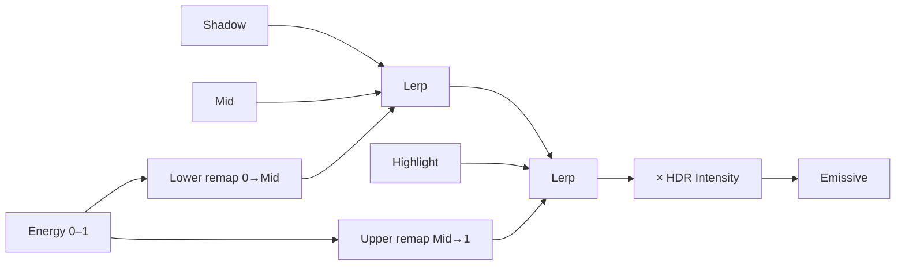

# 1. L04-03 — Gradient mapping, HDR і stylized color control

| Поле | Значення |
|---|---|
| Блок | 04 — Stylized VFX Materials |
| Lesson ID | L04-03 |
| Цільова версія | Unreal Engine 5.8 |
| Артефакт уроку | `MF_VFX_ThreeColorRamp`, texture-ramp variant і bright-background A/B |
| Mastery gate | Перетворити grayscale energy field на керовану ієрархію світлоти й кольору без втрати readability |

## 2. Результат уроку

Ви навчитеся:

- використовувати значення у градаціях сірого як координату color mapping;
- будувати analytic three-color ramp без texture;
- sample-ити 1D gradient ramp texture із clamp behavior;
- відокремлювати hue/color від HDR intensity;
- порівнювати `Additive`, `Translucent` і `AlphaComposite` behavior на різних backgrounds;
- створювати stylized stepped palette, не руйнуючи silhouette.

Доказ: два ramp methods, три background tests, independent stepped palette й art/technical журнал рішень.

## 3. Орієнтовний час

| Частина | Години | Практика |
|---|---:|---:|
| Color/value mental model | 1.25 | 0 |
| Controlled experiments | 0.75 | 0.75 |
| Guided practice | 2.5 | 2.5 |
| Самостійні вправи | 2.0 | 2.0 |
| Performance/rebuild/self-check | 1.5 | 0.75 |
| **Разом** | **8.0** | **6.0 (75%)** |

## 4. Prerequisites

| Навичка | Де | Перевірка |
|---|---|---|
| Linear/sRGB/HDR, vector colors | [L03-01](../03_MATERIAL_FOUNDATIONS/01_shader_mental_model_and_value_types.md) | Поясніть color vs data |
| Lerp/remap/Saturate | [L03-02](../03_MATERIAL_FOUNDATIONS/02_material_math_and_remapping.md) | Розрахуйте Lerp |
| Texture sampling | [L03-06](../03_MATERIAL_FOUNDATIONS/06_texture_sampling_channels_and_flipbooks.md) | Sample ramp у fixed V=0.5 |
| Blend Modes | [L03-07](../03_MATERIAL_FOUNDATIONS/07_material_domains_blending_depth_and_overdraw.md) | Additive vs AlphaComposite |
| Body/Edge masks | [L04-01](01_dissolve_erosion_and_edge_control.md) | Preview masks окремо |

## 5. Нові терміни

| Англійський термін | Пояснення | Приклад | Glossary |
|---|---|---|---|
| Gradient mapping | Перетворення scalar 0–1 на color уздовж ramp | 0=violet, .5=cyan, 1=white | [Gradient ramp](../02_GLOSSARY.md#stylized-vfx-materials-і-runtime-data) |
| Color stop | Color у визначеній position ramp | MidStop=.4 | [Glossary](../02_GLOSSARY.md) |
| Premultiplied alpha | Workflow, де source color уже помножений на alpha для відповідної blend formula | `Color×Opacity` перед AlphaComposite output logic | [Glossary](../02_GLOSSARY.md) |
| HDR intensity | Множник, що дозволяє output перевищити 1 | EdgeIntensity=8 | [HDR](../02_GLOSSARY.md#material-editor-і-shader-math) |
| Stepped palette | Дискретні color/value bands замість безперервного gradient | 4 anime-style bands | [Glossary](../02_GLOSSARY.md) |

## 6. Навіщо ця тема потрібна VFX-фахівцю

Color picker сам по собі не створює hierarchy. У сильному stylized effect color прив’язаний до energy/value structure:

- darkest/lowest value підтримує outer body;
- dominant mid color займає більшу частину shape;
- small highlight/core має найвищу intensity;
- accent color керує focal point, а не рівномірно фарбує все.

Gradient mapping дозволяє art-direct color незалежно від noise/shape source. Один grayscale simulation або mask може отримати різні palettes без перебудови motion. Але проста зміна ramp не робить стихійну варіацію завершеною: shape, timing і motion теж мають змінитися.

## 7. Теорія простими словами

Grayscale image — це не «чорно-біла картинка», а таблиця energy values. Gradient mapping читає value як горизонтальну адресу:

```text
Value 0.00 → лівий край ramp
Value 0.50 → середина ramp
Value 1.00 → правий край ramp
```

Color і brightness — різні controls:

```text
MappedColor = Ramp(Value)
Emissive = MappedColor × Intensity
```

Якщо запекти brightness у дуже світлий color picker і ще множити intensity, керування стає непередбачуваним. Тримайте palette colors у зрозумілому range, HDR energy — окремим scalar.

## 8. Детальні технічні пояснення

### Analytic three-color ramp

Нехай `v` — 0–1 source value, `m` — `MidPoint` 0.01–0.99.

```text
LowerT = saturate(v / m)
UpperT = saturate((v - m) / (1 - m))
LowerColor = lerp(ShadowColor, MidColor, LowerT)
FinalColor = lerp(LowerColor, HighlightColor, UpperT)
```

При `v<m` UpperT=0, працює lower segment. При `v>m` LowerColor вже близький до MidColor, UpperT змішує до Highlight.

Не дозволяйте `m=0` або `m=1`: division denominator стане 0. Для reusable function встановіть authoring range 0.01–0.99 й controlled defaults.

### Texture ramp

```text
RampUV = float2(saturate(v), 0.5)
Color = TextureSample(RampTexture, RampUV)
```

Texture має clamp-итися по U, інакше values на краях можуть wrap-нути. Exact texture addressing UI/settings перевірте в Texture Asset/Sampler Source workflow UE 5.8.x.

### Linear color і sRGB

Color ramp є color data, отже sRGB decode зазвичай доречний; mask/energy texture — data, де sRGB часто вимикають. Конкретні import/compression settings треба перевірити для кожного asset:

`Потребує ручної перевірки в Unreal Engine 5.8.`

### Blend behavior

- `Additive`: чорний фактично не додає; яскравий на bright background може втратити saturation/visibility.
- `Translucent`: змішує source із destination через opacity.
- `AlphaComposite`: premultiplied-alpha formula може краще зберігати saturation на bright background.

Blend Mode є material property, тому для чесного A/B використовуйте окремі parent materials або duplicate із тотожною graph logic.

## 9. Математичний приклад

```text
v = 0.70
m = 0.40
Shadow = (0.02, 0.00, 0.10)
Mid = (0.10, 0.20, 1.00)
Highlight = (0.70, 1.00, 1.00)
```

```text
LowerT = saturate(.70/.40) = 1
UpperT = saturate((.70-.40)/(.60)) = .5
LowerColor = Mid
Final = lerp(Mid, Highlight, .5)
      = (.40, .60, 1.00)
```

При `Intensity=5`, Emissive стає `(2,3,5)`: це HDR output. Opacity не стає 5; її контролює окрема 0–1 mask.



## 10. Controlled experiments

### CE-L04-03-01 — Value hierarchy до hue

- **Гіпотеза:** якщо ramp має неправильну luminance hierarchy, effect не читається навіть із приємними hues.
- **Умови:** одна circle/ring energy mask, same opacity.
- **Variants:** A — Shadow/Mid/Highlight зі зростаючим value; B — усі stops однакової perceived brightness.
- **Дії:** capture color і grayscale.
- **Очікувано:** A зберігає core/body hierarchy; B стає flat.

### CE-L04-03-02 — Blend Mode на backgrounds

- **Умови:** identical graph/parameters, dark/mid/bright panels.
- **Variants:** Additive, Translucent, AlphaComposite.
- **Values:** Intensity 3, Opacity .7.
- **Очікувано:** Additive найслабше читається на bright panel; результати інших залежать від alpha/color.
- **Запис:** не оголошуйте переможця загалом; оберіть через gameplay need.

## 11. Покрокова керована практика

### GP-L04-03 — Three-color ramp function і renderer material

#### Крок 1 — Створіть function

`/Game/SVFX/Core/MaterialFunctions/MF_VFX_ThreeColorRamp`.

Inputs:

| Name | Type | Preview |
|---|---|---:|
| `Value` | Scalar | 0.5 |
| `ShadowColor` | Vector3 | `(0.02,0,0.1)` |
| `MidColor` | Vector3 | `(0.1,0.2,1)` |
| `HighlightColor` | Vector3 | `(0.7,1,1)` |
| `MidPoint` | Scalar | 0.4 |

Output: `MappedColor`, Vector3.

#### Крок 2 — Lower segment

`Value ÷ MidPoint → Saturate = LowerT`; `Lerp(Shadow,Mid,LowerT)`.

Debug: Value .2/Mid .4 gives LowerT .5.

#### Крок 3 — Upper segment

`Value−MidPoint`; `1−MidPoint`; divide; Saturate = UpperT. `Lerp(LowerColor, HighlightColor, UpperT)`.

Debug: Value .7/Mid .4 gives UpperT .5.

#### Крок 4 — Material

Створіть `M_VFX_Gradient_AlphaComposite`.

| Property | Value |
|---|---|
| Material Domain | `Surface` |
| Blend Mode | `AlphaComposite` |
| Shading Model | `Unlit` |
| Two Sided | On |

Потребує ручної перевірки в Unreal Engine 5.8: exact availability/behavior AlphaComposite для цільового platform/RHI.

Sample grayscale `EnergyTexture.R` і shape alpha. Function output × `EmissiveIntensity` × `ShapeOpacity` → `Emissive Color`; ShapeOpacity → `Opacity`.

Множення Emissive на opacity підтримує premultiplied convention. Порівняйте з/без цього multiply, але final AlphaComposite variant має бути internally consistent.

#### Крок 5 — Texture ramp variant

Створіть duplicate material `M_VFX_Gradient_TextureRamp`. Додайте Texture Parameter `ColorRampTexture`, `AppendVector(Saturate(Energy), 0.5)` → Ramp UVs.

Використайте 256×16 або іншу невелику horizontal ramp із padded/constant vertical color. Її створення з нуля буде формалізовано в L05-04; зараз дозволено власний simple gradient, але не proprietary asset.

#### Крок 6 — Instances і A/B

Створіть:

- `MI_VFX_Ramp_Analytic`;
- `MI_VFX_Ramp_Texture`;
- parent duplicates для Additive/Translucent comparison або controlled property variants.

Три backgrounds: near-black, mid-gray, near-white. Додайте grayscale screenshot.

## 12. Exact graph specifications

### MG-L04-03-01 — `MF_VFX_ThreeColorRamp`

| Alias | Node | Name / Type | Default |
|---|---|---|---|
| `ValueIn` | `Function Input` | Value / Scalar | .5 |
| `ShadowIn` | `Function Input` | ShadowColor / Vector3 | (.02,0,.1) |
| `MidIn` | `Function Input` | MidColor / Vector3 | (.1,.2,1) |
| `HighIn` | `Function Input` | HighlightColor / Vector3 | (.7,1,1) |
| `MidPointIn` | `Function Input` | MidPoint / Scalar | .4 |
| `One` | `Constant` | — | 1 |
| `LowerDivide` | `Divide` | — | — |
| `LowerSat` | `Saturate` | — | — |
| `LowerLerp` | `Linear Interpolate` | — | — |
| `UpperNumerator` | `Subtract` | — | — |
| `UpperDenominator` | `Subtract` | — | — |
| `UpperDivide` | `Divide` | — | — |
| `UpperSat` | `Saturate` | — | — |
| `FinalLerp` | `Linear Interpolate` | — | — |
| `ColorOut` | `Function Output` | MappedColor | — |

```text
ValueIn.Output → LowerDivide.A
MidPointIn.Output → LowerDivide.B
LowerDivide.Output → LowerSat.Input
ShadowIn.Output → LowerLerp.A
MidIn.Output → LowerLerp.B
LowerSat.Output → LowerLerp.Alpha
ValueIn.Output → UpperNumerator.A
MidPointIn.Output → UpperNumerator.B
One.Output → UpperDenominator.A
MidPointIn.Output → UpperDenominator.B
UpperNumerator.Output → UpperDivide.A
UpperDenominator.Output → UpperDivide.B
UpperDivide.Output → UpperSat.Input
LowerLerp.Output → FinalLerp.A
HighIn.Output → FinalLerp.B
UpperSat.Output → FinalLerp.Alpha
FinalLerp.Output → ColorOut.Input
```

### MG-L04-03-02 — Analytic material

| Alias | Node | Parameter | Default |
|---|---|---|---|
| `EnergyTex` | `Texture Sample Parameter 2D` | `EnergyTexture` | grayscale |
| `ShapeOpacityP` | `Scalar Parameter` | `OpacityScale` | .8 |
| `ShadowP` | `Vector Parameter` | `ShadowColor` | (.02,0,.1,1) |
| `MidP` | `Vector Parameter` | `MidColor` | (.1,.2,1,1) |
| `HighP` | `Vector Parameter` | `HighlightColor` | (.7,1,1,1) |
| `MidPointP` | `Scalar Parameter` | `MidPoint` | .4 |
| `RampFn` | `Material Function Call` | — | ThreeColorRamp |
| `IntensityP` | `Scalar Parameter` | `EmissiveIntensity` | 5 |
| `OpacityMul` | `Multiply` | — | — |
| `HDRMul` | `Multiply` | — | — |
| `Premultiply` | `Multiply` | — | — |
| `MaterialOutput` | Main Material Node | — | — |

```text
EnergyTex.A → OpacityMul.A
ShapeOpacityP.Output → OpacityMul.B
EnergyTex.R → RampFn.Value
ShadowP.RGB → RampFn.ShadowColor
MidP.RGB → RampFn.MidColor
HighP.RGB → RampFn.HighlightColor
MidPointP.Output → RampFn.MidPoint
RampFn.MappedColor → HDRMul.A
IntensityP.Output → HDRMul.B
HDRMul.Output → Premultiply.A
OpacityMul.Output → Premultiply.B
Premultiply.Output → MaterialOutput.Emissive Color
OpacityMul.Output → MaterialOutput.Opacity
```

### Texture ramp UV branch

| Alias | Node | Value |
|---|---|---|
| `EnergySat` | `Saturate` | — |
| `Half` | `Constant` | .5 |
| `RampUV` | `AppendVector` | — |
| `RampTex` | `Texture Sample Parameter 2D` | `ColorRampTexture` |

```text
EnergyTex.R → EnergySat.Input
EnergySat.Output → RampUV.A
Half.Output → RampUV.B
RampUV.Output → RampTex.UVs
RampTex.RGB → HDRMul.A
```

## 13. Стартові параметри

| Parameter | Type | Start | Low | High | Effect |
|---|---|---:|---:|---:|---|
| `MidPoint` | Scalar | .40 | .15 | .80 | Portion shadow→mid vs mid→highlight |
| `EmissiveIntensity` | Scalar | 5 | 1 | 15 | HDR brightness/bloom response |
| `OpacityScale` | Scalar | .80 | .2 | 1 | Coverage/composite |
| `ShadowColor` | Vector | (.02,0,.1) | — | — | Low energy |
| `MidColor` | Vector | (.1,.2,1) | — | — | Dominant body |
| `HighlightColor` | Vector | (.7,1,1) | — | — | Core/accent |

MidPoint поза 0.01–0.99 не допускайте без denominator guard.

## 14. Очікувані результати

| Етап | Видимий result | Перевірка |
|---|---|---|
| LowerT | 0→1 до MidPoint | Grayscale preview |
| UpperT | 0 до MidPoint, 0→1 після | Preview |
| Analytic ramp | 3 colors, no discontinuity | Value sweep |
| Texture ramp | Ramp follows Energy | Fixed V=.5 |
| HDR | Same hue hierarchy, brighter output | Emissive before/after |
| Background test | Readability differences captured | 3 panels |
| Grayscale | Core/body hierarchy survives | Desaturated capture |

## 15. Самостійна вправа

### EX-L04-03-A — Four-band anime palette

- **Завдання:** перетворіть continuous Energy у 4 discrete bands і assign 4-color palette.
- **Обмеження:** no gradient texture; band count parameter 4; shape opacity не quantize-иться.
- **Elements:** Multiply, Floor, Divide або equivalent quantization; analytic color selection/Lerp chain.
- **Deliverables:** continuous vs stepped A/B, grayscale, graph list.
- **Acceptance:** bands stable; highlight займає найменшу area; silhouette/opacity unchanged.

## 16. Додаткова складніша вправа

### EX-L04-03-B — Body/edge dual palette

- **Завдання:** використайте BodyMask/EdgeMask L04-01 з різними ramps/intensities.
- **Обмеження:** edge ≤20% visible area на representative frame; white-background readability обов’язкова.
- **Elements:** two mapped color branches, independent intensities, combined opacity.
- **Deliverables:** body/edge debug, bright/dark captures, blend-mode decision.
- **Acceptance:** edge є accent, не рівномірна halo; color change не замінює shape/timing variation.

## 17. Підказки

### EX-L04-03-A

<details><summary>Підказка 1 — напрямок</summary>
Спочатку quantize scalar, потім color-map. Не quantize opacity.
</details>
<details><summary>Hint 2 — nodes</summary>
`Multiply(Value, BandCount)`, `Floor`, `Divide(..., BandCount-1 або узгоджений denominator)`, `Clamp/Saturate`, Lerp chain.
</details>
<details><summary>Hint 3 — structure</summary>
Для 4 bands зручніше `Index=floor(saturate(Value)*3.999)`, `Quantized=Index/3`; використайте thresholds 1/3 і 2/3 або 1D ramp logic для 4 colors.
</details>

[Рішення A](../EXERCISE_ANSWERS/L04-03_gradient_mapping_answers.md#ex-l04-03-a)

### EX-L04-03-B

<details><summary>Підказка 1 — напрямок</summary>
Body і Edge — незалежні masks; кожна mask має власний mapped color, але opacity об’єднується.
</details>
<details><summary>Hint 2 — nodes</summary>
Два `Material Function Call` ramps або one ramp + Vector Parameters, Multiply by Body/Edge, Add, Saturate.
</details>
<details><summary>Hint 3 — structure</summary>
`BodyEmission=BodyRamp(Energy)*BodyMask*BodyIntensity`; `EdgeEmission=EdgeColor*EdgeMask*EdgeIntensity`; Emissive sum; Opacity=saturate(BodyMask+EdgeMask).
</details>

[Рішення B](../EXERCISE_ANSWERS/L04-03_gradient_mapping_answers.md#ex-l04-03-b)

## 18. Типові помилки

| Помилка | Ознака | Причина | Запобігання |
|---|---|---|---|
| Color stop order не за value | Core темніший за body випадково | Hue оцінювали без grayscale | Grayscale test |
| MidPoint=0/1 | NaN/compile/flat result | Division by zero | Range 0.01–.99 |
| Energy не saturate-нуто | Ramp wraps/clamps неочікувано | Values >1 | Explicit range decision |
| Ramp wraps по U | High values беруть left color | Texture addressing Repeat | Clamp/asset test |
| HDR у Opacity | Sorting/coverage дивні | Intensity branch змішано з alpha | Separate controls |
| Additive на white | Effect зникає | Blend formula/background | AlphaComposite/shape support A/B |
| Palette-only element variant | Fire/water мають однакові shape/motion | Recolor замість design | Застосувати L02-04 constraints |

## 19. Troubleshooting

| Симптом | Test | Cause | Виправлення | Verification |
|---|---|---|---|---|
| Ramp лише 2 colors | Preview LowerT/UpperT | Upper remap wrong | `(v-m)/(1-m)` | Sweep 0→1 |
| Hard seam at MidPoint | Compare values around m | Segment mismatch | Lower ends at Mid; upper starts from Mid | No discontinuity |
| Texture ramp vertical artifact | Set V=.5 constant | Ramp image varies vertically/filtering | Constant vertical rows/padding | Clean sample |
| Colors washed out | Dark/white background A/B | Additive + bright background | AlphaComposite/opacity/value support | Readable silhouette |
| Bloom hides structure | Disable/reduce intensity | HDR too high | Lower intensity, preserve small core | Grayscale/value capture |
| AlphaComposite looks too dark/bright | Inspect premultiply | Incorrect color-alpha convention | Multiply source color by opacity consistently | Known test swatches |

## 20. Performance

- Analytic ramp використовує ALU без sample ramp texture; texture ramp додає один sample, але дає artist-friendly довільну palette.
- Сам лише Shader instruction count не дає повного порівняння texture lookup і math.
- HDR intensity не є «безкоштовною красою»: більші яскраві screen regions можуть посилювати post-process/bloom cost і visual pollution.
- Blend Mode й overdraw часто важливіші за ramp method.
- Medium: analytic 3-stop ramp, same shape.
- Low: 2-color Lerp або Particle Color × grayscale; lower overlap/intensity, preserve cue.
- Профілюйте з тими самими instances/background; зафіксуйте візуальну різницю й докази GPU.

## 21. Запитання

1. Що є input gradient mapping?
2. Чому `MidPoint` не можна без guard ставити 0 або 1?
3. Як обчислюється UpperT?
4. Чому HDR intensity слід відділяти від palette color?
5. Яка відмінність analytic і texture ramp?
6. Чому Additive може втрачати readability на bright background?
7. Що означає premultiplied alpha в контексті AlphaComposite?
8. Чому recolor не є повною elemental variation?
9. Який evidence потрібен для вибору ramp method?

## 22. Відповіді

1. Scalar/energy/value, зазвичай normalized 0–1.
2. Він є denominator або створює `1−MidPoint=0`.
3. `saturate((Value−MidPoint)/(1−MidPoint))`.
4. Щоб hue/value stops і output energy мали незалежні, передбачувані controls.
5. Analytic використовує math/parameters; texture ramp додає sample й довільну authorable palette.
6. Additive лише додає source до вже світлого destination, тому contrast/saturation можуть зменшитися.
7. Source color готується з урахуванням alpha перед blend formula; у graph convention color множиться на opacity.
8. Element identity також визначають silhouette, rhythm, acceleration, breakup і residue.
9. Identical A/B capture, instruction/sample context, profiler і art-direction usability.

## 23. Self-check

- [ ] LowerT/UpperT preview відповідає formulas.
- [ ] MidPoint range safe.
- [ ] Analytic і texture ramps дають intended hierarchy.
- [ ] Color capture перевірено в grayscale.
- [ ] HDR і opacity controls independent.
- [ ] Additive/Translucent/AlphaComposite A/B збережено.
- [ ] Exercises A/B виконано.
- [ ] 8/9 answers correct.
- [ ] Performance decision має conditions.
- [ ] Element variants не описані як simple recolor.

## 24. Mastery criteria

1. Із чистого function відтворити 3-color ramp за 30 хв.
2. Чисельно розрахувати color segment для заданого v/m.
3. Побудувати texture-ramp UV без wrap artifact.
4. Four-band exercise не змінює opacity silhouette.
5. Body/edge palette читається на 3 backgrounds.
6. Blend choice аргументовано A/B, не смаком.
7. Немає division-by-zero path.
8. Performance evidence зафіксовано.

## 25. Підсумок

- Grayscale energy може бути координатою color.
- Three-stop analytic ramp складається з lower й upper remaps.
- HDR intensity — окрема scalar energy control.
- Texture ramp гнучкіша для art direction, але додає sample.
- Blend Mode/background визначають readability.
- Palette не замінює shape/motion language.

## 26. Наступні уроки

| Урок | Повторне використання | Зберегти |
|---|---|---|
| [L04-04](04_fresnel_wpo_and_vertex_animation.md) | Fresnel/value → ramp | Ramp functions/instances |
| [L04-05](05_sprite_mesh_ribbon_and_decal_materials.md) | Renderer-specific color | Blend A/B |
| [L05-04](../05_PHOTOSHOP_VFX_TEXTURES/04_ramps_distortion_and_channel_packing.md) | Author texture ramp | Ramp spec |

## 27. Офіційні джерела

- [Material Blend Modes](https://dev.epicgames.com/documentation/unreal-engine/material-blend-modes-in-unreal-engine) — Epic Games, UE 5.8, доступ 2026-07-27.
- [Material Data Types](https://dev.epicgames.com/documentation/unreal-engine/material-data-types-in-unreal-engine) — Epic Games, UE 5.8, доступ 2026-07-27.
- [Material Expressions Reference](https://dev.epicgames.com/documentation/en-us/unreal-engine/unreal-engine-material-expressions-reference) — Epic Games, UE 5.8, доступ 2026-07-27.
- [Texture Asset Editor](https://dev.epicgames.com/documentation/en-us/unreal-engine/texture-asset-editor-in-unreal-engine) — Epic Games, UE 5.8, доступ 2026-07-27.

## 28. Рекомендовані screenshots/schemes

```text
Рекомендований скриншот:
Що відкрити: MF_VFX_ThreeColorRamp.
Що повинно бути видно: LowerT, UpperT і два Lerp.
Яку область виділити: denominators MidPoint та 1−MidPoint.
```

```text
Рекомендований скриншот:
Що відкрити: three-background test, color і grayscale.
Що повинно бути видно: Additive, Translucent, AlphaComposite variants.
Яку область виділити: core/body readability на white panel.
```
