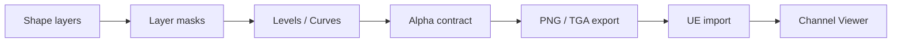

# 1. L05-01 — Photoshop/Krita workflow для VFX-текстур з нуля

| Поле | Значення |
|---|---|
| Блок | 05 — Photoshop VFX Textures |
| ID уроку | L05-01 |
| Цільове середовище | Photoshop Desktop або Krita; Unreal Engine 5.8 |
| Артефакт | `T_PS_Foundation_Mask_512`, layered source і `M_PS_ChannelViewer` |
| Критерій опанування | Чиста grayscale/alpha texture, коректний export та однакове читання в UE |

## 2. Результат уроку

Після уроку ви зможете без готового artwork:

- створити production document із безпечними color/bit-depth settings;
- будувати VFX-shape через layers, masks, Levels, Curves, Brush, Transform і Warp;
- розрізняти grayscale value та alpha coverage;
- експортувати PNG/TGA і перевіряти їх після повторного відкриття;
- імпортувати data mask в UE, вимкнути color decoding і переглянути кожен канал;
- зберігати reproducible source, export manifest і validation evidence.

Доказ: layered source, два exports, channel-viewer Material Instance і contact sheet перевірок.

## 3. Орієнтовний час

| Частина | Теорія | Практика | M/S practice |
|---|---:|---:|---:|
| Документ, grayscale/alpha mental model | 1.0 | 0.0 | 0.0 |
| Controlled experiments | 0.25 | 0.75 | 0.5 |
| Guided texture build | 0.25 | 2.25 | 1.0 |
| Export, UE validation, вправи | 0.0 | 1.5 | 0.5 |
| **Разом** | **1.5** | **4.5** | **2.0** |

M/S practice — обов’язкова material/shader-перевірка в Unreal Engine. Вона входить у практичні години, а не додається зверху.

## 4. Передумови

| Потрібно | Джерело | Швидка перевірка |
|---|---|---|
| Mastery Gate G04 | [Block 04 assessment](../04_STYLIZED_VFX_MATERIALS/BLOCK_ASSESSMENT.md) | Відкрити Material Instance і змінити scalar/vector parameter |
| Texture sampling і channels | [L03-06](../03_MATERIAL_FOUNDATIONS/06_texture_sampling_channels_and_flipbooks.md) | Вивести R окремо в Emissive |
| Файлова дисципліна | [L01-03](../01_UE_FOUNDATIONS/03_vfx_test_level_and_import_pipeline.md) | Пояснити різницю source та imported asset |
| Власні або procedural assets | Правило курсу | Немає proprietary brush packs чи чужих textures |

Запишіть у worklog точну версію Photoshop або Krita та build Unreal Engine. Інтерфейс і назви preset-ів можуть відрізнятися між збірками.

## 5. Нові терміни

| Термін | Значення | Практичний тест |
|---|---|---|
| Grayscale value | Яскравість 0–1, що не обов’язково керує прозорістю | RGB білий, alpha чорний дають білий колір із нульовим coverage |
| Alpha coverage | Окремий канал видимості/маски | Переглянути A у channel viewer |
| Destructive edit | Зміна, яку важко переналаштувати | Levels застосовано прямо до pixels |
| Non-destructive edit | Adjustment/mask, що лишається редагованим | Levels Adjustment Layer |
| Halo | Світлий або темний fringe біля alpha edge | Перевірити на чорному, білому й saturated background |
| Export manifest | Таблиця purpose, format, channels, settings і destination | Один рядок на кожен export |

## 6. Навіщо ця тема потрібна VFX artist

VFX texture рідко є просто картинкою. Один pixel може бути opacity, intensity, distortion, timing або чотирма різними utility masks. Якщо автор дивиться лише composite preview, прихований alpha, gamma decode або fringe проявляться вже у Material, на mip-рівнях чи в additive/translucent overlap.

Layered source і manifest роблять texture повторюваною. Через місяць інший artist має зрозуміти, що означає R, де master resolution і чому `sRGB` вимкнено, не відгадуючи задум із filename.

## 7. Теорія простими словами

Уявіть два аркуші:

- grayscale sheet відповідає «наскільки сильний сигнал»;
- alpha sheet відповідає «де сигнал дозволено показати».

Вони можуть збігатися, але не зобов’язані. Для soft glow часто intensity і coverage однакові. Для hard symbol із м’яким glow RGB може містити широкий gradient, а alpha — чіткіший silhouette.

Працюйте від великих мас до дрібних: background check, primary silhouette, secondary breakup, value remap, alpha cleanup, export. Adjustment Layers і masks лишають рішення оборотними.

## 8. Детальні технічні пояснення

### Document contract

Для master:

- width/height: `512 × 512 px`;
- resolution metadata: `72 ppi` — не впливає на кількість texture pixels;
- Color Mode: `RGB Color`;
- depth: `8 Bits/Channel`;
- profile: `sRGB IEC61966-2.1` для передбачуваного desktop preview;
- background: black check layer, але не flatten у data export;
- naming: `T_PS_Foundation_Mask_512_v001.psd` або `.kra`.

Data masks усе одно імпортуються в UE без sRGB decoding. Profile у source допомагає desktop preview, але не перетворює data на color.

### Value operations

`Levels` задає input black, gamma midpoint і input white. Start `20 / 1.00 / 235`: values ≤20 стають black, ≥235 — white, решта розтягується. `Curves` точніше формує contrast:

```text
Input 0   → Output 0
Input 64  → Output 45
Input 128 → Output 150
Input 220 → Output 245
Input 255 → Output 255
```

Це стартова S-curve, не універсальний preset. Перевіряйте clipped regions через Histogram.

### Straight color і alpha edge

Transparent pixels усе одно можуть мати RGB values. Filtering змішує сусідів; black RGB навколо bright shape може створити темний fringe. Для mask-only texture це менш помітно, але для colored alpha assets edge padding має містити логічний колір shape. У цьому уроці зберігаємо grayscale в RGB і контрольовану alpha.

## 9. Візуальні й математичні приклади

Pixel `RGB=0.8`, `A=0.25`:

- channel viewer R показує 80% white;
- channel viewer A показує 25% white;
- translucent output приблизно пропускає 25% coverage, але emissive intensity може лишатися 0.8.

Levels normalization для input interval `[20,235]`:

```text
normalized = saturate((value - 20) / (235 - 20))
```

Для input 128: `(128−20)/215 ≈ 0.502`. Gamma control змінює цю середину нелінійно.



## 10. Controlled experiments

### CE-L05-01-01 — Grayscale не дорівнює alpha

- Створіть white circle на transparent layer.
- Додайте у RGB усередині circle gradient 0.2→1.0.
- Зробіть alpha uniform 0.5.
- Експортуйте PNG, повторно відкрийте й перегляньте RGB та A окремо.
- Очікування: RGB gradient і flat alpha відрізняються.
- Висновок запишіть одним реченням: який канал керує якою властивістю.

### CE-L05-01-02 — Destructive проти non-destructive Levels

- Дублюйте layer.
- На A застосуйте Levels прямо до pixels.
- На B використайте clipped Levels Adjustment Layer.
- Після збереження змініть black point 20→35.
- Очікування: B коригується без втрати первинних pixels; A потребує Undo або source copy.

### CE-L05-01-03 — Halo board

- Покладіть export над black, white, 50% gray і magenta backgrounds.
- Масштаби: 100%, 50%, 25%.
- Очікування: немає кольорового/темного кільця, edge не рветься.
- Якщо fringe видно лише після UE import, перевіряйте mips, compression і RGB transparent border.

## 11. Покрокова guided practice

### GP-L05-01 — `T_PS_Foundation_Mask_512`

1. **Створіть документ.** Photoshop: `File > New`, `512 × 512`, RGB, 8 bit, sRGB profile. Krita: `File > New`, Custom Image `512 × 512`, RGB/Alpha 8-bit integer/channel, sRGB-elle-V2-srgbtrc profile. Очікування: square canvas і окремий background-check layer.
2. **Структура layers.** Groups: `00_CHECK`, `10_PRIMARY`, `20_BREAKUP`, `30_ADJUST`, `90_EXPORT`. Check group не експортується. Очікування: жодного `Layer 1`.
3. **Primary shape.** На `10_PRIMARY/Orb_Base` hard round brush, white, size `260 px`, hardness `100%`, opacity/flow `100%`; один center dab. Додайте layer mask.
4. **Soft shoulder.** На новому layer soft round brush, size `360 px`, hardness `0%`, opacity `35%`, flow `20%`; 2–3 dabs. Не paint-іть у alpha напряму.
5. **Breakup.** Власним basic spatter або default chalk brush на mask, size `40–90 px`, opacity `20%`, flow `15%`; заберіть не більше 25% silhouette.
6. **Transform.** `Edit > Free Transform`: scale X `115%`, Y `82%`, rotation `-12°`. Krita: Transform Tool, Tool Options із тими самими values.
7. **Warp.** Photoshop: `Edit > Transform > Warp`, grid `3×3`, змістіть upper-right control приблизно на `24 px`. Krita: Transform Tool > Warp, аналогічна локальна деформація.
8. **Levels.** Clipped Adjustment Layer Levels: input `20 / 1.00 / 235`, output `0 / 255`.
9. **Curves.** Додайте точки `64→45`, `128→150`, `220→245`; стежте, щоб primary core не займав понад 35% area.
10. **Alpha.** Photoshop: `Window > Channels`, створіть/оновіть Alpha 1 із merged mask selection. Krita: зберігайте layer transparency; для явного alpha inspect використайте Channels docker/Separate Image за доступності встановленої версії.
11. **Source save.** `T_PS_Foundation_Mask_512_v001.psd` або `.kra`; не flatten.
12. **Export.** PNG-24 із transparency: `T_PS_Foundation_Mask_512.png`; TGA 32-bit: `T_PS_Foundation_Mask_512.tga`. Повторно відкрийте обидва.
13. **UE import.** `/Game/SVFX/Textures/SourceExercises/`; `sRGB=Off`; для mask candidate `Compression Settings=Masks (no sRGB)`, Mip Gen Settings лишіть project default і запишіть фактичне значення.
14. **Validate.** Призначте texture в `MI_PS_ChannelViewer`; перевірте R, G, B, A й compare з reopened export.

Потребує ручної перевірки в Unreal Engine 5.8. Exact назви `Compression Settings`, `Texture Group`, `Mip Gen Settings`, вигляд Texture Asset Editor та auto-detected alpha звірте у встановленому build.

## 12. Точні назви nodes, modules, settings і connections

### Photoshop/Krita operations

| Purpose | Photoshop | Krita |
|---|---|---|
| Layer mask | `Layer > Layer Mask > Reveal All` | Right-click layer > `Add > Transparency Mask` |
| Levels | `Layer > New Adjustment Layer > Levels` | Filter Mask > `Levels` |
| Curves | `Layer > New Adjustment Layer > Curves` | Filter Mask > `Color Adjustment Curves` |
| Transform | `Edit > Free Transform` | `Transform Tool` |
| Warp | `Edit > Transform > Warp` | `Transform Tool > Warp` |
| Channels | `Window > Channels` | Channels docker або Separate Image workflow |

Krita menu labels залежать від версії; запишіть фактичний шлях у worklog.

### `M_PS_ChannelViewer`

Material properties:

| Property | Value |
|---|---|
| Material Domain | `Surface` |
| Blend Mode | `Opaque` |
| Shading Model | `Unlit` |
| Two Sided | Off |

| Alias | Node | Parameter / value |
|---|---|---|
| `TextureSample_Source` | `Texture Sample Parameter 2D` | `SourceTexture` |
| `VectorParameter_ChannelWeights` | `Vector Parameter` | `ChannelWeights=(1,0,0,0)` |
| `DotProduct_Channel` | `DotProduct` | — |
| `MaterialOutput` | Main Material Node | — |

```text
TextureSample_Source.RGBA → DotProduct_Channel.A
VectorParameter_ChannelWeights.RGBA → DotProduct_Channel.B
DotProduct_Channel.Output → MaterialOutput.Emissive Color
```

Weights:

```text
R = (1,0,0,0)
G = (0,1,0,0)
B = (0,0,1,0)
A = (0,0,0,1)
```

Потребує ручної перевірки в Unreal Engine 5.8. Exact pin labeling RGBA/Output і sampler-type auto-selection звірте у Material Editor.

## 13. Стартові значення

| Setting | Start | Test low | Test high |
|---|---:|---:|---:|
| Canvas | 512×512 | 256×256 | 1024×1024 |
| Primary brush | 260 px | 180 px | 320 px |
| Soft brush opacity | 35% | 15% | 55% |
| Breakup flow | 15% | 5% | 30% |
| Levels | 20 / 1.00 / 235 | 0 / 1 / 255 | 35 / 0.85 / 210 |
| Warp displacement | 24 px | 0 px | 48 px |
| UE `sRGB` | Off | — | — |
| ChannelWeights | (1,0,0,0) | A preset | B preset |

## 14. Очікуваний результат кожного етапу

| Етап | Очікувано | Перевірка |
|---|---|---|
| Document | Квадрат 512, RGB 8-bit, іменовані groups | Document Properties + Layers |
| Primary | Один читабельний asymmetric orb | Thumbnail 64 px |
| Breakup | Secondary variation, silhouette не втрачено | Toggle group |
| Levels/Curves | Повний 0–255 range без масового clipping | Histogram |
| Alpha | Чітко визначений coverage | A-only view |
| Reopen export | Dimensions/channels збережено | Reopen in editor |
| UE import | Data не gamma-decoded | `sRGB=Off` |
| Channel viewer | Кожен preset показує правильний канал | R/G/B/A captures |

## 15. Самостійна вправа A

### EX-L05-01-A — Three-value orb mask

Створіть `T_OrbMask_512` із dark exterior, mid-value shoulder і white core.

- лише default/basic brushes і geometric selections;
- source має named layers і non-destructive Levels/Curves;
- alpha не повинен випадково дублювати RGB: поясніть свій contract;
- матеріали для здачі: PSD/KRA, PNG, TGA, рядок manifest, captures R/A в UE;
- acceptance: три value zones читаються на 64 px, немає halo, `sRGB=Off`.

## 16. Додаткова складніша вправа B

### EX-L05-01-B — Curved comet mask

Створіть `T_CometMask_512`: bright head, tapered warped tail, controlled breakup.

- почніть із circles/rectangles, Transform і Warp; proprietary brushes заборонені;
- tail не торкається document border ближче ніж на 8 px;
- alpha має чистий silhouette, RGB — ширший soft energy gradient;
- матеріали для здачі: layered source, PNG/TGA, halo board із 4 backgrounds, captures channels в UE;
- acceptance: head/tail читаються без color, channels відповідають manifest.

## 17. Три підказки для кожної вправи

### EX-L05-01-A

1. **Hint 1:** спершу зробіть три nested shapes, а texture detail додавайте після value hierarchy.
2. **Hint 2:** використайте hard circle для core, larger soft circle для shoulder і mask для irregular exterior.
3. **Hint 3:** Groups `Core`, `Shoulder`, `Breakup`; Levels на merged smart group; alpha сформуйте з silhouette selection, не з composite luminance автоматично.

[Повне рішення EX-L05-01-A](../EXERCISE_ANSWERS/L05-01_photoshop_vfx_texture_workflow_answers.md#ex-l05-01-a)

### EX-L05-01-B

1. **Hint 1:** побудуйте straight capsule, а curvature створіть лише після правильного taper.
2. **Hint 2:** Free Transform стискає tail, Warp змінює arc; окрема mask прибирає breakup.
3. **Hint 3:** RGB = soft head + tapered body; alpha = hard head + narrower tail; перевірте border padding і premultiplied-looking fringe на magenta.

[Повне рішення EX-L05-01-B](../EXERCISE_ANSWERS/L05-01_photoshop_vfx_texture_workflow_answers.md#ex-l05-01-b)

## 18. Типові помилки

| Помилка | Симптом | Виправлення |
|---|---|---|
| Paint на Background | Немає transparency | Окремий layer + mask |
| Grayscale прийнято за alpha | UE opacity не збігається | Inspect/export A окремо |
| Adjustment застосовано destructively | Неможливо змінити threshold | Adjustment Layer/Filter Mask |
| Забагато breakup | Shape читається як noise | Thumbnail test, повернути primary mass |
| `sRGB=On` для data mask | Mid-values зміщені | Вимкнути sRGB і revalidate |
| Check background flatten-нуто | Export має чорне поле | Exclude `00_CHECK` |
| Імена `Layer 1 copy` | Source неаудитований | Purpose-based naming |

## 19. Troubleshooting

| Симптом | Тест | Причина | Рішення |
|---|---|---|---|
| PNG без alpha | Reopen, A-only | Transparency не експортовано | Увімкнути transparency; перевірити source |
| TGA inverted-looking alpha | A-only compare | Viewer interpretation або channel contract | Порівняти raw A в двох tools і UE |
| White fringe | Magenta board | RGB у transparent border | Extend logical RGB/padding, повторний export |
| UE виглядає темніше | Compare R numeric | sRGB/compression | `sRGB=Off`, mask compression candidate |
| Warp недоступний | Перевірити layer type | Locked/background/unsupported object | Rasterize copy або transform compatible layer |
| Texture blurry | 100% texture view | import size/mips/compression | Перевірити source dimensions і resident mip |
| Alpha весь white | Channel viewer A | Export не містив alpha | Перебудувати export contract |

## 20. Performance і texture memory

- 512² RGBA8 без mips: `512×512×4 = 1,048,576 bytes`, приблизно `1.00 MiB`.
- Повний mip chain додає приблизно третину: близько `1.33 MiB` до platform compression.
- Один R8 канал без mips: приблизно `0.25 MiB`; із mips — близько `0.33 MiB`.
- PNG/TGA file size на диску не дорівнює GPU memory.
- Реальний ресурс залежить від compression format, platform, streaming і cooked build; дивіться UE resource size/statistics.
- Не зберігайте однакову mask у RGB і A без причини. У наступних уроках packing зменшить sample/asset overhead, але ускладнить contract.
- Для прозорого VFX texture cost матеріалу часто визначає screen coverage/overdraw; менша file size не виправляє великий translucent quad.

## 21. Запитання для самоперевірки

1. Чим grayscale value відрізняється від alpha coverage?
2. Чому `72 ppi` не зменшує texture resolution?
3. Навіщо використовувати Adjustment Layers?
4. Що робить стартовий Levels `20 / 1.00 / 235`?
5. Чому data mask імпортують із `sRGB=Off`?
6. Як довести, що export справді містить alpha?
7. Чому PNG file size не можна називати GPU memory?
8. Які чотири backgrounds потрібні для halo board?

## 22. Відповіді

1. Grayscale — intensity у color/data channels; alpha — окремий coverage channel, і values можуть не збігатися.
2. PPI є print metadata; texture має рівно 512×512 pixels.
3. Вони дозволяють змінювати remap без руйнування source pixels.
4. Remap-ить 20 у black, 235 у white і розтягує проміжок; midpoint 1.00 нейтральний.
5. Gamma decoding змінює числові mid-values, тоді як mask очікує linear data.
6. Повторно відкрити export, переглянути A-only і порівняти з UE channel viewer.
7. Disk encoding і runtime GPU format/mips різні.
8. Black, white, 50% gray і saturated magenta.

## 23. Self-check checklist

- [ ] Версії Photoshop/Krita та UE записані.
- [ ] Source 512×512, RGB, 8-bit, із named groups.
- [ ] Primary shape читається у 64 px thumbnail.
- [ ] Levels і Curves лишаються редагованими.
- [ ] RGB та A мають задокументований contract.
- [ ] PNG/TGA повторно відкриті й перевірені.
- [ ] UE import має `sRGB=Off`.
- [ ] R/G/B/A переглянуті через `M_PS_ChannelViewer`.
- [ ] Обидві independent exercises виконані після власної спроби.
- [ ] M/S evidence займає 2.0 години worklog.

## 24. Mastery criteria

Урок пройдено, якщо ви за 45 хв із clean document:

1. створюєте layered grayscale/alpha mask без proprietary assets;
2. пояснюєте кожен Levels/Curves decision;
3. отримуєте PNG і TGA з однаковими dimensions/channels;
4. не маєте halo на test board;
5. правильно налаштовуєте data import;
6. відтворюєте channel viewer з connection list;
7. відповідаєте щонайменше на 7/8 питань;
8. подаєте reproducible manifest і captures.

## 25. Підсумок

- Source document — частина технічного asset, а не тимчасовий файл.
- Grayscale й alpha треба проектувати та перевіряти окремо.
- Masks, Adjustment Layers, Levels і Curves дають контрольовану ітерацію.
- Reopen test ловить export errors до UE.
- Channel viewer робить import contract видимим.
- Data textures потребують linear interpretation і документованих settings.

## 26. Зв’язок із наступними уроками

| Урок | Повторне використання |
|---|---|
| [L05-02](02_seamless_noise_smoke_and_masks.md) | Groups, masks, Levels/Curves, UE channel validation |
| [L05-03](03_slash_spark_and_magic_circle_textures.md) | Transform/Warp, clean alpha, thumbnail test |
| [L05-04](04_ramps_distortion_and_channel_packing.md) | Explicit channel contracts і memory reasoning |
| [L05-05](05_flipbook_export_and_ue_texture_validation.md) | Export manifest, edge padding, UE validation |

## 27. Офіційні джерела

- [PS-01 — Photoshop Desktop Help](https://helpx.adobe.com/photoshop/desktop.html) — Adobe, rolling documentation, доступ 2026-07-27.
- [PS-02 — Create documents](https://helpx.adobe.com/photoshop/using/create-documents.html) — Adobe, доступ 2026-07-27.
- [PS-03 — Work with the Layers panel](https://helpx.adobe.com/photoshop/desktop/create-manage-layers/get-started-layers/work-with-the-layers-panel.html) — Adobe, доступ 2026-07-27.
- [PS-04 — Add layer masks](https://helpx.adobe.com/photoshop/desktop/create-masks/layer-masks/add-layer-masks.html) — Adobe, доступ 2026-07-27.
- [PS-05 — Channel basics](https://helpx.adobe.com/photoshop/using/channel-basics.html) — Adobe, доступ 2026-07-27.
- [PS-06 — Levels adjustment](https://helpx.adobe.com/photoshop/using/levels-adjustment.html) — Adobe, доступ 2026-07-27.
- [PS-07 — Curves adjustment](https://helpx.adobe.com/photoshop/using/curves-adjustment.html) — Adobe, доступ 2026-07-27.
- [PS-08 — Brush tool](https://helpx.adobe.com/photoshop/using/tool-techniques/brush-tool.html) — Adobe, доступ 2026-07-27.
- [PS-09 — Apply transformations](https://helpx.adobe.com/photoshop/desktop/crop-resize-transform/transform-manipulate-reshape/apply-transformations.html) — Adobe, доступ 2026-07-27.
- [PS-10 — Transform Warp](https://helpx.adobe.com/photoshop/desktop/effects-filters/artistic-stylize-filters/reshape-and-distort-images-with-transform-warp.html) — Adobe, доступ 2026-07-27.
- [Texture Asset Editor](https://dev.epicgames.com/documentation/en-us/unreal-engine/texture-asset-editor-in-unreal-engine) — Epic Games, UE documentation, доступ 2026-07-27.

## 28. Рекомендовані скриншоти або схеми

```text
Скриншот 1
Відкрити: Layers і Channels поруч із 512×512 document.
Показати: named groups, clipped Levels/Curves, RGB composite та Alpha 1.
Виділити: різницю між soft RGB shoulder і clean alpha silhouette.
```

```text
Скриншот 2
Відкрити: M_PS_ChannelViewer і MI.
Показати: три nodes, exact connections, ChannelWeights presets R та A.
Виділити: однакову форму в reopened export і UE viewport.
```

```text
Схема 3
Показати: source → export manifest → PNG/TGA reopen → UE import settings → R/G/B/A captures.
Підписати: точку, де перевіряється color decoding, alpha та mip behavior.
```
