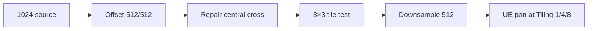

# 1. L05-02 — Seamless noise, smoke і utility masks

| Поле | Значення |
|---|---|
| Блок | 05 — Photoshop VFX Textures |
| ID уроку | L05-02 |
| Артефакти | `T_Noise_Seamless_512`, `T_Smoke_Seamless_512`, `M_PS_SeamViewer` |
| Критерій опанування | Невидимий seam у 3×3 test та стабільний panning у UE |

## 2. Результат уроку

Ви навчитеся:

- створювати noise і smoke з basic/default tools;
- робити texture seamless через half-size Offset і seam repair;
- відрізняти tileable boundary від просто «хаотичного» зображення;
- тестувати texture у 3×3 grid, при minification і під час panning;
- імпортувати masks як linear data та перевіряти Wrap;
- документувати scale, density, contrast і channel purpose.

Матеріали для здачі: source set, два exports 512, tile boards і motion capture в UE.

## 3. Орієнтовний час

| Частина | Теорія | Практика | M/S practice |
|---|---:|---:|---:|
| Seam mental model і frequency | 0.75 | 0.0 | 0.0 |
| Controlled experiments | 0.25 | 1.0 | 0.5 |
| Noise/smoke guided build | 0.0 | 2.5 | 1.0 |
| UE panning validation і вправи | 0.0 | 1.5 | 1.5 |
| **Разом** | **1.0** | **5.0** | **3.0** |

M/S practice входить у 5.0 практичних годин.

## 4. Передумови

| Навичка | Де отримано | Перевірка |
|---|---|---|
| Layer/mask workflow | [L05-01](01_photoshop_vfx_texture_workflow.md) | Non-destructive Levels і alpha inspect |
| UV sampling | [L03-04](../03_MATERIAL_FOUNDATIONS/04_uv_coordinates_and_coordinate_spaces.md) | Побудувати TexCoord×Tiling |
| Channel viewer | [L05-01](01_photoshop_vfx_texture_workflow.md) | R channel у Emissive |
| G04 | [Block 04 assessment](../04_STYLIZED_VFX_MATERIALS/BLOCK_ASSESSMENT.md) | Material Instance parameter override |

## 5. Нові терміни

| Термін | Пояснення |
|---|---|
| Seamless/tileable | Протилежні borders збігаються після повторення |
| Offset test | Перенесення borders у center для видимого repair |
| Wrap Around | Pixels, що виходять за edge, повертаються з протилежного боку |
| Spatial frequency | Розмір і щільність деталей texture |
| Directionality | Видимий переважний напрямок форм |
| Tile signature | Повторюваний унікальний mark, що видає pattern |
| Utility mask | Дані для breakup, distortion, erosion або timing, а не фінальний color |

## 6. Навіщо ця тема потрібна VFX-фахівцю

Noise розбиває ідеальні gradients, smoke mask формує volume impression, а seamless texture може pan-итися без стрибка. Навіть якщо seam математично закритий, великий bright blob біля center створює tile signature. Тому технічна і художня перевірки різні: borders мають збігатися, а pattern — не видавати період.

У Material один tileable noise може працювати в кількох scales. Це часто ефективніше й керованіше, ніж імпортувати багато майже однакових textures.

## 7. Теорія простими словами

Розріжте квадрат навпіл і поміняйте частини місцями. Старі borders опиняться всередині — тепер seam легко побачити й замаскувати. Після repair повернення Offset не потрібне: нові outer edges уже походять із безперервних внутрішніх regions.

Smoke читається на трьох рівнях:

1. large mass задає silhouette;
2. medium lobes додають rhythm;
3. small breakup прибирає пластик.

Якщо третій рівень сильніший за перший, texture стає піском, а не smoke.

## 8. Детальні технічні пояснення

Для 1024 master half-offset:

```text
Horizontal = 512 px
Vertical   = 512 px
Undefined Areas = Wrap Around
```

Для 512 export відповідний half-offset — `256/256`. Half-size переносить усі чотири original borders у central cross.

Frequency plan:

| Band | Орієнтир у 1024 master | Роль |
|---|---:|---|
| Large | 220–420 px | Mass |
| Medium | 70–180 px | Lobes |
| Small | 12–60 px | Breakup |

В UE `Address X/Y=Wrap` потрібні для repeat. `sRGB=Off` зберігає числові mask values. Compression і mip generation можуть змінювати contrast; source, imported mip 0 і distant mip потрібно порівнювати.

## 9. Візуальні й математичні приклади

Tile condition:

```text
T(0, y) ≈ T(1, y)
T(x, 0) ≈ T(x, 1)
```

Для periodic UV:

```text
SampleUV = frac(UV × Tiling + Time × Speed)
```

Material sampler із Wrap фактично повторює coordinates за межами 0–1. При `Tiling=4` texture повторюється чотири рази по U і V.



## 10. Controlled experiments

### CE-L05-02-01 — Central cross

- На 1024 layer намалюйте одну soft cloud.
- Застосуйте Offset `512/512`, `Wrap Around`.
- Очікування: original borders формують central cross; outer borders тепер узгоджені.
- Repair-іть лише central seam на mask/clone layer.
- Повторіть Offset: сильна лінія не повинна з’являтися.

### CE-L05-02-02 — Seam versus signature

- Побудуйте 3×3 grid із repaired tile.
- Спершу перевірте borders при 200% zoom.
- Потім подивіться grid на 12.5%.
- Очікування: border seam може бути відсутнім, але один bright island повторюється 9 разів.
- Зменште унікальний island або додайте balanced secondary masses.

### CE-L05-02-03 — Mip survival

- Збережіть variants із Levels `20/1.0/235` та `35/0.85/215`.
- Імпортуйте обидва з однаковими settings.
- Порівняйте близько, далеко й під рухом.
- Очікування: агресивний contrast може тримати silhouette, але втрачати soft hierarchy.

## 11. Покрокова керована практика

### GP-L05-02-A — Noise

1. Новий 1024×1024 RGB 8-bit source `T_Noise_Seamless_1024_v001`.
2. Groups: `10_LARGE`, `20_MEDIUM`, `30_SMALL`, `40_SEAM_REPAIR`, `90_ADJUST`.
3. Large: default soft/chalk brush, size `280 px`, opacity `25%`, flow `15%`; 8–12 overlapping masses.
4. Medium: size `110 px`, opacity `35%`, flow `20%`; не обводьте large shapes.
5. Small: size `28 px`, opacity `18%`, flow `10%`; заповніть лише sparse gaps.
6. Levels start `35 / 0.85 / 215`; Curves `64→52`, `128→142`, `210→238`.
7. Photoshop: `Filter > Other > Offset`, Horizontal `512`, Vertical `512`, `Wrap Around`. Krita: `Filter > Other > Offset Image`, offsets `512/512` або Wrap Around Mode + transform, залежно від version.
8. На `40_SEAM_REPAIR` використайте Clone Stamp/Clone Brush і masks. Не малюйте довгу прямолінійну смугу.
9. Створіть 3×3 Smart Object/clone grid; перевірте cross і tile signature.
10. Downsample copy до 512×512 із bicubic sharper candidate; після resize повторно налаштуйте Levels лише за потреби.

### GP-L05-02-B — Smoke

1. Duplicate structure у `T_Smoke_Seamless_1024_v001`.
2. Large lobes: 3–5 masses, brush `320–480 px`, opacity `20%`, flow `10%`.
3. Cut negative pockets через transparency mask, brush `90–180 px`, opacity `25%`.
4. Додайте medium curls через transformed/warped ellipses; уникайте однакового clockwise pattern.
5. Offset `512/512`, repair central cross, 3×3 test.
6. Export `T_Smoke_Seamless_512.png` та `T_Noise_Seamless_512.png`; grayscale у R, alpha або відсутній згідно manifest.

### GP-L05-02-C — UE validation

1. Import у `/Game/SVFX/Textures/Noise/`.
2. `sRGB=Off`; `Address X=Wrap`, `Address Y=Wrap`; compression candidate `Masks (no sRGB)`.
3. Створіть `M_PS_SeamViewer`, instance `MI_PS_SeamViewer`.
4. Перевірте `Tiling=1`, `4`, `8`; speed `(0.05,0.02)`.
5. Capture one loop не коротший 5 секунд; seam не повинен «стрибати».

Потребує ручної перевірки в Unreal Engine 5.8. Exact labels Address X/Y, Compression Settings, Texture Group, mip controls і sampler behavior звірте у встановленому build.

## 12. Точні назви вузлів, модулів, налаштувань і зʼєднань

Material properties: `Surface`, `Opaque`, `Unlit`, `Two Sided=Off`.

| Alias | Node | Parameter/default |
|---|---|---|
| `TextureCoordinate_UV0` | `TextureCoordinate` | Coordinate Index 0 |
| `ScalarParameter_Tiling` | `Scalar Parameter` | `Tiling=4.0` |
| `Multiply_TiledUV` | `Multiply` | — |
| `Panner_Motion` | `Panner` | Speed X `0.05`, Speed Y `0.02` |
| `TextureSample_Seamless` | `Texture Sample Parameter 2D` | `SeamTexture` |
| `MaterialOutput` | Main Material Node | — |

```text
TextureCoordinate_UV0.Output → Multiply_TiledUV.A
ScalarParameter_Tiling.Output → Multiply_TiledUV.B
Multiply_TiledUV.Output → Panner_Motion.Coordinate
Panner_Motion.Output → TextureSample_Seamless.UVs
TextureSample_Seamless.R → MaterialOutput.Emissive Color
```

Потребує ручної перевірки в Unreal Engine 5.8. Exact Panner input/output pin labels і exposed Speed properties звірте у встановленому build.

## 13. Стартові значення

| Parameter | Start | Range |
|---|---:|---:|
| Master size | 1024 | fixed |
| Export size | 512 | 256–1024 test |
| Offset | 512/512 | fixed for 1024 |
| Noise Levels | 35 / 0.85 / 215 | compare 20 / 1 / 235 |
| Smoke Levels | 20 / 1.10 / 240 | compare 35 / 0.9 / 220 |
| Tiling | 4 | 1, 4, 8 |
| Speed X/Y | 0.05 / 0.02 | −0.1–0.1 |
| `sRGB` | Off | fixed for data |
| Address X/Y | Wrap | fixed for seamless |

## 14. Очікуваний результат кожного етапу

| Етап | Результат |
|---|---|
| Frequency blockout | Large/medium/small hierarchy помітна |
| Offset | Borders у central cross |
| Repair | Немає straight cross при 200% |
| 3×3 | Немає border seam або dominant repeated island |
| Downsample | Large shape збережена, small detail не перетворився на dust |
| Import | Linear R channel, Wrap |
| Pan | Немає periodic jump у 5-second capture |
| Mip test | Texture лишається корисною на gameplay distance |

## 15. Самостійна вправа A

### EX-L05-02-A — Seamless energy wisps

Створіть 512 tileable mask із двома diagonal wisp families.

- wisp direction readable, але outer borders без seam;
- не більше одного basic brush family;
- values: чорне field, м’яка body середнього value, розріджені білі accents;
- перевірка: 3×3 board і UE pan при Tiling 1/4/8;
- матеріали для здачі: layered source, export, manifest, still + motion capture.

## 16. Додаткова складніша вправа B

### EX-L05-02-B — Dual-scale smoke

Створіть smoke texture, яка працює як один великий tile і як дрібний breakup.

- один export, два Material samples/scales у validation instance;
- large sample `Tiling=1`, detail sample `Tiling=5`;
- жодного obvious repeated hero blob;
- acceptance: multiply двох samples не знищує всю mask і не створює seam.

## 17. Три підказки для кожної вправи

### EX-L05-02-A

1. **Hint 1:** зробіть straight wisps tileable до того, як додавати bends.
2. **Hint 2:** Offset 256/256 для 512 export переносить усі borders у center.
3. **Hint 3:** дві transformed ellipse families на різних layers, central-cross repair на masks, Levels після 3×3 test.

[Повне рішення EX-L05-02-A](../EXERCISE_ANSWERS/L05-02_seamless_noise_smoke_and_masks_answers.md#ex-l05-02-a)

### EX-L05-02-B

1. **Hint 1:** large-scale usefulness потребує broad masses; detail usefulness — sparse mid/small breakup.
2. **Hint 2:** перевірте texture окремо при Tiling 1 і 5 до Multiply.
3. **Hint 3:** SampleA.R × lerp(0.65,1.0,SampleB.R) знижує шанс повного black; speed directions зробіть різними.

[Повне рішення EX-L05-02-B](../EXERCISE_ANSWERS/L05-02_seamless_noise_smoke_and_masks_answers.md#ex-l05-02-b)

## 18. Типові помилки

| Помилка | Симптом | Попередження |
|---|---|---|
| Offset без Wrap Around | Empty strips | Вибрати Wrap Around |
| Repair лише видимого vertical seam | Horizontal line лишається | Перевірити весь cross |
| Clone уздовж прямої | Новий soft seam | Short irregular strokes |
| Один hero blob | Видимий grid pattern | Balance masses |
| Detail сильніший за mass | Smoke схожий на static | Frequency hierarchy |
| Clamp address | Рух зупиняється на edge | Wrap для tileable |
| sRGB data | Contrast у UE інший | `sRGB=Off` |

## 19. Troubleshooting

| Симптом | Діагностика | Рішення |
|---|---|---|
| Seam видно лише у UE | Static 3×3 vs pan | Перевірити Address Wrap і mips |
| Seam видно в source | Offset central cross | Repair exact crossing regions |
| Pulse кожну секунду | Freeze frame sequence | Tile signature, не border seam; rebalance masses |
| Smoke зникає далеко | Mip preview | Підсилити large/mid masses, не sharpening dust |
| Black result після dual multiply | Preview samples | Remap detail до 0.65–1 |
| Panner стоїть | Time/Speed inspection | Ненульові Speed або external Time |
| Import color shifted | R numeric compare | Вимкнути sRGB, перевірити compression |

## 20. Performance і texture memory

- Два 512 R8 exports без mips: приблизно `0.50 MiB`; із повними mip chains — приблизно `0.67 MiB` до platform compression.
- Два окремі samples у Material коштують більше sampling work, навіть якщо використовують одну texture двічі.
- Повторне використання однієї tileable texture у двох UV scales економить asset memory, але не обов’язково texture-sample cost.
- 1024 master не має імпортуватися автоматично, якщо 512 export достатній у gameplay.
- Noise high-frequency detail швидко втрачається у mips і може shimmer-ити; менша кількість значущих forms краща за випадкову різкість.
- Для translucent smoke головні ризики — overlap, покриття екрана і overdraw. Texture memory є лише одним budget.

## 21. Запитання для самоперевірки

1. Чому half-size Offset корисний?
2. Чим seam відрізняється від tile signature?
3. Які три frequency bands потрібні smoke?
4. Який Offset потрібен для 512 texture?
5. Чому Wrap важливий у UE?
6. Навіщо тестувати Tiling 1, 4 і 8?
7. Чому dual-scale use не означає нульовий sample cost?
8. Що робити, якщо detail multiply робить texture black?

## 22. Відповіді

1. Він переносить original borders у central cross, де їх легко repair-ити.
2. Seam — discontinuity на border; signature — повторюваний mark навіть за безперервних borders.
3. Large mass, medium lobes і small breakup.
4. 256 px horizontal і vertical із Wrap Around.
5. Sampler має повторювати UV поза 0–1, інакше texture clamp-иться.
6. Щоб побачити seam, repetition signature і mip/frequency behavior у різних scales.
7. Кожен sample у graph все одно виконує texture lookup, навіть з одним asset.
8. Remap detail до вузького high range, наприклад 0.65–1, або змінити blend.

## 23. Self-check checklist

- [ ] 1024 master і 512 exports мають manifest.
- [ ] Offset 512/512 виконано з Wrap Around.
- [ ] Central cross repair не створив нової straight line.
- [ ] 3×3 board перевірено при 200% і 12.5%.
- [ ] Noise та smoke мають різну frequency hierarchy.
- [ ] UE `sRGB=Off`, Address X/Y Wrap.
- [ ] Pan capture триває щонайменше 5 секунд.
- [ ] Tiling 1/4/8 перевірено.
- [ ] Обидві вправи мають по одній власній спробі до answers.
- [ ] M/S practice = 3.0 години в журналі.

## 24. Mastery criteria

1. Border seam невидимий у 3×3 і UE pan.
2. Ви відрізняєте seam від repeated signature.
3. Smoke читається на 25% scale.
4. Noise працює при Tiling 1 і 8 без shimmer, неприйнятного для gameplay.
5. Import settings задокументовано.
6. Усі assets створені власноруч/default tools.
7. Щонайменше 7/8 відповідей правильні.
8. Worklog містить 3.0 M/S години й evidence.

## 25. Підсумок

- Offset робить borders видимими для repair.
- Seamless не означає непомітно повторюваний.
- Frequency hierarchy визначає, чи читається smoke.
- 3×3, downsample і moving UE tests перевіряють різні failure modes.
- Wrap і linear data interpretation є частиною texture contract.

## 26. Зв’язок із наступними уроками

| Урок | Що передається |
|---|---|
| [L05-03](03_slash_spark_and_magic_circle_textures.md) | Noise/smoke breakup для combat shapes |
| [L05-04](04_ramps_distortion_and_channel_packing.md) | Noise та smoke як R/G упаковані канали |
| [L05-05](05_flipbook_export_and_ue_texture_validation.md) | Border/mip tests і export manifest |

## 27. Офіційні джерела

- [PS-08 — Brush tool](https://helpx.adobe.com/photoshop/using/tool-techniques/brush-tool.html) — Adobe, доступ 2026-07-27.
- [PS-11 — Applying specific filters, including Offset](https://helpx.adobe.com/photoshop/using/applying-specific-filters.html) — Adobe, доступ 2026-07-27.
- [PS-06 — Levels adjustment](https://helpx.adobe.com/photoshop/using/levels-adjustment.html) — Adobe, доступ 2026-07-27.
- [PS-07 — Curves adjustment](https://helpx.adobe.com/photoshop/using/curves-adjustment.html) — Adobe, доступ 2026-07-27.
- [Texture Asset Editor](https://dev.epicgames.com/documentation/en-us/unreal-engine/texture-asset-editor-in-unreal-engine) — Epic Games, доступ 2026-07-27.
- [Coordinates Material Expressions](https://dev.epicgames.com/documentation/en-us/unreal-engine/coordinates-material-expressions-in-unreal-engine) — Epic Games, доступ 2026-07-27.

## 28. Рекомендовані скриншоти або схеми

```text
Скриншот 1
Відкрити: Offset-applied 1024 noise.
Показати: central vertical/horizontal borders до repair.
Виділити: чотири crossing regions і Wrap Around settings.
```

```text
Скриншот 2
Відкрити: 3×3 noise та smoke boards.
Показати: view at 200% and 12.5%.
Виділити: border continuity окремо від repeated signature.
```

```text
Скриншот 3
Відкрити: MI_PS_SeamViewer.
Показати: Tiling 1/4/8 captures і Panner graph.
Виділити: seamless transition через UV wrap.
```
