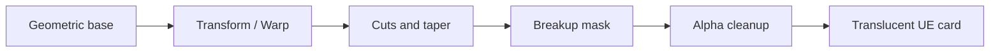

# 1. L05-03 — Slash, spark і magic circle textures

| Поле | Значення |
|---|---|
| Блок | 05 — Photoshop VFX Textures |
| ID уроку | L05-03 |
| Артефакти | `T_Slash_Crescent_1024`, `T_Spark_Star_512`, `T_MagicCircle_1024` |
| UE validator | `M_PS_CombatTextureViewer` |
| Критерій опанування | Оригінальний combat texture sheet із чистими silhouettes, alpha і gameplay readability |

## 2. Результат уроку

Ви зможете:

- будувати slash, spark і magic circle з selections, shapes, masks і transforms;
- створювати speed/taper без advanced painting;
- проектувати primary, secondary і accent hierarchy;
- уникати чужих symbols, brush packs та photobash;
- перевіряти alpha edge на різних backgrounds і в UE translucent material;
- оцінювати transparent padding, overdraw і resolution.

Матеріали для здачі: три layered sources, exports, contact sheet і captures перевірки в UE.

## 3. Орієнтовний час

| Частина | Теорія | Практика | M/S practice |
|---|---:|---:|---:|
| Combat-shape design і alpha | 0.75 | 0.0 | 0.0 |
| Controlled experiments | 0.25 | 0.75 | 0.5 |
| Guided slash/spark/circle | 0.0 | 2.75 | 1.0 |
| UE validation і вправи | 0.0 | 1.5 | 1.5 |
| **Разом** | **1.0** | **5.0** | **3.0** |

## 4. Передумови

| Навичка | Джерело | Перевірка |
|---|---|---|
| Masks, Levels, Curves, Transform/Warp | [L05-01](01_photoshop_vfx_texture_workflow.md) | Curved comet без destructive flatten |
| Seamless breakup | [L05-02](02_seamless_noise_smoke_and_masks.md) | Noise R у UE |
| VFX shape language | [Block 02](../02_VFX_DESIGN/BLOCK_ASSESSMENT.md) | Primary/secondary/accent thumbnail |
| Translucent unlit material | [L03-07](../03_MATERIAL_FOUNDATIONS/07_material_domains_blending_depth_and_overdraw.md) | Пояснити opacity та overdraw |

## 5. Нові терміни

| Термін | Пояснення |
|---|---|
| Taper | Поступове звуження shape |
| Crescent | Дугоподібний silhouette між двома зміщеними ellipses |
| Radial cadence | Ритм повторів навколо center |
| Registration | Точне співпадіння center/scale між layers |
| Transparent padding | Порожня area навколо useful shape |
| Combat texture sheet | Узгоджений набір slash/spark/symbol assets |
| Edge dilation | Продовження логічного RGB за alpha edge для filtering |

## 6. Навіщо ця тема потрібна VFX artist

Combat textures несуть напрямок, силу й timing ще до Niagara animation. Slash без taper виглядає як arc decal; spark без value hierarchy — як зірочка; magic circle без spacing hierarchy перетворюється на дрібний текст.

Геометричний workflow дозволяє створювати clean original assets навіть без впевненого digital painting. Він також дає контроль над symmetry, thickness і alpha, які важко виправляти в Material.

## 7. Теорія простими словами

Slash — це не одна біла дуга. Він складається з:

1. primary crescent, що задає motion;
2. inner hot core або secondary cut;
3. sparse breakup, що не руйнує direction.

Spark — asymmetric long axis плюс коротші rays. Magic circle — кілька rings із різними line weights, gaps і accents. Якщо всі частини однаково яскраві й часті, око не знає, куди дивитися.

## 8. Детальні технічні пояснення

### Crescent construction

Створіть outer ellipse selection і відніміть inner ellipse, зміщену в напрямку товстої частини. Warp керує arc, Free Transform — taper. Для clean edge master робиться 1024, export може лишитися 1024, якщо gameplay scale це виправдовує.

### Spark construction

Base ray — білий tapered rectangle/diamond. Duplicate/rotate навколо center:

```text
Angles: 0°, 90°, 35°, 145°
Length ratios: 1.0, 0.72, 0.42, 0.36
```

Small rays не мають конкурувати з primary axis.

### Magic circle construction

Кільця: outer `360 px radius`, main `285 px`, inner `170 px` у 1024 document. Line widths `14/8/5 px`. Додайте gaps через layer masks і 8 accents із `45°` cadence. Текст не потрібен: використайте original abstract ticks/triangles.

### Alpha contract

RGB може містити soft glow wider за alpha. Для pure mask texture можна повторити luminance в RGB, але рішення запишіть. Border padding: щонайменше `8 px` для 512 і `16 px` для 1024 master у цьому lesson.

## 9. Візуальні й математичні приклади

Arc occupancy:

```text
UsefulAreaRatio = nontransparent bounding-box area / full texture area
```

Якщо slash займає лише 20% width і 15% height, більшість quad pixels прозорі, але translucent shader усе одно може обробляти covered screen region.

Radial rotation:

```text
angle_i = startAngle + i × 360° / count
count=8 → step=45°
```



## 10. Controlled experiments

### CE-L05-03-01 — Slash taper

- Зробіть три crescents: uniform thickness, one-end taper, two-end taper.
- Перегляньте на 64 px і 256 px.
- Очікування: one/two-end taper краще передають direction; uniform читається як ring segment.
- Незмінні: arc, brightness, background.

### CE-L05-03-02 — Spark hierarchy

- Варіант A: чотири rays однакової довжини.
- Варіант B: ratios `1.0/0.72/0.42/0.36`.
- Очікування: B має primary axis і менше symbol-like symmetry.

### CE-L05-03-03 — Alpha edge

- Width м’якого glow RGB `24 px`; alpha містить hard core із feather `4 px`.
- Перевірте на black/white/magenta і в UE.
- Очікування: glow читається в Emissive, silhouette контролюється alpha, fringe відсутній.

## 11. Покрокова guided practice

### GP-L05-03-A — Slash `T_Slash_Crescent_1024`

1. 1024×1024 RGB 8-bit, groups `10_ARC`, `20_CORE`, `30_BREAKUP`, `40_ALPHA`, `90_ADJUST`.
2. Elliptical Marquee: outer ellipse приблизно `820×520 px`; subtract inner `690×390 px`, shift `+42 px X`, `+8 px Y`.
3. Fill white на separate layer. Free Transform rotation `-18°`.
4. Warp 3×3: upper tip `+34 px Y`, lower tip `−20 px Y`; не ламайте smooth arc.
5. Add mask; large soft black brush `180 px`, opacity `100%`, taper обидва ends.
6. Duplicate arc, contract inward до `82%`, Levels `60/0.75/210` для hot core.
7. Додайте L05-02 noise як clipped breakup із opacity `25%`; primary silhouette лишається continuous.
8. Padding: мінімум `16 px` від nontransparent pixels до border.

### GP-L05-03-B — Spark `T_Spark_Star_512`

1. 512 document; center guides at 256.
2. Primary diamond `28×360 px`; secondary `20×260 px`; поверни другий на `90°`.
3. Accent diamonds `12×150` і `10×130`; rotate `35°` і `145°`.
4. Soft glow ellipse `220×220`, opacity `35%`, behind rays.
5. Mask tips до taper; asymmetric small chips не більше 10% silhouette.

### GP-L05-03-C — Circle `T_MagicCircle_1024`

1. Center guides, rings radii `360/285/170 px`.
2. Widths stroke `14/8/5 px`; зберігай кожний ring на окремому Shape Layer.
3. Mask gaps: outer 4 gaps по `18°`, middle 8 gaps по `8°`.
4. Створіть original triangle/tick accent, duplicate 8 разів, angle step `45°`.
5. Inner focal diamond `96×96 px`; не використовуйте шрифти чи чужі sigils.
6. Thumbnail test 128 px; якщо ticks зливаються, зменшіть count, а не sharpen.

### GP-L05-03-D — Export і UE

1. Source names із `_v001`; exports PNG/TGA за manifest.
2. Reopen, A-only, halo board.
3. Import; mask-only `sRGB=Off`; colored preview textures — за documented purpose.
4. `M_PS_CombatTextureViewer`: translucent, unlit, two-sided.
5. Test на black, gray і bright checker; capture close/gameplay distance.

Потребує ручної перевірки в Unreal Engine 5.8. Exact Blend Mode/Shading Model property layout, alpha import detection, Compression Settings і mip UI звірте у встановленому build.

## 12. Точні назви nodes, modules, settings і connections

Material properties:

| Property | Value |
|---|---|
| Material Domain | `Surface` |
| Blend Mode | `Translucent` |
| Shading Model | `Unlit` |
| Two Sided | On |

| Alias | Node | Parameter/default |
|---|---|---|
| `TextureSample_Combat` | `Texture Sample Parameter 2D` | `CombatTexture` |
| `VectorParameter_Tint` | `Vector Parameter` | `Tint=(0.10,0.60,1.00,1)` |
| `Multiply_ColorMask` | `Multiply` | — |
| `ScalarParameter_Emissive` | `Scalar Parameter` | `EmissiveIntensity=5.0` |
| `Multiply_Emissive` | `Multiply` | — |
| `MaterialOutput` | Main Material Node | — |

```text
TextureSample_Combat.R → Multiply_ColorMask.A
VectorParameter_Tint.RGB → Multiply_ColorMask.B
Multiply_ColorMask.Output → Multiply_Emissive.A
ScalarParameter_Emissive.Output → Multiply_Emissive.B
Multiply_Emissive.Output → MaterialOutput.Emissive Color
TextureSample_Combat.A → MaterialOutput.Opacity
```

Якщо asset не має meaningful alpha, для isolated validation тимчасово підключіть `TextureSample_Combat.R → MaterialOutput.Opacity` і позначте variant у capture.

Потребує ручної перевірки в Unreal Engine 5.8. Exact RGBA pin display, parameter color input convention та Translucent root inputs звірте у встановленому renderer configuration.

## 13. Стартові значення

| Asset/setting | Start |
|---|---|
| Slash document | 1024×1024 |
| Slash outer/inner | 820×520 / 690×390 px |
| Slash rotation | −18° |
| Slash padding | 16 px minimum |
| Spark document | 512×512 |
| Spark rays | 360, 260, 150, 130 px |
| Circle radii | 360, 285, 170 px |
| Circle strokes | 14, 8, 5 px |
| Tint | (0.10, 0.60, 1.00) |
| EmissiveIntensity | 5.0; test 1, 5, 12 |

## 14. Очікуваний результат кожного етапу

| Етап | Очікувано |
|---|---|
| Slash outer-inner | Clean crescent без jagged subtraction |
| Slash taper | Direction читається на 64 px |
| Spark hierarchy | Один dominant axis |
| Circle rings | Three line weights і readable gaps |
| Alpha | Clean A-only silhouette |
| Halo board | Немає dark/light fringe |
| UE card | Texture читається на three backgrounds |
| Gameplay distance | Primary shape лишається, дрібні accents не shimmer-ять |

## 15. Самостійна вправа A

### EX-L05-03-A — Wind slash kit

Створіть sheet із трьома original wind slashes: heavy, quick, circular.

- одна design family, але різні curvature/taper;
- default shapes/basic brushes;
- кожен slash має 16 px padding у 1024 master;
- deliverables: layered source, окремі exports, alpha board, UE comparison;
- acceptance: type впізнається без color і підписів.

## 16. Додаткова складніша вправа B

### EX-L05-03-B — Elemental circle і sparks

Створіть original elemental magic circle та matching spark set.

- заборонено fonts, downloaded glyphs і proprietary symbols;
- не більше 3 ring scales, 2 line weights для accents і 1 focal motif;
- RGB soft glow та alpha silhouette мають documented difference;
- acceptance: circle читається на 128 px, sparks підтримують ту саму angle language.

## 17. Три підказки для кожної вправи

### EX-L05-03-A

1. **Hint 1:** варіюйте curvature, length і taper, а не випадковий noise.
2. **Hint 2:** heavy = ширший body/коротший arc; quick = тонший/довший; circular = майже closed arc із gap.
3. **Hint 3:** побудуйте один clean crescent master, duplicate як Smart Object/clone layer, non-destructively transform і створіть окремі masks для ends.

[Повне рішення EX-L05-03-A](../EXERCISE_ANSWERS/L05-03_slash_spark_and_magic_circle_textures_answers.md#ex-l05-03-a)

### EX-L05-03-B

1. **Hint 1:** почніть із одного original motif і повторіть його з radial cadence.
2. **Hint 2:** три rings 360/285/170, gaps різної ширини, spark primary axis повторює motif angle.
3. **Hint 3:** Shape Layers для rings, masks для gaps, duplicate-rotate 45° для accents; alpha з merged hard structure, RGB додає wider glow.

[Повне рішення EX-L05-03-B](../EXERCISE_ANSWERS/L05-03_slash_spark_and_magic_circle_textures_answers.md#ex-l05-03-b)

## 18. Типові помилки

| Помилка | Симптом | Виправлення |
|---|---|---|
| Uniform slash thickness | Arc decal | Taper ends і hot core |
| Symmetric spark | Clip-art star | Dominant axis і unequal rays |
| Circle перевантажений | Gray mush at 128 px | Менше accents, ширші gaps |
| Noise руйнує contour | Нечитабельний attack direction | Breakup clipped до interior |
| Shape торкається border | Mip/atlas bleed | 8/16 px padding |
| RGB black outside alpha | Dark fringe | Edge dilation/logical RGB |
| Full 1024 for tiny spark | Waste | Gameplay-size validation |

## 19. Troubleshooting

| Симптом | Тест | Причина | Рішення |
|---|---|---|---|
| Slash jagged | Zoom 100%, vector visibility | Low-res raster transform | Transform Shape/Smart Object master |
| Alpha staircase | A-only, no glow | Hard low-res edge | 1024 master, controlled feather |
| Spark disappears | 64 px thumbnail | Rays too thin | Increase primary width |
| Circle moiré | Gameplay camera move | Dense concentric lines | Reduce rings/details |
| UE opacity blank | A channel viewer | Missing alpha | Use R temporarily, fix export |
| Edge dark on bright bg | Halo board | Transparent RGB mismatch | Dilation/padding |
| Material too bright | Tint × intensity preview | Emissive 12 with full white area | Lower intensity/area; retain hierarchy |

## 20. Performance і texture memory

- 1024 RGBA8 raw = `4.00 MiB` без mips, приблизно `5.33 MiB` із full mip chain до platform compression.
- 512 RGBA8 raw = `1.00 MiB`, приблизно `1.33 MiB` із mips.
- Slash, spark і circle не мають автоматично бути RGBA: mask-only assets можуть використовувати one-channel/packing workflow після validation.
- Transparent padding збільшує covered quad area, overdraw і wasted texels. Обрізайте bounds, але лишайте filter-safe padding.
- Dense magic circle lines shimmer-ять у mips; performance/quality fix — design simplification або controlled mip behavior, не безмежне resolution.
- Emissive intensity не збільшує texture memory, але bloom може розширити perceived screen footprint; оцінюйте final scene.

## 21. Запитання для самоперевірки

1. Чому crescent із uniform thickness слабше передає motion?
2. Як two-ellipse subtraction створює slash?
3. Навіщо spark має dominant axis?
4. Що таке radial cadence?
5. Чому magic circle тестують на 128 px?
6. Навіщо RGB інколи ширший за alpha?
7. Як transparent padding впливає на cost?
8. Які assets заборонені в цьому block?

## 22. Відповіді

1. Він читається як статичний ring segment; taper задає direction/speed.
2. Inner ellipse вирізає частину outer; зміщення визначає thickness distribution.
3. Він прибирає clip-art symmetry і створює visual direction.
4. Передбачуваний кутовий ритм повторів навколо center.
5. Щоб перевірити gameplay readability та злиття тонких деталей.
6. Soft RGB дає glow, а tighter alpha контролює silhouette/coverage.
7. Великий порожній quad витрачає texels і може збільшувати translucent covered area.
8. Downloaded/proprietary brushes, symbols, fonts/glyphs як чужий artwork і photobash.

## 23. Self-check checklist

- [ ] Усі three assets original і мають layered sources.
- [ ] Slash читається в grayscale на 64 px.
- [ ] Spark має dominant axis.
- [ ] Circle читається на 128 px без moiré у motion.
- [ ] Padding: 16 px для 1024, 8 px для 512 minimum.
- [ ] RGB/A contract записано для кожного export.
- [ ] Halo board містить 4 backgrounds.
- [ ] UE viewer перевірено close/gameplay distance.
- [ ] Answers відкриті лише після власних спроб.
- [ ] M/S practice = 3.0 години.

## 24. Mastery criteria

1. Three texture types побудовано без advanced painting.
2. Primary silhouette читається без color.
3. Alpha edge clean на black/white/gray/magenta.
4. Materials compile і показують R/A contract.
5. Texture resolutions виправдані gameplay capture.
6. Немає proprietary/source-license problem.
7. Щонайменше 7/8 self-check answers правильні.
8. Performance note містить bounds/overdraw і memory estimate.

## 25. Підсумок

- Geometry, masks і transforms достатні для clean combat texture base.
- Slash потребує taper, spark — hierarchy, circle — spacing cadence.
- Original abstract motifs безпечніші й більш керовані.
- Alpha, padding і gameplay-size test є production requirements.
- UE card validation показує fringe, overdraw context і real readability.

## 26. Зв’язок із наступними уроками

| Урок | Повторне використання |
|---|---|
| [L05-04](04_ramps_distortion_and_channel_packing.md) | Slash/spark/circle masks як packing candidates |
| [L05-05](05_flipbook_export_and_ue_texture_validation.md) | Edge padding і cells для animated combat textures |
| [Block 09 у Course Map](../01_COURSE_MAP.md) | Combat archetype textures |

## 27. Офіційні джерела

- [PS-03 — Layers panel](https://helpx.adobe.com/photoshop/desktop/create-manage-layers/get-started-layers/work-with-the-layers-panel.html) — Adobe, доступ 2026-07-27.
- [PS-04 — Layer masks](https://helpx.adobe.com/photoshop/desktop/create-masks/layer-masks/add-layer-masks.html) — Adobe, доступ 2026-07-27.
- [PS-08 — Brush tool](https://helpx.adobe.com/photoshop/using/tool-techniques/brush-tool.html) — Adobe, доступ 2026-07-27.
- [PS-09 — Transformations](https://helpx.adobe.com/photoshop/desktop/crop-resize-transform/transform-manipulate-reshape/apply-transformations.html) — Adobe, доступ 2026-07-27.
- [PS-10 — Transform Warp](https://helpx.adobe.com/photoshop/desktop/effects-filters/artistic-stylize-filters/reshape-and-distort-images-with-transform-warp.html) — Adobe, доступ 2026-07-27.
- [Material Blend Modes](https://dev.epicgames.com/documentation/en-us/unreal-engine/material-blend-modes-in-unreal-engine) — Epic Games, доступ 2026-07-27.

## 28. Рекомендовані скриншоти або схеми

```text
Скриншот 1
Відкрити: Slash source at 25% і 100%.
Показати: outer/inner ellipse layers, taper mask, hot core, 16 px padding.
Виділити: silhouette до і після Warp.
```

```text
Скриншот 2
Відкрити: Magic circle Layers panel.
Показати: three rings, gap masks, 45° accent duplicates.
Виділити: line-weight hierarchy at 128 px preview.
```

```text
Скриншот 3
Відкрити: UE cards on black/gray/bright checker.
Показати: R-driven color, A-driven opacity, close/gameplay views.
Виділити: edge fringe і transparent bounds.
```
