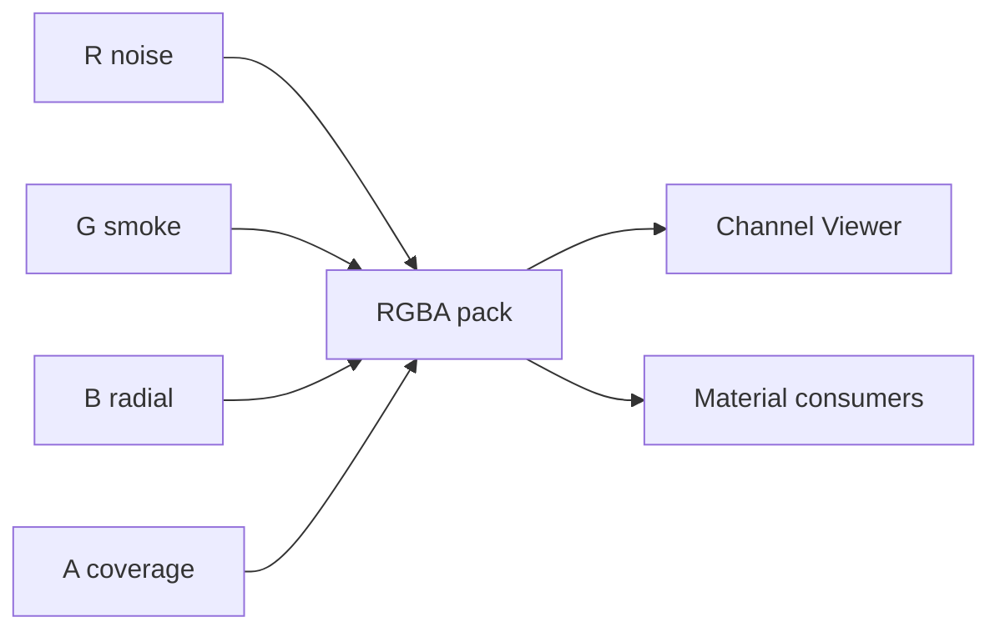

# 1. L05-04 — Gradient ramps, distortion і пакування каналів

| Поле | Значення |
|---|---|
| Блок | 05 — Photoshop VFX Textures |
| ID уроку | L05-04 |
| Артефакти | `T_Ramp_Energy_256x16`, `T_Distortion_RG_512`, `T_UtilityPacked_RGBA_512` |
| UE validator | `M_PS_DistortionViewer`, `M_PS_ChannelViewer` |
| Критерій опанування | Контракт channels переживає export/import; distortion neutral = 0.5 без drift |

## 2. Результат уроку

Ви зможете:

- створити керовану horizontal color ramp;
- кодувати signed-looking 2D offset у unsigned R/G через neutral 0.5;
- пакувати чотири незалежні utility masks у RGBA;
- експортувати channels без accidental color conversion;
- перевіряти R/G/B/A та distortion numerically у UE;
- оцінювати memory/sample trade-offs і ризики спільних compression/mips.

Матеріали для здачі: ramp, RG distortion, packed texture, manifest і докази в UE.

## 3. Орієнтовний час

| Частина | Теорія | Практика | M/S practice |
|---|---:|---:|---:|
| Ramp, encoding і packing contract | 1.0 | 0.0 | 0.0 |
| Guided authoring | 0.0 | 1.75 | 1.25 |
| UE channel/distortion validation | 0.0 | 1.25 | 1.25 |
| Independent A/B і profiling | 0.0 | 1.0 | 1.5 |
| **Разом** | **1.0** | **4.0** | **4.0** |

Уся практика уроку є M/S practice: кожен export приймається лише після Unreal Engine material validation.

## 4. Передумови

| Навичка/asset | Джерело | Перевірка |
|---|---|---|
| Channel viewer і export manifest | [L05-01](01_photoshop_vfx_texture_workflow.md) | R/G/B/A presets |
| Noise/smoke masks | [L05-02](02_seamless_noise_smoke_and_masks.md) | 512 tileable exports |
| Combat masks | [L05-03](03_slash_spark_and_magic_circle_textures.md) | Clean grayscale/alpha |
| UV distortion math | [L04-02](../04_STYLIZED_VFX_MATERIALS/02_distortion_flow_and_fake_refraction.md) | Пояснити `RG−0.5` |

## 5. Нові терміни

| Термін | Пояснення |
|---|---|
| Gradient ramp | 1D lookup: horizontal coordinate → color/value |
| Channel packing | Незалежні masks у R, G, B, A одного texture |
| Channel contract | Таблиця meaning, range, neutral, gamma і consumer |
| Neutral point | Encoded value, що означає нульовий offset; тут 0.5 |
| Signed remap | Перетворення 0–1 у −1–1: `x×2−1` або `(x−0.5)×2` |
| Crosstalk | Небажана зміна/вплив channels через authoring, compression або sampling |
| Shared fate | Усі упаковані канали мають однакові resolution, mips, addressing і compression |

## 6. Навіщо ця тема потрібна VFX-фахівцю

Ramps відділяють shape від palette: одна grayscale mask може стати fire, poison або ice без нового artwork. Packing може зменшити кількість texture assets і samples, але тільки коли channels мають сумісні runtime requirements.

Distortion є data, а не готовою картинкою. Якщо neutral не 0.5 або sRGB змінює values, UV постійно drift-ить. Channel contract перетворює «кольоровий packed файл» на надійний технічний interface.

## 7. Теорія простими словами

У packed texture кожен color channel — окрема чорно-біла папка:

- R: seamless noise;
- G: smoke breakup;
- B: radial mask;
- A: coverage.

Composite виглядає дивно, але це не важливо. Важливо, що consumer точно знає channel.

Для distortion сірий `0.5` означає «не рухай UV». Значення нижче зміщують у negative direction, вище — у positive. R керує U/X, G — V/Y.

## 8. Детальні технічні пояснення

### Ramp

Master `256×16`, horizontal:

| Position | Color sRGB preview |
|---:|---|
| 0% | `(0.005, 0.010, 0.025)` |
| 25% | `(0.020, 0.080, 0.300)` |
| 55% | `(0.050, 0.650, 1.000)` |
| 80% | `(0.850, 0.980, 1.000)` |
| 100% | `(1.000, 1.000, 1.000)` |

Color ramp candidate має `sRGB=On`; data ramp — `Off`. Purpose визначає setting, не filename.

### Distortion encoding

Для source signed offset `d ∈ [−1,1]`:

```text
encoded = d × 0.5 + 0.5
decoded = (encoded − 0.5) × 2
```

У validator можна не множити на 2, якщо Strength calibrated до half-range. Contract має явно сказати formula.

### Packing compatibility

Пакуйте разом лише channels, яким підходять:

- одна resolution;
- одна UV addressing mode;
- одна mip policy;
- linear data interpretation;
- одна compression trade-off;
- схожа lifetime/streaming importance.

Alpha може впливати на compression format і memory. Packing «безкоштовним» не є.

## 9. Візуальні й математичні приклади

Encoded R `0.70`, G `0.35`:

```text
decoded = (RG − 0.5) × 2
U = (0.70−0.5)×2 = +0.40
V = (0.35−0.5)×2 = −0.30
```

Якщо validator використовує лише `RG−0.5` і `Strength=0.03`, UV delta:

```text
(+0.20, −0.15) × 0.03 = (+0.006, −0.0045)
```



## 10. Controlled experiments

### CE-L05-04-01 — Ramp resolution

- Створіть identical ramp у 256×16 та 256×1.
- Import з однаковими settings; sample по U.
- Перевірте mips/minification.
- Очікування: vertical height може бути мінімізована, але exact mip/streaming behavior треба виміряти; 16 px є навчальним safe start.

### CE-L05-04-02 — Neutral distortion

- Заповніть RG рівно `128/255 ≈ 0.502`, B=0, A=1.
- Strength 0, 0.03, 0.1.
- Очікування: майже відсутній drift; 8-bit не представляє 0.5 абсолютно симетрично.
- Порівняйте Constant2Vector `(0.5,0.5)` texture для reference.

### CE-L05-04-03 — Packing integrity

- Запакуй чотири відомі patterns: horizontal gradient, vertical gradient, checker, circle.
- Reopen export і UE channel viewer.
- Очікування: кожен channel лишається своїм; composite preview не є acceptance test.

## 11. Покрокова керована практика

### GP-L05-04-A — Ramp

1. Документ 256×16 RGB 8-bit, `T_Ramp_Energy_256x16_v001`.
2. Photoshop Gradient Tool, linear, angle `0°`, stops з таблиці section 8. Krita Gradient Tool, foreground/background або custom gradient із matching stops.
3. Extend edge colors на full first/last columns.
4. Export PNG без alpha, reopen.
5. UE: для color-призначення `sRGB=On`, Address X `Clamp`, Address Y `Clamp`; порівняй із variant linear data, якщо ramp зберігає числову mask.

### GP-L05-04-B — RG distortion

1. 512×512 document; fill RGB `128,128,128`; alpha white.
2. На separate grayscale layers створіть `OffsetU`: seamless noise Levels `64/1.0/192`; `OffsetV`: rotated/warped independent noise з тим самим range.
3. Photoshop Channels: paste U into Red, V into Green; Blue fill `128` або magnitude candidate; Alpha coverage.
4. Krita: використайте channel separation/compose workflow або RGBA layers/export; перевірте numeric channels після reopen.
5. Filename `T_Distortion_RG_512.png`; manifest: R=encoded U, G=encoded V, B=0.5 neutral/reserved, A=coverage.
6. UE: `sRGB=Off`, Address Wrap, сумісна data compression; перевір zero/low/high strength.

### GP-L05-04-C — Packed utility

1. Reopen L05-02 noise/smoke і створіть 512 master.
2. R = `T_Noise_Seamless_512.R`.
3. G = `T_Smoke_Seamless_512.R`.
4. B = procedural radial mask `saturate(1−distance(center)×2)`.
5. A = clean slash/comet coverage або dedicated coverage.
6. Paste exact grayscale into Channels; не оцінюйте за composite color.
7. Повторно відкрий PNG/TGA, перевір усі чотири channels, обчисли histogram для кожного channel.
8. UE: `sRGB=Off`, captures channel viewer, тести consumer material.

Потребує ручної перевірки в Unreal Engine 5.8. Exact Compression Settings labels such as `Masks (no sRGB)`, Texture Group values, alpha-related runtime format, Address controls, imported bit depth і resource-size reporting звірте у встановленому build.

## 12. Точні назви вузлів, модулів, налаштувань і зʼєднань

### `M_PS_DistortionViewer`

Properties: `Surface`, `Opaque`, `Unlit`, `Two Sided=Off`.

| Alias | Node | Parameter/default |
|---|---|---|
| `TextureCoordinate_UV0` | `TextureCoordinate` | Index 0 |
| `TextureSample_Distortion` | `Texture Sample Parameter 2D` | `DistortionTexture` |
| `Constant2Vector_Neutral` | `Constant2Vector` | `(0.5,0.5)` |
| `Subtract_Neutral` | `Subtract` | — |
| `ScalarParameter_Strength` | `Scalar Parameter` | `Strength=0.03` |
| `Multiply_Strength` | `Multiply` | — |
| `Add_DistortedUV` | `Add` | — |
| `TextureSample_Preview` | `Texture Sample Parameter 2D` | `PreviewTexture` |
| `MaterialOutput` | Main Material Node | — |

```text
TextureCoordinate_UV0.Output → TextureSample_Distortion.UVs
TextureSample_Distortion.RG → Subtract_Neutral.A
Constant2Vector_Neutral.Output → Subtract_Neutral.B
Subtract_Neutral.Output → Multiply_Strength.A
ScalarParameter_Strength.Output → Multiply_Strength.B
TextureCoordinate_UV0.Output → Add_DistortedUV.A
Multiply_Strength.Output → Add_DistortedUV.B
Add_DistortedUV.Output → TextureSample_Preview.UVs
TextureSample_Preview.RGB → MaterialOutput.Emissive Color
```

`PreviewTexture` має бути high-contrast checker/UV grid із дозволеним license або власний procedural export.

### `M_PS_ChannelViewer`

Використайте точну схему графа з [розділу 12 уроку L05-01](01_photoshop_vfx_texture_workflow.md#12-точні-назви-вузлів-модулів-налаштувань-і-зєднань) та ваги каналів R/G/B/A.

Потребує ручної перевірки в Unreal Engine 5.8. Exact ComponentMask/TextureSample RG pin exposure та Material root UI звірте у встановленому build.

## 13. Стартові значення

| Setting | Start | Test values |
|---|---:|---|
| Ramp | 256×16 | 256×1, 256×16, 512×16 |
| Distortion | 512×512 RGBA8 | — |
| U/V source range | 64–192 / 255 | 32–224 |
| Neutral | 128/255 | Constant 0.5 reference |
| Strength | 0.03 | 0, 0.01, 0.03, 0.10 |
| Packed utility | 512×512 RGBA8 | — |
| Packed `sRGB` | Off | fixed |
| Distortion address | Wrap | Clamp negative test |
| Ramp address | Clamp | fixed for lookup |

## 14. Очікуваний результат кожного етапу

| Етап | Очікувано |
|---|---|
| Source ramp | Плавна horizontal palette, стала по вертикалі |
| Ramp в UE | Без wrap seam, endpoints стабільні |
| Distortion R/G | Незалежні fields навколо mid-gray |
| Strength 0 | Pixel-identical preview reference |
| Strength 0.03 | Subtle motion-shaped displacement |
| Packed reopen | Four correct independent masks |
| Viewer channels в UE | R/G/B/A відповідають source |
| Тест consumer | Без ненавмисного drift/crosstalk channels |

## 15. Самостійна вправа A

### EX-L05-04-A — Pack four existing masks

Створіть `T_UtilityPacked_RGBA_512_Student`:

- R noise, G smoke, B radial timing, A combat coverage;
- manifest містить source filename, meaning, range, neutral, addressing і consumer для кожного;
- export PNG і TGA, reopen і UE A/B;
- acceptance: four known test points мають expected numeric ordering; no gamma shift.

## 16. Додаткова складніша вправа B

### EX-L05-04-B — Directional RG distortion pair

Створіть tileable RG field:

- R переважно horizontal offset, G — vertical counterflow;
- exact neutral background `128/255`;
- mean кожного channel близький до 0.5; жодного constant drift у static preview;
- validate Strength `−0.03`, `0`, `+0.03`;
- матеріали для здачі: source layers/channels, export, graph viewer, три captures.

## 17. Три підказки для кожної вправи

### EX-L05-04-A

1. **Hint 1:** спочатку напишіть channel contract, тільки потім paste-іть masks.
2. **Hint 2:** приведіть усі sources до 512, linear grayscale і compatible Wrap/mips.
3. **Hint 3:** R=noise, G=smoke, B=radial, A=coverage; повторно відкрийте export; застосуйте presets ChannelWeights; перевірте sample points у center, corner, bright feature і background.

[Повне рішення EX-L05-04-A](../EXERCISE_ANSWERS/L05-04_ramps_distortion_and_channel_packing_answers.md#ex-l05-04-a)

### EX-L05-04-B

1. **Hint 1:** gray 0.5 — zero; balance light and dark deviations around it.
2. **Hint 2:** derive R/G from separate seamless masks, remap each into roughly 0.25–0.75.
3. **Hint 3:** `Levels output 64–192`, paste into R/G, Offset repair, UE decode `RG−0.5`, compare Strength signs; measure center-of-grid drift.

[Повне рішення EX-L05-04-B](../EXERCISE_ANSWERS/L05-04_ramps_distortion_and_channel_packing_answers.md#ex-l05-04-b)

## 18. Типові помилки

| Помилка | Симптом | Виправлення |
|---|---|---|
| Packed composite judged as art | «Дивний колір» | Inspect channels only |
| sRGB on | Mid-values/neutral shift | Data `sRGB=Off` |
| R і G identical | Diagonal uniform distortion | Independent fields |
| Background 0 instead of 0.5 | Constant negative drift | Fill neutral 128 |
| Incompatible masks packed | Один channel needs Clamp, інші Wrap | Separate assets |
| Alpha added без budget check | Runtime format/memory surprise | Inspect resource size |
| Ramp Wrap | Endpoint color seam | Clamp |

## 19. Troubleshooting

| Симптом | Test | Причина | Рішення |
|---|---|---|---|
| Preview drifts at neutral | Constant RG texture | Encoding/8-bit bias/sRGB | sRGB off; subtract actual neutral; document |
| Distortion flips axis | Horizontal grid test | R/G swapped | R→U, G→V |
| Channel viewer shows all white A | Reopen alpha | PNG/TGA alpha absent | Correct export and manifest |
| Packed masks softened | Mip0 vs distant | Shared mips/compression | Re-evaluate compatibility |
| Ramp bands | 100% and scene | Low precision/compression | Larger width or suitable settings; measure |
| Checker clamps at edge | UV outside 0–1 | Preview texture Address Clamp | Wrap preview or reduce Strength |
| PNG differs from TGA | Numeric channel samples | Export color/profile handling | Choose validated format and record |

## 20. Performance і texture memory

- Three standalone 512 R8 masks raw без mips ≈ `0.75 MiB`; one 512 RGBA8 ≈ `1.00 MiB`. Packing не завжди зменшує raw memory.
- Якщо material раніше sample-ив чотири separate textures, one packed sample може зменшити lookups; якщо consumer потрібен лише один channel, packed RGBA може марнувати bandwidth.
- Full mip chain додає приблизно третину: 512 RGBA8 ≈ `1.33 MiB` raw reference.
- Alpha може спричинити інший platform format; лише cooked/resource statistics дають фінальний verdict.
- Ramp 256×16 RGBA8 raw ≈ `16 KiB` без mips, але asset/streaming overhead теж існує.
- Distortion sample + preview sample = два lookups у validator. У final translucent material додатковий lookup множиться на overdraw.
- Packing decision оформлюйте як comparison: sample count, resource size, compression artifacts, channel compatibility.

## 21. Запитання для самоперевірки

1. Коли ramp має `sRGB=On`, а коли Off?
2. Яка formula кодує −1–1 у 0–1?
3. Чому neutral для RG distortion близький до 0.5?
4. Що означає спільна доля упакованих каналів?
5. Чому packing не гарантує меншу memory?
6. Які settings мають бути сумісні до packing?
7. Як перевірити channel integrity?
8. Чому ramp зазвичай Clamp, а seamless distortion Wrap?

## 22. Відповіді

1. On для display color lookup; Off для numeric/data lookup, відповідно до purpose.
2. `encoded=d×0.5+0.5`; decode `(encoded−0.5)×2`.
3. Воно ділить unsigned range на negative/positive offsets і означає zero.
4. Однакові resolution, mips, addressing, compression, streaming і lifecycle.
5. RGBA може бути більшим за кілька compressed/single-channel resources; alpha може змінити format.
6. Resolution, UV address, mip policy, linearity, compression tolerance, streaming importance.
7. Reopen export, R/G/B/A viewer, known patterns і numeric sample points.
8. Ramp endpoint не має повторюватися; tileable field повинен безперервно повторювати UV.

## 23. Self-check checklist

- [ ] Ramp purpose і sRGB policy записані.
- [ ] Ramp endpoints не wrap-яться.
- [ ] Distortion R/G незалежні та centered біля 0.5.
- [ ] Strength 0 дає reference image.
- [ ] Packed manifest має 4 complete rows.
- [ ] PNG/TGA reopened і compared.
- [ ] UE R/G/B/A captures збігаються із source.
- [ ] Address/mips/compression compatibility обґрунтована.
- [ ] Exercises виконано до перегляду answers.
- [ ] M/S practice = 4.0 години.

## 24. Mastery criteria

1. Ви з clean files збираєте ramp, RG distortion і RGBA pack.
2. Neutral distortion не має помітного drift.
3. Channel contract однозначний для іншого artist.
4. Material connections відтворено без tutorial.
5. Import settings validated, version-sensitive labels recorded.
6. Memory/sample comparison містить numbers і caveats.
7. Щонайменше 7/8 questions правильні.
8. Усі four practice hours мають UE evidence.

## 25. Підсумок

- Ramp є lookup і має відповідати color/data purpose.
- Distortion потребує documented encode/decode і neutral.
- Packing — interface design, не декоративний composite.
- Compatible channels можуть економити samples, incompatible — створюють artifacts.
- UE channel/distortion validators обов’язкові до прийняття export.

## 26. Зв’язок із наступними уроками

| Наступний матеріал | Що зберегти |
|---|---|
| [L05-05](05_flipbook_export_and_ue_texture_validation.md) | Manifest, channel viewers, memory arithmetic |
| [Block 07](../07_NIAGARA_FOUNDATIONS/) | Packed masks/ramp as emitter inputs |
| [Block 09 у Course Map](../01_COURSE_MAP.md) | Distortion і palette variants |

## 27. Офіційні джерела

- [PS-05 — Channel basics](https://helpx.adobe.com/photoshop/using/channel-basics.html) — Adobe, доступ 2026-07-27.
- [PS-06 — Levels](https://helpx.adobe.com/photoshop/using/levels-adjustment.html) — Adobe, доступ 2026-07-27.
- [PS-07 — Curves](https://helpx.adobe.com/photoshop/using/curves-adjustment.html) — Adobe, доступ 2026-07-27.
- [PS-12 — Saving files in graphics formats](https://helpx.adobe.com/photoshop/using/saving-files-graphics-formats.html) — Adobe, доступ 2026-07-27.
- [Texture Asset Editor](https://dev.epicgames.com/documentation/en-us/unreal-engine/texture-asset-editor-in-unreal-engine) — Epic Games, доступ 2026-07-27.
- [Material Expressions Reference](https://dev.epicgames.com/documentation/en-us/unreal-engine/unreal-engine-material-expressions-reference) — Epic Games, доступ 2026-07-27.

## 28. Рекомендовані скриншоти або схеми

```text
Скриншот 1
Відкрити: Photoshop Channels for T_UtilityPacked_RGBA_512.
Показати: R noise, G smoke, B radial, A coverage.
Виділити: channel contract table beside source.
```

```text
Скриншот 2
Відкрити: M_PS_DistortionViewer.
Показати: RG sample, subtract 0.5, Strength, UV Add, checker sample.
Виділити: captures Strength −0.03 / 0 / +0.03.
```

```text
Схема 3
Показати: compatible packing decision tree.
Гілки: same resolution? same addressing? same gamma? same mips? same compression tolerance?
Фінал: pack або keep separate.
```
