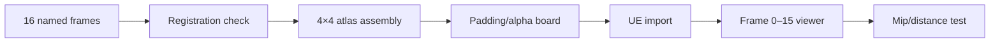

# 1. L05-05 — Flipbook preparation, export і UE texture settings

| Поле | Значення |
|---|---|
| Блок | 05 — Photoshop VFX Textures |
| ID уроку | L05-05 |
| Артефакт | `T_Flipbook_EnergyRing_4x4_1024`, source frames і `M_PS_FlipbookViewer` |
| Assessment | [Block 05 Assessment](BLOCK_ASSESSMENT.md), 3.0 години всередині цього уроку |
| Критерій опанування | 16 frames без edge/mip bleeding, правильний order і перевірка в UE |

## 2. Результат уроку

Ви зможете:

- спланувати 4×4 atlas із 16 frames і явним frame order;
- підготувати 256×256 cells із safe padding;
- експортувати image sequence та зібраний atlas;
- виявляти frame swap, edge bleeding, alpha halo і mip contamination;
- вручну обчислити atlas UV у Material;
- оцінити memory, resolution і practical alternatives;
- пройти G05 assessment із повним texture set.

Матеріали для здачі: source sequence, atlas 1024, manifest export, contact sheet/motion capture 16 frames в UE.

## 3. Орієнтовний час

| Частина | Теорія | Практика | M/S practice |
|---|---:|---:|---:|
| Atlas/order/padding mental model | 0.5 | 0.0 | 0.0 |
| Guided flipbook і manual viewer | 0.0 | 1.0 | 1.0 |
| Independent exercises/retrieval | 0.0 | 0.5 | 1.0 |
| BLOCK_ASSESSMENT | 0.0 | 3.0 | 0.0 |
| **Разом** | **0.5** | **4.5** | **2.0** |

Assessment hours уже включені в `4.5` practice цього уроку. Не додавайте 3.0 години до total block time. Разом block 05: `5.0 T / 23.0 P = 28.0`, M/S practice `14.0`.

## 4. Передумови

| Потрібно | Джерело | Перевірка |
|---|---|---|
| Clean grayscale/alpha workflow | [L05-01](01_photoshop_vfx_texture_workflow.md) | Reopen + R/A compare |
| Seam/padding thinking | [L05-02](02_seamless_noise_smoke_and_masks.md) | 3×3 tile board |
| Combat shape assets | [L05-03](03_slash_spark_and_magic_circle_textures.md) | Original texture sheet |
| Packing/import contract | [L05-04](04_ramps_distortion_and_channel_packing.md) | Four-channel manifest |
| Flipbook UV foundations | [L03-06](../03_MATERIAL_FOUNDATIONS/06_texture_sampling_channels_and_flipbooks.md) | Пояснити cell scale/offset |

## 5. Нові терміни

| Термін | Пояснення |
|---|---|
| Flipbook | Послідовність frames у texture atlas |
| Atlas | Одна texture з grid cells |
| Cell | Прямокутна область одного frame |
| Frame order | Правило нумерації й обходу cells |
| Row-major | Спершу columns зліва направо, потім наступний row зверху вниз |
| Cell padding | Empty/safe border усередині cell |
| Edge bleeding | Sampling pixels сусідньої cell |
| Mip contamination | Змішування cells на нижчих mip levels |
| Registration | Стабільний pivot/center між frames |

## 6. Навіщо ця тема потрібна VFX artist

Flipbook переносить складну shape evolution у один sample: explosion, smoke puff, ring, slash trail або impact core. Але atlas створює нову межу — не texture border, а border кожної cell. Bilinear filtering і mips можуть читати сусідній frame, тому «чистий PNG» ще не означає чистий runtime.

Manual viewer змушує зрозуміти grid math. Коли Niagara/SubUV behavior відрізняється, ви можете відокремити помилку atlas від renderer setup.

## 7. Теорія простими словами

4×4 atlas — шафа з 16 комірками. Frame 0 у top-left, frame 3 у top-right, frame 4 починає другий row. Щоб показати один frame, UV спочатку стискається в 1/4, потім зміщується до потрібної комірки.

Кожен frame має лишатися всередині своєї cell. Safe padding — порожній коридор, який знижує ризик, що filter захопить сусіда. На малих mips цей коридор теж зменшується, тому validation виконується на різних distances.

## 8. Детальні технічні пояснення

Contract:

```text
Grid      = 4 columns × 4 rows
Frames    = 16
Cell      = 256 × 256 px
Atlas     = 1024 × 1024 px
Order     = row-major, top-left → bottom-right
Names     = F_000 through F_015
Padding   = 8 px inside every cell
Safe area = 240 × 240 px
```

Frame indexing:

```text
frame = clamp(floor(Frame), 0, 15)
row   = floor(frame / Columns)
col   = frame - row × Columns
AtlasUV = (UV + float2(col,row)) / float2(Columns,Rows)
```

Unreal texture V convention/material preview може вимагати vertical interpretation, що залежить від actual atlas orientation. Потребує ручної перевірки в Unreal Engine 5.8.

### Frame design

Energy ring example:

- F000: 8% radius, 100% core;
- F004: 35% radius, bright core;
- F008: 62% radius, thinning;
- F012: 85% radius, breakup;
- F015: 96% radius, 0–10% opacity.

Registration center `(128,128)` у кожній cell.

## 9. Візуальні й математичні приклади

Frame 6 in 4×4:

```text
row = floor(6/4) = 1
col = 6 - 1×4 = 2
cell offset = (2,1)
AtlasUV = (UV + (2,1)) / (4,4)
```

Cell covers U `[0.50,0.75]`, V `[0.25,0.50]` за top-left/UV orientation після підтвердження в viewer.

```text
F000 F001 F002 F003
F004 F005 F006 F007
F008 F009 F010 F011
F012 F013 F014 F015
```



## 10. Controlled experiments

### CE-L05-05-01 — Frame order marker

- Додайте тимчасовий corner marker і number 00–15 у debug copy.
- Assemble atlas row-major.
- У UE змініть Frame 0→15.
- Очікування: послідовність зростає left-to-right, top-to-bottom без swap/flip.
- Debug numbers не потрапляють у final export.

### CE-L05-05-02 — Padding

- Atlas A: shape доходить до cell border.
- Atlas B: 8 px internal padding.
- Перегляньте frame 5 при close/distant camera.
- Очікування: A частіше показує neighbor contamination; B має чистіший border.

### CE-L05-05-03 — Mip chain

- Перегляньте atlas mip levels у Texture Asset Editor.
- Порівняйте frame contact sheet at mip 0 і distant runtime.
- Очікування: lower mips змішують tiny cells сильніше; рішення залежить від gameplay size, padding, resolution і mip policy.

## 11. Покрокова guided practice

### GP-L05-05-A — Frame sequence

1. Створіть master frame document `256×256`, RGB 8-bit, transparent.
2. Guides: center 128/128; safe guides 8 і 248 px.
3. Groups: `10_RING`, `20_CORE`, `30_BREAKUP`, `40_ALPHA`, `90_ADJUST`.
4. Побудуйте F000 як two-ellipse ring; duplicate source state 15 разів.
5. Для frame `i` scale ring приблизно `8% + i×5.9%`; thickness від `28 px` до `5 px`.
6. Core opacity: frames 0–5 `100→65%`, 6–11 `60→25%`, 12–15 `20→0%`.
7. Breakup вводьте з F008, не змінюючи center registration.
8. Назвіть layer comps/groups або files точно `F_000`–`F_015`.

### GP-L05-05-B — Export sequence

1. Photoshop: `File > Export > Render Video`, output `Photoshop Image Sequence`, format PNG, alpha enabled, frame rate metadata не критична для still sequence; exact dialog зафіксуйте.
2. Альтернатива Photoshop: export Layer Comps/files із validated naming.
3. Krita: `File > Render Animation`, PNG sequence `F_000`–`F_015`.
4. Повторно відкрий first/middle/last: dimensions 256, alpha, center.
5. Contact sheet: overlay centers; жоден frame не виходить за 8 px safe guides.

### GP-L05-05-C — Atlas assembly

1. New 1024×1024 transparent source.
2. Guides кожні 256 px.
3. Place F000–F015 row-major; top-left registration кожної placed layer exact multiple of 256.
4. Naming від `R0_C0_F000` до `R3_C3_F015`.
5. Export `T_Flipbook_EnergyRing_4x4_1024.png`, reopen і inspect A.

### GP-L05-05-D — UE validation

1. Import у `/Game/SVFX/Textures/Flipbooks/`.
2. Atlas mask/data: `sRGB=Off`; політику compression/mips/alpha записано.
3. Створіть manual `M_PS_FlipbookViewer` за section 12.
4. Material Instance: Frame values 0–15, one screenshot contact sheet.
5. Animate Frame externally або вручну scrub; inspect order, pivot, edge bleed.
6. Compare mip 0, gameplay distance і lower mip preview.

Потребує ручної перевірки в Unreal Engine 5.8. Exact texture import defaults, alpha detection, Compression Settings, Mip Gen Settings, Texture Group, Texture Asset Editor mip controls, Material node/pin labels і row orientation звірте у встановленому build.

## 12. Точні назви nodes, modules, settings і connections

Material properties: `Surface`, `Translucent`, `Unlit`, `Two Sided=On`.

| Alias | Node | Parameter/default |
|---|---|---|
| `TextureCoordinate_UV0` | `TextureCoordinate` | Index 0 |
| `ScalarParameter_Frame` | `Scalar Parameter` | `Frame=0` |
| `Floor_Frame` | `Floor` | — |
| `Clamp_Frame` | `Clamp` | Min 0, Max 15 |
| `ScalarParameter_Columns` | `Scalar Parameter` | `Columns=4` |
| `ScalarParameter_Rows` | `Scalar Parameter` | `Rows=4` |
| `Divide_Row` | `Divide` | — |
| `Floor_Row` | `Floor` | — |
| `Multiply_RowColumns` | `Multiply` | — |
| `Subtract_Column` | `Subtract` | — |
| `Append_Cell` | `AppendVector` | col,row |
| `Append_Grid` | `AppendVector` | columns,rows |
| `Add_UVCell` | `Add` | — |
| `Divide_AtlasUV` | `Divide` | — |
| `TextureSample_Atlas` | `Texture Sample Parameter 2D` | `FlipbookTexture` |
| `MaterialOutput` | Main Material Node | — |

```text
ScalarParameter_Frame.Output → Floor_Frame.Input
Floor_Frame.Output → Clamp_Frame.Input
Clamp_Frame.Output → Divide_Row.A
ScalarParameter_Columns.Output → Divide_Row.B
Divide_Row.Output → Floor_Row.Input
Floor_Row.Output → Multiply_RowColumns.A
ScalarParameter_Columns.Output → Multiply_RowColumns.B
Clamp_Frame.Output → Subtract_Column.A
Multiply_RowColumns.Output → Subtract_Column.B
Subtract_Column.Output → Append_Cell.A
Floor_Row.Output → Append_Cell.B
ScalarParameter_Columns.Output → Append_Grid.A
ScalarParameter_Rows.Output → Append_Grid.B
TextureCoordinate_UV0.Output → Add_UVCell.A
Append_Cell.Output → Add_UVCell.B
Add_UVCell.Output → Divide_AtlasUV.A
Append_Grid.Output → Divide_AtlasUV.B
Divide_AtlasUV.Output → TextureSample_Atlas.UVs
TextureSample_Atlas.R → MaterialOutput.Emissive Color
TextureSample_Atlas.R → MaterialOutput.Opacity
```

Якщо meaningful alpha окремий:

```text
TextureSample_Atlas.A → MaterialOutput.Opacity
```

Потребує ручної перевірки в Unreal Engine 5.8. Exact `Clamp` properties/pins, AppendVector labels, scalar-vector coercion, atlas V orientation і Material root inputs звірте у встановленому build.

## 13. Стартові значення

| Setting | Start | Tests |
|---|---:|---:|
| Grid | 4×4 | fixed |
| Frames | 16 | 0–15 |
| Cell | 256×256 | fixed |
| Atlas | 1024×1024 | fixed |
| Padding | 8 px | compare 0/4/8/16 |
| Ring scale | 8%→96% | monotonic |
| Frame | 0 | 0, 1, 3, 4, 6, 15 |
| Columns/Rows | 4/4 | fixed |
| `sRGB` mask atlas | Off | fixed |
| Viewer emissive | R | alpha variant |

## 14. Очікуваний результат кожного етапу

| Етап | Очікувано |
|---|---|
| Sequence | Monotonic expansion/fade, center stable |
| Reopened frames | 16 files, 256×256, alpha present |
| Atlas | Exact 4×4 alignment |
| Debug order | 0–15 row-major |
| Viewer Frame 6 | Third column, second row |
| Motion | No unexpected backwards frame |
| Тест padding | Немає pixels сусідньої cell на прийнятній відстані |
| Тест mip | Першу failing distance/mip задокументовано |

## 15. Самостійна вправа A

### EX-L05-05-A — Energy ring flipbook

Створіть original 4×4 ring atlas:

- 16 frames, row-major, 256 cell, 8 px padding;
- anticipation F000–F002, expansion F003–F010, breakup/fade F011–F015;
- source sequence і atlas обидва потрібні;
- acceptance: stable center, monotonic broad motion, no edge bleed у UE frame viewer.

## 16. Додаткова складніша вправа B

### EX-L05-05-B — Asymmetric smear/smoke flipbook

Створіть 16-frame directional smear або smoke puff:

- center-of-mass може рухатись, але documented pivot guide лишається;
- silhouette асиметрична, без простої animation лише через uniform scale;
- neighboring frames мають coherent changes;
- acceptance: order читається без debug numbers, lower mips не показують неприйнятного neighbor frame на target distance.

## 17. Три підказки для кожної вправи

### EX-L05-05-A

1. **Hint 1:** розбийте motion на anticipation, expansion і fade, а не scale 0→1.
2. **Hint 2:** зафіксуйте guides і duplicate source state; змінюйте radius, thickness, breakup та opacity.
3. **Hint 3:** у F000–2 створіть мале bright core; у F003–10 збільшуйте radius і зменшуйте thickness; у F011–15 посилюйте breakup та зменшуйте alpha; збирайте atlas за точними offsets по 256 px.

[Повне рішення EX-L05-05-A](../EXERCISE_ANSWERS/L05-05_flipbook_export_and_ue_texture_validation_answers.md#ex-l05-05-a)

### EX-L05-05-B

1. **Hint 1:** виберіть один motion vector і один evolving negative pocket.
2. **Hint 2:** використайте transform/warp між key poses 0, 5, 10, 15, потім створіть in-betweens.
3. **Hint 3:** тримайте pivot guide у 128/128; зміщуйте mass не більше ніж на 6 px/frame; деформуйте tail; поступово введіть три breakup islands; перевірте contact sheet і ручний порядок frames.

[Повне рішення EX-L05-05-B](../EXERCISE_ANSWERS/L05-05_flipbook_export_and_ue_texture_validation_answers.md#ex-l05-05-b)

## 18. Типові помилки

| Помилка | Симптом | Виправлення |
|---|---|---|
| Mixed frame names | Wrong assembly order | Zero-padded F_000–F_015 |
| Bottom-up vs top-down assumption | Rows flipped | Debug-number viewer test |
| Shape crosses safe guide | Neighbor bleed | 8 px internal padding |
| Pivot drifts | Animation jitters | Center guides/registration overlay |
| Uniform scale only | Mechanical motion | Thickness, breakup, opacity phases |
| Alpha omitted | Opaque square | Reopen A-only before import |
| Mips ignored | Clean close, dirty distance | Lower-mip/runtime test |

## 19. Troubleshooting

| Симптом | Діагностика | Рішення |
|---|---|---|
| Frame 4 shows wrong cell | Debug-number atlas | Check row/col formula and V orientation |
| Thin line from neighbor | Padding A/B | Increase padding, contain shape, review mips |
| Whole atlas displayed | UV graph preview | Missing divide/offset connection |
| Same frame always | Frame parameter path | Parameter→Floor→Clamp connected |
| Animation backwards | Frame values over time | Reverse driver or sequence, document |
| Alpha halo | 4-background board | RGB outside alpha mismatch |
| Lower mip becomes gray grid | Mip preview | Cell contamination; redesign padding/resolution/policy |

## 20. Performance і texture memory

- 1024² RGBA8 raw: `4,194,304 bytes = 4.00 MiB` без mips; full mip chain reference ≈ `5.33 MiB`.
- 1024² R8 raw: `1.00 MiB`; із mips ≈ `1.33 MiB`.
- 16 separate 256 RGBA8 frames мають приблизно ту саму raw pixel total, але більше asset/sampling/streaming management overhead.
- Actual GPU/cooked memory залежить від platform compression, alpha, streaming і format; record UE resource size.
- Atlas використовує один sample, але transparent cell padding і quad overdraw лишаються.
- 4×4 grid з нижчою cell resolution може втратити detail раніше, ніж standalone texture.
- Не вимикайте mips автоматично: це може збільшити aliasing і bandwidth. Порівняйте target distance, padding і resource behavior.
- Manual viewer є diagnostic material; final production animation може використовувати інший renderer/function після окремої validation.

## 21. Запитання для самоперевірки

1. Який frame лежить у row 1, column 2 для zero-based 4×4?
2. Яка формула знаходить row?
3. Навіщо frame names zero-padded?
4. Що робить internal cell padding?
5. Чим edge bleeding відрізняється від alpha halo?
6. Чому frame order тестують debug numbers?
7. Скільки raw memory має 1024 RGBA8 без mips?
8. Чому не можна автоматично вимикати mips?

## 22. Відповіді

1. Frame 6.
2. `floor(frame / Columns)`.
3. Щоб lexical/file sorting зберігав numeric order.
4. Віддаляє useful pixels від сусідньої cell для filtering/mips.
5. Bleeding бере pixels сусіднього frame; halo походить із RGB/alpha edge mismatch.
6. Щоб однозначно виявити row orientation, swap і indexing errors.
7. 4,194,304 bytes, тобто 4.00 MiB.
8. Mips зменшують aliasing/minification cost; рішення треба виміряти на target platform/distance.

## 23. Self-check checklist

- [ ] 16 files мають names F_000–F_015.
- [ ] Усі frames 256×256 і registered.
- [ ] Safe padding 8 px перевірено.
- [ ] Atlas exact 1024×1024, 4×4 row-major.
- [ ] PNG reopened; RGB/A inspected.
- [ ] Viewer показує правильні frames 0,3,4,6,15.
- [ ] Close, gameplay і lower-mip evidence збережено.
- [ ] Both exercises attempted before answers.
- [ ] Block assessment завершено в межах 3.0 годин цього lesson.
- [ ] L05-05 M/S practice = 2.0 години; block M/S total = 14.0.

## 24. Mastery criteria

1. Atlas збирається із clean frames без ручного guesswork.
2. Frame 0–15 order і pivot correct.
3. No unacceptable bleed на target gameplay distance.
4. Import contract і resource size recorded.
5. Manual viewer graph відтворено з memory.
6. Block assessment score ≥80/100 і category floors виконані.
7. 7/8 self-check answers правильні.
8. G05 evidence не містить proprietary assets.

## 25. Підсумок

- Flipbook — grid contract плюс temporal design.
- Zero-padded names і row-major manifest запобігають order errors.
- Registration і padding важливі так само, як artwork.
- Manual atlas UV viewer відділяє texture defects від renderer defects.
- Mips, alpha, compression і memory приймаються за UE evidence.
- Assessment hours уже входять у 28-hour block.

## 26. Зв’язок із наступними уроками

| Наступний блок | Що передається |
|---|---|
| [Block 06](../06_BLENDER_AND_SUBSTANCE/) | Export discipline і UE validation |
| [Block 07](../07_NIAGARA_FOUNDATIONS/) | Flipbook atlas як renderer input |
| [Block 09 у Course Map](../01_COURSE_MAP.md) | Animated impact/smoke textures |
| [Block 10 у Course Map](../01_COURSE_MAP.md) | Resource size, mips, overdraw evidence |

## 27. Офіційні джерела

- [PS-13 — Export video files or image sequences](https://helpx.adobe.com/photoshop/desktop/save-and-export/export-files-to-different-formats/export-video-files-or-image-sequences.html) — Adobe, доступ 2026-07-27.
- [PS-14 — Import video files and image sequences](https://helpx.adobe.com/photoshop/using/importing-video-files-image-sequences.html) — Adobe, доступ 2026-07-27.
- [PS-12 — Saving files in graphics formats](https://helpx.adobe.com/photoshop/using/saving-files-graphics-formats.html) — Adobe, доступ 2026-07-27.
- [Texture Asset Editor](https://dev.epicgames.com/documentation/en-us/unreal-engine/texture-asset-editor-in-unreal-engine) — Epic Games, доступ 2026-07-27.
- [Material Expressions Reference](https://dev.epicgames.com/documentation/en-us/unreal-engine/unreal-engine-material-expressions-reference) — Epic Games, доступ 2026-07-27.
- [Importing assets directly into Unreal Engine](https://dev.epicgames.com/documentation/en-us/unreal-engine/importing-assets-directly-into-unreal-engine) — Epic Games, доступ 2026-07-27.

## 28. Рекомендовані скриншоти або схеми

```text
Скриншот 1
Відкрити: 16-frame contact sheet.
Показати: F_000–F_015 labels, 128/128 pivot cross і 8 px safe guides.
Виділити: anticipation, expansion, breakup/fade phases.
```

```text
Скриншот 2
Відкрити: atlas source.
Показати: 4×4 guides і layer names R0_C0_F000 through R3_C3_F015.
Виділити: one cell border with safe padding.
```

```text
Скриншот 3
Відкрити: M_PS_FlipbookViewer та Texture Asset Editor.
Показати: row/col graph, Frame=6 preview, mip selector/resource size.
Виділити: close versus first failing distance/mip.
```
