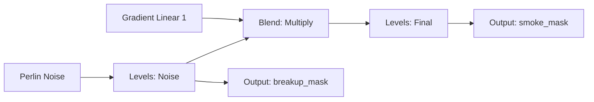

# 1. Назва

## Урок 06.04 — Substance graph basics: noises, gradients, Blend, Levels і masks

# 2. Результат уроку

Після уроку ти зможеш:

- пояснити package, graph, node, connection, input і output у Substance 3D Designer;
- відрізнити grayscale data від color data;
- створити resolution-independent compositing graph;
- використовувати `Gradient Linear 1` і `Perlin Noise`;
- комбінувати masks через atomic `Blend`;
- пояснити `Multiply`, `Add`, `Max` і `Min` у діапазоні 0–1;
- remap values через `Levels` без випадкового clipping;
- створити reusable smoke/breakup grayscale mask;
- налаштувати `Output` contract;
- підготувати graph до standard bitmap export у 06.05.

Ключовий результат — package `P_VFX_TextureLab.sbs` із graph `G_VFX_SmokeMask` та двома outputs: `smoke_mask` і `breakup_mask`.

# 3. Орієнтовний час

**5 годин: 1 година теорії та 4 години практики.**

| Частина | Час |
|---|---:|
| Ментальна модель graph і grayscale-математика | 1 год |
| Контрольовані експерименти | 40 хв |
| Керована побудова graph | 1 год 35 хв |
| Самостійні вправи | 1 год 20 хв |
| Самоперевірка й журнал | 25 хв |

# 4. Передумови

- Завершено 06.03.
- Є базова орієнтація в Substance 3D Designer UI.
- Material Foundations пройдено: 0–1, Multiply, Add, Clamp/remapping, grayscale masks.
- Установлену версію Substance 3D Designer записано.
- Не потрібен і не припускається жодний Substance plugin для Unreal Engine.

# 5. Нові терміни

| Термін | Пояснення |
|---|---|
| **Package** | `.sbs` container для graphs/resources |
| **Substance Compositing Graph** | Спрямований graph, що обчислює 2D images |
| **Node** | Operation або generator із inputs, outputs і parameters |
| **Connection** | Потік даних від output одного node до input іншого |
| **Grayscale** | Одноканальні image/data, зазвичай 0–1 |
| **Color** | Багатоканальне image; потрібне не для кожної mask |
| **Generator** | Node без image input, який генерує pattern/noise |
| **Atomic node** | Core operation, наприклад `Blend`, `Levels`, `Output` |
| **Relative to Parent** | Output size успадковується від graph/parent resolution |
| **Output Size** | Resolution calculation для node/graph |
| **Bit depth** | Точність зберігання або обчислення для кожного channel |
| **Tiling** | Безшовне повторення pattern по boundaries |
| **Histogram** | Розподіл values в image |
| **Clipping** | Втрата detail, коли values remap у pure 0 або 1 |
| **Output Identifier** | Stable name output для bitmap export contract |

# 6. Навіщо ця тема потрібна VFX-фахівцю

Substance Designer корисний не як заміна Photoshop, а як:

- швидкий generator noise/masks;
- відтворюваний graph, де scale/contrast легко змінити;
- source для seamless breakup, smoke, spark і допоміжних distortion textures;
- library, яку можна повторно згенерувати у 512/1024/2048 без repaint;
- спосіб запакувати кілька masks в один standard bitmap.

Але procedural graph не має цінності, якщо output:

- не читається у VFX material;
- має непотрібний тип color;
- clipping знищує gradient;
- pattern надто щільний;
- export залежить від неперевіреного plugin.

# 7. Теорія простими словами

Graph — це рецепт image:

```text
Gradient визначає large shape.
Noise додає variation.
Blend вирішує, як їх поєднати.
Levels вирішує, де black/gray/white.
Output дає stable export name.
```

Кожний connection має contract:

- який data type входить;
- який range;
- що означає black і white;
- чи image має tile;
- яка resolution потрібна.

Для VFX mask:

```text
black = effect відсутній / 0
white = effect повністю присутній / 1
gray = partial value
```

Значення може змінюватися, але його потрібно задокументувати.

# 8. Детальні технічні пояснення

## 8.1. Package і graph

Створи package `.sbs`, а в ньому `Substance Compositing Graph`. Package може містити кілька graphs, але beginner baseline — один цілеспрямований graph із чіткими outputs.

Іменування:

```text
Package: P_VFX_TextureLab.sbs
Graph: G_VFX_SmokeMask
```

Не називай `New_Graph` або `Output_1`.

## 8.2. Resolution

Для output size graph задай `Relative to Parent`, а для parent — початкове значення `1024×1024`.

Procedural generators можуть повторно генеруватися в інших resolutions, але:

- сприйняття pattern frequency відносно image може змінитися;
- warps/blurs можуть поводитися інакше;
- обсяг пам’яті export змінюється;
- фінальний результат mip/streaming в UE потрібно перевірити.

Використовуй preview 512 під час iteration, якщо graph повільний; повторно перевір у фінальному 1024.

## 8.3. Grayscale vs color

Atomic `Blend` очікує однаковий data type для Foreground і Background. З’єднання color із grayscale може спричинити помилку connection.

Для masks:

- зберігай grayscale якомога довше;
- не перетворюй на color без потреби;
- grayscale graph простіший і може дешевше обчислюватися в Designer.

Це performance під час authoring, а не гарантія runtime в UE.

## 8.4. `Gradient Linear 1`

Офіційний node створює плавний linear gradient від чорного до білого.

Використані parameters:

- `Tiling`: 1;
- `Rotation`: обери 0°/90°/180°/270°, щоб вирівняти fade.

Для smoke mask використовуй білий поблизу запланованого body/source і чорний біля межі dissolve. Якщо напрямок протилежний, поверни gradient або контрольовано інвертуй через output Levels, а не навмання.

Точні parameters/UI встановленого node потрібно звірити з актуальною документацією Adobe.

## 8.5. `Perlin Noise`

Офіційні parameters:

- `Scale`: integer density;
- `Disorder`: pattern displacement;
- `Disorder speed`;
- `Tile offset`;
- `Non-square expansion`.

Початкові значення:

```text
Scale = 5
Disorder = 0.35
```

Більший Scale створює щільнішу variation. Не використовуй дуже великий Scale для імітації white noise; обери відповідний node/pattern.

## 8.6. `Blend`

Inputs:

- `Foreground`;
- `Background`;
- опційний input `Opacity`;
- parameter `Opacity`;
- `Blending mode`.

Обидва основні inputs мають бути одного типу.

Для mask `gradient × noise`:

```text
Background = Gradient
Foreground = Noise
Blending mode = Multiply
Opacity = 1
```

Multiply:

```text
out = background × foreground
```

Біла область noise зберігає gradient, чорна — прибирає його.

## 8.7. Blend modes

Для `a,b ∈ [0,1]`:

```text
Multiply: a×b
Add: min(a+b, 1) for clamped image result
Max: max(a,b)
Min: min(a,b)
```

Приклади для `a=.6`, `b=.4`:

```text
Multiply=.24
Add=1.0 after clamp
Max=.6
Min=.4
```

Застосування:

- Multiply — вирізати одну mask іншою;
- Add — об’єднати energy/areas із ризиком clipping;
- Max — union зі збереженням яскравішого значення;
- Min — темніший відбір, подібний до intersection.

## 8.8. `Levels`

Parameters містять:

- `Level in low`;
- `Level in high`;
- `Level in mid`;
- `Level out low`;
- `Level out high`.

Початкові значення:

```text
in low = 0.20
in mid = 0.50
in high = 0.82
out low = 0
out high = 1
```

Підвищення `in low` переводить більше темних значень у чорний. Зниження `in high` переводить більше світлих значень у білий. Якщо вони надто зближуються, тонкі сірі деталі втрачаються через clipping.

## 8.9. Graph branches

Створи:

```text
Perlin Noise → Levels_Noise → Output_breakup
Gradient Linear 1 → Blend_Multiply.Background
Levels_Noise → Blend_Multiply.Foreground
Blend_Multiply → Levels_Final → Output_smoke
```

Одна branch noise керує і breakup output, і комбінацією smoke. Це просте повторне використання.

## 8.10. Output contract

Outputs:

```text
smoke_mask
breakup_mask
```

Кожен node `Output`:

- має унікальний Identifier;
- має grayscale output;
- має label/description зі значенням black/white;
- використовує Relative to Parent;
- не залежить від plugin UE.

Точні поля metadata залежать від версії Designer.

## 8.11. Debugging intermediate outputs

Перевір у preview:

1. Gradient окремо.
2. Noise окремо.
3. Levels noise.
4. Blend.
5. Фінальний Levels.

Якщо фінальний результат неправильний, не змінюй навмання кожен parameter. Знайди перший етап, де output відхиляється від очікування.

## 8.12. Seamless check

Perlin створено як procedural noise, але tiling фінального graph потрібно перевірити візуально після всіх operations.

Перевір:

- перегляд tiling 2×2;
- краї left/right/top/bottom;
- зміщення Tile Offset;
- gradient: directional gradient може навмисно не мати tiling уздовж однієї осі.

Smoke mask для one-shot card може не потребувати повного seamless tiling; breakup noise для panning зазвичай потребує.

## 8.13. Designer graph performance

- Використовуй grayscale, коли color не потрібен.
- Уникай зайвої високої resolution під час iteration.
- Обробка alpha в `Blend` не потрібна для grayscale.
- Висока кількість або scale patterns може сповільнити graph.
- Blurs/warps є важчими authoring nodes; пізніше додавай їх обережно.
- Швидкість обчислення graph не дорівнює безпосередньо runtime cost UE після bitmap export.

# 9. Візуальні або математичні приклади

## 9.1. Multiply table

| Gradient | Noise | Output |
|---:|---:|---:|
| 1.0 | 0.8 | 0.8 |
| 0.5 | 0.8 | 0.4 |
| 0.2 | 0.3 | 0.06 |
| 0.0 | 1.0 | 0.0 |

Gradient гарантує fade до чорного; noise розбиває внутрішню body.

## 9.2. Levels remap

Спрощена лінійна частина:

```text
out ≈ saturate((x - inLow) / (inHigh - inLow))
```

Для `inLow=.2`, `inHigh=.8`, `x=.5`:

```text
(.5-.2)/(.8-.2)=.3/.6=.5
```

`Level in mid` змінює curve навколо midtones, тому фактичний результат Levels може відрізнятися від простої лінійної моделі.

## 9.3. Graph diagram



## 9.4. Range check

Використовуй histogram/2D preview:

- усе чорне → range надто низький;
- усе біле → clipping;
- корисна mask → видимий чорний, сірий transition і білий core там, де потрібно.

# 10. Контрольовані експерименти

## Експеримент 1 — Scale

Дублюй `Perlin Noise`:

- Scale 2;
- Scale 5;
- Scale 12.

**Очікування:** більший Scale = щільніший pattern. Обирай відповідно до запланованого розміру particle/card.

## Експеримент 2 — Режими Blend

Ті самі gradient/noise:

- Multiply;
- Add;
- Max;
- Min.

**Очікування:** розуміти математику, а не обирати за візуальним вгадуванням.

## Експеримент 3 — Clipping у Levels

Варіанти:

- gentle `0.15/0.85`;
- medium `0.25/0.75`;
- hard `0.45/0.55`.

**Очікування:** жорсткий варіант втрачає сірі transitions і стійкість до banding.

## Експеримент 4 — Resolution

Переглянь 512 і 1024. Порівняй macro shape та edge.

**Очікування:** procedural graph генерується повторно, але фінальний вигляд усе одно потребує перевірки.

## Експеримент 5 — Tiling

Переглянь breakup 2×2 і smoke 2×2.

**Очікування:** breakup має повторюватися без seam; directional smoke gradient може навмисно не мати tiling уздовж осі fade.

# 11. Покрокова керована практика

## Етап 1 — Створи package

1. Створи новий package.
2. Збережи `P_VFX_TextureLab.sbs`.
3. Запиши версію Designer.

Точні формулювання menu залежать від установленої версії.

## Етап 2 — Створи graph

1. Додай `Substance Compositing Graph`.
2. Назви `G_VFX_SmokeMask`.
3. Використай порожній або базовий template без PBR channels.
4. Output size parent — 1024×1024.
5. Workflow Grayscale.

## Етап 3 — Додай gradient

1. Знайди точний node `Gradient Linear 1`.
2. `Tiling=1`.
3. Задай `Rotation` так, щоб біла body була біля source/bottom і згасала до top; перевір візуально.
4. Переглянь preview.

## Етап 4 — Додай noise

1. Знайди точний node `Perlin Noise`.
2. `Scale=5`.
3. `Disorder=0.35`.
4. Спочатку залиш tile offset 0,0.
5. Переглянь preview з tiling 2×2.

Точні types/ranges parameters залежать від установленої версії Designer.

## Етап 5 — Сформуй noise

1. Додай `Levels`.
2. З’єднай:

```text
Perlin Noise.Output → Levels_Noise.Input
```

3. Почни зі значень:

```text
Level in low=.20
Level in mid=.50
Level in high=.82
```

4. Збережи сірий transition; уникай жорсткої binary mask.

## Етап 6 — Multiply із gradient

1. Додай `Blend`.
2. З’єднай:

```text
Gradient Linear 1.Output → Blend.Background
Levels_Noise.Output → Blend.Foreground
```

3. Задай:

```text
Blending mode=Multiply
Opacity=1
```

4. Preview: чорний на кінці fade, розбита біло-сіра body.

## Етап 7 — Фінальний remap

1. Додай другий `Levels`.
2. Під’єднай Output Blend.
3. Почни з `in low=.08`, `in high=.90`, mid `.52`.
4. Порівняй до/після.
5. Не знищуй усі сірі значення.

## Етап 8 — Outputs

Додай два nodes `Output`:

```text
Levels_Noise.Output → Output_breakup
Levels_Final.Output → Output_smoke
```

Identifiers:

```text
breakup_mask
smoke_mask
```

Налаштуй metadata grayscale/color відповідно до контракту.

## Етап 9 — Проміжні labels

Перейменуй nodes:

```text
N_Gradient_Fade
N_Perlin_Base
L_Noise_Contrast
B_Gradient_Multiply
L_Final_Range
O_BreakupMask
O_SmokeMask
```

Фактичне іменування instances стосується організації graph, а не точного type node.

## Етап 10 — Перевірка

Checklist:

- значення black/white для output задокументовано;
- breakup має tiling;
- smoke має запланований напрямок fade;
- немає помилок type color/grayscale;
- виконано порівняння 512/1024;
- жоден output не має повного clipping;
- identifiers унікальні.

Поки не виконуй export, крім опційного preview; стандартний workflow export розглянуто в 06.05.

# 12. Точні назви вузлів, модулів і налаштувань

### Substance 3D Designer

- `Substance Compositing Graph`
- `Gradient Linear 1`
- `Perlin Noise`
- `Blend`
- `Levels`
- `Output`
- `Foreground`
- `Background`
- `Opacity`
- `Blending mode`
- `Multiply`
- `Add (Linear dodge)`
- `Max (Lighten)`
- `Min (Darken)`
- `Level in low`
- `Level in mid`
- `Level in high`
- `Level out low`
- `Level out high`
- `Identifier`
- `Output Size`
- `Relative to Parent`

Точні шляхи menu, групування properties і labels залежать від установленої версії Designer. Звір їх з актуальною документацією Adobe.

### Unreal Engine

Import в UE не потрібен до 06.05. Наявність жодного plugin не припускається.  
**Потребує ручної перевірки в Unreal Engine 5.8.**

# 13. Стартові значення параметрів

| Параметр | Початкове значення |
|---|---:|
| Graph size | 1024×1024 |
| Розмір preview | 512 або 1024 |
| Data type | Grayscale |
| Gradient Tiling | 1 |
| Gradient Rotation | Обери перевірений напрямок fade |
| Perlin Scale | 5 |
| Perlin Disorder | 0.35 |
| Blend mode | Multiply |
| Blend Opacity | 1 |
| Noise Levels in | .20/.50/.82 |
| Final Levels in | .08/.52/.90 |
| Output identifiers | `breakup_mask`, `smoke_mask` |

# 14. Очікуваний результат кожного етапу

| Етап | Результат |
|---|---|
| Package | Збережений `.sbs` |
| Graph | Сфокусований grayscale compositing graph |
| Gradient | Чіткий спрямований fade 0→1 |
| Perlin | Seamless variation середнього масштабу |
| Noise Levels | Чорно-сіро-білий breakup |
| Multiply | Noise обмежено gradient |
| Фінальний Levels | Контрольовані body/edge без надмірного clipping |
| Outputs | Два унікальні grayscale-контракти |
| Перевірка | Проміжні етапи зрозумілі |

# 15. Самостійна вправа

## EX-L06-04-A — Procedural-дослідження двох masks

**Завдання:** створи two-output graph для `soft_smoke_mask` і `hard_breakup_mask`.

**Обмеження:**

- лише `Gradient Linear 1`, один затверджений noise, `Blend`, `Levels`, `Output`;
- лише grayscale;
- той самий base noise використано повторно;
- soft output зберігає 25–75% сірих transitions;
- hard output має чіткі islands, але не складається лише з чистого black/white;
- identifiers/naming задокументовано;
- без bitmap inputs.

**Матеріали для здачі:**

- `.sbs`;
- screenshot graph;
- аркуш проміжних preview;
- порівняння 512/1024;
- таблиця значень black/white.

**Критерії приймання:**

- outputs помітно відрізняються;
- connections пояснено математично;
- немає помилки type;
- немає випадкового clipping;
- tiling breakup перевірено.

# 16. Додаткова складніша вправа

## EX-L06-04-B — Аркуш доказів для режимів Blend

**Завдання:** побудуй one graph branch, що показує identical gradient/noise через Multiply, Add, Max і Min.

**Обмеження:**

- ті самі inputs;
- та сама resolution;
- без post-Levels до порівняння;
- вручну взяти sample п’яти пар pixel/value;
- пояснити, коли кожен режим допомагає VFX masks;
- не обирати режим лише за виглядом.

**Матеріали для здачі:**

- чотири outputs;
- таблиця обчислення values;
- таблиця use/avoid;
- один обраний режим для smoke mask з обґрунтуванням.

**Критерії приймання:**

- математика відповідає режиму;
- ризик clipping для Add визначено;
- відмінність Max/Min пояснено правильно;
- обраний режим відповідає запланованій mask.

# 17. Три рівні підказок

## EX-L06-04-A

- **Hint 1 — напрямок мислення:** reuse one noise, then shape one branch softly and one more tightly.
- **Hint 2 — потрібні інструменти:** Gradient Linear 1, Perlin Noise, two Levels branches, Multiply Blend, two Outputs.
- **Hint 3 — майже повна структура:** Perlin→LevelsSoft and LevelsHard; Gradient×LevelsSoft→soft Output; LevelsHard→hard Output; soft in .12/.5/.9, hard .35/.5/.68.

[Повне рішення EX-L06-04-A](../EXERCISE_ANSWERS/L06-04_substance_graphs_noise_gradients_and_masks_answers.md#ex-l06-04-a)

## EX-L06-04-B

- **Hint 1 — напрямок мислення:** calculate one pair before looking at images.
- **Hint 2 — потрібні інструменти:** four Blend nodes with same Foreground/Background, modes Multiply/Add/Max/Min, four Outputs.
- **Hint 3 — майже повна структура:** for a=.6,b=.4 outputs .24/1.0/.6/.4; repeat for a=.2,b=.8 and a=.9,b=.3, then map use cases.

[Повне рішення EX-L06-04-B](../EXERCISE_ANSWERS/L06-04_substance_graphs_noise_gradients_and_masks_answers.md#ex-l06-04-b)

# 18. Типові помилки

1. Color node під’єднано до grayscale input Blend.
2. Names Output загальні або дублюються.
3. Sliders Levels змінено без розуміння range.
4. Жорсткий clipping прибирає корисний transition.
5. Дуже великий Scale noise використано як white noise.
6. Resolution graph залишається високою під час кожної iteration.
7. Напрямок Gradient протилежний запланованому flow UV/material.
8. Перевірено лише фінальний output, а проміжні nodes проігноровано.
9. Tiling припускається, а не тестується.
10. Graph побудовано на припущенні про plugin UE/SBSAR.

# 19. Усунення несправностей

| Симптом | Причина | Виправлення |
|---|---|---|
| Червоне або пунктирне connection | Невідповідність color/grayscale | Зберегти однаковий type обох inputs Blend |
| Output повністю чорний | Input/range Multiply надто низький | Перевірити gradient/noise, послабити Levels |
| Output повністю білий | Clipping Add/Levels | Перевірити histogram, розширити range |
| Noise надто дрібний | Scale надто високий | Знизити Scale для запланованого розміру card |
| Gradient перевернуто | Неправильні Rotation/orientation | Повернути на перевірений крок 90° або контрольовано інвертувати |
| Seam breakup видно у 2×2 | Branch/operation без tiling | Перевірити generator/offset/operation |
| Smoke схожий на випадковий static | Немає macro gradient/body | Посилити gradient і знизити contrast noise |
| Graph повільний | Висока resolution/pattern density | Знизити resolution preview, прибрати непотрібні nodes |
| Output згодом відсутній під час export | Metadata Identifier/output | Унікальні node Output та Identifier |

# 20. Міркування щодо performance

### Designer authoring

- Grayscale уникає непотрібної обробки color.
- Менший розмір preview пришвидшує iteration.
- Високий Scale або count pattern може сповільнити generation.
- Обробка alpha у Blend не потрібна для grayscale.
- Зберігай branches graph видимими й придатними до повторного використання.

### UE runtime after bitmap export

- Кількість nodes graph не потрапляє до поставки, коли імпортуються лише bitmap-файли.
- Runtime cost залежить від dimensions/format/channels експортованої texture і sampling material, а не від складності graph Designer.
- Одну grayscale mask згодом можна запакувати, щоб зменшити кількість texture samples, але packing має обмеження color-space/compression.
- Жодний plugin Substance не потрібен і не припускається.
- Фінальні texture memory/mips вимірюються в UE 5.8.

# 21. Запитання для самоперевірки

1. Що зберігає `.sbs` package?
2. Чому VFX masks краще тримати grayscale?
3. Що робить Multiply?
4. Чому Add може clip?
5. Чим Max відрізняється від Add?
6. Що змінює `Level in low`?
7. Навіщо preview intermediate nodes?
8. Чому graph complexity не дорівнює UE runtime cost після bitmap export?
9. Чому breakup і smoke можуть мати різні tiling requirements?

# 22. Відповіді

1. Procedural graphs/resources і source parameters.
2. Не потрібні зайві channels/type conversions; meaning 0–1 простіший.
3. Множить corresponding values, тому black одного input вирізає output.
4. Sum може перевищити 1 і clamp to white, втрачаючи detail.
5. Max бере higher input value, а Add сумує.
6. Values at/below threshold map toward black, збільшуючи dark clipping.
7. Щоб знайти перший branch, де result стає неправильним.
8. UE отримує rendered pixels; runtime визначають texture/material settings.
9. Breakup може panning/tile; one-shot smoke fade intentionally non-tiling along one axis.

# 23. Checklist самоперевірки

- [ ] Версію Designer записано.
- [ ] Names package/graph точні.
- [ ] Graph використовує grayscale.
- [ ] Resolution задокументовано.
- [ ] Напрямок Gradient задано навмисно.
- [ ] Scale Perlin обґрунтовано.
- [ ] Inputs Blend мають однаковий type.
- [ ] Математика Multiply зрозуміла.
- [ ] Levels не знищує всі сірі значення.
- [ ] Проміжні previews збережено.
- [ ] Tiling breakup перевірено.
- [ ] Fade smoke перевірено.
- [ ] Outputs мають унікальні identifiers.
- [ ] Немає залежності від plugin.
- [ ] Порівняння 512/1024 записано.

# 24. Критерії опанування

Урок засвоєно, якщо:

1. graph можна відтворити зі списку nodes;
2. кожен connection/input/output пояснено;
3. дві masks відрізняються завдяки навмисній логіці Levels/Blend;
4. режими Blend обчислено правильно;
5. немає невідповідності color/grayscale;
6. outputs мають стабільні контракти;
7. наявність plugin не припускається;
8. пройдено щонайменше 13 із 15 пунктів checklist.

# 25. Підсумок

Substance graph — контрольований 0–1 image pipeline. Gradient дає macro direction, noise — variation, Blend — математику combination, Levels — range, Output — delivery contract. Beginner goal — не «складний procedural art», а reproducible VFX masks, які зрозуміло перевірити.

# 26. Зв’язок із наступними уроками

У `05_procedural_texture_library_and_ue_validation.md` ти додаси `Directional Warp`, `Distance`, `Tile Generator`, `RGBA Merge`, створиш reusable library, експортуєш standard PNG/TGA files і перевіриш channels/material behavior у UE 5.8 без стороннього plugin.

# 27. Офіційні джерела

- Adobe. [Substance 3D Designer User Guide](https://experienceleague.adobe.com/en/docs/substance-3d-designer/using/home).
- Adobe. [Substance Compositing Graph Key Concepts](https://experienceleague.adobe.com/en/docs/substance-3d-designer/using/substance-graphs/substance-compositing-graph-key-concepts).
- Adobe. [Gradient Linear 1](https://experienceleague.adobe.com/en/docs/substance-3d-designer/using/substance-graphs/nodes-reference-for-substance-graphs/node-library/texture-generators/patterns/gradient-linear-1).
- Adobe. [Perlin Noise](https://experienceleague.adobe.com/en/docs/substance-3d-designer/using/substance-graphs/nodes-reference-for-substance-graphs/node-library/texture-generators/noises/perlin-noise).
- Adobe. [Blend](https://experienceleague.adobe.com/en/docs/substance-3d-designer/using/substance-graphs/nodes-reference-for-substance-graphs/atomic-nodes/blend/blend).
- Adobe. [Levels](https://experienceleague.adobe.com/en/docs/substance-3d-designer/using/substance-graphs/nodes-reference-for-substance-graphs/atomic-nodes/levels).
- Adobe. [Performance Optimization Guidelines](https://experienceleague.adobe.com/en/docs/substance-3d-designer/using/best-practices/performance-optimization-guidelines).

# 28. Рекомендовані скриншоти або схеми

```text
Рекомендований скриншот 1:
Що відкрити: full G_VFX_SmokeMask graph.
Що повинно бути видно: Gradient, Perlin, Levels, Blend, two Outputs.
Яку область виділити: data flow and node labels.
```

```text
Рекомендована схема 2:
Що показати: Multiply values table.
Що повинно бути видно: gradient×noise at four sample points.
Яку область виділити: why black removes and white preserves.
```

```text
Рекомендований скриншот 3:
Що відкрити: Levels before/after previews.
Що повинно бути видно: gentle, medium, clipped versions.
Яку область виділити: gray detail lost by clipping.
```

```text
Рекомендований скриншот 4:
Що відкрити: 2×2 tiling preview breakup and smoke.
Що повинно бути видно: breakup seamless, smoke directional fade.
Яку область виділити: intentional vs accidental seam.
```

```text
Рекомендована схема 5:
Що показати: Designer graph → standard bitmap → UE texture.
Що повинно бути видно: no runtime graph/plugin dependency.
Яку область виділити: separation authoring cost vs runtime texture cost.
```
