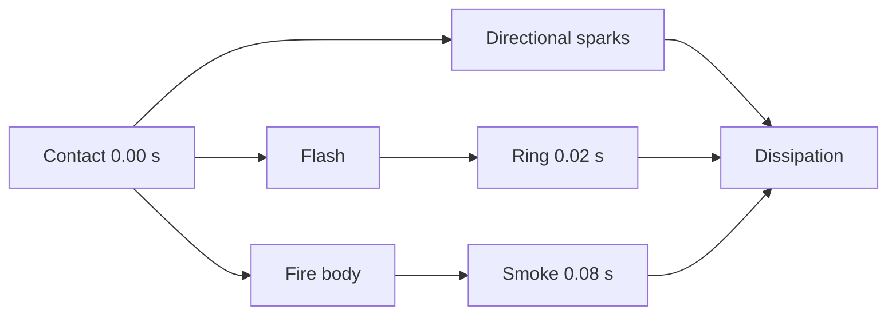

# 1. L09-01 — Fire language: hit spark і melee impact

| Поле | Значення |
|---|---|
| Блок | 09 — Effect Archetypes |
| ID уроку | L09-01 |
| Реєстр архетипів | #01 hit spark; #02 melee impact |
| Elemental language | Fire: звужені язики, вибухове розширення, підйом, гаряче ядро → помаранчевий край → темний післяслід |
| Артефакт | Триетапний проєкт **Stylized Impact**, `NS_L09_Fire_Impact` |
| Mastery gate | Reference-informed, але повністю original impact з доказами з гри та даними про продуктивність |

## 2. Результат уроку

Ви зможете:

- реконструювати технічний hit spark і layered melee impact;
- розкласти impact на flash, directional sparks, expanding ring, fire body та residue;
- провести етичний аналіз референсів без extraction, tracing або копіювання assets;
- створити original variation, де змінені shape, timing, motion і color, а не лише palette;
- зібрати Niagara stacks, materials, textures, mesh/data contracts і bindings;
- підготувати High/Medium/Low variants без втрати contact cue;
- оформити перший portfolio-process artifact **Stylized Impact**.

## 3. Орієнтовний час

| Частина | Теорія | Практика | M/S practice |
|---|---:|---:|---:|
| Аналіз impact/Fire | 1.0 | 0.0 | 0.0 |
| Етап 1 — технічна реконструкція | 0.25 | 2.0 | 0.5 |
| Етап 2 — етичний аналіз референсів | 0.25 | 1.5 | 0.0 |
| Етап 3 — оригінальна варіація | 0.0 | 1.5 | 0.5 |
| Gameplay/performance перевірка | 0.0 | 0.5 | 0.0 |
| **Разом** | **1.5** | **5.5** | **1.0** |

## 4. Передумови

| Потрібно | Де | Перевірка |
|---|---|---|
| G08 Niagara Advanced | [Оцінювання блоку 08](../08_NIAGARA_ADVANCED/BLOCK_ASSESSMENT.md) | User parameters, renderer bindings, bounds |
| Робочий зошит стихій | [L02-04](../02_VFX_DESIGN/04_elemental_style_language_workbook.md) | Правила форми, руху й таймінгу Fire |
| Таймінг impact | [L02-03](../02_VFX_DESIGN/03_timing_motion_and_animation_phases.md) | Кадр контакту, дія, розсіювання |
| Original textures | [Block 05](../05_PHOTOSHOP_VFX_TEXTURES/BLOCK_ASSESSMENT.md) | Spark, smoke/noise, ramp із provenance |
| VFX meshes | [Block 06](../06_BLENDER_AND_SUBSTANCE/BLOCK_ASSESSMENT.md) | Ring/card mesh із clean UV/pivot |

## 5. Нові терміни

| Термін | Пояснення |
|---|---|
| Contact cue | Найшвидший visual signal точної точки удару |
| Hit spark | Короткий малий impact archetype із flash і directional streaks |
| Melee impact | Layered contact effect, що передає силу, напрям і material/element |
| Primary action | Найбільша shape/motion подія після contact |
| Residue | Повільний low-contrast післяслід |
| Directional bias | Нерівномірний розподіл уздовж attack/normal direction |
| Reference abstraction | Вимірювання відносин, не копіювання pixels/assets |
| Provenance record | Таблиця походження кожного texture/mesh/reference |

## 6. Навіщо ця тема потрібна VFX-фахівцю

Impact є найкоротшим тестом усієї VFX дисципліни: contact має збігтися з gameplay, silhouette читатися за кілька frames, а overdraw не повинен перекривати персонажів. Fire додає rise й thermal breakup, але не скасовує directional force удару.

**Reference ethics:** дозволено вивчати frame count, layer order, відносний scale, напрям і contrast. Заборонено витягувати textures/meshes/audio з гри, трасувати frames, копіювати чужий sigil/shape або видавати recolor за original. У System використовуються тільки власні assets студента з Blocks 05–06.

## 7. Теорія простими словами

Impact читається як п’ять дієслів:

```text
торкнувся → спалахнув → розлетівся → піднявся → згас
```

- Flash відповідає «де».
- Sparks відповідають «у якому напрямку й наскільки сильно».
- Ring відповідає «який radius сили».
- Fire body відповідає «яка стихія».
- Residue відповідає «що лишилося».

Fire language не є orange tint: shapes звужуються, motion має швидкий expansion та upward drift, timing має гарячий короткий core і довший темний tail.

## 8. Детальні технічні пояснення

### Три обов’язкові stages

1. **Technical archetype reconstruction.** З чистого System відтворіть мінімальний hit spark і melee stack за числовим brief нижче.
2. **Reference study.** Оберіть один legal-viewable impact reference; запишіть лише normalized observations: contact=0, peak scale, duration ratios, direction cone, layer overlap. Усі render assets створіть самі.
3. **Original variation.** Змініть одночасно:
   - форма: круглий burst → роздвоєний/трикутний ковальський мотив;
   - таймінг: один pulse → короткий подвійний pulse;
   - рух: радіальний → зміщена вгору спіраль;
   - колір: білий-помаранчевий-червоний → білий-золотий-cyan-вугільний.

Palette-only variation не приймається.

### Контракт timing

Для reference на 60 fps:

```text
Flash      0–5 frames
Core       0–14
Sparks     0–28
Ring       1–18
Smoke      5–60
```

Frame counts є design grid, не runtime dependency. Niagara працює в seconds.

### Базис напрямку

`User.ImpactNormal` задає hemisphere; `User.AttackDirection` задає tangent bias. Якщо vectors не normalized, speed/rotation logic стає нестабільною. Normalize у caller або validated module.

## 9. Візуальні й математичні приклади

Оцінка кількості particles:

```text
Hit flash 1 + core 6 + sparks 18 + ring 1 + smoke 8 = 34 particles
```

Напрямлений spark:

```text
V = normalize(lerp(RandomHemisphere(ImpactNormal), AttackDirection, 0.65))
    × RandomRange(550,1100)
```

Scale by `User.ImpactScale=1.25`: 120 cm flash becomes 150 cm; lifetime не масштабуйте автоматично.



## 10. Контрольовані експерименти

### CE09-01-A — Затримка contact

- Spawn-ніть System у позначеній точці удару.
- Змініть Flash Spawn Time на `0`, `0.033`, `0.066 s`.
- Зафіксуйте camera й animation.
- Очікування: навіть 2–4 frames delay послаблюють contact.

### CE09-01-B — Radial проти directional

- A: сферичний velocity.
- B: hemisphere навколо `ImpactNormal`, змішана на 65% з `AttackDirection`.
- Приховайте labels A/B, застосуйте детермінований порядок за номером спроби, відкладіть captures до наступного review pass і до розкриття labels самостійно запишіть attack direction у B; optional peer review може лише повторити цю перевірку.

### CE09-01-C — Fire identity без color

- Задайте всім renderer colors білий.
- Порівняйте generic radial і fire variant.
- Fire має лишатися впізнаваним через tapered sparks, upward body, curl і dark residue timing.

## 11. Покрокова керована практика

### Етап 1 — технічна реконструкція

1. Створіть `NS_L09_Fire_Impact` і five emitters: `NE_Flash`, `NE_CoreFire`, `NE_Sparks`, `NE_Ring`, `NE_Smoke`.
2. Відкрийте `User.ImpactNormal`, `User.AttackDirection`, `User.ImpactScale`, `User.PrimaryColor`, `User.SecondaryColor`, `User.RandomSeed`.
3. Побудуйте stacks із section 12; у всіх emitters `Local Space=Off`, бо impact lives in world.
4. Flash: 1 sprite, `0.08 s`, розмір `120→20 cm`.
5. Core: burst 6, `0.18–0.28 s`, cone speed `250–550 cm/s`, bias угору.
6. Sparks: burst 18, `0.25–0.55 s`, швидкість `550–1100`, gravity `−500`, drag `1.8`.
7. Ring: один `SM_VFX_Ring_16`, scale `0.15→1.35`, lifetime `0.30`.
8. Smoke: burst 8 після `0.08 s`, lifetime `0.6–1.0`, speed `50–120`, curl/noise strength `35`.
9. Прив’яжіть colors/material parameters і перевірте на black/gray/bright backgrounds та gameplay camera.

### Етап 2 — етичний аналіз референсів

1. Запишіть назву reference, source link, власника й дату спостереження.
2. Створіть таблицю timing/layer на п’ять рядків; screenshots не додавайте до вихідних ресурсів, extraction заборонено.
3. Запишіть три абстрактні спостереження, наприклад `spark cone ≈ 70°`, `ring peak ≈ 1.4× character torso`, `residue lasts ≈ 3× flash`.
4. Відтворіть відносини зі своїми textures/mesh/material.
5. Додайте provenance table: кожний asset посилається на ваш course source.

### Етап 3 — оригінальна варіація

1. Duplicate-ніть як `NS_L09_Fire_Impact_Forge`.
2. Shape: замініть round core трьома forked slash sprites.
3. Timing: другий mini-flash у `0.10 s`, 45% size першого.
4. Motion: sparks рухаються spiral `20–35°` навколо normal і піднімаються.
5. Колір: біло-золоте ядро, вторинний cyan edge, вугільний smoke.
6. Створіть side-by-side capture technical/reference/original з однаковою camera.

Потребує ручної перевірки в Unreal Engine 5.8. Exact Niagara module names, stack categories, renderer properties, bindings, Blueprint spawn pins і deterministic seed controls звірте у встановленому build.

## 12. Точна структура Niagara: стеки, матеріали, ресурси, дані й привʼязки

### Дані System/User

```text
User.ImpactNormal    Vector3 = (0,0,1)
User.AttackDirection Vector3 = (1,0,0)
User.ImpactScale     Float   = 1.0
User.PrimaryColor    LinearColor = (8.0,2.2,0.15,1)
User.SecondaryColor  LinearColor = (1.0,0.08,0.01,1)
User.RandomSeed      Int = 901
```

### `NE_Flash`

```text
Emitter Properties: CPU Sim, Local Space Off, Determinism On
Emitter Update: Spawn Burst Instantaneous Count 1, Spawn Time 0
Particle Spawn:
  Initialize Particle: Lifetime .08, Sprite Size (120,120) × User.ImpactScale
  Set Variables: Particles.Color = User.PrimaryColor
Particle Update:
  Particle State
  Scale Sprite Size: curve (0,1.0),(.35,1.2),(1,0.15)
  Scale Color/Alpha: alpha (0,1),(.55,.8),(1,0)
Render: Sprite Renderer, Material M_VFX_Fire_Flash
Bindings: Color←Particles.Color; SpriteSize←Particles.SpriteSize
```

### `NE_CoreFire`

```text
Spawn Burst Count 6
Initialize: Lifetime random .18–.28; Sprite Size 35–70
Shape Location: Sphere Radius 8
Add Velocity: cone around ImpactNormal, 250–550
Particle Update: Particle State → Curl Noise Force 35 → Drag 5
  → Solve Forces and Velocity → Scale Sprite Size → Scale Color
Sprite Renderer: M_VFX_Fire_Body
```

### `NE_Sparks`

```text
Spawn Burst Count 18
Initialize: Lifetime .25–.55; Sprite Size X 4–8, Y 32–70
Add Velocity in Cone: 550–1100, angle 35°, basis AttackDirection/ImpactNormal
Update: Gravity Force (0,0,-500) → Drag 1.8 → Solve Forces and Velocity
Sprite Renderer: Alignment/Orientation = velocity-facing candidate
Material: M_VFX_Fire_Streak
```

### `NE_Ring` / `NE_Smoke`

```text
NE_Ring:
  Burst 1; Lifetime .30; Mesh Scale .15
  Scale Mesh Size curve .15→1.35; Alpha 1→0
  Mesh Renderer: SM_VFX_Ring_16, M_VFX_Fire_Ring

NE_Smoke:
  Burst 8 at .08; Lifetime .6–1.0; Sprite 35–80
  Sphere Radius 15; Velocity 50–120 with +Z bias
  Curl Noise Force 35 → Drag 2 → Solve Forces and Velocity
  Sprite Renderer: M_VFX_Smoke_Translucent
```

### Контракт material graph

```text
TextureSample_Fire.R × ParticleColor.A → Opacity
TextureSample_Fire.R × ParticleColor.RGB → Multiply_Color
Multiply_Color × ScalarParameter_Emissive(6) → Emissive Color
```

Assets: власні `T_Spark_Star_512`, `T_Smoke_Seamless_512`, `T_Ramp_Energy_256x16`, `SM_VFX_Ring_16`. Extracted reference assets відсутні.

Потребує ручної перевірки в Unreal Engine 5.8. Exact orientation/alignment enum names, curve module inputs, parameter namespace and renderer binding labels звірте у встановленому build.

## 13. Стартові значення

| Параметр | Старт | Діапазон дослідження |
|---|---:|---:|
| ImpactScale | 1.0 | 0.6–1.6 |
| Flash lifetime/size | .08 s / 120 cm | .05–.12 / 80–180 |
| Core count | 6 | 3–10 |
| Spark count/speed | 18 / 550–1100 | 8–28 / 350–1400 |
| Ring lifetime/scale | .30 / .15→1.35 | .18–.45 / .8–1.8 |
| Smoke count/lifetime | 8 / .6–1.0 | 0–12 / .4–1.4 |
| Emissive | 6 | 2–12 |
| Bounds test radius | 250 cm | виміряний |

## 14. Очікуваний результат кожного етапу

| Етап | Докази |
|---|---|
| Technical hit spark | Contact читається ≤0.1 s, direction obvious |
| Technical melee impact | П’ять functions нашаровано без opaque blob |
| Reference study | Metrics/provenance, copied assets відсутні |
| Original shape | Forked silhouette, не round recolor |
| Original timing | Виразний double pulse |
| Original motion | Upward spiral, не лише radial |
| Original color | Нове four-stop relationship |
| Performance pass | H/M/L captures і bounds evidence |

## 15. Самостійна вправа A

### EX-L09-01-A — Мінімальний спрямований hit spark

З clean System зробіть #01 hit spark із максимум 3 emitters і 24 particles.

- contact flash ≤0.09 s;
- attack direction розпізнається на white-material capture;
- лише власні textures;
- User controls для normal, direction, scale, colors;
- deliverables: stacks, 60 fps capture, bounds і Medium/Low variants.

## 16. Додаткова складніша вправа B

### EX-L09-01-B — Оригінальний ковальський melee impact

Пройдіть три stages для #02 melee impact.

- ethical reference sheet із normalized observations;
- original variation змінює forked shape, double-pulse timing, spiral-up motion і color relationship;
- максимум 5 emitters у Medium, 3 у Low;
- acceptance: gameplay camera визначає contact і fire/forge identity без labels.

## 17. Три підказки для кожної вправи

### EX-L09-01-A

1. **Hint 1:** flash позначає contact; velocity-aligned streaks показують direction.
2. **Hint 2:** використайте Flash, Sparks і optional tiny Core; змістіть velocity до AttackDirection.
3. **Hint 3:** Burst 1 flash `.08 s`; Burst 16 streaks `.25–.45 s`, `600–1000 cm/s`, cone 30°; white capture має й далі вказувати вздовж attack.

[Повне рішення EX-L09-01-A](../EXERCISE_ANSWERS/L09-01_fire_impact_language_answers.md#ex-l09-01-a)

### EX-L09-01-B

1. **Hint 1:** reference дає ratios, а не assets; variation потребує чотирьох незалежних змін.
2. **Hint 2:** forked cards для shape, delayed mini-flash для timing, tangential/up velocity для motion, новий ramp для color.
3. **Hint 3:** duplicate technical System; замініть Core на 3 forked sprites; second flash у `.10 s` і `.45 scale`; поверніть velocity на 25° навколо normal; gold→cyan→charcoal ramp.

[Повне рішення EX-L09-01-B](../EXERCISE_ANSWERS/L09-01_fire_impact_language_answers.md#ex-l09-01-b)

## 18. Типові помилки

| Помилка | Симптом | Виправлення |
|---|---|---|
| Reference extraction | Чужа texture/mesh у project | Видалити, recreate own asset, provenance audit |
| Варіант лише палітри | Той самий силует/таймінг | Чекліст варіації за чотирма осями |
| Flash запізнюється | Hit feels soft | Spawn at contact frame |
| Сферичний velocity | Напрямок неясний | Hemisphere + зміщення AttackDirection |
| Все additive white | No hierarchy | Separate value/color/opacity curves |
| Smoke перекриває контакт | Удар каламутний | Затримайте або зменште opacity/size |
| Завеликі фіксовані bounds | Поганий culling | Виміряйте повну траєкторію |
| Low tier прибирає Flash | Втрачено ігровий сигнал | Збережіть контакт, приберіть residue/detail |

## 19. Пошук несправностей

| Симптом | Діагностика | Рішення |
|---|---|---|
| System має offset | Покажіть impact point/axes | World/local-space і caller transform |
| Sparks дивляться неправильно | Velocity debug | Renderer alignment/basis |
| Ring вертикальний | Mesh pivot/rotation | Виправте import/orientation |
| Colors clamp-яться | Unlit material preview | HDR values, tone mapper, ramp |
| Pop зникає | Bounds visualization | Перевірте max speed/lifetime/WPO |
| Random result заважає A/B | Seed/restart | Determinism і записаний seed |
| Reference надто схожий | Silhouette/timing overlay | Забезпечте four-axis delta |

## 20. Продуктивність і рівні High/Medium/Low

| Рівень | Emitters/counts | Збережений візуальний зміст |
|---|---|---|
| High | Flash 1, Core 6, Sparks 18, Ring 1, Smoke 8 | Повні контакт, напрямок, вогняне тіло й residue |
| Medium | Flash 1, Core 4, Sparks 10, Ring 1, Smoke 4 | Контакт/напрямок/fire; менше residue |
| Low | Flash 1, Sparks 6, Ring 1 | Контакт/напрямок/радіус; без smoke/core cloud |

- Профілюйте concurrency: 1, 8 і 20 impacts за однакових camera/build.
- Перевірте shader complexity/quad overdraw для overlap flash, smoke і ring.
- Material sample count і transparent padding можуть бути важливішими за один particle count.
- Bounds мають охоплювати траєкторію найшвидшого spark і WPO.
- Low tier ніколи не прибирає exact contact cue.
- Exact Effect Type thresholds тут не задаються: потрібне target measurement.

Потребує ручної перевірки в Unreal Engine 5.8. Exact bounds visualization, Niagara performance counters, renderer-cost view and scalability override UI звірте у встановленому build.

## 21. Запитання для самоперевірки

1. Які archetypes закриває урок?
2. Яка layer function має найменшу latency?
3. Чому fire language не дорівнює orange tint?
4. Що дозволено брати з reference?
5. Які чотири axes має змінити original variation?
6. Чому ImpactNormal і AttackDirection різні?
7. Що обов’язково лишається в Low tier?
8. Як довести, що result не є palette-only copy?

## 22. Відповіді

1. #01 hit spark і #02 melee impact.
2. Contact flash.
3. Її визначають tapered shape, expansion/rise/curl motion і hot-to-residue timing.
4. Abstract ratios, layer roles, timing and direction observations; не assets/pixels.
5. Shape, timing, motion і color.
6. Normal задає surface hemisphere, direction — attack tangent/bias.
7. Immediate contact flash і directional/radius cue.
8. Side-by-side white captures, timing plot, motion paths і color ramp показують four independent changes.

## 23. Чекліст самоперевірки

- [ ] Archetypes #01–02 внесено в ledger.
- [ ] Усі textures/meshes мають own provenance.
- [ ] Technical stack відтворено з clean System.
- [ ] Reference observations normalized, extraction відсутній.
- [ ] Original змінює shape/timing/motion/color.
- [ ] Gameplay camera й 60 fps capture готові.
- [ ] User data/bindings документовано.
- [ ] H/M/L variants compile-яться й зберігають contact.
- [ ] Bounds/докази продуктивності збережено.
- [ ] M/S worklog містить 1.0 годину.

## 24. Критерії опанування

1. Hit spark contact читається в first frames.
2. Melee impact має directional bias і five layer roles.
3. Fire identity проходить white-material test.
4. Reference ethics/provenance пройдено.
5. Original variation відрізняється по four axes.
6. Exact stacks, assets, data і bindings задокументовано.
7. H/M/L зберігають ігрову підказку.
8. Щонайменше 7/8 відповіді самоперевірки правильні.

## 25. Підсумок

- Impact починається з contact and direction, потім element.
- Fire language поєднує taper, explosive rise і residue.
- Reference study аналізує relationships, не копіює assets.
- Original variation змінює four axes.
- H/M/L скорочують detail, а не meaning.
- **Stylized Impact** є першим three-stage portfolio process artifact.

## 26. Зв’язок із наступними уроками

У [L09-02](02_water_projectile_language.md) contact layering перетвориться на moving projectile: head визначатиме gameplay position, а trail — history motion. Збережіть User color/scale conventions, provenance sheet і H/M/L comparison layout.

## 27. Офіційні джерела

- [NIA-01 — Creating Visual Effects in Niagara](https://dev.epicgames.com/documentation/en-us/unreal-engine/creating-visual-effects-in-niagara-for-unreal-engine) — Epic Games, UE 5.8, доступ 2026-07-27.
- [NIA-05 — System and Emitter Module Reference](https://dev.epicgames.com/documentation/en-us/unreal-engine/system-and-emitter-module-reference-for-niagara-effects-in-unreal-engine) — Epic Games, UE 5.8, доступ 2026-07-27.
- [NIA-06 — Render Module Reference](https://dev.epicgames.com/documentation/en-us/unreal-engine/render-module-reference-for-niagara-effects-in-unreal-engine) — Epic Games, UE 5.8, доступ 2026-07-27.
- [NIA-07 — Niagara System Settings Reference](https://dev.epicgames.com/documentation/en-us/unreal-engine/system-settings-reference-for-niagara-effects-in-unreal-engine) — Epic Games, UE 5.8, доступ 2026-07-27.
- [BP-01 — Spawn System at Location](https://dev.epicgames.com/documentation/en-us/unreal-engine/BlueprintAPI/Niagara/SpawnSystematLocation) — Epic Games, UE 5.8, доступ 2026-07-27.
- [PERF-01 — Measuring Performance in Niagara](https://dev.epicgames.com/documentation/en-us/unreal-engine/measuring-performance-in-niagara) — Epic Games, UE 5.8, доступ 2026-07-27.

## 28. Рекомендовані скриншоти або схеми

```text
Скриншот 1
Відкрити: NS_L09_Fire_Impact overview.
Показати: five emitters, User Parameters і renderer list.
Виділити: exact contact-to-residue timing.
```

```text
Скриншот 2
Відкрити: three-stage comparison.
Показати: technical, ethical reference metrics, original Forge variation.
Виділити: shape/timing/motion/color changes and provenance.
```

```text
Скриншот 3
Відкрити: High/Medium/Low gameplay-camera capture.
Показати: same contact frame, bounds and overdraw view.
Виділити: retained hit cue.
```
