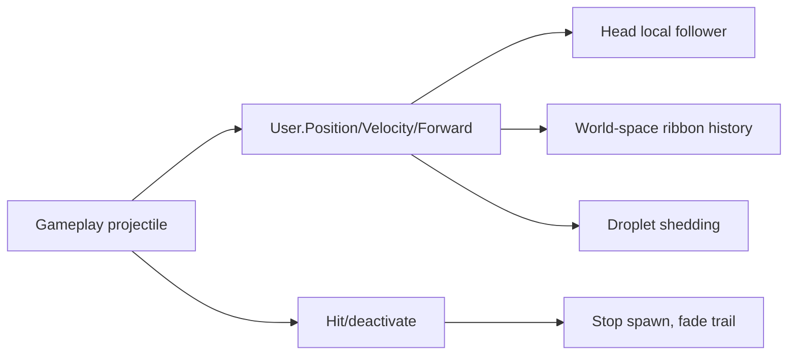

# 1. L09-02 — Water language: projectile і projectile trail

| Поле | Значення |
|---|---|
| Блок | 09 — Effect Archetypes |
| ID уроку | L09-02 |
| Реєстр архетипів | #03 projectile; #04 projectile trail |
| Elemental language | Water: округлі/стиснені shapes, coherent flow, trailing droplets і wave-like pulse |
| Артефакт | Триетапний **Elemental Projectile Kit** prototype, `NS_L09_Water_Projectile` |
| Mastery gate | Visual слідує за authoritative projectile, trail читає історію руху, original variant змінює four axes |

## 2. Результат уроку

Ви зможете:

- відокремити gameplay projectile authority від visual Niagara;
- створити readable projectile head і ribbon/droplet trail;
- передати water language через cohesion, pulse, drag and breakup;
- провести reference study без extracting projectile/trail assets;
- створити original four-axis variation, не recolor;
- передати speed/forward/radius data через User Parameters;
- підготувати H/M/L variants і test path із поворотами/teleport/deactivation.

## 3. Орієнтовний час

| Частина | Теорія | Практика | M/S practice |
|---|---:|---:|---:|
| Projectile authority і water language | 1.0 | 0.0 | 0.0 |
| Stage 1 — технічна реконструкція | 0.25 | 2.0 | 0.5 |
| Stage 2 — етичне reference study | 0.25 | 1.5 | 0.0 |
| Stage 3 — оригінальна варіація | 0.0 | 1.5 | 0.5 |
| Lifecycle/performance перевірка | 0.0 | 0.5 | 0.0 |
| **Разом** | **1.5** | **5.5** | **1.0** |

## 4. Передумови

| Навичка | Де | Перевірка |
|---|---|---|
| Робоча домовленість G09 | [L09-01](01_fire_impact_language.md) | Аркуш трьох етапів і provenance |
| Основи Ribbon | [Блок 07](../07_NIAGARA_FOUNDATIONS/BLOCK_ASSESSMENT.md) | Ribbon Renderer із коректними link/order |
| User parameters/bindings | [L08-03](../08_NIAGARA_ADVANCED/03_user_parameters_renderer_bindings_and_blueprint_data.md) | Зовнішні оновлення Vector3 |
| Власні water textures/meshes | Блоки 05–06 | Noise, ramp, sphere/card/ring |
| Робочий зошит мови Water | [L02-04](../02_VFX_DESIGN/04_elemental_style_language_workbook.md) | Правила форми, руху й кольору |

## 5. Нові терміни

| Термін | Пояснення |
|---|---|
| Projectile head | Visual focal mass у authoritative projectile position |
| Projectile trail | Temporal path cue позаду projectile |
| Ribbon width | Visual thickness поперек path |
| Ribbon age/order | Data, що встановлює sequence segments |
| Authoritative actor | Gameplay object, який володіє collision/path/lifetime |
| Visual follower | Niagara component, attached або driven authoritative object |
| Teleport discontinuity | Випадковий довгий ribbon segment після position jump |
| Graceful deactivation | Stop spawning, дати trail завершитися, потім destroy/reuse |

## 6. Навіщо ця тема потрібна VFX artist

Projectile — це рухома gameplay-обіцянка: player читає position, direction, speed, danger і element. Head не може відставати від collision; trail не повинен закривати target або лишати world-spanning lines після teleport.

Water identity — не просто blue. Cohesive mass розтягується зі speed, surface-like highlights пульсують, droplets відділяються через inertia/gravity, а trail звужується й пом’якшується як wake. Reference може підказати ratios, але всі textures, meshes і Niagara implementation лишаються оригінальною роботою студента.

## 7. Теорія простими словами

Уявіть projectile як пунктуацію:

```text
head = current point
trail = recent sentence
droplets = physical accent
```

Gameplay actor рухається. Niagara має представляти цей motion, а не самостійно вирішувати hit truth. Ribbon з’єднує samples; continuous spawning або per-frame ribbon particles створюють history. Droplets дають breakup, але не можуть стати другим head.

## 8. Детальні технічні пояснення

### Три stages

1. **Технічна реконструкція:** sphere/capsule head, один ribbon, droplets і periodic wake rings.
2. **Reference study:** виміряйте head:trail ratio, taper, pulse interval, bend delay і breakup density. Screenshots не вставляються в textures, extracted shader/mesh заборонені.
3. **Оригінальна варіація:**
   - форма: orb → розділена crescent capsule;
   - таймінг: рівномірний рух → тридольний wake pulse;
   - рух: прямі droplets → зустрічно обертова helix;
   - колір: cyan-white → глибокий teal, pearl, violet accent.

### Вибір space

Head, attached до projectile, може використовувати Local Space, щоб слідувати component orientation. Trail/ribbon, який має зберігати world history, зазвичай використовує world-space positions. Змішування space потребує контрольованого System/Emitter transform test.

### Життєвий цикл

```text
Activate → travel spawn → StopSpawning at hit → trail fades → component release
```

Destroy component у момент contact обрізає trail. Active spawn після removal actor може лишити particles в origin.

## 9. Візуальні й математичні приклади

Відстань між trail segments:

```text
speed = 1800 cm/s
spawn rate = 60 particles/s
distance ≈ 1800 / 60 = 30 cm per segment
```

При 15/s distance ≈120 cm, ribbon може ламатися на curves. Сам rate не гарантує smoothness: важливі також path curvature і renderer tessellation.

Розтягування head:

```text
Stretch = saturate(Speed / 2400)
ScaleX = lerp(1.0, 1.8, Stretch)
ScaleYZ = lerp(1.0, 0.72, Stretch)
```



## 10. Контрольовані експерименти

### CE09-02-A — Авторитетність і drift

- Запустіть actor зі speed 1800 cm/s.
- Порівняйте attached head з independent Niagara velocity.
- Поверніть path на 90°.
- Очікування: independent particle overshoot-ить; attached/driven head збігається з collision.

### CE09-02-B — Щільність segments

- Перевірте Ribbon spawn rates 15, 30, 60/s на одному curved spline path.
- Зафіксуйте segment gaps і cost.
- Виберіть найнижчий rate, що зберігає curve у target camera.

### CE09-02-C — Teleport/deactivation

- Teleport-ніть projectile на 2000 cm.
- A: збережіть той самий ribbon.
- B: reset/deactivate перед relocation.
- Зафіксуйте long-segment failure і safe lifecycle.

## 11. Покрокова guided practice

### Stage 1 — технічна реконструкція

1. Створіть `NS_L09_Water_Projectile` з `NE_Head`, `NE_Ribbon`, `NE_Droplets`, `NE_Wake`.
2. Expose-ніть position/velocity/forward/radius/colors і `User.IsTraveling`.
3. Attach System до authoritative test projectile; gameplay collision лишається поза Niagara.
4. Head: один persistent mesh/sprite, lifetime прив’язаний до System, stretch залежить від speed.
5. Ribbon: spawn у world space 45/s, life `.35 s`, width `34→3 cm`, color alpha `0→1→0`.
6. Droplets: 18/s, lifetime `.35–.7`, velocity проти forward `80–220` плюс random `120`, gravity `−380`.
7. Wake: burst одного ring кожні `.16 s`, lifetime `.28`, size `24→80`, alpha fade.
8. На hit задайте `User.IsTraveling=false`; припиніть travel spawning і дайте ribbon/droplets завершитися.

### Stage 2 — етичне reference study

1. Запишіть source/title/date і поясніть, чому reference legal-viewable.
2. Спостерігайте лише ratios: head diameter, trail length у head units, pulse spacing, bend lag, droplet count.
3. Реконструюйте зі своїми `T_Noise`, `T_Ramp_Water`, `SM_Ring` і material graphs.
4. Додайте provenance rows і три deliberate deviations.

### Stage 3 — оригінальна варіація

1. Duplicate-ніть у `NS_L09_Water_Projectile_TideCrescent`.
2. Shape head стає двома mirrored crescent cards навколо authority point.
3. Wake timing циклічно використовує intervals `.10, .16, .24 s`.
4. Droplets слідують за двома counter-rotating helix offsets; trail width пульсує за normalized age.
5. Palette стає deep teal body, pearl edge і restrained violet accent.
6. Порівняйте всі stages на straight, S-curve і hit/deactivate paths.

Потребує ручної перевірки в Unreal Engine 5.8. Exact Spawn System Attached pins, attachment transform rules, ribbon link/order bindings, spawn-per-unit alternatives and component deactivation/pooling behavior звірте у встановленому build.

## 12. Точні Niagara stacks, materials, assets, data і bindings

### Контракт User

```text
User.ProjectileVelocity Vector3 = (1800,0,0)
User.ProjectileForward  Vector3 = (1,0,0)
User.ProjectileRadius   Float = 28
User.PrimaryColor       LinearColor = (0.02,1.8,4.0,1)
User.SecondaryColor     LinearColor = (0.4,4.0,6.0,1)
User.IsTraveling        Bool = true
User.TrailWidth         Float = 34
```

### `NE_Head`

```text
Emitter Properties: CPU Sim, Local Space On, loop while active
Emitter Update: Spawn Burst Instantaneous Count 1
Particle Spawn:
  Initialize Particle: Lifetime 1000, Mesh/Sprite Size 56 cm
  Set Color = User.PrimaryColor
Particle Update:
  Particle State
  Calculate/Set stretch from length(User.ProjectileVelocity)
  Scale Color by pulse curve
Render:
  Mesh Renderer SM_VFX_WaterOrb or Sprite Renderer
  Material M_VFX_Water_Head
```

### `NE_Ribbon`

```text
Emitter Properties: CPU Sim, Local Space Off
Emitter Update: Spawn Rate 45 × User.IsTraveling
Particle Spawn:
  Initialize Particle: Lifetime .35; Position = current component world position
  Set Ribbon Width = User.TrailWidth
  Set Color = User.SecondaryColor
Particle Update:
  Particle State
  Scale Ribbon Width by age curve (0,.2),(.15,1),(1,.1)
  Scale Color Alpha (0,0),(.1,1),(1,0)
Render:
  Ribbon Renderer; Material M_VFX_Water_Ribbon
  Position←Particles.Position; Color←Particles.Color
  RibbonWidth←Particles.RibbonWidth
```

### `NE_Droplets` / `NE_Wake`

```text
NE_Droplets:
  Spawn Rate 18 × IsTraveling
  Lifetime .35–.70; Sprite 6–14
  Velocity = -Forward×Random(80,220)+RandomCone(120)
  Gravity (0,0,-380) → Drag 1.4 → Solve Forces and Velocity
  Sprite Renderer M_VFX_Water_Droplet

NE_Wake:
  Periodic burst Count 1 every .16 s while traveling
  Lifetime .28; Mesh Scale .24→.80
  Mesh Renderer SM_VFX_Ring_16, M_VFX_Water_Ring
```

### Контракт material

```text
TextureSample_Mask.R × ParticleColor.A → Opacity
TextureSample_Mask.R × ParticleColor.RGB × Emissive(3.5) → Emissive
Panner(Noise, Speed .08,.02) × EdgeMask → subtle breakup
```

Лише власні assets: `T_Smoke_Seamless_512`, `T_Ramp_Energy_256x16`, `SM_VFX_Ring_16`, власні orb/crescent mesh або cards.

Потребує ручної перевірки в Unreal Engine 5.8. Exact ribbon attributes, width binding namespace, persistent-particle setup, Local/World Space conversion and periodic spawn module names звірте у встановленому build.

## 13. Стартові значення

| Параметр | Старт | Діапазон дослідження |
|---|---:|---:|
| Projectile speed | 1800 cm/s | 600–3200 |
| Head diameter | 56 cm | 32–90 |
| Ribbon spawn/life | 45/s / .35 s | 20–90 / .2–.6 |
| Trail width | 34 cm | 16–60 |
| Droplets | 18/s | 0–30 |
| Droplet gravity | −380 | від 0 до −980 |
| Wake interval | .16 s | .08–.30 |
| Wake scale | .24→.80 | .15→1.2 |
| Bounds path margin | 120 cm | виміряний |

## 14. Очікуваний результат кожного етапу

| Етап | Доказ |
|---|---|
| Technical projectile | Head збігається з authority на turns |
| Technical trail | Smooth readable path без target obstruction |
| Hit lifecycle | Spawn зупиняється, tail завершується без origin pop |
| Reference study | Лише ratios/provenance |
| Оригінальна форма | Розділена crescent head |
| Оригінальний таймінг | Тридольний wake |
| Оригінальний рух | Зустрічно обертові droplets |
| Оригінальний колір | Співвідношення teal/pearl/violet |

## 15. Самостійна вправа A

### EX-L09-02-A — Авторитетний водяний bolt

Побудуйте #03 projectile на власному Blueprint/test mover.

- Niagara ніколи не володіє gameplay hit;
- deviation head від actor візуально negligible на 90° turn;
- дані User для speed/forward/radius/color;
- безпечний життєвий цикл stop-spawn/fade;
- H/M/L і bounds captures.

## 16. Додаткова складніша вправа B

### EX-L09-02-B — Оригінальний припливний projectile trail

Пройдіть три stages для #04 projectile trail.

- лише reference metrics і власні assets;
- original variation змінює cross-section shape, pulse timing, droplet motion і palette;
- тестові траєкторії straight/S-curve/teleport/hit;
- acceptance: player читає direction/speed без head color.

## 17. Три підказки для кожної вправи

### EX-L09-02-A

1. **Hint 1:** gameplay actor володіє transform/collision; Niagara споживає data.
2. **Hint 2:** attach-ніть head, лишіть trail world-space, зупиніть spawning перед component release.
3. **Hint 3:** один persistent head; User.ProjectileVelocity/Forward; ribbon 45/s `.35 s`; на hit `IsTraveling=false`, delay release не менше trail lifetime.

[Повне рішення EX-L09-02-A](../EXERCISE_ANSWERS/L09-02_water_projectile_language_answers.md#ex-l09-02-a)

### EX-L09-02-B

1. **Hint 1:** зміни color недостатньо; redesign-ніть head/trail silhouette і cadence.
2. **Hint 2:** split crescents, nonuniform wake intervals, helix droplets і нова three-color hierarchy.
3. **Hint 3:** дві crescent cards обертаються протилежно; intervals `.10/.16/.24`; два droplet phase offsets 0/π; deep teal body, pearl edge, violet accents.

[Повне рішення EX-L09-02-B](../EXERCISE_ANSWERS/L09-02_water_projectile_language_answers.md#ex-l09-02-b)

## 18. Типові помилки

| Помилка | Симптом | Виправлення |
|---|---|---|
| Niagara володіє hit | Розсинхронізація gameplay/VFX | Зовнішня авторитетність |
| Увесь System у local space | Trail рухається з head | Emitter історії у world space |
| Миттєве знищення | Trail обрізається | Зупинити spawn, потім fade/release |
| Рідкий ribbon | Кутові проміжки | Перевірка щільності spawn/path |
| Надмір droplets | Немає фокусної head | Зменшити count/contrast |
| Лише blue recolor | Загальний magic bolt | Перепроєктування за чотирма осями |
| Teleport без reset | Гігантська лінія ribbon | Deactivate/reset до переміщення |
| Texture референсу скопійовано | Порушення етики | Власні assets/provenance |

## 19. Пошук несправностей

| Симптом | Діагностика | Виправлення |
|---|---|---|
| Head відстає | Actor/head position overlay | Attach або exact transform drive |
| Ribbon snaps | World/local-space і spawn order | Виправте space/link/order |
| Ribbon відсутній | Renderer/bindings/material | Перевірте width, position, alpha |
| Trail лишається назавжди | Lifetime/loop/deactivate | Stop spawn і completion policy |
| Head flips | Forward vector/orientation | Normalize і bind consistent axis |
| Curve faceted | Segment distance test | Підвищте rate або suitable spawn-per-distance |
| Bounds cull на curves | Full path/bounds view | Validated bounds margin |

## 20. Performance і High/Medium/Low

| Рівень | Head | Ribbon | Droplets | Wake |
|---|---|---|---:|---:|
| High | mesh + glow | 60/s, .45 s | 24/s | .12 s |
| Medium | mesh/card | 40/s, .35 s | 12/s | .20 s |
| Low | одна card | 24/s, .25 s | 0 | 0 |

- Зберігайте head position і path cue у кожному tier.
- Ribbon particle count ≈ spawn rate × lifetime; 60×.45 ≈27 live segments на projectile.
- Перевірте 1, 10 і 30 concurrent projectiles.
- Wide translucent ribbon може домінувати в overdraw навіть за малої кількості particles.
- Teleport/lifecycle errors можуть створити huge bounds і draw cost.
- Medium/Low thresholds потребують target profiling, а не universal distance values.

Потребує ручної перевірки в Unreal Engine 5.8. Exact ribbon tessellation/UV controls, renderer statistics, component pooling and scalability UI звірте у встановленому build.

## 21. Запитання для самоперевірки

1. Які ledger archetypes закриває урок?
2. Хто має бути authoritative for gameplay hit?
3. Чому trail часто world-space?
4. Як estimate-ити segment distance?
5. Що робити перед component release?
6. Які four axes змінює original variant?
7. Чому water не дорівнює cyan color?
8. Що зберігає Low tier?

## 22. Відповіді

1. #03 projectile і #04 projectile trail.
2. Gameplay actor/component/ability logic, не cosmetic particle.
3. Щоб зберігати world history path, а не рухатися разом із head.
4. Speed, поділена на spawn rate, як first-order estimate.
5. Stop spawning, дати remaining particles/ribbon згаснути, потім destroy/reuse.
6. Shape, timing, motion і color.
7. Water language також потребує cohesion, flow, pulse, droplets і wake behavior.
8. Exact head position і readable recent motion path.

## 23. Чекліст самоперевірки

- [ ] Архетипи #03–04 внесено до реєстру.
- [ ] Gameplay authority відокремлено від Niagara.
- [ ] Head слідує straight/turning path.
- [ ] Ribbon world/local choice задокументовано.
- [ ] Teleport і hit lifecycle перевірено.
- [ ] Reference assets не copied/extracted.
- [ ] Original variant змінює всі four axes.
- [ ] H/M/L зберігають head/path.
- [ ] Bounds/concurrency evidence збережено.
- [ ] До M/S ledger додано 1.0 години.

## 24. Критерії опанування

1. Head і collision authority збігаються.
2. Trail передає direction і speed у gameplay camera.
3. Немає teleport line або clipped deactivation.
4. Water identity проходить grayscale test.
5. Ethical reference/provenance пройдено.
6. Original four-axis delta вимірюється.
7. H/M/L comparison задокументовано.
8. Щонайменше 7/8 questions правильні.

## 25. Підсумок

- Projectile head — поточна правда; trail — недавня історія.
- Gameplay authority лишається поза visual Niagara.
- Water language використовує cohesive flow і pulse, а не лише color.
- Space/lifecycle decisions запобігають drift, snap і clipping.
- Reference study фіксує ratios; original variation змінює four axes.

## 26. Зв’язок із наступними уроками

[L09-03](03_ice_shockwave_language.md) переносить head/trail timing у radial ground response: moving history зміниться expanding wave, а droplets — shards with shatter response.

## 27. Офіційні джерела

- [NIA-05 — System and Emitter Module Reference](https://dev.epicgames.com/documentation/en-us/unreal-engine/system-and-emitter-module-reference-for-niagara-effects-in-unreal-engine) — Epic Games, UE 5.8, доступ 2026-07-27.
- [NIA-06 — Render Module Reference](https://dev.epicgames.com/documentation/en-us/unreal-engine/render-module-reference-for-niagara-effects-in-unreal-engine) — Epic Games, UE 5.8, доступ 2026-07-27.
- [NIA-07 — Niagara System Settings](https://dev.epicgames.com/documentation/en-us/unreal-engine/system-settings-reference-for-niagara-effects-in-unreal-engine) — Epic Games, UE 5.8, доступ 2026-07-27.
- [BP-02 — Spawn System Attached](https://dev.epicgames.com/documentation/en-us/unreal-engine/BlueprintAPI/Niagara/SpawnSystemAttached) — Epic Games, UE 5.8, доступ 2026-07-27.
- [PERF-02 — Scalability and Best Practices for Niagara](https://dev.epicgames.com/documentation/en-us/unreal-engine/scalability-and-best-practices-for-niagara) — Epic Games, UE 5.8, доступ 2026-07-27.

## 28. Рекомендовані скриншоти або схеми

```text
Скриншот 1
Відкрити: gameplay projectile + Niagara component.
Показати: authority transform, head overlay, world-space trail.
Виділити: 90° turn and hit deactivation.
```

```text
Скриншот 2
Відкрити: reference metrics/provenance and three-stage comparison.
Показати: own assets only.
Виділити: split shape, pulse timing, helix motion, palette delta.
```

```text
Скриншот 3
Відкрити: H/M/L on S-curve.
Показати: segment density, bounds and overdraw.
Виділити: retained head/path cue.
```
