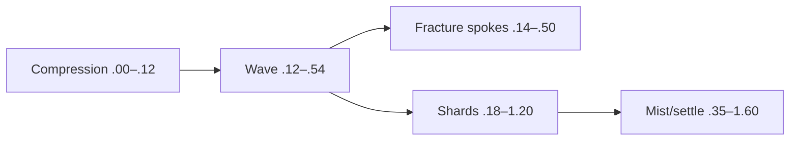

# 1. L09-03 — Ice language: shockwave і shatter response

| Поле | Значення |
|---|---|
| Блок | 09 — Effect Archetypes |
| ID уроку | L09-03 |
| Archetype ledger | #05 shockwave; shatter є обов’язковим response layer, не окремим ledger archetype |
| Elemental language | Ice: faceted segmentation, compression → snap, rigid shards і cold mist |
| Артефакт | `NS_L09_Ice_Shockwave`, radial wave with secondary shards |
| Mastery gate | Ground-aligned wave + coherent shatter, original four-axis variation і H/M/L pass |

## 2. Результат уроку

Ви зможете:

- побудувати radial shockwave, aligned to ground/impact normal;
- синхронізувати ring, fracture spokes, shards, frost mist and residue;
- зробити shatter response directional and staged, а не random debris burst;
- провести етичний аналіз референсів використовуючи лише власні ресурси;
- створювати оригінальний варіант зі зміною форми, таймінгу, руху й кольору;
- вибирати кількість meshes/sprites, політику collision, bounds і скорочення за tiers;
- документувати #05 з явним покриттям обов’язкової реакції shatter.

## 3. Орієнтовний час

| Частина | Теорія | Практика | M/S practice |
|---|---:|---:|---:|
| Модель shockwave/ice/shatter | 1.0 | 0.0 | 0.0 |
| Етап 1 — технічна реконструкція | 0.25 | 2.0 | 0.5 |
| Етап 2 — етичний аналіз референсів | 0.25 | 1.5 | 0.0 |
| Етап 3 — оригінальна варіація | 0.0 | 1.5 | 0.5 |
| Performance/gameplay перевірка | 0.0 | 0.5 | 0.0 |
| **Разом** | **1.5** | **5.5** | **1.0** |

## 4. Передумови

| Навичка | Де | Перевірка |
|---|---|---|
| Дані й життєвий цикл projectile | [L09-02](02_water_projectile_language.md) | Авторитетність і контракт даних |
| Meshes для ring і shards | Блоки 05–06 | Власні ring, crack/facet mask і shard mesh |
| Вибір collision | [L08-01](../08_NIAGARA_ADVANCED/01_cpu_gpu_simulation_and_collision_choices.md) | Візуальний та ігровий collision |
| Фази таймінгу | [L02-03](../02_VFX_DESIGN/03_timing_motion_and_animation_phases.md) | Compression/action/dissipation |
| Мова Ice | [L02-04](../02_VFX_DESIGN/04_elemental_style_language_workbook.md) | Facets, snap, desaturation |

## 5. Нові терміни

| Термін | Пояснення |
|---|---|
| Shockwave | Швидка expanding spatial response від center |
| Shatter response | Secondary fracture/shard action, спричинена primary wave |
| Radial velocity | Motion від center або до нього |
| Ground alignment | Орієнтація effect plane/basis за surface normal |
| Facet | Flat angular shape unit, що нагадує crystalline structure |
| Compression beat | Коротка inward/held phase перед release |
| Fracture spoke | Angular radial line від center до outward break |
| Settle phase | Low-motion state після shard action |

## 6. Навіщо ця тема потрібна VFX-фахівцю

Shockwave повідомляє area, radius і timing. Якщо ring красиво expands, але не збігається з ігровим радіусом, він вводить в оману. Ice додає brittle material logic: коротку compression, sharp snap, rigid pieces і cold residue. Shards не можуть бути декоративною random cloud; їхній direction і delay мають виглядати спричиненими wave.

Reference ethics лишається суворою: спостерігайте radius ratios, phases і shard density; ніколи не extract-іть crack decals, meshes, flipbooks або shader data. Кожний artifact у project походить зі student Blocks 05–06.

## 7. Теорія простими словами

Ice shockwave має три beats:

```text
freeze inward → crack outward → shards settle
```

Ring показує gameplay radius. Spokes пояснюють fracture. Shards дають material response. Mist не дає завершенню відчуватися механічно порожнім. Кожний layer починається з причини й завершується до того, як закриє next cue.

## 8. Детальні технічні пояснення

### Три етапи

1. **Технічна реконструкція:** circular ground ring, 12 spokes, 24 shards і mist.
2. **Reference study:** лише normalized timeline і ratios; rebuild з original masks/meshes.
3. **Оригінальна варіація:**
   - форма: circle → broken hexagonal wave із чергуванням довгих і коротких facets;
   - таймінг: миттєве expansion → утримання compression `.12 s`, потім snap і затримане падіння shards;
   - рух: radial outward → короткий inward pull із подальшим виходом у шість похилих секторів;
   - колір: cyan-white → блідо-лавандове ядро, steel-blue edge, темний desaturated residue.

### Відображення радіуса

Якщо ігровий радіус дорівнює `User.RadiusCm=450`, mesh, authored з diameter 100 cm, потребує scale за actual imported dimensions. Не припускайте unit scale: виміряйте mesh bounds. User radius керує visual target; overshoot документується, зазвичай ≤5% для telegraph-like accuracy.

### Причинність shatter

Позиції spawn для shards лежать біля фронту, що розширюється, або з’являються невдовзі після нього. Напрямок сектора:

```text
angle = sectorIndex × 60° + jitter(−12°,12°)
velocity = radial×Random(350,700) + normal×Random(180,420)
```

Collision є декоративним. High може використовувати обмежений visual collision; Medium/Low — детермінований балістичний settle/fade.

## 9. Візуальні й математичні приклади

Швидкість wave:

```text
Radius 450 cm reached in .42 s
Average front speed ≈ 450/.42 = 1071 cm/s
```

Оцінка кількості shards:

```text
High 24 shards × average lifetime .9 s = 21.6 particle-seconds per activation
```



## 10. Контрольовані експерименти

### CE09-03-A — Правдивість radius

- Радіус ігрового debug circle 450 cm.
- Wave масштабується до цільових 420, 450, 500 cm.
- Перевірка з ігрової камери виявляє оманливе недосягнення або перевищення радіуса.

### CE09-03-B — Таймінг shards

- У A shards з’являються в 0.
- У B shards з’являються в `.18 s`, після початку видимого fracture.
- B має читатися як спричинена реакція, A — як не пов’язаний із нею вибух.

### CE09-03-C — Ice без color

- Зробіть захоплення з повністю білим матеріалом.
- Порівняйте smooth circle/random particles із hex/facets/snap/rigid shards.
- Варіант Ice має лишатися впізнаваним.

## 11. Покрокова керована практика

### Етап 1 — технічна реконструкція

1. Створіть `NS_L09_Ice_Shockwave`: `NE_Compress`, `NE_Wave`, `NE_Spokes`, `NE_Shards`, `NE_Mist`.
2. Відкрийте center/normal/radius/colors/seed.
3. `NE_Compress`: один inward ring `.12 s`, scale `.35→.08`, alpha 0→1.
4. `NE_Wave`: spawn у `.12`, lifetime `.42`, mesh scale `.08→target radius`.
5. `NE_Spokes`: burst із 12 angular cards у `.14`, lifetime `.36`, radial scale 0→1.
6. `NE_Shards`: burst 24 у `.18`, lifetime `.7–1.2`, шість секторів, gravity `−980`, angular velocity.
7. `NE_Mist`: burst 10 у `.35`, lifetime `.8–1.3`, speed `30–90`, sprite size `50–140`.
8. Вирівняйте basis ring/spokes за `User.ImpactNormal`; перевірте нахили 0°, 20°, 35°.

### Етап 2 — етичний аналіз референсів

1. Не захоплюйте вихідні assets; запишіть пропорції фаз і ролі шарів.
2. Виміряйте нормалізовану до 1.0 тривалість wave, затримку shard і масштаб shard:radius.
3. Побудуйте власні facet texture і варіанти shard mesh.
4. У таблиці provenance перелічіть вихідні документи й файли mesh.
5. Запишіть щонайменше три відхилення від референсу.

### Етап 3 — оригінальна варіація

1. Створіть дублікат `NS_L09_Ice_Shockwave_HexBreak`.
2. Замініть круглі mesh/mask власним broken hex ring.
3. Утримуйте compression `.12 s`, потім випустіть шість секторів із чергуванням затримок 0/.02.
4. Додайте короткий inward velocity shards `−100 cm/s` протягом `.06 s`, потім outward sector burst.
5. Застосуйте ramp lavender/steel-blue/dark residue.
6. Порівняння з білим матеріалом, timing plot і motion paths доводять зміну чотирьох осей.

Потребує ручної перевірки в Unreal Engine 5.8. Exact delayed spawn setup, mesh orientation bindings, surface-normal basis modules, angular velocity inputs, collision modules and deterministic sector indexing звірте у встановленому build.

## 12. Точна структура Niagara: стеки, матеріали, ресурси, дані й привʼязки

### Контракт User

```text
User.ImpactCenter Vector3 = world spawn position
User.ImpactNormal Vector3 = (0,0,1)
User.RadiusCm     Float = 450
User.PrimaryColor LinearColor = (0.25,2.5,5.0,1)
User.EdgeColor    LinearColor = (0.65,4.0,8.0,1)
User.Seed         Int = 903
```

### Stacks для ring/spokes

```text
NE_Compress:
  CPU, Local Space Off, Burst 1
  Initialize Lifetime .12; Mesh Scale .35
  Scale Mesh Size .35→.08; Alpha 0→1
  Mesh Renderer SM_VFX_Ring_16, M_VFX_Ice_Ring

NE_Wave:
  Burst 1 at .12
  Initialize Lifetime .42; Mesh Scale .08
  Scale Mesh Size curve .08→1.00 mapped to User.RadiusCm
  Alpha 1→.8→0
  Mesh Renderer own ring/hex mesh

NE_Spokes:
  Burst 12 at .14
  Initialize Lifetime .36; Sprite Size (12,220)
  Cylinder/Disc Location Radius 20, angular distribution
  Orient to radial vector in impact plane
  Scale Sprite Size Y 0→1; X 1→.2
  Sprite Renderer M_VFX_Ice_Spoke
```

### Stacks для shards/mist

```text
NE_Shards:
  CPU Sim candidate; Burst 24 at .18
  Initialize Lifetime .7–1.2; Mesh Scale .25–.75
  Disc Location Radius 40–120 in impact plane
  Add Velocity radial 350–700 + normal 180–420
  Gravity −980 → Drag .35 → Solve Forces and Velocity
  Add/Set Angular Velocity random −4..4 rad/s per axis
  Mesh Renderer SM_VFX_IceShard_Low, M_VFX_IceShard

NE_Mist:
  Burst 10 at .35
  Lifetime .8–1.3; Sprite 50–140
  Velocity radial 30–90 + normal 20–60
  Curl Noise 20 → Drag 2.5 → Solve Forces and Velocity
  Sprite Renderer M_VFX_FrostMist
```

### Material/assets/bindings

```text
TextureSample_Facet.R × ParticleColor.A → Opacity
TextureSample_Facet.R × ParticleColor.RGB × Emissive(4) → Emissive
Fresnel or mesh edge mask × EdgeColor → optional shard edge
```

Bindings: MeshOrientation/Scale, SpriteSize, Position і Color із відповідних `Particles.*`; відображення радіуса використовує `User.RadiusCm`. Власні assets: `T_IceFacet_512`, `T_Noise_Seamless_512`, `SM_VFX_IceShard_Low`, `SM_VFX_Ring_16`.

Потребує ручної перевірки в Unreal Engine 5.8. Exact Mesh Orientation binding type, angular velocity units, delayed burst field names, renderer pivot and normal-basis implementation звірте у встановленому build.

## 13. Стартові значення

| Параметр | Старт | Діапазон |
|---|---:|---:|
| Radius | 450 cm | 250–700 |
| Compression | .12 s | .06–.20 |
| Wave lifetime | .42 s | .25–.65 |
| Spokes | 12 | 6–18 |
| Shards | 24 | 8–36 |
| Shard speed | 350–700 | 200–1000 |
| Shard lifetime | .7–1.2 | .4–1.8 |
| Mist | 10 | 0–16 |
| Bounds radius/Z | 650/450 cm | виміряний |

## 14. Очікуваний результат кожного етапу

| Етап | Доказ |
|---|---|
| Technical wave | Radius збігається з debug circle |
| Shatter response | Shards візуально спричинені front |
| Ground alignment | Correct на three slopes |
| Reference study | Лише ratios і provenance |
| Оригінальна форма | Broken hex wave |
| Оригінальний таймінг | Утримання compression + snap |
| Оригінальний рух | Inward-to-sector release |
| Оригінальний колір | Ієрархія lavender/steel/dark |

## 15. Самостійна вправа A

### EX-L09-03-A — Льодяна shockwave з точним радіусом

Побудуйте #05 shockwave для radii 300/450/600 cm.

- візуальний front на піку в межах 5% від ігрового debug radius;
- compression, wave і mist;
- обов’язкова реакція shatter із власним shard mesh;
- перевірка slope/white-material;
- докази H/M/L і bounds.

## 16. Додаткова складніша вправа B

### EX-L09-03-B — Оригінальний hex shatter

Пройдіть три stages:

- лише метрики референсу й provenance;
- форма broken hex, таймінг із утриманим snap, рух inward→six-sector та оригінальне колірне співвідношення;
- реакція shatter лишається вторинною щодо сигналу радіуса;
- умова приймання: ідентичність Ice у відтінках сірого й відсутність оманливого радіуса.

## 17. Три підказки для кожної вправи

### EX-L09-03-A

1. **Hint 1:** ігровий радіус є contract; dimensions ring mesh треба виміряти.
2. **Hint 2:** drive scale від User.RadiusCm; delay shards до початку fracture front.
3. **Hint 3:** `.12 s` compression, `.42 s` wave до radius, shard burst у `.18 s`; debug circle порівнює peak outer edge у `.54 s`.

[Повне рішення EX-L09-03-A](../EXERCISE_ANSWERS/L09-03_ice_shockwave_language_answers.md#ex-l09-03-a)

### EX-L09-03-B

1. **Hint 1:** шість sectors мають спільний center, але різні delays/angles.
2. **Hint 2:** використайте broken hex mask, alternating sector delays, коротку inward velocity і новий ramp.
3. **Hint 3:** sector angle `i×60°±12°`; delay even/odd `0/.02`; перші `.06 s` inward, потім radial+normal; lavender core/steel edge/dark mist.

[Повне рішення EX-L09-03-B](../EXERCISE_ANSWERS/L09-03_ice_shockwave_language_answers.md#ex-l09-03-b)

## 18. Типові помилки

| Помилка | Симптом | Виправлення |
|---|---|---|
| Ring не tied to radius | Misleading gameplay area | User radius + measured mesh |
| Shards у frame 0 | Random explosion | Delay після fracture |
| Smooth blobs | Ice language відсутня | Facets/spokes/rigid rotation |
| Забагато shards | Wave приховано | Зменште count/contrast |
| Collision required на всіх tiers | Expensive/inconsistent | Cosmetic deterministic fallback |
| Color-only variant | Той самий motion graph | Four-axis checklist |
| Лише flat-ground | Floating на slope | Impact-normal basis test |
| Copied crack texture | Ethics failure | Власний procedural/geometric asset |

## 19. Пошук несправностей

| Симптом | Діагностика | Виправлення |
|---|---|---|
| Ring вертикальний або хибний | Debug осей normal | Binding basis/orientation |
| Shards під ground | Spawn plane/normal sign | Offset уздовж normal |
| Wave pops/culls | Bounds на max radius/Z | Tight measured bounds |
| Hex corners distort | Mesh UV/pivot | Перевірте власний mesh/mask |
| Shards однакові | Random seed/mesh scale/orientation | Controlled ranges/variants |
| Radius не збігається через scale | Imported mesh bounds | Обчисліть actual scale |
| Mist знижує readability | Alpha/size/delay | Lower/delay/fade |

## 20. Продуктивність і рівні High/Medium/Low

| Рівень | Wave/spokes | Shards | Mist/collision |
|---|---|---:|---|
| High | hex ring + 12 spokes | 24 | 10 mist; кандидат на обмежений visual collision |
| Medium | ring + 6 spokes | 12 | 5 mist; балістичний рух |
| Low | один ring/card | 6 або 0 | без mist/collision |

- Зберігайте радіус і таймінг snap на кожному tier.
- Mesh particles можуть коштувати більше draw/vertex work, ніж sprites; вимірюйте.
- Collision декоративний і вилучається раніше за сигнал радіуса.
- Широкі translucent ground layers накопичуються над terrain; перевіряйте overdraw.
- Перевірте 1, 6 і 15 одночасних waves.
- Fixed bounds охоплюють максимальний радіус і висоту shards, а не довільний розмір світу.

Потребує ручної перевірки в Unreal Engine 5.8. Exact collision support by Sim Target, mesh renderer statistics, bounds and scalability controls звірте у встановленому build.

## 21. Запитання для самоперевірки

1. Скільки ledger archetypes додає цей урок?
2. Чому shatter тут не рахується як #06?
3. Що контролює visual radius truth?
4. Навіщо delay-ити shards?
5. Що робить ice читабельним без color?
6. Які four axes змінюються в original variant?
7. Що зберігається в Low tier?
8. Чому particle collision не authoritative?

## 22. Відповіді

1. Один: #05 shockwave.
2. Course map рахує shockwave; shatter є mandatory response layer усередині нього.
3. User gameplay radius, mapped через measured mesh/material scale і debug comparison.
4. Щоб fracture front візуально спричиняв secondary response.
5. Facets, compression-snap timing, rigid shards і cold settle.
6. Shape, timing, motion і color.
7. Radius-accurate front і snap timing.
8. Gameplay collision/area rules належать authoritative gameplay systems.

## 23. Чекліст самоперевірки

- [ ] #05 внесено до реєстру; реакцію shatter доведено.
- [ ] Піковий радіус у межах 5%.
- [ ] Три перевірки схилів пройдено.
- [ ] Використано лише власні facet/shard/ring assets.
- [ ] Аркуш референсу містить пропорції, вилучених файлів немає.
- [ ] Оригінальний варіант змінює чотири осі.
- [ ] H/M/L зберігають radius/snap.
- [ ] Bounds охоплюють радіус і висоту shards.
- [ ] Performance concurrency записано.
- [ ] До M/S ledger додано 1.0 години.

## 24. Критерії опанування

1. Wave візуально відповідає ігровому радіусу.
2. Shards мають зрозумілу причину, затримку й вторинну роль.
3. Ідентичність Ice зберігається з білим матеріалом і у відтінках сірого.
4. Вирівнювання за поверхнею працює на цільових схилах.
5. Перевірку reference/provenance пройдено.
6. Оригінальна різниця за чотирма осями очевидна.
7. Перевірку performance H/M/L пройдено.
8. Правильні щонайменше 7/8 відповідей самоперевірки.

## 25. Підсумок

- Shockwave є обіцянкою радіуса й таймінгу.
- Ice додає грановані compression, snap і жорсткий shatter.
- Shatter є обов’язковою реакцією, а не штучним збільшенням реєстру.
- Basis поверхні, розміри mesh і радіус User мають узгоджуватися.
- Оригінальний варіант змінює форму, таймінг, рух і колір.

## 26. Зв’язок із наступними уроками

[L09-04](04_electric_beam_language.md) перетворює радіальне розширення на спрямований зв’язок source-to-target. Зберігайте ту саму дисципліну контракту даних: endpoints та ігровий target лишаються авторитетними.

## 27. Офіційні джерела

- [NIA-05 — System and Emitter Module Reference](https://dev.epicgames.com/documentation/en-us/unreal-engine/system-and-emitter-module-reference-for-niagara-effects-in-unreal-engine) — Epic Games, UE 5.8, доступ 2026-07-27.
- [NIA-06 — Render Module Reference](https://dev.epicgames.com/documentation/en-us/unreal-engine/render-module-reference-for-niagara-effects-in-unreal-engine) — Epic Games, UE 5.8, доступ 2026-07-27.
- [NIA-07 — System Settings Reference](https://dev.epicgames.com/documentation/en-us/unreal-engine/system-settings-reference-for-niagara-effects-in-unreal-engine) — Epic Games, UE 5.8, доступ 2026-07-27.
- [PERF-02 — Scalability and Best Practices](https://dev.epicgames.com/documentation/en-us/unreal-engine/scalability-and-best-practices-for-niagara) — Epic Games, UE 5.8, доступ 2026-07-27.
- [BP-01 — Spawn System at Location](https://dev.epicgames.com/documentation/en-us/unreal-engine/BlueprintAPI/Niagara/SpawnSystematLocation) — Epic Games, UE 5.8, доступ 2026-07-27.

## 28. Рекомендовані скриншоти або схеми

```text
Скриншот 1
Відкрити: gameplay debug radius + wave at peak.
Показати: 300/450/600 cm tests and three slopes.
Виділити: ≤5% edge difference.
```

```text
Скриншот 2
Відкрити: timeline/contact sheet.
Показати: compression, wave, spokes, shards, mist.
Виділити: causal shard delay.
```

```text
Скриншот 3
Відкрити: technical/reference/original and H/M/L.
Показати: broken hex, timing plot, six-sector vectors, palette.
Виділити: own asset provenance.
```
