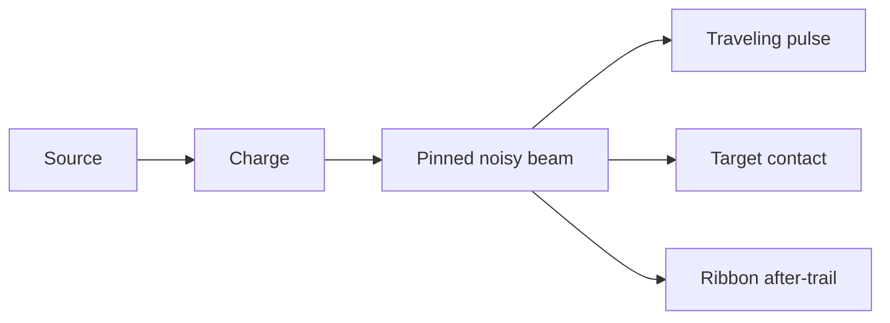

# 1. L09-04 — Electricity language: beam і ribbon trail

| Поле | Значення |
|---|---|
| Блок | 09 — Effect Archetypes |
| ID уроку | L09-04 |
| Реєстр архетипів | #06 beam; #07 ribbon trail |
| Elemental language | Electricity: branching angular paths, staccato pulses, traveling energy і rapid polarity changes |
| Артефакт | `NS_L09_Electric_Beam`, directed beam/trail ability |
| Mastery gate | Exact source/target, readable pulse, ethical reference і original four-axis braid |

## 2. Результат уроку

Ви зможете:

- будувати source-to-target beam із явними даними endpoints;
- створювати ribbon trail/afterimage, що записує рух emitter;
- генерувати керований angular noise та ієрархію branches;
- синхронізувати source flash, traveling pulse і target contact;
- виконувати дослідження референсу без копіювання textures/shaders beam;
- створювати оригінальний варіант зі зміною форми, таймінгу, руху й кольору;
- скорочувати segments/branches/material layers у H/M/L, зберігаючи правду endpoints.

## 3. Орієнтовний час

| Частина | Теорія | Практика | M/S practice |
|---|---:|---:|---:|
| Модель beam/ribbon/electric | 1.0 | 0.0 | 0.0 |
| Етап 1 — технічна реконструкція | 0.25 | 2.0 | 0.5 |
| Етап 2 — етичний аналіз референсів | 0.25 | 1.5 | 0.0 |
| Етап 3 — оригінальна варіація | 0.0 | 1.5 | 0.5 |
| Endpoint/performance перевірка | 0.0 | 0.5 | 0.0 |
| **Разом** | **1.5** | **5.5** | **1.0** |

## 4. Передумови

| Навичка | Де | Перевірка |
|---|---|---|
| Дані User для endpoints | L08-03 | Параметри Set Vector3 |
| Контракт Scratch Pad | L08-04 | Багаторазова інтерполяція точок |
| Ribbon Renderer | G07 | Width/color/link/order |
| Авторитетний target | [L09-02](02_water_projectile_language.md) | Розділення gameplay/VFX |
| Мова Electricity | L02-04 | Правила angular branching і pulse |

## 5. Нові терміни

| Термін | Пояснення |
|---|---|
| Beam | Directed effect, що з’єднує source і target |
| Endpoint | Exact world position source або target |
| Segment | Sample point уздовж beam path |
| Tangent basis | Два perpendicular directions навколо source-target axis |
| Branch | Secondary коротший electrical path |
| Traveling pulse | Bright region, що рухається від source до target |
| Ribbon trail | Connected history рухомих particles/points |
| Staccato timing | Короткі on/off energy bursts |
| Endpoint pinning | Збереження exact first/last points попри noise |

## 6. Навіщо ця тема потрібна VFX-фахівцю

Beam — це gameplay relationship: він має чітко з’єднувати правильні source і target. Noise, що рухає endpoints, — не style, а неправильна information. Electricity додає high-frequency angular deviation і staccato rhythm, але width, contrast і branches не повинні закривати target contact.

References можуть навчити branch density, pulse speed і core/outer-width ratios. Вони не можуть надавати textures, Niagara graphs, extracted meshes або traced paths. Кожний segment/material будуйте з власних assets і parameter logic.

## 7. Теорія простими словами

Почніть із прямої лінії між A й B. Додайте controlled bends лише посередині, а A й B лишіть pinned. Brightness може рухатися вздовж лінії. Branches — це пунктуація, а не друге main sentence.

Ribbon trail відрізняється від beam:

- beam відповідає «що з’єднано зараз?»;
- trail відповідає «де нещодавно рухалося джерело або енергія?».

## 8. Детальні технічні пояснення

### Три етапи

1. **Технічна реконструкція:** один noisy core beam, outer ribbon, source/target bursts і short after-trail.
2. **Reference study:** виміряйте normalized segment count, core:outer width, on/off rhythm, branch count і pulse travel; використовуйте лише own assets.
3. **Оригінальна варіація:**
   - форма: одна ламана лінія → плетене роздвоєння з трьох strands;
   - таймінг: безперервний → charge `.18 s`, три pulses `.06 on/.04 off`;
   - рух: статичний noise → traveling pulse і зміна полярності branches;
   - колір: blue-white → тепло-біле/жовте ядро, magenta-violet outer, темні gaps.

### Побудова points

Для сегмента `i` з `N`:

```text
t = i/(N−1)
base = lerp(Source,Target,t)
envelope = sin(πt)
offset = (basisY×noise1 + basisZ×noise2) × NoiseAmplitude × envelope
point = base + offset
```

`sin(πt)` дорівнює 0 на обох endpoints, тому source/target лишаються зафіксованими.

### Політика оновлення

Якщо target рухається, points щокадрово update-яться з User endpoints. Large instantaneous target jump може вимагати trail reset. Exact beam/ribbon modules можуть інакше керувати points; перевірте actual data flow.

## 9. Візуальні й математичні приклади

Для source `(0,0,100)` і target `(900,0,160)`:

```text
Length ≈ sqrt(900²+60²) ≈ 902 cm
32 segments → average base spacing ≈ 29 cm
NoiseAmplitude = 45 cm
```

Умова приймання похибки endpoint:

```text
distance(firstPoint,Source) < 1 cm
distance(lastPoint,Target) < 1 cm
```



## 10. Контрольовані експерименти

### CE09-04-A — Envelope для endpoints

- Порівняйте сталий noise offset з envelope `sin(πt)`.
- Переміщуйте source/target.
- Сталий варіант плаває в endpoints; envelope лишається зафіксованою.

### CE09-04-B — Кількість segments

- Перевірте 12, 24 і 48 points за однакових length/camera.
- Запишіть кутову якість і вартість simulation/render.
- Виберіть найменшу прийнятну для tier кількість.

### CE09-04-C — Читабельність pulse

- Порівняйте безперервну intensity із трьома staccato pulses.
- Зробіть захоплення з білим матеріалом і вимкненим audio.
- Самоперевірка визначає active/damage windows лише за VFX.

## 11. Покрокова керована практика

### Етап 1 — технічна реконструкція

1. Створіть `NS_L09_Electric_Beam` із `NE_Charge`, `NE_BeamCore`, `NE_BeamOuter`, `NE_Branches`, `NE_TargetBurst`, `NE_RibbonTrail`.
2. Відкрийте source/target, width, amplitude, colors, activation і seed.
3. `NE_Charge`: source sprite зростає `.18 s`.
4. `NE_BeamCore`: 32 ordered points або beam setup; source/target зафіксовано, noise 45 cm.
5. `NE_BeamOuter`: та сама path, width 28 cm, нижча alpha; width Core 9 cm.
6. `NE_Branches`: 3 короткі branches від t=.25/.55/.72, length 120–240 cm, life `.08–.14`.
7. `NE_TargetBurst`: burst із 8 sparks у target на кожен primary pulse.
8. `NE_RibbonTrail`: записує рух source протягом `.22 s`, width `18→0`.
9. Перевірте нерухомі endpoints, рухомий target, швидкий retarget і disable.

### Етап 2 — етичний аналіз референсів

1. Запишіть source/title/date; описуйте лише співвідношення.
2. Запишіть width core:outer, contrast branch/main, тривалість on/off і напрямок pulse.
3. Використайте власну noise/gradient texture й оригінальний material.
4. Заборонено frame tracing, extracted flipbook, copied shader graph або точний силует branch.
5. Запишіть три навмисні відхилення.

### Етап 3 — оригінальна варіація

1. Створіть дублікат `NS_L09_Electric_Beam_Braided`.
2. Згенеруйте три paths навколо осі з фазами `0°,120°,240°`; зведіть їх у endpoints.
3. Таймінг: charge `.18 s`, потім три pulses `.06/.04`.
4. Координата Pulse рухається source→target; активна сторона branch чергується для кожного pulse.
5. Змініть палітру на warm-white/yellow Core, magenta/violet Outer і темні off gaps.
6. Доведіть чотири зміни білим still, timing chart, накладенням paths і колірною смугою.

Потребує ручної перевірки в Unreal Engine 5.8. Exact Niagara Beam Emitter Setup/Spawn Beam/Update Beam module names, ribbon/beam attributes, execution order, renderer bindings and target-update path звірте у встановленому build.

## 12. Точна структура Niagara: стеки, матеріали, ресурси, дані й привʼязки

### Контракт User

```text
User.SourcePosition Vector3 = (0,0,100)
User.TargetPosition Vector3 = (900,0,160)
User.BeamWidth      Float = 9
User.NoiseAmplitude Float = 45
User.PrimaryColor  LinearColor = (4,6,12,1)
User.SecondaryColor LinearColor = (.15,.5,6,1)
User.IsActive      Bool = true
User.Seed          Int = 904
```

### Stack Core/Outer

```text
NE_BeamCore:
  CPU Sim, Local Space Off, Determinism On
  Emitter Update:
    Beam/point spawn setup; Num Points = 32 while active
  Particle Spawn:
    Initialize Lifetime .12; Ribbon Width 9
    Calculate index t = ExecutionIndex/(32−1)
    Position = lerp(Source,Target,t) + basisNoise×sin(pi*t)
    Color = PrimaryColor
  Particle Update:
    Recalculate positions from current endpoints
    Scale Color by staccato pulse
  Ribbon Renderer:
    M_VFX_Electric_Core
    Position←Particles.Position; Color←Particles.Color
    Width←Particles.RibbonWidth; order/link←validated beam attributes

NE_BeamOuter:
  Same point path/phase, Width 28, Alpha .35
  Ribbon Renderer M_VFX_Electric_Outer
```

### Допоміжні emitters

```text
NE_Charge:
  Burst 1; Lifetime .18; Sprite 20→90; source position

NE_Branches:
  3 branches per pulse; Lifetime .08–.14
  branch start at main t=.25/.55/.72
  end = start + sideBasis×120–240 + axis×40

NE_TargetBurst:
  Burst 8 at target on each pulse
  Lifetime .12–.25; Speed 250–600

NE_RibbonTrail:
  Spawn Rate 45 while source moves; Lifetime .22
  Position=current source; Width 18→0
```

### Material Electricity

```text
RibbonUV0/U → Panner/TravelingPulseMask
NoiseTexture.R panned (1.5,0) × ParticleColor.A → Opacity
CoreMask × ParticleColor.RGB × EmissiveIntensity(10) → Emissive
Outer uses Emissive 4 and wider opacity
```

Власні assets: `T_Noise_Seamless_512`, `T_Ramp_Energy_256x16`, власна spark mask; скопійованої beam texture з референсу немає.

Потребує ручної перевірки в Unreal Engine 5.8. Exact Beam/Ribbon UV attributes, Execution Index availability, width/order/link bindings and material Ribbon coordinate expressions звірте у встановленому build.

## 13. Стартові значення

| Параметр | Старт | Діапазон дослідження |
|---|---:|---:|
| Length | 900 cm | 200–2500 |
| Points | 32 | 12–48 |
| Core/outer width | 9/28 cm | 4–18 / 14–50 |
| Noise amplitude | 45 cm | 0–100 |
| Charge | .18 s | .08–.35 |
| Pulse | .06 on/.04 off ×3 | .03–.12 |
| Branches | 3 | 0–6 |
| Trail lifetime | .22 s | .08–.4 |
| Допуск endpoint | <1 cm | фіксована умова приймання |

## 14. Очікуваний результат кожного етапу

| Етап | Доказ |
|---|---|
| Технічний beam | Похибка endpoints <1 cm |
| Ribbon trail | Читабельний недавній рух source |
| Pulse/contact | Source→target travel і target burst синхронізовані |
| Reference study | Лише ratios/provenance |
| Оригінальна форма | Braid/fork із трьох strands |
| Original timing | Charge + три staccato pulses |
| Original motion | Traveling pulse і polarity swap |
| Оригінальний колір | Тепле ядро/magenta outer/темні gaps |

## 15. Самостійна вправа A

### EX-L09-04-A — Бойовий beam із зафіксованими endpoints

Побудуйте #06 beam між moving source і target.

- похибка endpoint <1 cm у записаній перевірці;
- 24–40 points, Core+Outer, target contact;
- target може рухатися 600 cm/s;
- власні materials/textures;
- H/M/L, bounds і перевірка retarget.

## 16. Додаткова складніша вправа B

### EX-L09-04-B — Оригінальний плетений ribbon discharge

Пройдіть три stages для #07 ribbon trail.

- лише етичні метрики референсу;
- змінено форму, таймінг, рух і колір;
- плетений beam і movement after-trail лишаються розрізнюваними;
- rapid retarget/reset не залишає сегмента через увесь світ.

## 17. Три підказки для кожної вправи

### EX-L09-04-A

1. **Hint 1:** noise має зникати при t=0 і t=1.
2. **Hint 2:** помножте lateral offset на `sin(πt)`; update від User endpoints.
3. **Hint 3:** 32 points, t=index/31, base=Lerp, offset=basisNoise×45×sin(πt), widths 9/28; target burst на кожному pulse.

[Повне рішення EX-L09-04-A](../EXERCISE_ANSWERS/L09-04_electric_beam_language_answers.md#ex-l09-04-a)

### EX-L09-04-B

1. **Hint 1:** braid означає multiple phased paths зі спільними endpoints, а не duplicate parallel lines.
2. **Hint 2:** використайте axis basis і phases 0/120/240; анімуйте phase/pulse і чергуйте branches.
3. **Hint 3:** offset strand k за `(Y cos(phase)+Z sin(phase))×envelope`; charge .18; три .06/.04 pulses; trail lifetime .22; reset при retarget.

[Повне рішення EX-L09-04-B](../EXERCISE_ANSWERS/L09-04_electric_beam_language_answers.md#ex-l09-04-b)

## 18. Типові помилки

| Помилка | Симптом | Виправлення |
|---|---|---|
| Noise в endpoints | Source/target плавають | Envelope endpoint |
| Забагато однакових branches | Основний beam неясний | Ієрархія contrast/length branches |
| Безперервний full-white | Немає таймінгу | Проміжки charge/pulse/off |
| Ribbon і beam змішано | Історія руху нечитабельна | Окремі функції й width матеріалу |
| Target оновлюється пізно | Beam запізнюється | Оновіть User data до render/simulation |
| Retarget без reset | Довга діагональ | Reset/reinitialize trail |
| Лише blue recolor | Загальна копія | Різниця за чотирма осями |
| Beam texture скопійовано | Порушення етики | Власні noise/mask |

## 19. Пошук несправностей

| Симптом | Діагностика | Виправлення |
|---|---|---|
| Beam відсутній | Active/point count/renderer/material | Перевірте ordered points і alpha |
| Лише один segment | Spawn count/index | Виправте generation points |
| Endpoint плаває | View endpoint distances | Envelope і exact first/last |
| Beam перекручується | Basis вироджується | Стійкий перпендикулярний basis |
| Width неправильний | Renderer binding | Particles.RibbonWidth/type |
| Pulse reversed | Ribbon U orientation | Invert U або pulse direction |
| Bounds cull | Перемістіть target на max range | Dynamic/tight validated bounds |

## 20. Продуктивність і рівні High/Medium/Low

| Рівень | Основні paths/points | Branches | Trail/support |
|---|---:|---:|---|
| High | 3×48 | 5 | trail + bursts у source/target |
| Medium | 1×32 + Outer | 2 | короткий trail + target burst |
| Low | 1×16 | 0 | лише Flash у source/target |

- Читабельність endpoint і damage window зберігається на всіх tiers.
- Вартість update points зростає як paths×points×active beams.
- Overdraw матеріалу Ribbon зростає з width і довжиною на екрані.
- Перевірте 1, 5 і 12 одночасних beams на коротких і довгих дистанціях.
- Low скорочує braid/branches раніше за core connection.
- Політика bounds має охоплювати діапазон рухомої цілі без фіксованих меж розміром зі світ.

Потребує ручної перевірки в Unreal Engine 5.8. Exact beam/ribbon renderer cost metrics, tessellation behavior, bounds update and scalability controls звірте у встановленому build.

## 21. Запитання для самоперевірки

1. Які archetypes мають номери #06 і #07?
2. Навіщо множити noise на `sin(πt)`?
3. Що показує beam порівняно з ribbon trail?
4. Які data мають бути authoritative?
5. Чому electric identity — це більше, ніж blue?
6. Які four original changes виконуються?
7. Що зберігає Low tier?
8. Що спричиняє world-spanning ribbon segment?

## 22. Відповіді

1. Beam і ribbon trail.
2. Щоб примусово занулити lateral offset на обох endpoints.
3. Current source-target connection проти recent movement history.
4. Source/target positions і gameplay activation/damage timing.
5. Angular branching, staccato pulses і traveling/polarity motion.
6. Braided shape, charge/pulse timing, moving polarity/branch motion і new color hierarchy.
7. Correct endpoint connection і active-window/contact cue.
8. Retarget/teleport, поки та сама ribbon history лишається connected.

## 23. Чекліст самоперевірки

- [ ] #06–07 внесено до реєстру.
- [ ] Виміряна похибка endpoint <1 cm.
- [ ] Функції beam і trail розділено.
- [ ] Перевірки moving target/retarget пройдено.
- [ ] Етичність reference/provenance підтверджено.
- [ ] Оригінальний варіант змінює чотири осі.
- [ ] H/M/L зберігають connection/pulse.
- [ ] Material/data/bindings задокументовано.
- [ ] Concurrency/bounds захоплено.
- [ ] До M/S ledger додано 1.0 години.

## 24. Критерії опанування

1. Source/target лишаються зафіксованими.
2. Мова Electricity читається без кольору.
3. Історія Ribbon стабільна й безпечно скидається.
4. Pulse/target contact відповідає ігровому вікну.
5. Етичне дослідження референсу пройдено.
6. Оригінальний варіант за чотирма осями очевидний.
7. Докази tiers/performance повні.
8. Правильні щонайменше 7/8 відповідей.

## 25. Підсумок

- Beam є контрактом endpoints; ribbon — історією руху.
- Noise належить простору між endpoints, а не самим кінцям.
- Electricity використовує angular branching і staccato travel.
- Оригінальний braid змінює всі чотири осі.
- Tiers скорочують points/branches, зберігаючи connection і timing.

## 26. Зв’язок із наступними уроками

[L09-05](05_wind_slash_language.md) перетворює спрямовану лінію на короткоживу blade arc. Basis endpoints і логіка velocity-facing стають орієнтацією sweep та таймінгом combo.

## 27. Офіційні джерела

- [NIA-05 — System and Emitter Module Reference](https://dev.epicgames.com/documentation/en-us/unreal-engine/system-and-emitter-module-reference-for-niagara-effects-in-unreal-engine) — Epic Games, UE 5.8, доступ 2026-07-27.
- [NIA-06 — Render Module Reference](https://dev.epicgames.com/documentation/en-us/unreal-engine/render-module-reference-for-niagara-effects-in-unreal-engine) — Epic Games, UE 5.8, доступ 2026-07-27.
- [NIA-07 — Niagara System Settings Reference](https://dev.epicgames.com/documentation/en-us/unreal-engine/system-settings-reference-for-niagara-effects-in-unreal-engine) — Epic Games, UE 5.8, доступ 2026-07-27.
- [BP-04 — Set Niagara Variable Vector3](https://dev.epicgames.com/documentation/en-us/unreal-engine/BlueprintAPI/Niagara/SetNiagaraVariable_Vector3) — Epic Games, UE 5.8, доступ 2026-07-27.
- [PERF-01 — Measuring Performance in Niagara](https://dev.epicgames.com/documentation/en-us/unreal-engine/measuring-performance-in-niagara) — Epic Games, UE 5.8, доступ 2026-07-27.

## 28. Рекомендовані скриншоти або схеми

```text
Скриншот 1
Відкрити: source/target axes and beam points.
Показати: t, endpoint envelope and distance error.
Виділити: first/last pinned points.
```

```text
Скриншот 2
Відкрити: three-stage braided comparison.
Показати: reference metrics/provenance, timing chart and three paths.
Виділити: four-axis delta.
```

```text
Скриншот 3
Відкрити: H/M/L at two lengths and moving target.
Показати: point count, bounds, overdraw.
Виділити: retained endpoint/contact cue.
```
