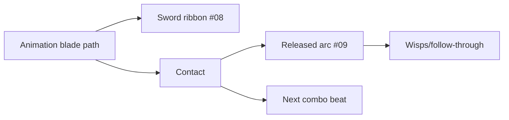

# 1. L09-05 — Wind language: sword slash і slash arc

| Поле | Значення |
|---|---|
| Блок | 09 — Effect Archetypes |
| ID уроку | L09-05 |
| Реєстр архетипів | #08 sword slash; #09 slash arc |
| Elemental language | Wind: tapered negative space, fast sweep, directional wisps і light dissipation |
| Артефакт | Триетапний проєкт **Slash Combo**, `NS_L09_Wind_SwordSlash`, `NS_L09_Wind_SlashArc` |
| Mastery gate | Blade path і released arc розрізняються, combo timing читається, original змінює four axes |

## 2. Результат уроку

Ви зможете:

- розрізняти прикріплений до зброї sword slash і випущений slash arc;
- будувати ribbon path леза й mesh/card arc із reveal/dissolve;
- передавати напрямок атаки й ритм трьох ударів;
- створювати мову Wind через taper, gaps, wisps і швидке dissipation;
- виконувати етичне дослідження референсу лише з власними assets;
- створювати оригінальний варіант зі зміною форми, таймінгу, руху й кольору;
- створювати H/M/L варіанти combo без втрати порядку ударів.

## 3. Орієнтовний час

| Частина | Теорія | Практика | M/S practice |
|---|---:|---:|---:|
| Модель slash/wind/combo | 0.75 | 0.0 | 0.0 |
| Етап 1 — технічна реконструкція | 0.25 | 1.75 | 0.5 |
| Етап 2 — етичний аналіз референсів | 0.0 | 1.25 | 0.0 |
| Етап 3 — оригінальна варіація | 0.0 | 1.5 | 0.5 |
| Gameplay/performance перевірка | 0.0 | 0.5 | 0.0 |
| **Разом** | **1.0** | **5.0** | **1.0** |

## 4. Передумови

| Навичка | Де | Перевірка |
|---|---|---|
| Ribbon і basis endpoints | [L09-04](04_electric_beam_language.md) | Стабільний упорядкований trail |
| Slash texture/mesh | Блоки 05–06 | Власні tapered mask і arc mesh |
| Runtime binding параметрів | L08-03 | User vectors/scalars |
| Фази timing/animation | L02-03 | Contact windows і follow-through |
| Мова Wind | L02-04 | Negative space і спрямований потік |

## 5. Нові терміни

| Термін | Пояснення |
|---|---|
| Sword slash | VFX, що tracing/augmenting actual weapon swing |
| Slash arc | Released або independent crescent shape, що представляє cut force |
| Blade ribbon | Trail між sampled weapon positions |
| Sweep plane | Площина руху атаки |
| Leading edge | Передній висококонтрастний edge slash |
| Follow-through | Motion/readability після contact |
| Combo cadence | Timing relationship між multiple attacks |
| Negative-space cut | Intentional gap, що лишає arc повітряною й directional |

## 6. Навіщо ця тема потрібна VFX-фахівцю

Sword slash має підсилювати animation, а не закривати її. Slash arc може рухатися independently і потребує readable direction/size. Wind identity залежить від thin tapered shapes, gaps і drifting flow; green/cyan tint сам по собі створює generic magic crescent.

Reference study може аналізувати arc coverage, reveal duration, hit spacing і wisps. Не trace-іть frame, не extract-іть slash texture, не copy-іть mesh silhouette і не відтворюйте signature proprietary motif. Provenance лишається mandatory.

## 7. Теорія простими словами

Два пов’язані archetypes:

```text
sword slash = where the blade was
slash arc = force that leaves the blade
```

Перший anchored до animation і recent path. Другий має власні orientation, reveal, velocity і lifetime. Combo читається, коли кожний hit має різні silhouette й interval, але спільну wind language.

## 8. Детальні технічні пояснення

### Три етапи

1. **Технічна реконструкція:** weapon ribbon + один released crescent.
2. **Reference study:** normalized arc angle, thickness ratio, reveal/contact/fade і combo spacing; лише own assets.
3. **Оригінальна варіація:**
   - форма: один crescent → розділений каліграфічний S-hook із negative gap;
   - таймінг: один sweep `.28 s` → ритм трьох ударів `.18/.12/.28 s`;
   - рух: planar sweep → чергування висхідних/спадних arcs плюс зустрічно обертові wisps;
   - колір: pale cyan → біло-зелене ядро, приглушене teal body, малий теплий accent контакту.

### Дискретизація ribbon

Weapon trail потребує двох edge points або stable width/orientation basis. Один sampled center створює ribbon, але може twist-итися. User/tool inputs можуть надавати `BladeBase` і `BladeTip`; ribbon segments треба reset-ити між attacks, щоб не з’єднувати idle positions.

### Reveal для arc

Material Arc відображає normalized age у вікно reveal:

```text
Head = smoothstep(P−Soft, P+Soft, U)
Tail = smoothstep(P−Length−Soft, P−Length+Soft, U)
Band = saturate(Head−Tail)
```

Напрямок Orientation/U потрібно перевірити на власному mesh.

## 9. Візуальні й математичні приклади

Timeline combo:

```text
Hit 1 start .00, contact .10, end .18
Hit 2 start .24, contact .31, end .36
Hit 3 start .48, contact .66, end .76
```

Відстань між сегментами ribbon за speed кінчика леза 2400 cm/s і 60 samples/s ≈40 cm; фактична кривизна може вимагати вищої частоти samples.



## 10. Контрольовані експерименти

### CE09-05-A — Reset ribbon

- Виконайте swing, зачекайте секунду й виконайте swing в іншому місці.
- A зберігає історію emitter; B скидає її на початку атаки.
- A може з’єднати idle jump; B починається чисто.

### CE09-05-B — Напрямок reveal arc

- Перевірте U orientation mesh за допомогою debug gradient red→green.
- Reveal 0→1.
- Запишіть, який кінець є leading; не вгадуйте після rotation texture.

### CE09-05-C — Wind без color

- Використайте білі materials без bloom.
- Порівняйте щільний суцільний crescent із tapered split arc + wisps.
- Wind має читатися з форми й руху.

## 11. Покрокова керована практика

### Етап 1 — технічна реконструкція

1. Створіть `NS_L09_Wind_SwordSlash` із `NE_BladeRibbon`, `NE_Contact`, `NE_Wisps`.
2. Передайте `User.BladeBase`, `User.BladeTip`, `User.AttackActive`, colors і width.
3. Ribbon дискретизує path леза 60/s, поки атака active; lifetime `.16`, width від відстані base-tip або `User.BladeWidth`.
4. Виконуйте перевірені reset/deactivate ribbon на початку й наприкінці атаки.
5. Створіть `NS_L09_Wind_SlashArc` із `NE_Arc`, `NE_EdgeStreaks`, `NE_AfterWisps`.
6. Arc — один mesh, lifetime `.32`, reveal `0→1` за `.14`, fade `.18`; scale `1→1.18`.
7. Edge streaks: burst 8, velocity уздовж tangent slash `350–700`; wisps: burst 6, life `.5–.8`, drag/curl.

### Етап 2 — етичний аналіз референсів

1. Запишіть source/date референсу й лише виміряні пропорції.
2. Занотуйте arc angle, thickness:length, reveal/contact/fade та інтервали combo.
3. Відбудуйте ефект із власних slash texture/mesh/material.
4. Заборонено traced contour, extracted texture або точну впізнавану signature.
5. Запишіть три відхилення й provenance.

### Етап 3 — оригінальна варіація

1. Побудуйте `NS_L09_Wind_SlashCombo_Calligraphy` із трьох hits.
2. Hit 1: rising split hook; Hit 2: короткий falling counter-cut; Hit 3: широка S arc.
3. Таймінг використовує active lengths `.18/.12/.28` із gaps `.06/.12`.
4. Wisps обертаються проти кожної arc; третій hit випускає два затримані тонкі echoes.
5. Нова color hierarchy white-green/teal із теплим accent контакту.
6. Перевірте з ігрової камери, зберігаючи видимим силует animation.

Потребує ручної перевірки в Unreal Engine 5.8. Exact animation/socket parameter update path, ribbon reset/lifecycle, persistent ordering, mesh orientation and material dynamic parameter bindings звірте у встановленому build.

## 12. Точна структура Niagara: стеки, матеріали, ресурси, дані й привʼязки

### Контракт User для sword slash

```text
User.BladeBase   Vector3
User.BladeTip    Vector3
User.AttackActive Bool
User.BladeWidth  Float = 12
User.PrimaryColor LinearColor = (.4,5,3,1)
User.SecondaryColor LinearColor = (.05,1.2,1.0,1)
User.ComboIndex Int = 0
```

### `NE_BladeRibbon`

```text
CPU Sim, Local Space Off
Emitter Update: Spawn Rate 60 × AttackActive
Particle Spawn:
  Initialize Lifetime .16
  Position = lerp(User.BladeBase,User.BladeTip,.5)
  Ribbon Width = distance(Base,Tip) or authored width
  Color = PrimaryColor
Particle Update:
  Particle State
  Scale Ribbon Width (0,.2),(.2,1),(1,0)
  Scale Alpha (0,0),(.08,1),(1,0)
Ribbon Renderer: M_VFX_Wind_BladeRibbon
Bindings: Position, RibbonWidth, Color, validated order/link
```

### Stack slash arc

```text
NE_Arc:
  CPU Sim, Local Space Off, Burst 1
  Initialize Lifetime .32; Mesh Scale 1.0; Color Primary
  Set Material Dynamic Parameter X = Particles.NormalizedAge
  Scale Mesh Size 1.0→1.18
  Scale Alpha 1→0 after .45 normalized age
  Mesh Renderer SM_VFX_SlashArc, M_VFX_Wind_SlashReveal

NE_EdgeStreaks:
  Burst 8; Lifetime .18–.32; Sprite (5–10,40–90)
  Velocity tangent 350–700 + random 80
  Drag 3 → Solve Forces and Velocity

NE_AfterWisps:
  Burst 6; Lifetime .5–.8; Sprite 25–70
  Velocity tangent 80–180; Curl Noise 24; Drag 2.5
```

### Контракт material

```text
DynamicParameter.X = RevealProgress
MeshUV.U + RevealProgress → head/tail smoothstep band
SlashTexture.R × Band × ParticleColor.A → Opacity
SlashTexture.R × Band × ParticleColor.RGB × Emissive(5) → Emissive
```

Власні assets: `T_Slash_Crescent_1024`, `T_EnergyWisps_Seamless_512`, `SM_VFX_SlashArc`; traced/extracted content із референсу відсутній.

Потребує ручної перевірки в Unreal Engine 5.8. Exact Material Dynamic Parameter binding fields, ribbon width/orientation attributes, spawn ordering and renderer UV conventions звірте у встановленому build.

## 13. Стартові значення

| Параметр | Старт | Діапазон |
|---|---:|---:|
| Ribbon rate/lifetime | 60/s / .16 s | 30–120 / .08–.25 |
| Arc lifetime | .32 s | .18–.55 |
| Reveal | .14 s | .08–.25 |
| Arc scale | 1→1.18 | .8–1.5 |
| Streaks | 8 | 0–14 |
| Wisps | 6 | 0–10 |
| Wisp life | .5–.8 | .3–1.2 |
| Combo beats | .18/.12/.28 | створені вручну |
| Bounds radius | 350 cm | виміряний |

## 14. Очікуваний результат кожного етапу

| Етап | Доказ |
|---|---|
| Sword slash | Ribbon слідує за лезом і чисто скидається |
| Slash arc | Випущений crescent відкривається в напрямку атаки |
| Дослідження референсу | Лише метрики/provenance |
| Оригінальна форма | Сімейство split S-hook |
| Оригінальний таймінг | Три виразні beats combo |
| Оригінальний рух | Rising/falling/counter wisps |
| Оригінальний колір | Нова ієрархія, а не лише recolor |
| Перевірка tier | Порядок hits читається в H/M/L |

## 15. Самостійна вправа A

### EX-L09-05-A — Чистий sword ribbon

Побудуйте #08 sword slash для трьох attack motions.

- дані Base/tip або рівнозначний стабільний basis леза;
- немає лінії через idle/teleport;
- width/timing слідують за animation, не перекриваючи персонажа;
- власні material/texture;
- H/M/L і restart tests.

## 16. Додаткова складніша вправа B

### EX-L09-05-B — Оригінальна вітряна Slash Combo

Пройдіть три stages для #09 slash arc.

- три hits мають спільну мову Wind, але різні силуети;
- оригінальні зміни за чотирма осями задокументовано;
- референс використано лише як метрики;
- умова приймання: самоперевірка визначає порядок hits у gameplay capture у відтінках сірого.

## 17. Три підказки для кожної вправи

### EX-L09-05-A

1. **Hint 1:** sample-іть лише під час active attack і reset-іть history для кожного swing.
2. **Hint 2:** передайте blade base/tip; ribbon center/width або two-edge strategy має бути stable.
3. **Hint 3:** 60/s, `.16 s` lifetime, alpha 0→1→0; на attack start clear/reinitialize; в end stop spawn і дайте fade.

[Повне рішення EX-L09-05-A](../EXERCISE_ANSWERS/L09-05_wind_slash_language_answers.md#ex-l09-05-a)

### EX-L09-05-B

1. **Hint 1:** combo identity спершу походить із silhouette і cadence.
2. **Hint 2:** використайте rising hook, falling counter-cut і wide S arc; чергуйте wisp rotation.
3. **Hint 3:** active `.18/.12/.28`, gaps `.06/.12`; third hit додає two delayed echoes; white-green core/teal body/warm contact.

[Повне рішення EX-L09-05-B](../EXERCISE_ANSWERS/L09-05_wind_slash_language_answers.md#ex-l09-05-b)

## 18. Типові помилки

| Помилка | Симптом | Виправлення |
|---|---|---|
| Ribbon постійно створює частинки | Idle loops/довгі connectors | Gate/reset атаки |
| Slash перекриває персонажа | Animation нечитабельна | Вужчий/зміщений/коротший alpha |
| U для Arc інвертовано | Reveal іде назад | UV debug |
| Три однакові hits | Combo пласке | Контраст форми й ритму |
| Wind = лише green | Загальний slash | Gaps/taper/wisps |
| Обведено кадр референсу | Порушення етики | Власна геометрична побудова |
| Low tier прибирає arc | Порядок hits неясний | Зберегти основні силуети |
| Bounds затісні | Arc/wisps раптово зникають | Перевірка повного sweep |

## 19. Пошук несправностей

| Симптом | Діагностика | Виправлення |
|---|---|---|
| Ribbon перекручується | Debug Base/tip/basis | Стабільні orientation/data |
| Gap на fast swing | Sample distance/rate | Вищий rate або distance-based spawn |
| Старий swing з’єднується | History/lifecycle | Reset emitter |
| Arc у wrong plane | Mesh axes/User normal | Орієнтуйте sweep plane |
| Reveal invisible | Dynamic parameter/UV | Bind і preview scalar |
| Contact accent запізнюється | Animation timeline | Align spawn/notify test |
| Combo clutter | Solo кожного hit | Зменште overlap/dissipation |

## 20. Продуктивність і рівні High/Medium/Low

| Рівень | Sword ribbon | Шари Arc | Wisps/streaks |
|---|---|---|---|
| High | 90/s, .20 s | основний + 2 echoes | 10/12 |
| Medium | 60/s, .16 s | основний + 1 echo на finisher | 5/6 |
| Low | 30/s, .12 s | одна primary arc на кожен hit | 0/0 |

- Зберігайте силуети й ритм трьох hits.
- Довгі широкі ribbons і arcs на весь екран збільшують translucent overdraw.
- Mesh arc може складатися з однієї частинки, але мати дороге material coverage.
- Перевірте повне combo для ×1 і ×5 одночасних персонажів.
- Low прибирає вторинні wisps/echoes раніше за primary arc.
- Вимірюйте bounds для кожної атаки, а не спільні bounds розміром зі світ.

Потребує ручної перевірки в Unreal Engine 5.8. Exact ribbon sample/reset behavior, animation integration, material binding, bounds and renderer-cost tools звірте у встановленому build.

## 21. Запитання для самоперевірки

1. Що таке #08 і #09?
2. Чим відрізняються sword slash і slash arc?
3. Навіщо reset-ити ribbon history?
4. Що робить wind читабельним без color?
5. Які four axes змінюються?
6. Як перевіряється reveal direction?
7. Що зберігає Low tier?
8. Чому character silhouette має лишатися visible?

## 22. Відповіді

1. Sword slash і slash arc.
2. Один traces weapon motion; другий є released/independent force shape.
3. Щоб запобігти connections між idle/teleport/previous swing.
4. Taper, gaps, fast sweep і directional wisps/light fade.
5. Shape, timing, motion і color.
6. Debug UV gradient і controlled progress 0→1.
7. Primary arc/ribbon і three-hit cadence.
8. Gameplay animation повідомляє attack pose, timing і threat.

## 23. Чекліст самоперевірки

- [ ] #08–09 внесено до реєстру.
- [ ] Blade trail скидається кожну атаку.
- [ ] Напрямок reveal Arc задокументовано.
- [ ] Перевірку власних assets/provenance пройдено.
- [ ] Із референсу взято лише метрики.
- [ ] Combo змінено за чотирма осями.
- [ ] Порядок hits читається у відтінках сірого.
- [ ] H/M/L зберігають ритм.
- [ ] Bounds/concurrency захоплено.
- [ ] До M/S ledger додано 1.0 години.

## 24. Критерії опанування

1. Sword ribbon слідує за path без застарілих connectors.
2. Напрямок/reveal slash arc правильні.
3. Ідентичність Wind зберігається у відтінках сірого.
4. Три hits різні й цілісні.
5. Етичну перевірку референсу пройдено.
6. Є оригінальна різниця за чотирма осями.
7. Є докази tiers/performance.
8. Правильні щонайменше 7/8 відповідей.

## 25. Підсумок

- Sword slash малює історію леза; slash arc випускає силу.
- Мова Wind використовує taper, negative space, sweep і wisps.
- Ритм combo є задачею дизайну таймінгу.
- Референс вимірюють, але ніколи не вилучають і не обводять.
- H/M/L зберігають порядок hits і основний силует.

## 26. Зв’язок із наступними уроками

[L09-06](06_earth_ground_response.md) перетворює короткі повітряні arcs на тривалі ground marks: impact normal, правдивий радіус і поетапний residue стають координацією crack/debris/wave.

## 27. Офіційні джерела

- [NIA-05 — System and Emitter Module Reference](https://dev.epicgames.com/documentation/en-us/unreal-engine/system-and-emitter-module-reference-for-niagara-effects-in-unreal-engine) — Epic Games, UE 5.8, доступ 2026-07-27.
- [NIA-06 — Render Module Reference](https://dev.epicgames.com/documentation/en-us/unreal-engine/render-module-reference-for-niagara-effects-in-unreal-engine) — Epic Games, UE 5.8, доступ 2026-07-27.
- [NIA-07 — System Settings Reference](https://dev.epicgames.com/documentation/en-us/unreal-engine/system-settings-reference-for-niagara-effects-in-unreal-engine) — Epic Games, UE 5.8, доступ 2026-07-27.
- [BP-02 — Spawn System Attached](https://dev.epicgames.com/documentation/en-us/unreal-engine/BlueprintAPI/Niagara/SpawnSystemAttached) — Epic Games, UE 5.8, доступ 2026-07-27.
- [PERF-01 — Measuring Performance in Niagara](https://dev.epicgames.com/documentation/en-us/unreal-engine/measuring-performance-in-niagara) — Epic Games, UE 5.8, доступ 2026-07-27.

## 28. Рекомендовані скриншоти або схеми

```text
Скриншот 1
Відкрити: BladeBase/BladeTip ribbon debug.
Показати: active gate, reset and three swing paths.
Виділити: no stale connector.
```

```text
Скриншот 2
Відкрити: three-stage Slash Combo board.
Показати: reference metrics/provenance and three white silhouettes.
Виділити: shape/timing/motion/color delta.
```

```text
Скриншот 3
Відкрити: H/M/L gameplay capture.
Показати: character silhouette, hit order, bounds/overdraw.
Виділити: retained primary arcs.
```
