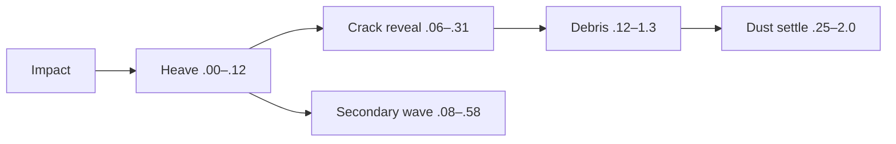

# 1. L09-06 — Earth language: ground crack і secondary shockwave

| Поле | Значення |
|---|---|
| Блок | 09 — Effect Archetypes |
| ID уроку | L09-06 |
| Archetype ledger | #10 ground crack; secondary shockwave є mandatory response layer |
| Elemental language | Earth: chunky low-frequency masses, weight, delayed uplift, debris і settling dust |
| Артефакт | `NS_L09_Earth_GroundResponse` |
| Mastery gate | Surface-aligned crack/radius cue, caused debris, ethical reference і four-axis original fault variant |

## 2. Результат уроку

Ви зможете:

- будувати читабельний ground crack без залежності від proprietary decals;
- вирівнювати crack plane, secondary wave і debris за impact normal;
- координувати reveal, heave, debris і settle dust;
- відрізняти архетип ground crack у реєстрі від обов’язкової вторинної реакції;
- виконувати дослідження референсу лише з оригінальними textures/meshes;
- створювати оригінальний варіант зі зміною форми, таймінгу, руху й кольору;
- подавати H/M/L tiers із доказами radius/bounds/overdraw/collision.

## 3. Орієнтовний час

| Частина | Теорія | Практика | M/S practice |
|---|---:|---:|---:|
| Модель ground response/earth | 0.75 | 0.0 | 0.0 |
| Stage 1 — технічна реконструкція | 0.25 | 1.75 | 0.5 |
| Stage 2 — етичне reference study | 0.0 | 1.25 | 0.0 |
| Stage 3 — оригінальна варіація | 0.0 | 1.5 | 0.5 |
| Surface/performance перевірка | 0.0 | 0.5 | 0.0 |
| **Разом** | **1.0** | **5.0** | **1.0** |

## 4. Передумови

| Навичка | Де | Перевірка |
|---|---|---|
| Ground-aligned radius | [L09-03](03_ice_shockwave_language.md) | Три перевірки схилів |
| Власна crack/noise texture | Блоки 05–06 | Оригінальна mask/procedural source |
| Mesh і pivot debris | Блок 06 | Low-poly mesh, перевірений у UE |
| Вибір collision | L08-01 | Декоративний fallback |
| Мова Earth | L02-04 | Вага, low frequency, settle |

## 5. Нові терміни

| Термін | Пояснення |
|---|---|
| Ground crack | Persistent surface mark, що повідомляє impact/fracture |
| Secondary shockwave | Expanding response, спричинена ground impact |
| Surface bias | Малий normal offset, що запобігає z-fighting |
| Heave | Враження upward/lateral ground motion |
| Debris family | Малий набір власних mesh variants і scales |
| Settle dust | Повільний low-contrast residue після heavy action |
| Fault line | Асиметричний домінантний напрямок crack |
| Terrain conformity | Наскільки projection/mesh слідує uneven surface |

## 6. Навіщо ця тема потрібна VFX artist

Ground response прив’язує airborne effects до world scale і material. Crack, що floats, z-fights або проходить крізь stairs, руйнує illusion. Secondary wave показує impact propagation; debris/dust показують weight. Ground mark може persist довше за інші layers, тому його readability і cost важливі.

Reference ethics: спостерігайте crack density, dominant direction, debris delay і dust duration; не extract-іть decal textures, terrain meshes або proprietary fracture shapes. Mask і mesh створюйте самостійно.

## 7. Теорія простими словами

Earth response читається:

```text
hit → ground pushes back → cracks travel → chunks lift → dust settles
```

Crack є ledger archetype. Secondary wave потрібна для показу force, але не рахується як twentieth archetype. Heavy effect зазвичай трохи затримує частину motion; усе, що вибухає у frame zero, відчувається weightless.

## 8. Детальні технічні пояснення

### Три stages

1. **Технічна реконструкція:** radial crack plane, expanding secondary ring, debris і dust.
2. **Reference study:** normalized radius, reveal speed, chunk scale, delay і residue; лише own assets.
3. **Оригінальна варіація:**
   - форма: radial star → зміщені прямокутні тектонічні fault plates;
   - таймінг: миттєвий crack → heave `.12 s`, затриманий collapse `.28 s`;
   - рух: рівномірний radial → спрямований lateral uplift, потім settle;
   - колір: brown/orange → slate body, ochre edge, стриманий moss accent.

### Вирівнювання за поверхнею

Створіть tangent/bitangent basis із `User.ImpactNormal` і dominant `User.ImpactDirection`. Offset-ніть crack mesh уздовж normal на `1.5 cm` як стартовий candidate. Надто високо — visibly floats; надто низько — z-fights. Uneven terrain може потребувати decal/projection або geometry conformity понад один flat mesh.

### Тривалість

Crack lifetime `3.0 s`: reveal `.25`, hold `2.0`, fade `.75`. Не тримайте invisible particles alive indefinitely. Persistent marks потребують concurrency policy у Block 10.

## 9. Візуальні й математичні приклади

Швидкість ground wave:

```text
Radius 500 cm / .5 s = 1000 cm/s
```

Балістична оцінка debris:

```text
initial Z 400 cm/s, gravity −980
time to apex ≈ .41 s
height ≈ 82 cm
```



## 10. Контрольовані експерименти

### CE09-06-A — Зміщення від поверхні

- Перевірте offsets crack plane `.1`, `1.5`, `5 cm`.
- Перевірте площину, схил 20° і зону біля краю сходинки.
- Запишіть баланс z-fight проти float.

### CE09-06-B — Delay ваги

- У A всі шари починаються в 0.
- У B: heave 0, wave .08, debris .12, dust .25.
- Сліпа самоперевірка визначає B як важчий.

### CE09-06-C — Цінність collision

- Порівняйте 16 debris із visual collision та детермінованим ballistic fade.
- Виміряйте цільовий build; оцініть, чи bounce додає видиму цінність.

## 11. Покрокова guided practice

### Stage 1 — технічна реконструкція

1. Створіть `NS_L09_Earth_GroundResponse`: `NE_Heave`, `NE_Crack`, `NE_Wave`, `NE_Debris`, `NE_Dust`.
2. Відкрийте center/normal/direction/radius/colors/ground offset.
3. `NE_Heave`: один низький cylinder/ring mesh `.18 s`, scale `.3→1`, offset уздовж normal `0→12→0 cm`.
4. `NE_Crack`: один plane/mesh, life 3 s, reveal 0→1 за `.25`, hold, fade.
5. `NE_Wave`: spawn `.08`, life `.50`, expansion radius `.05→1`.
6. `NE_Debris`: 16 meshes у `.12`, life `.8–1.4`, speed radial `180–520`, normal `180–460`, gravity `−980`.
7. `NE_Dust`: 10 sprites у `.25`, life `1.0–1.8`, size `80–220`, speed `30–100`, drag/curl.
8. Перевірте surface alignment, перетин terrain, bounds та ігровий радіус.

### Stage 2 — етичне reference study

1. Запишіть лише референс і спостереження.
2. Виміряйте length/radius основного fault, щільність branching, затримку debris й тривалість dust:action.
3. Відбудуйте власну crack mask із геометричних/procedural lines; використайте власний debris mesh.
4. Запишіть provenance і три відхилення.

### Stage 3 — оригінальна варіація

1. Створіть дублікат `NS_L09_Earth_GroundResponse_Tectonic`.
2. Замініть radial mask трьома зміщеними rectangular plates і одним diagonal fault.
3. Heave `.12`, пауза `.08`, delayed collapse у `.28`.
4. Рух на 70% зміщено вздовж `ImpactDirection`; uplift/settle plates чергуються.
5. Палітра: slate, ochre edge, moss accent; збережіть вагу Earth у відтінках сірого.
6. Порівняйте technical/reference/original за однакових camera/radius.

Потребує ручної перевірки в Unreal Engine 5.8. Exact Decal Renderer availability/status, mesh/decal orientation, surface-normal basis, collision modules, normal offset and material parameter bindings звірте у встановленому build.

## 12. Точні Niagara stacks, materials, assets, data і bindings

### Контракт User

```text
User.ImpactCenter    Vector3
User.ImpactNormal    Vector3 = (0,0,1)
User.ImpactDirection Vector3 = (1,0,0)
User.RadiusCm        Float = 500
User.GroundOffsetCm  Float = 1.5
User.PrimaryColor    LinearColor = (.55,.18,.035,1)
User.EdgeColor       LinearColor = (2.2,.55,.08,1)
User.Seed            Int = 906
```

### Шари ground

```text
NE_Heave:
  Burst 1; Lifetime .18
  Mesh SM_VFX_GroundDisc; Scale .3→1.0
  Position = Center + Normal×curve(0,12,0)

NE_Crack:
  Burst 1 at .06; Lifetime 3.0
  Mesh plane/ground card aligned to normal
  Position = Center + Normal×GroundOffsetCm
  DynamicParameter.X = NormalizedAge/reveal
  Mesh Renderer M_VFX_Earth_Crack

NE_Wave:
  Burst 1 at .08; Lifetime .50
  Mesh Scale .05→radius target
  Mesh Renderer SM_VFX_Ring_16, M_VFX_Earth_Wave
```

### Debris/dust

```text
NE_Debris:
  CPU candidate; Burst 16 at .12
  Initialize Lifetime .8–1.4; Mesh Scale .3–1.0
  Disc Location Radius 30–160 in impact plane
  Velocity radial 180–520 + normal 180–460
  Gravity −980 → Drag .25 → Solve Forces and Velocity
  Angular Velocity random −3..3
  Mesh Renderer SM_VFX_Debris_A/B/C, M_VFX_Earth_Debris

NE_Dust:
  Burst 10 at .25
  Lifetime 1.0–1.8; Sprite 80–220
  Velocity radial 30–100 + normal 15–50
  Curl Noise 18 → Drag 2.8 → Solve
  Sprite Renderer M_VFX_Dust_Translucent
```

### Material crack

```text
DynamicParameter.X → RevealProgress
CrackTexture.R and UV-direction reveal → RevealMask
RevealMask × ParticleColor.A → Opacity/Opacity Mask
RevealMask × ParticleColor.RGB × Emissive(2.5) → Emissive
NoiseTexture.R panned slowly → edge variation
```

Власні assets: `T_GroundCrack_1024`, `T_Noise_Seamless_512`, `SM_VFX_GroundDisc`, три low-poly debris meshes.

Потребує ручної перевірки в Unreal Engine 5.8. Exact renderer support/status, orientation and decal/mesh projection limitations, mesh selection binding and collision input names звірте у встановленому build.

## 13. Стартові значення

| Параметр | Старт | Діапазон |
|---|---:|---:|
| Radius | 500 cm | 250–800 |
| Ground offset | 1.5 cm | .1–5 |
| Crack reveal/hold/fade | .25/2/.75 s | створені вручну |
| Wave delay/life | .08/.50 s | .02–.2/.3–.8 |
| Debris | 16 | 4–28 |
| Debris speed | 180–520 + Z 180–460 | 100–800 |
| Dust | 10 | 0–16 |
| Dust life | 1–1.8 s | .5–2.5 |
| Bounds radius/Z | 850/500 cm | виміряний |

## 14. Очікуваний результат кожного етапу

| Етап | Доказ |
|---|---|
| Технічний crack | Surface mark читабельна й стабільна |
| Secondary wave | Поширення радіуса/сили зрозуміле |
| Debris/dust | Затримана вага й settle |
| Дослідження референсу | Лише пропорції/provenance |
| Оригінальна форма | Тектонічні plates/fault |
| Оригінальний таймінг | Heave/pause/collapse |
| Оригінальний рух | Спрямований lateral uplift |
| Оригінальний колір | Ієрархія slate/ochre/moss |

## 15. Самостійна вправа A

### EX-L09-06-A — Ground crack, безпечний для поверхні

Побудуйте #10 ground crack із secondary shockwave.

- перевірки flat/20°/stair-edge;
- власні crack texture і debris meshes;
- контракт radius і lifetime;
- докази z-fight/floating;
- перевірка H/M/L і concurrency.

## 16. Додаткова складніша вправа B

### EX-L09-06-B — Оригінальна реакція тектонічного розлому

Пройдіть три stages.

- лише метрики референсу;
- зміни форми, таймінгу, руху й кольору задокументовано;
- асиметричний fault і далі передає ігрові center/radius;
- secondary wave лишається читабельною, а debris — спричиненим;
- приймання з ігрової камери й у відтінках сірого.

## 17. Три підказки для кожної вправи

### EX-L09-06-A

1. **Hint 1:** відокремте surface mark від airborne response і перевірте normal offset.
2. **Hint 2:** crack plane використовує impact basis; wave — radius; debris починається після heave.
3. **Hint 3:** offset start 1.5 cm, crack reveal .25/hold2/fade.75, wave .08/.50, debris .12; порівняйте slopes і stair edge.

[Повне рішення EX-L09-06-A](../EXERCISE_ANSWERS/L09-06_earth_ground_response_answers.md#ex-l09-06-a)

### EX-L09-06-B

1. **Hint 1:** asymmetry потребує dominant fault direction, але зберігає center cue.
2. **Hint 2:** three plate cards, staggered heave/collapse і direction-biased debris.
3. **Hint 3:** plates під −18°/12°/38°, delays 0/.04/.08; collapse `.28`; velocity 70% ImpactDirection; slate/ochre/moss.

[Повне рішення EX-L09-06-B](../EXERCISE_ANSWERS/L09-06_earth_ground_response_answers.md#ex-l09-06-b)

## 18. Типові помилки

| Помилка | Симптом | Fix |
|---|---|---|
| Plane зависоко або занизько | Float/z-fight | Контрольована перевірка bias |
| Перевірено лише площину | Перетинає схили | Basis normal і межі conformity |
| Усе в t=0 | Немає ваги | Затримані heave/debris/dust |
| Випадковий дрібний debris | Шум гравію | Ієрархія масштабу low-frequency |
| Crack триває вічно | Витік concurrency | Політика lifetime/fade/pool |
| Secondary wave відсутня | Радіус сили неясний | Зберегти обов’язкову реакцію |
| Лише brown recolor | Загальний impact | Тектонічне перепроєктування за чотирма осями |
| Decal скопійовано | Порушення етики | Власні mask/provenance |

## 19. Пошук несправностей

| Симптом | Діагностика | Виправлення |
|---|---|---|
| Crack повернуто неправильно | Impact axes debug | Виправте tangent basis |
| Z-fight | Offset sweep | Підніміть мінімально/material choice |
| Floats на uneven terrain | Terrain profile | Decal/projection/conforming alternative або scope |
| Debris стартує під ground | Spawn offset/normal sign | Offset уздовж normal |
| Радіус Wave не збігається | Debug circle/mesh bounds | Відобразіть фактичні розміри |
| Dust робить view muddy | Solo/alpha/size | Delay/lower contrast |
| Culling на debris apex | Bounds view | Include ballistic max |

## 20. Performance і High/Medium/Low

| Рівень | Шари Ground | Debris | Dust/collision |
|---|---|---:|---|
| High | crack + heave + wave | 20, 3 meshes | 12; обмежений collision |
| Medium | crack + wave | 10, 2 meshes | 6; балістичний рух |
| Low | crack + проста wave | 4 або 0 | 0 |

- Зберігайте center/radius crack і secondary wave на всіх tiers.
- Persistent ground cards збільшують overlap/concurrency; задайте lifetime.
- Вибір decal/mesh має різні компроміси projection/draw; виміряйте встановлений path.
- Collision для mesh debris є необов’язковим декоративним шаром.
- Перевірте 1, 6 і 20 недавніх impacts, включно з overlapping ground marks.
- Bounds охоплюють радіус/висоту debris, а не довільну тривалу область світу.

Потребує ручної перевірки в Unreal Engine 5.8. Exact decal/mesh renderer performance, collision cost, bounds and Effect Type/scalability controls звірте у встановленому build.

## 21. Запитання для самоперевірки

1. Який archetype має номер #10?
2. Як рахується secondary shockwave?
3. Навіщо delay-ити debris/dust?
4. Яку проблему вирішує GroundOffset?
5. Навіщо тестувати slopes/stairs?
6. Які four axes змінюються?
7. Що лишається в Low?
8. Чому persistent cracks створюють concurrency issue?

## 22. Відповіді

1. Ground crack.
2. Mandatory response layer, а не additional ledger archetype.
3. Це створює causality/weight і зберігає contact readability.
4. Він балансує z-fighting і visible floating.
5. Flat card може не conform-итися до uneven geometry.
6. Shape, timing, motion і color.
7. Crack center/radius і simple secondary wave.
8. Багато long-lived overlapping marks накопичують particles/draws/overdraw.

## 23. Чекліст самоперевірки

- [ ] #10 внесено до реєстру, secondary wave доведено.
- [ ] Використано власні crack/debris assets.
- [ ] Захоплено три перевірки поверхні.
- [ ] Контракт radius/lifetime задокументовано.
- [ ] Дослідження референсу етичне.
- [ ] Оригінальний варіант змінює чотири осі.
- [ ] H/M/L зберігають ground cue.
- [ ] Перевірку persistent overlap завершено.
- [ ] Bounds охоплюють вершину debris.
- [ ] До M/S ledger додано 1.0 години.

## 24. Критерії опанування

1. Crack стабільний на заявлених типах поверхні.
2. Secondary wave передає радіус.
3. Таймінг debris/dust відчувається спричиненим і важким.
4. Ідентичність Earth зберігається у відтінках сірого.
5. Перевірку reference/provenance пройдено.
6. Є оригінальна різниця за чотирма осями.
7. Є докази tiers/concurrency.
8. Правильні щонайменше 7/8 відповідей.

## 25. Підсумок

- Ground crack прив’язує impact до світу.
- Secondary shockwave передає поширення.
- Мова Earth використовує вагу, затримку, chunks і settle.
- Surface conformity і persistence є виробничими обмеженнями.
- Оригінальний тектонічний варіант змінює всі чотири осі.

## 26. Зв’язок із наступними уроками

[L09-07](07_nature_aura_and_area.md) розширює persistence від одноразової ground mark до тривалих станів персонажа й області з читабельними enter/loop/exit.

## 27. Офіційні джерела

- [NIA-05 — System and Emitter Module Reference](https://dev.epicgames.com/documentation/en-us/unreal-engine/system-and-emitter-module-reference-for-niagara-effects-in-unreal-engine) — Epic Games, UE 5.8, доступ 2026-07-27.
- [NIA-06 — Render Module Reference](https://dev.epicgames.com/documentation/en-us/unreal-engine/render-module-reference-for-niagara-effects-in-unreal-engine) — Epic Games, UE 5.8, доступ 2026-07-27.
- [NIA-07 — System Settings Reference](https://dev.epicgames.com/documentation/en-us/unreal-engine/system-settings-reference-for-niagara-effects-in-unreal-engine) — Epic Games, UE 5.8, доступ 2026-07-27.
- [PERF-02 — Scalability and Best Practices](https://dev.epicgames.com/documentation/en-us/unreal-engine/scalability-and-best-practices-for-niagara) — Epic Games, UE 5.8, доступ 2026-07-27.
- [BP-01 — Spawn System at Location](https://dev.epicgames.com/documentation/en-us/unreal-engine/BlueprintAPI/Niagara/SpawnSystematLocation) — Epic Games, UE 5.8, доступ 2026-07-27.

## 28. Рекомендовані скриншоти або схеми

```text
Скриншот 1
Відкрити: flat/slope/stair surface matrix.
Показати: crack offset, normal axes and secondary radius.
Виділити: z-fight/float limits.
```

```text
Скриншот 2
Відкрити: layer timeline.
Показати: heave, crack, wave, debris, dust.
Виділити: weight-causing delays.
```

```text
Скриншот 3
Відкрити: three-stage and H/M/L comparison.
Показати: original tectonic fault and provenance.
Виділити: retained center/radius.
```
