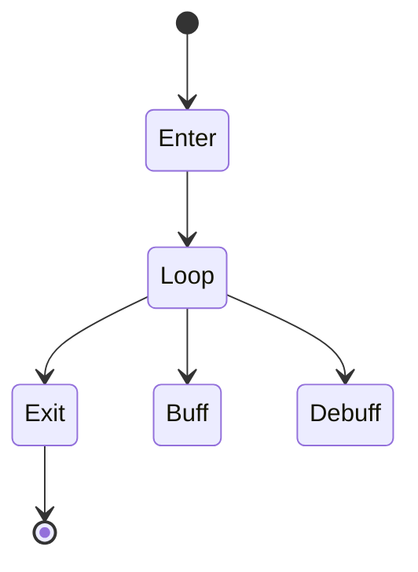

# 1. L09-07 — Nature language: aura, buff/debuff і lingering area effect

| Поле | Значення |
|---|---|
| Блок | 09 — Effect Archetypes |
| ID уроку | L09-07 |
| Реєстр архетипів | #11 aura; #12 buff/debuff; #13 lingering area effect |
| Elemental language | Nature: growth, branching, breathing cycles, orbit/germination і wilt/return |
| Артефакт | `NS_L09_Nature_Aura`, `NS_L09_Nature_Area`, Aura/Transformation study input |
| Mastery gate | Enter/loop/exit і buff/debuff states читаються через shape/motion, area radius лишається truthful |

## 2. Результат уроку

Ви зможете:

- будувати attached aura з явним життєвим циклом enter/loop/exit;
- розрізняти buff і debuff не лише кольором;
- створювати тривалу boundary і внутрішню активність ігрової області;
- керувати radius/state/intensity з авторитетних ігрових даних;
- виконувати етичне дослідження референсу з оригінальними leaves/masks/meshes;
- створювати оригінальний міцеліальний варіант за чотирма осями;
- керувати persistence, bounds, overlap і H/M/L.

## 3. Орієнтовний час

| Частина | Теорія | Практика | M/S practice |
|---|---:|---:|---:|
| Модель aura/state/area | 0.75 | 0.0 | 0.0 |
| Stage 1 — технічна реконструкція | 0.25 | 1.75 | 0.5 |
| Stage 2 — етичне reference study | 0.0 | 1.25 | 0.0 |
| Stage 3 — оригінальна варіація | 0.0 | 1.5 | 0.5 |
| Persistence/performance перевірка | 0.0 | 0.5 | 0.0 |
| **Разом** | **1.0** | **5.0** | **1.0** |

## 4. Передумови

| Навичка | Де | Перевірка |
|---|---|---|
| Тривалий ground layer | [L09-06](06_earth_ground_response.md) | Міркування про lifetime/concurrency |
| Attached systems | [L09-02](02_water_projectile_language.md) | Життєвий цикл component |
| User parameters | L08-03 | Binding state/radius/intensity |
| Власні leaves/rings/noise | Блоки 05–06 | Provenance та import |
| Стильова мова Nature | L02-04 | Правила growth/branch/wilt |

## 5. Нові терміни

| Термін | Пояснення |
|---|---|
| Aura | Persistent character-centered effect, що повідомляє state |
| Buff | Positive state cue; тут open/upward/growing |
| Debuff | Negative state cue; тут constricting/downward/wilting |
| Lingering area | Тривала ігрова область у world space |
| Enter/loop/exit | Lifecycle phases для activation, steady state і removal |
| Boundary cue | Чіткий outer radius gameplay area |
| Interior density | Activity усередині boundary, secondary до radius |
| Breathing cycle | Повільний intensity/scale pulse, що нагадує living growth |
| State-safe readability | Meaning зберігається у color-blind/grayscale view |

## 6. Навіщо ця тема потрібна VFX artist

Persistent effects довго конкурують із characters, environment і combat cues. Aura не повинна приховувати animation. Buff/debuff мають лишатися distinguishable без reliance на green/red. Lingering area має показувати exact safe/danger radius і state changes.

Reference study може аналізувати enter duration, loop cadence, radius/owner ratio і density. Воно не може copy-ити leaf sprites, rune rings, shaders, meshes або exact signature growth patterns. Усі assets original.

## 7. Теорія простими словами

Aura — це wearable sentence:

```text
enter: state arrived
loop: state is active
exit: state ended
```

Buff opens і rises. Debuff closes і sinks. Area boundary відповідає «where», interior — «what element». Nature breathes і grows, а не flashing continuously.

## 8. Детальні технічні пояснення

### Три stages

1. **Технічна реконструкція:** attached leaf aura, buff/debuff mode і world-space lingering circle.
2. **Reference study:** лише phase ratios, density, boundary contrast і state motion; own assets.
3. **Оригінальна варіація:**
   - форма: circular leaf orbit → п’ятилопатеві mycelial/petal cells;
   - таймінг: рівномірний loop → germination `.25 s`, breathing `.9 s`, staggered exit;
   - рух: прості orbit/up → radial sprout, counter-spiral і inward wilt;
   - колір: generic green → ivory Core, verdant Body, стриманий violet spore accent.

### Контракт state

Використайте `User.StateSign = +1` для buff, `−1` для debuff або explicit enum/int із safe mapping. Зміни shape/motion:

| Buff | Debuff |
|---|---|
| petals назовні | thorns усередину |
| motes угору | motes униз |
| відкритий pulse | pulse, що стискається |
| повільний світлий enter | різкий темний enter |

Color підтримує state, але не несе його самостійно.

### Правдивість area

Boundary mesh/material maps до `User.AreaRadiusCm`. Gameplay actor/ability володіє overlap/hits; Niagara лише visualizes. Area може persist 8–20 s у test; concurrency і culling є essential.

## 9. Візуальні й математичні приклади

Оцінка живих частинок:

```text
Orbit leaves 12/s × 1.6 s ≈ 19
Motes 10/s × 1.2 s ≈ 12
Area spores 20/s × 1.5 s ≈ 30
```

Breathing:

```text
Pulse(t) = .5 + .5 sin(2πt / .9)
Scale = lerp(.94,1.06,Pulse)
```



## 10. Контрольовані експерименти

### CE09-07-A — Buff/debuff у grayscale

- Приберіть колір.
- Самоперевірка класифікує стани open/upward проти constrict/downward.
- Якщо класифікація не проходить, перепроєктуйте shape/motion.

### CE09-07-B — Правдивість radius

- Порівняйте radii області 250/450/700 cm із debug circles.
- Щільність interior змінюється, але peak boundary лишається в межах 5%.

### CE09-07-C — Persistent overlap

- Створіть 1, 5, 12 areas і 8 auras персонажів.
- Запишіть overdraw, кількість частинок, bounds/culling і читабельність.

## 11. Покрокова guided practice

### Stage 1 — технічна реконструкція

1. Створіть `NS_L09_Nature_Aura`: `NE_EnterPulse`, `NE_OrbitLeaves`, `NE_StateMotes`, `NE_Exit`.
2. Відкрийте owner radius, state sign, intensity, phase і colors.
3. Enter: один ring/petal burst `.25 s`, scale `.3→1.05`.
4. Leaves: 12/s, life `1.4–1.8`, torus/cylinder radius `70–95`, tangential speed `90`, upward `20`.
5. State motes: 10/s, life `1.0–1.4`; vertical speed `+80` для buff або `−65` для debuff.
6. Створіть `NS_L09_Nature_Area`: `NE_Boundary`, `NE_InteriorSpores`, `NE_Sprouts`.
7. Boundary — один persistent ring, масштабований до радіуса; breathing `.9 s`.
8. Interior 20/s, life 1.5, рівномірна дискретизація disc; sprouts — burst 8 кожні 1.8 s.
9. Exit зупиняє безперервний spawn, виконує reverse/constrict і fade `.4 s`.

### Stage 2 — етичне reference study

1. Запишіть доступний для законного перегляду референс і дату.
2. Запишіть співвідношення enter:loop:exit, contrast boundary і density.
3. Відтворіть власні leaf/petal/spore textures та mesh cards.
4. Заборонено extracted glyph, точний дизайн ring, flipbook або shader graph.
5. Запишіть provenance і навмисні відхилення.

### Stage 3 — оригінальна варіація

1. Створіть дублікат `NS_L09_Nature_Mycelium`.
2. Boundary стає п’ятилопатевими petal/mycelial cells.
3. Germination `.25`, breathing `.9`, stagger lobes під час exit кожні `.06`.
4. Buff sprouts рухаються назовні, потім counter-spiral; thorns debuff складаються всередину й тонуть.
5. Палітра ivory/verdant/violet; violet лишається accent на ≤15% площі.
6. Порівняйте buff/debuff у відтінках сірого й area radius у трьох масштабах.

Потребує ручної перевірки в Unreal Engine 5.8. Exact attached-component lifecycle, parameter enum/bool handling, torus/cylinder sampling modules, persistent loop/deactivation, renderer bindings and Blueprint parameter update pins звірте у встановленому build.

## 12. Точні Niagara stacks, materials, assets, data і bindings

### Контракт User

```text
User.OwnerRadiusCm Float = 70
User.AreaRadiusCm  Float = 450
User.StateSign     Float = 1
User.Intensity01   Float = 1
User.IsActive      Bool = true
User.PrimaryColor  LinearColor = (.2,3.5,.45,1)
User.SecondaryColor LinearColor = (1.5,4,.25,1)
User.Seed          Int = 907
```

### Stack aura

```text
NE_EnterPulse:
  Burst 1 on activation; Lifetime .25
  Mesh ring/petal Scale .3→1.05; Alpha 0→1→0

NE_OrbitLeaves:
  Spawn Rate 12 × IsActive
  Initialize Lifetime 1.4–1.8; Sprite 12–28
  Torus/Cylinder Location Radius 70–95
  Velocity tangent 90 + Z 20
  Vortex/Curl candidate → Drag 1.8 → Solve Forces and Velocity
  Sprite Renderer M_VFX_Nature_Leaf

NE_StateMotes:
  Spawn Rate 10 × IsActive
  Lifetime 1.0–1.4; Sprite 8–20
  Velocity Z = lerp(−65,+80,step(0,StateSign))
  Radial = StateSign×40
  Sprite Renderer M_VFX_Nature_Spore

NE_Exit:
  Burst 8 on exit; Lifetime .4
  Velocity inward/down for debuff, outward/fade for buff
```

### Stack area

```text
NE_Boundary:
  Persistent one mesh/card; scale from AreaRadiusCm
  DynamicParameter.X = lifecycle age/pulse
  Mesh Renderer M_VFX_Nature_AreaBoundary

NE_InteriorSpores:
  Spawn Rate 20 × IsActive
  Disc Location Radius 0–AreaRadiusCm
  Lifetime 1.2–1.8; Sprite 6–18
  Curl Noise 12; Z speed 15–45

NE_Sprouts:
  Periodic Burst 8 every 1.8 s
  Disc Location; Lifetime .7; scale .2→1→0
```

### Контракт material

```text
OwnLeafMask.R × ParticleColor.A → Opacity
OwnLeafMask.R × ParticleColor.RGB × Emissive(2.5) → Emissive
Boundary radial/petal mask × lifecycle pulse → Opacity/Emissive
```

Bindings: position/local-space для attached aura; AreaRadius/StateSign/Intensity до відповідних particle variables/material dynamic parameters. Лише власні assets.

Потребує ручної перевірки в Unreal Engine 5.8. Exact torus shape module, lifecycle event/data binding, persistent mesh scale and Material Dynamic Parameter labels звірте у встановленому build.

## 13. Стартові значення

| Параметр | Старт | Діапазон |
|---|---:|---:|
| Aura radius | 70–95 cm | 45–130 |
| Enter/exit | .25/.4 s | .12–.7 |
| Leaves | 12/s, 1.6 s | 4–20/s |
| State motes | 10/s | 0–18 |
| Area radius | 450 cm | 250–800 |
| Breathing period | .9 s | .6–1.6 |
| Interior spores | 20/s | 6–35 |
| Sprout burst | 8/1.8 s | 0–12 |
| Допуск boundary | ≤5% | фіксована умова приймання |

## 14. Очікуваний результат кожного етапу

| Етап | Доказ |
|---|---|
| Життєвий цикл aura | Enter/loop/exit чітко різняться |
| Buff/debuff | Класифікація у відтінках сірого успішна |
| Lingering area | Boundary відповідає радіусу |
| Дослідження референсу | Лише метрики/provenance |
| Оригінальна форма | П’ятилопатевий mycelium |
| Оригінальний таймінг | Germinate/breathe/staggered exit |
| Оригінальний рух | Sprout/counter-spiral/wilt |
| Оригінальний колір | Ієрархія ivory/verdant/violet |

## 15. Самостійна вправа A

### EX-L09-07-A — Aura з читабельним станом

Побудуйте #11 aura і #12 buff/debuff.

- attached, але не перекриває силует персонажа;
- enter/loop/exit;
- buff/debuff розпізнаються у відтінках сірого у ≥4/5 додаткових перевірок або за повторених умов самоперевірки;
- власні assets;
- докази H/M/L і lifecycle/bounds.

## 16. Додаткова складніша вправа B

### EX-L09-07-B — Оригінальна міцеліальна lingering area

Пройдіть три stages для #13.

- точний radius за 250/450/700;
- власні assets для дослідження референсу;
- оригінал змінює форму, таймінг, рух і колір;
- перевірка persistent overlap;
- умова приймання: boundary лишається читабельною, коли interior зменшено до Low.

## 17. Три підказки для кожної вправи

### EX-L09-07-A

1. **Hint 1:** state має змінювати motion/shape, а не лише tint.
2. **Hint 2:** buff opens/rises; debuff constricts/sinks; lifecycle gates spawn.
3. **Hint 3:** StateSign +1 задає radial +40/Z+80/open petals; −1 задає radial −40/Z−65/inward thorns; enter .25, exit .4.

[Повне рішення EX-L09-07-A](../EXERCISE_ANSWERS/L09-07_nature_aura_and_area_answers.md#ex-l09-07-a)

### EX-L09-07-B

1. **Hint 1:** спочатку побудуйте boundary truth, потім decorative interior.
2. **Hint 2:** власна five-lobed mask, .9 breathing, staggered exit і counter-spiral spores.
3. **Hint 3:** scale lobed mesh від AreaRadius; pulse .94→1.06; lobe exits через .06; High 20/s spores, Medium 10/s, Low лише boundary.

[Повне рішення EX-L09-07-B](../EXERCISE_ANSWERS/L09-07_nature_aura_and_area_answers.md#ex-l09-07-b)

## 18. Типові помилки

| Помилка | Симптом | Fix |
|---|---|---|
| Buff/debuff різняться лише кольором | Невдача без кольору | Стан через shape/motion |
| Aura ховає персонажа | Animation нечитабельна | Зменшити height/opacity/density |
| Boundary області м’яка або хибна | Ігровий радіус неясний | Окремий висококонтрастний edge |
| Миттєве знищення | Exit обрізається | Зупинити spawn + exit |
| Необмежений persistence | Накопичення | Політика lifetime/concurrency |
| Green recolor | Загальна Nature | Growth/branch/breathe/wilt |
| Скопійовано leaf/glyph | Порушення етики | Власний геометричний asset |
| Low прибирає boundary | Область невидима | Зберегти сигнал радіуса |

## 19. Пошук несправностей

| Симптом | Діагностика | Виправлення |
|---|---|---|
| Aura відстає від owner | Attachment/space | Виправте local/attached transform |
| Leaves обертаються навколо хибної осі | Візуалізація basis | Owner up/ground normal |
| State не update-иться | Parameter type/name | Узгодьте exposed contract |
| Exit не відбувається | Lifecycle bool/state | Explicit stop/exit trigger |
| Boundary scale неправильний | Mesh dimensions/debug circle | Radius mapping |
| Interior clumps | Sampling distribution/seed | Uniform disc і controlled seed |
| Culling через bounds | Рух owner/radius області | Окремі точні політики |

## 20. Performance і High/Medium/Low

| Рівень | Aura | Interior області | Boundary/state |
|---|---|---|---|
| High | 12 leaves/s + 10 motes/s | 20 spores/s + 8 sprouts | повна lobed boundary |
| Medium | 6 + 5/s | 10 spores/s + 4 sprouts | та сама boundary, простіший material |
| Low | 0 leaves + 4 motes/s | 0 | одна boundary + enter/exit |

- Зберігайте зміст state і radius на кожному tier.
- Persistent effects накопичують живі частинки й draws; перевірте 8 auras + 12 areas.
- Великі translucent boundaries/interiors можуть спричинити ground overdraw.
- Attached aura і world area потребують окремих припущень bounds/culling.
- Low прибирає декоративний interior раніше за boundary/state motion.
- Пороги Effect Type потребують вимірювань на цільовій платформі.

Потребує ручної перевірки в Unreal Engine 5.8. Exact persistent-system culling, attached bounds, renderer statistics, Effect Type and scalability override UI звірте у встановленому build.

## 21. Запитання для самоперевірки

1. Які archetypes мають номери #11–13?
2. Які lifecycle phases обов’язкові?
3. Чим buff і debuff відрізняються без color?
4. Хто володіє area gameplay overlap?
5. Що таке boundary cue?
6. Які four axes змінюються?
7. Що зберігає Low?
8. Навіщо тестувати persistent overlap?

## 22. Відповіді

1. Aura, buff/debuff і lingering area effect.
2. Enter, loop і exit.
3. Open/upward/growing проти constrict/downward/wilting shape і motion.
4. Авторитетна gameplay/ability system.
5. Чіткий візуальний зовнішній радіус активної області.
6. Shape, timing, motion і color.
7. State cue і accurate area boundary.
8. Long-lived instances накопичують particles, draws і overdraw.

## 23. Чекліст самоперевірки

- [ ] #11–13 внесено до реєстру.
- [ ] Enter/loop/exit захоплено.
- [ ] Перевірку buff/debuff у відтінках сірого пройдено.
- [ ] Похибка area radius ≤5%.
- [ ] Власні assets/provenance.
- [ ] Із референсу взято лише метрики.
- [ ] Оригінальний mycelium змінює чотири осі.
- [ ] H/M/L зберігають state/radius.
- [ ] Persistent overlap/bounds перевірено.
- [ ] До M/S ledger додано 1.0 години.

## 24. Критерії опанування

1. Aura слідує за owner і зберігає силует.
2. Buff/debuff передають стан без кольору.
3. Boundary області відповідає ігровому радіусу.
4. Життєвий цикл завершується чисто.
5. Етичну перевірку референсу пройдено.
6. Є оригінальна різниця за чотирма осями.
7. Є докази persistence/tiers.
8. Правильні щонайменше 7/8 відповідей.

## 25. Підсумок

- Aura передає тривалий стан персонажа.
- Buff/debuff потребують відмінностей shape/motion.
- Boundary lingering area є ігровою обіцянкою.
- Nature використовує growth, breath, orbit і wilt.
- Persistent effects вимагають дисципліни lifecycle/concurrency.

## 26. Зв’язок із наступними уроками

[L09-08](08_light_telegraph_and_burst.md) перетворює persistent area boundary на попередження з таймінгом: радіус лишається правдивим, а contrast/timing повідомляють, коли станеться burst.

## 27. Офіційні джерела

- [NIA-05 — System and Emitter Module Reference](https://dev.epicgames.com/documentation/en-us/unreal-engine/system-and-emitter-module-reference-for-niagara-effects-in-unreal-engine) — Epic Games, UE 5.8, доступ 2026-07-27.
- [NIA-06 — Render Module Reference](https://dev.epicgames.com/documentation/en-us/unreal-engine/render-module-reference-for-niagara-effects-in-unreal-engine) — Epic Games, UE 5.8, доступ 2026-07-27.
- [NIA-07 — System Settings Reference](https://dev.epicgames.com/documentation/en-us/unreal-engine/system-settings-reference-for-niagara-effects-in-unreal-engine) — Epic Games, UE 5.8, доступ 2026-07-27.
- [BP-02 — Spawn System Attached](https://dev.epicgames.com/documentation/en-us/unreal-engine/BlueprintAPI/Niagara/SpawnSystemAttached) — Epic Games, UE 5.8, доступ 2026-07-27.
- [PERF-02 — Scalability and Best Practices](https://dev.epicgames.com/documentation/en-us/unreal-engine/scalability-and-best-practices-for-niagara) — Epic Games, UE 5.8, доступ 2026-07-27.

## 28. Рекомендовані скриншоти або схеми

```text
Скриншот 1
Відкрити: buff/debuff grayscale board.
Показати: enter/loop/exit and character silhouette.
Виділити: open/up versus constrict/down.
```

```text
Скриншот 2
Відкрити: 250/450/700 debug circles.
Показати: lobed boundary and interior density.
Виділити: exact outer radius.
```

```text
Скриншот 3
Відкрити: three-stage plus 8-aura/12-area H/M/L test.
Показати: provenance, bounds, overdraw.
Виділити: retained state/radius.
```
