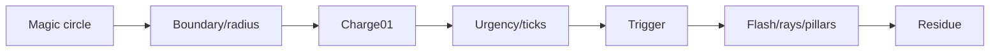

# 1. L09-08 — Light language: magic circle, targeting telegraph і elemental burst

| Поле | Значення |
|---|---|
| Блок | 09 — Effect Archetypes |
| ID уроку | L09-08 |
| Реєстр архетипів | #14 magic circle; #15 targeting telegraph; #16 elemental burst |
| Elemental language | Light: ordered geometry, symmetry, clean rays, accelerating clarity і high-value release |
| Артефакт | `NS_L09_Light_TelegraphBurst` |
| Mastery gate | Radius і burst time truthful, pre-burst warning читається, original prism variant змінює four axes |

## 2. Результат уроку

Ви зможете:

- будувати власний magic circle з оригінальних геометричних assets;
- синхронізувати targeting telegraph з авторитетними radius/time;
- розвивати попередження від спокійного charge до термінового pre-burst;
- будувати elemental burst із Flash, rays, pillars і residue;
- виконувати етичне дослідження референсу без скопійованих sigils/shaders/textures;
- створювати оригінальний призматичний варіант за чотирма осями;
- створювати H/M/L tiers, що ніколи не прибирають сигнали радіуса або моменту impact.

## 3. Орієнтовний час

| Частина | Теорія | Практика | M/S practice |
|---|---:|---:|---:|
| Модель telegraph/light/burst | 0.75 | 0.0 | 0.0 |
| Етап 1 — технічна реконструкція | 0.25 | 1.75 | 0.5 |
| Етап 2 — етичний аналіз референсів | 0.0 | 1.25 | 0.0 |
| Етап 3 — оригінальна варіація | 0.0 | 1.5 | 0.5 |
| Gameplay/performance перевірка | 0.0 | 0.5 | 0.0 |
| **Разом** | **1.0** | **5.0** | **1.0** |

## 4. Передумови

| Навичка | Де | Перевірка |
|---|---|---|
| Радіус persistent area | [L09-07](07_nature_aura_and_area.md) | Збіг 250/450/700 |
| Власна texture magic circle | L05-03 | Оригінальні symbols, без fonts |
| Ring/beam meshes | Блоки 05–06 | Перевірка UV/pivot/material |
| Дані User для таймінгу | L08-03 | Charge01 і duration |
| Мова Light | L02-04 | Правила geometry/order/rays |

## 5. Нові терміни

| Термін | Пояснення |
|---|---|
| Magic circle | Geometric visual structure для ritual/charge/spell identity |
| Targeting telegraph | Pre-action gameplay warning про area і timing |
| Elemental burst | Main release/action layer у trigger time |
| Charge01 | Нормалізований авторитетний progress 0–1 |
| Urgency cue | Зростання contrast, speed або tick frequency біля trigger |
| Countdown tick | Discrete visual event, що позначає remaining time |
| Prismatic split | Кероване розділення вторинних color/rays |
| Safe readability | Telegraph visible на різних backgrounds без obscuring actors |

## 6. Навіщо ця тема потрібна VFX-фахівцю

Telegraph — це gameplay communication перед spectacle. Якщо він неправдиво показує radius або timing, players не можуть приймати fair decisions. Magic circle дає identity/structure; burst дає payoff. Light language є ordered і precise, а не просто yellow bloom.

Reference може підказати countdown cadence, ring hierarchy, ray density і value contrast. Ніколи не copy-іть proprietary sigil, font glyph, circle texture, shader graph або exact animation. Використовуйте original geometric symbols і записуйте provenance.

## 7. Теорія простими словами

Telegraph відповідає на два питання:

```text
Where will it happen?
When will it happen?
```

Magic circle повідомляє вид spell. Boundary показує where. Countdown показує when. Burst відбувається лише після завершення promise. Residue підтверджує action, не приховуючи gameplay aftermath.

## 8. Детальні технічні пояснення

### Три етапи

1. **Технічна реконструкція:** magic circle, boundary, four countdown ticks і radial light burst.
2. **Reference study:** виміряйте charge duration, urgency curve, radius contrast і burst layering; лише own assets.
3. **Оригінальна варіація:**
   - форма: concentric circle → зміщена triangular aperture/prismatic hex;
   - таймінг: рівномірні ticks → прискорені інтервали `.30/.20/.12/.07`;
   - рух: steady rotation → counter-rotating apertures, що блокуються на trigger, потім axial rays;
   - колір: gold-white → ivory Core, cyan/rose prism edges, стриманий темний gap.

### Авторитетний progress

Бажаний контракт:

```text
User.Charge01 = clamp((Now−StartTime)/Duration,0,1)
```

Gameplay system володіє Duration і trigger. Niagara використовує `Charge01` для scale, rotation, material і tick scheduling. Niagara не має independently drift-ити від hit time.

### Контрастні фони

Boundary використовує value/shape contrast, а не лише bloom. Перевірте dark, mid, bright textured ground і color-vision/grayscale capture. Interior може мати low alpha; edge лишається clean.

## 9. Візуальні й математичні приклади

Для duration 1.5 s:

```text
t=.75 → Charge01=.5
t=1.35 → Charge01=.9
t=1.50 → trigger
```

Накопичені моменти прискорених ticks:

```text
.81, 1.11, 1.31, 1.43, trigger 1.50
```



## 10. Контрольовані експерименти

### CE09-08-A — Правдивість timing

- Ігровий trigger у 1.5 s.
- Візуальні варіанти мають trigger 1.4/1.5/1.65.
- Зафіксоване захоплення: прийнятний лише варіант 1.5.

### CE09-08-B — Radius/background

- Перевірте radius 400 cm на темній, сірій і світлій візерунковій підлозі.
- Порівняйте edge лише з bloom і чистий mask/contrast edge.
- Boundary має лишатися читабельною без bloom.

### CE09-08-C — Терміновість

- Порівняйте рівномірні rotation/brightness із прискореними ticks та aperture, що стискається.
- Самоперевірка прогнозує момент impact із вимкненим audio.

## 11. Покрокова керована практика

### Етап 1 — технічна реконструкція

1. Створіть `NS_L09_Light_TelegraphBurst`: `NE_Circle`, `NE_Boundary`, `NE_Ticks`, `NE_ChargeMotes`, `NE_BurstFlash`, `NE_Rays`, `NE_Pillars`, `NE_Residue`.
2. Відкрийте center/normal/radius/Charge01/IsTriggered/colors/seed.
3. Circle: один persistent mesh/card, rotation `15°/s`, scale `.85→1`.
4. Boundary: один ring, відображений на радіус 400 cm, pulse `.96→1.02`.
5. Ticks: чотири геометричні accents, що розвиваються; timing керується порогами Charge01.
6. Motes: 12/s, рухаються всередину до center зі зростанням charge.
7. На trigger: Flash 1 `.09 s`; rays 12 `.25–.4`; pillars 6 `.35`; residue ring `.8`.
8. Перевірте radius/time/background/gameplay camera.

### Етап 2 — етичний аналіз референсів

1. Запишіть source/date референсу; не імпортуйте з нього файлів.
2. Запишіть duration charge, тон boundary:interior, криву tick і пропорції шарів burst.
3. Відбудуйте ефект із власними `T_MagicCircle`, ring/beam meshes і material.
4. Перелічіть оригінальні symbols і спосіб побудови.
5. Задокументуйте три відхилення.

### Етап 3 — оригінальна варіація

1. Створіть дублікат `NS_L09_Light_TelegraphBurst_Prism`.
2. Замініть concentric circle на triangular aperture всередині broken hex.
3. Інтервали Tick `.30/.20/.12/.07`; apertures обертаються зустрічно, потім блокуються за Charge01 .96.
4. Burst випускає axial rays трьома парами й затримані prismatic outer arcs.
5. Палітра: ivory Core, cyan/rose edges і темні negative gaps.
6. Доведіть різницю за чотирма осями та рівність time/radius.

Потребує ручної перевірки в Unreal Engine 5.8. Exact external Charge01 update timing, Blueprint parameter pins, periodic/threshold burst implementation, renderer orientation, material dynamic parameter binding and spawn-at-location options звірте у встановленому build.

## 12. Точна структура Niagara: стеки, матеріали, ресурси, дані й привʼязки

### Контракт User

```text
User.Center       Vector3
User.SurfaceNormal Vector3 = (0,0,1)
User.RadiusCm     Float = 400
User.Charge01     Float = 0
User.IsTriggered  Bool = false
User.PrimaryColor LinearColor = (6,4.5,1.5,1)
User.SecondaryColor LinearColor = (.8,2.5,6,1)
User.Seed         Int = 908
```

### Stacks telegraph

```text
NE_Circle:
  Persistent Burst 1
  Mesh/card aligned to SurfaceNormal
  Scale from RadiusCm; rotation 15°/s
  DynamicParameter.X = Charge01
  Mesh Renderer M_VFX_Light_MagicCircle

NE_Boundary:
  Persistent Burst 1
  Ring scale from RadiusCm
  Pulse scale .96→1.02; alpha .6→1 with Charge01
  Mesh Renderer M_VFX_Light_Boundary

NE_Ticks:
  Burst/activate accents when Charge01 crosses authored thresholds
  4–5 geometric sprites/ring segments; Lifetime .12

NE_ChargeMotes:
  Spawn Rate 12 × (1+Charge01)
  Disc Location Radius .2–1.0×Radius
  Velocity toward center 80–240; Lifetime .5–1.0
```

### Stacks burst

```text
NE_BurstFlash:
  Burst 1 when IsTriggered; Lifetime .09; Sprite 180→40

NE_Rays:
  Burst 12; Lifetime .25–.40; Sprite (8–16,120–320)
  Radial direction in plane; Speed 500–1100
  Drag 3 → Solve; velocity-aligned

NE_Pillars:
  Burst 6; Lifetime .35; Mesh/card vertical beams
  Scale Z .1→1.3→.6; radial positions .25–.7 Radius

NE_Residue:
  Burst 1; Lifetime .8; ring .6→1.1; alpha .5→0
```

### Контракт material

```text
MagicCircleTexture.R × ParticleColor.A × ChargeMask → Opacity
MagicCircleTexture.R × ParticleColor.RGB × lerp(2,7,Charge01) → Emissive
Boundary uses clean radial/mesh edge; bloom is secondary
```

Власні assets: `T_MagicCircle_1024`, власна triangular/hex aperture texture, `SM_VFX_Ring_16`, власні beam cards.

Потребує ручної перевірки в Unreal Engine 5.8. Exact threshold-crossing implementation, persistent particle lifetime/state, dynamic parameters, mesh orientation and trigger reset behavior звірте у встановленому build.

## 13. Стартові значення

| Параметр | Старт | Діапазон |
|---|---:|---:|
| Radius | 400 cm | 200–750 |
| Charge duration | 1.5 s | .6–3 |
| Circle rotation | 15°/s | −45–45 |
| Boundary pulse | .96→1.02 | .92–1.08 |
| Motes | 12–24/s | 0–36 |
| Flash | .09 s / 180 cm | .05–.14 |
| Rays | 12 | 6–24 |
| Pillars | 6 | 0–10 |
| Residue | .8 s | .3–1.5 |

## 14. Очікуваний результат кожного етапу

| Етап | Доказ |
|---|---|
| Magic circle | Оригінальна геометрія й чиста ієрархія |
| Telegraph | Radius/time відповідають gameplay |
| Burst | Контакт trigger чіткий і багатошаровий |
| Дослідження референсу | Лише метрики/provenance |
| Оригінальна форма | Prism aperture/hex |
| Оригінальний таймінг | Прискорений ритм ticks |
| Оригінальний рух | Counter-rotate, lock, axial release |
| Оригінальний колір | Ivory/cyan/rose з темними gaps |

## 15. Самостійна вправа A

### EX-L09-08-A — Чесний targeting telegraph

Побудуйте #14 magic circle і #15 telegraph.

- radius 250/400/650 у межах 5%;
- trigger .8/1.5/2.5 s синхронізовано;
- читається на трьох фонах і у відтінках сірого;
- власні symbols/assets;
- H/M/L зберігають «де/коли».

## 16. Додаткова складніша вправа B

### EX-L09-08-B — Оригінальний призматичний elemental burst

Пройдіть три stages для #16.

- оригінальна геометрія, без proprietary sigil/font;
- змінено форму, таймінг, рух і колір;
- burst точно слідує за telegraph;
- умова приймання: повторна самоперевірка прогнозує момент і радіус до burst, включно з Low.

## 17. Три підказки для кожної вправи

### EX-L09-08-A

1. **Hint 1:** gameplay володіє radius і Charge01.
2. **Hint 2:** dedicated boundary для where; accelerating contrast/ticks для when.
3. **Hint 3:** map ring до RadiusCm; charge від caller; test 250/400/650 і .8/1.5/2.5; trigger exact при Charge01=1.

[Повне рішення EX-L09-08-A](../EXERCISE_ANSWERS/L09-08_light_telegraph_and_burst_answers.md#ex-l09-08-a)

### EX-L09-08-B

1. **Hint 1:** redesign-ніть symbol і cadence до додавання bloom.
2. **Hint 2:** triangular aperture/broken hex, accelerating ticks, counter-rotation lock і paired axial rays.
3. **Hint 3:** intervals .30/.20/.12/.07; lock у .96; ray pairs під 0/60/120°; ivory core, cyan/rose split, negative dark gaps.

[Повне рішення EX-L09-08-B](../EXERCISE_ANSWERS/L09-08_light_telegraph_and_burst_answers.md#ex-l09-08-b)

## 18. Типові помилки

| Помилка | Симптом | Виправлення |
|---|---|---|
| Візуальний timer незалежний | Burst зарано або запізно | Авторитетний Charge01 |
| Boundary лише з bloom | Губиться на світлій поверхні | Чистий edge тону/форми |
| Circle надто деталізований | Нечитабельний gameplay | Ієрархія/спрощення |
| Burst раніше за обіцянку | Нечесно | Точна синхронізація trigger |
| Скопійовано sigil/font | Порушення етики | Оригінальна геометрія |
| Лише gold recolor | Загальна мова Light | Упорядковані motion/geometry |
| Low прибирає ticks/boundary | Немає попередження | Зберегти «де/коли» |
| Interior ховає персонажів | Візуальний шум | Зменшити opacity/density |

## 19. Пошук несправностей

| Симптом | Діагностика | Виправлення |
|---|---|---|
| Radius неправильний | Debug circle/mesh bounds | Scale mapping |
| Circle обертається off-center | Pivot/UV/mesh | Виправте own asset |
| Charge стрибає | Update/log параметра | Стабільний нормалізований caller |
| Tick repeats | Threshold state | Зберігайте crossed state або deterministic schedule |
| Burst з’являється двічі | Detection edge trigger | One-shot guard/reset |
| Ground мерехтить | Offset/depth | Surface bias/вибір material |
| Втрата на bright ground | Bloom-off view | Value/outline contrast |

## 20. Продуктивність і рівні High/Medium/Low

| Рівень | Telegraph | Burst | Вторинні шари |
|---|---|---|---|
| High | circle + boundary + 24 motes + 5 ticks | 12 rays + 6 pillars | residue/prism arcs |
| Medium | простіший circle + boundary + 12 motes + 4 ticks | 8 rays + 3 pillars | residue |
| Low | boundary + 3 ticks | Flash + 6 rays | немає |

- Обіцянка «де/коли» зберігається на всіх tiers.
- Великі ground layers і bloom можуть домінувати в overdraw.
- Тривалість persistent telegraph множить вартість за одночасних casts.
- Перевірте 1, 6 і 16 telegraphs та одночасний trigger.
- Low прибирає interior/pillars раніше за boundary/ticks.
- Точні пороги scalability потребують профілю цільової платформи.

Потребує ручної перевірки в Unreal Engine 5.8. Exact renderer-cost, overdraw visualization, persistent bounds, Effect Type and scalability controls звірте у встановленому build.

## 21. Запитання для самоперевірки

1. Які archetypes мають номери #14–16?
2. На які два питання має відповісти telegraph?
3. Хто володіє Charge01?
4. Чому bloom недостатньо для boundary?
5. Чому light — це більше, ніж gold?
6. Які four original axes змінюються?
7. Що зберігається в Low?
8. Навіщо guard-ити trigger edge?

## 22. Відповіді

1. Magic circle, targeting telegraph і elemental burst.
2. Where і when.
3. Авторитетний gameplay timer/ability.
4. Він disappears/varies на bright backgrounds і не гарантує clean edge.
5. Ordered geometry, symmetry, clean rays і accelerating clarity.
6. Shape, timing, motion і color.
7. Accurate boundary, countdown/urgency і core burst contact.
8. Щоб запобігти multiple burst spawns, поки trigger лишається true.

## 23. Чекліст самоперевірки

- [ ] #14–16 внесено до реєстру.
- [ ] Використано лише власні magic circle/symbols.
- [ ] Матрицю radius/time пройдено.
- [ ] Виконано перевірки трьох фонів і відтінків сірого.
- [ ] Дослідження референсу етичне.
- [ ] Prism variation змінює чотири осі.
- [ ] Trigger one-shot/reset працює.
- [ ] H/M/L зберігають «де/коли».
- [ ] Є докази concurrency/overdraw/bounds.
- [ ] До M/S ledger додано 1.0 години.

## 24. Критерії опанування

1. Magic circle оригінальний і читабельний.
2. Radius/time telegraph правдиві.
3. Burst синхронізований і багатошаровий.
4. Ідентичність Light зберігається без bloom і у відтінках сірого.
5. Перевірку reference/provenance пройдено.
6. Є оригінальна різниця за чотирма осями.
7. Є докази tiers/concurrency.
8. Правильні щонайменше 7/8 відповідей.

## 25. Підсумок

- Magic circle надає ідентичність; telegraph — чесність; burst — розрядку.
- Gameplay володіє радіусом і таймінгом.
- Мова Light використовує порядок і чисте прискорення.
- Оригінальна prism змінює чотири осі.
- H/M/L ніколи не прибирають «де/коли».

## 26. Зв’язок із наступними уроками

[L09-09](09_void_spawn_transformation_ultimate.md) поєднує telegraph, стан персонажа й багатофазний release у spawn/transformation/ultimate; та сама правдивість таймінгу й контракти життєвого циклу лишаються обов’язковими.

## 27. Офіційні джерела

- [NIA-05 — System and Emitter Module Reference](https://dev.epicgames.com/documentation/en-us/unreal-engine/system-and-emitter-module-reference-for-niagara-effects-in-unreal-engine) — Epic Games, UE 5.8, доступ 2026-07-27.
- [NIA-06 — Render Module Reference](https://dev.epicgames.com/documentation/en-us/unreal-engine/render-module-reference-for-niagara-effects-in-unreal-engine) — Epic Games, UE 5.8, доступ 2026-07-27.
- [NIA-07 — System Settings Reference](https://dev.epicgames.com/documentation/en-us/unreal-engine/system-settings-reference-for-niagara-effects-in-unreal-engine) — Epic Games, UE 5.8, доступ 2026-07-27.
- [BP-01 — Spawn System at Location](https://dev.epicgames.com/documentation/en-us/unreal-engine/BlueprintAPI/Niagara/SpawnSystematLocation) — Epic Games, UE 5.8, доступ 2026-07-27.
- [PERF-02 — Scalability and Best Practices](https://dev.epicgames.com/documentation/en-us/unreal-engine/scalability-and-best-practices-for-niagara) — Epic Games, UE 5.8, доступ 2026-07-27.

## 28. Рекомендовані скриншоти або схеми

```text
Скриншот 1
Відкрити: gameplay radius/time debug.
Показати: three radii, Charge01 and trigger marker.
Виділити: where/when equality.
```

```text
Скриншот 2
Відкрити: original magic circle source/provenance and prism stage.
Показати: symbols, tick timing and counter-rotation.
Виділити: no proprietary assets.
```

```text
Скриншот 3
Відкрити: H/M/L on dark/gray/bright floor.
Показати: simultaneous trigger and overdraw.
Виділити: retained boundary/countdown.
```
