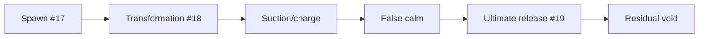

# 1. L09-09 — Darkness/void language: spawn, transformation і character ultimate

| Поле | Значення |
|---|---|
| Блок | 09 — Effect Archetypes |
| ID уроку | L09-09 |
| Реєстр архетипів | #17 spawn; #18 transformation; #19 character ultimate |
| Elemental language | Void: negative space, inward suction, asymmetry, false calm, inversion і delayed release |
| Артефакт | `NS_L09_Void_Sequence`, transformation/ultimate prototype |
| Assessment | [Block 09 Assessment](BLOCK_ASSESSMENT.md), 3.0 години included in this lesson |
| Mastery gate | Coherent multi-phase sequence, ethical reference, four-axis original version і ledger 19/19 |

## 2. Результат уроку

Ви зможете:

- будувати spawn reveal, зміну стану transformation і послідовність ultimate;
- координувати attached і world-space emitters у довгих фазах;
- передавати Void через absorption/inversion, а не purple recolor;
- синхронізувати telegraph/charge/release із gameplay;
- виконувати етичне дослідження референсу лише з оригінальними assets;
- створювати оригінальний eclipse variation за чотирма осями;
- подавати H/M/L послідовність і завершувати покриття 19/19 та оцінювання.

## 3. Орієнтовний час

| Частина | Теорія | Практика | M/S practice |
|---|---:|---:|---:|
| Багатофазна/void architecture | 0.75 | 0.0 | 0.0 |
| Stage 1 — технічна реконструкція | 0.25 | 0.75 | 0.25 |
| Stage 2 — етичне reference study | 0.0 | 0.5 | 0.0 |
| Stage 3 — оригінальна варіація | 0.0 | 0.75 | 0.75 |
| `BLOCK_ASSESSMENT` | 0.0 | 3.0 | 0.0 |
| **Разом** | **1.0** | **5.0** | **1.0** |

Години оцінювання вже входять до практики L09-09. Не додавайте їх до підсумку блоку. Разом у блоці 09: `11 T / 47 P = 58 h`; M/S `9 h`.

## 4. Передумови

| Навичка | Де | Перевірка |
|---|---|---|
| Усі 16 попередніх архетипів | L09-01–L09-08 | Coverage ledger 16/19 |
| Правдивий таймінг telegraph | [L09-08](08_light_telegraph_and_burst.md) | Charge01 і radius |
| Attachment/lifecycle aura | [L09-07](07_nature_aura_and_area.md) | Enter/loop/exit |
| Розширені parameters/bounds | G08 | User phase, fixed/dynamic bounds |
| Мова Void | L02-04 | Inward, pause, inversion, asymmetry |

## 5. Нові терміни

| Термін | Пояснення |
|---|---|
| Spawn | Візуальний архетип arrival/reveal |
| Transformation | Sustained transition між character/entity states |
| Character ultimate | Багатофазний прототип важливої ability |
| Phase contract | Авторитетні іменовані/нормалізовані стани послідовності |
| False calm | Короткий low-motion interval, що підсилює release contrast |
| Suction | Inward motion до center |
| Inversion burst | Motion/value relationship flips під час release |
| Silhouette shell | Attached layer, що змінює character outline без replacement gameplay mesh |
| Residual void | Тривалий low-contrast aftermath |

## 6. Навіщо ця тема потрібна VFX artist

Ultimate тестує architecture, art direction і restraint. Він поєднує telegraph, character state, motion hierarchy, camera readability, bounds і concurrency. Spawn і transformation мають лишатися readable до final release; інакше ultimate стає bright unrelated explosion.

Reference ethics тут найсуворіша: не відтворюйте famous ultimate beat-for-beat, не extract-іть character effects, не trace-іть silhouettes, не copy-іть sigils і не rip-іть audio/flipbooks. Записуйте abstract phase ratios і будуйте кожний asset/system самостійно.

## 7. Теорія простими словами

Послідовність Void:

```text
something arrives → identity changes → energy disappears inward
→ silence → space returns violently → residue proves consequence
```

Void — не лише black/purple. Negative space, asymmetry, inward motion і delayed inversion створюють language. Gameplay і далі володіє phase timing, target/radius і damage window.

## 8. Детальні технічні пояснення

### Три stages

1. **Технічна реконструкція:** portal spawn, attached transformation shell, suction/charge, false calm, release і residue.
2. **Reference study:** лише normalized phase ratios, silhouette coverage, inward/outward speed і contrast; own assets.
3. **Оригінальна варіація:**
   - форма: round portal → зміщений eclipse із трьома fractured void petals;
   - таймінг: linear charge → швидкий reveal, довгий suction, false calm `.18 s`, two-part release;
   - рух: simple radial → logarithmic inward spiral, потім inversion напрямку;
   - колір: purple-black → майже чорний Body, pale mint Core, rose-violet fracture edge.

### Дані phases

Запропоновані authoritative values:

```text
Phase 0 Spawn       0.00–.45
Phase 1 Transform   .45–1.25
Phase 2 Charge      1.25–2.10
Phase 3 False calm  2.10–2.28
Phase 4 Release     2.28–2.70
Phase 5 Residue     2.70–4.00
```

Expose-ніть `User.PhaseIndex` і `User.Phase01`; gameplay/cinematic controller update-ить їх. Уникайте independent emitter clocks для gameplay-critical release.

### Розподіл attached/world-space

Silhouette shell/orbit слідує за character. Portal, telegraph radius і ground residue лишаються world-space. Під час character teleport/despawn attached trails/shells safely stop; world residue має власний lifecycle.

## 9. Візуальні й математичні приклади

Inward spiral:

```text
radius(t)=R0×(1−t)^1.6
angle(t)=angle0+2.5×2π×t
position=center+basisY×cos(angle)×radius+basisZ×sin(angle)×radius
```

Під час release інвертуйте radial velocity і підвищте speed `180→900 cm/s`.



## 10. Контрольовані експерименти

### CE09-09-A — False calm

- A: безперервний charge→burst.
- B: та сама duration із `.18 s` calm, де motion і аудіовізуальна інтенсивність низькі.
- Порівняйте сприйняту силу release й чесність telegraph.

### CE09-09-B — Покриття силуету

- Перевірте opacity/size Shell за покриття персонажа 30/60/90%.
- Gameplay animation має лишатися впізнаваною.
- Виберіть безпечний для цільової камери діапазон.

### CE09-09-C — Авторитетність фаз

- Змініть загальну duration з 2.7 на 1.8/4.0 s.
- Зовнішні дані Phase зберігають синхронізацію release; незалежні clocks emitters виявляють drift.

## 11. Покрокова guided practice

### Stage 1 — технічна реконструкція

1. Створіть `NS_L09_Void_Sequence`: `NE_Portal`, `NE_Suction`, `NE_Shell`, `NE_OrbitShards`, `NE_Telegraph`, `NE_Collapse`, `NE_Release`, `NE_Residue`.
2. Відкрийте center/owner transform/radius/phase/charge/release/colors/seed.
3. Spawn: portal ring `.45 s`, scale `.2→1.1→.8`; 24 inward motes.
4. Transformation: attached shell `.45–1.25`, alpha `0→.55`; 8 orbit shards.
5. Charge: suction 24/s, life `.8`, radius 350→0; boundary telegraph до 500 cm.
6. False calm: spawn rate/intensity зменшено до 10–20%, boundary лишається видимою.
7. Release: Flash 1 `.08`, burst petals 3, streaks 18, wave 1; точний damage time.
8. Residue: ground eclipse `.9–1.3 s`, низька alpha, потім повне завершення.

### Stage 2 — етичне reference study

1. Запишіть доступні для законного перегляду source/date й лише пропорції фаз.
2. Запишіть покриття силуету, duration suction, contrast calm:release і ratio residue.
3. Відбудуйте ефект із власними eclipse/petal masks, ring/shard meshes і materials.
4. Заборонено скопійований силует персонажа, sigil, extracted flipbook/audio/shader.
5. Запишіть provenance і три відхилення.

### Stage 3 — оригінальна варіація

1. Створіть дублікат `NS_L09_Void_Sequence_Eclipse`.
2. Використайте зміщений eclipse плюс три fractured petals, а не центрований round portal.
3. Timeline: reveal `.32`, suction `1.05`, calm `.18`, release A `.10`, gap `.06`, release B `.24`.
4. Motes рухаються inward spiral 2.5 оберти; release інвертує спіраль і чергує напрямок petals.
5. Палітра: near-black, pale mint Core, rose-violet Edge.
6. Порівняйте technical/reference/original і виконайте перевірку H/M/L із gameplay camera.

Потребує ручної перевірки в Unreal Engine 5.8. Exact attached/world transform behavior, phase parameter update pins, shell/material bindings, trigger edge/reset, renderer support, bounds and pooling lifecycle звірте у встановленому build.

## 12. Точні Niagara stacks, materials, assets, data і bindings

### Контракт User

```text
User.Center          Vector3
User.OwnerPosition   Vector3
User.OwnerUp         Vector3 = (0,0,1)
User.RadiusCm        Float = 500
User.PhaseIndex      Int = 0
User.Phase01         Float = 0
User.IsRelease       Bool = false
User.PrimaryColor    LinearColor = (.02,.005,.05,1)
User.CoreColor       LinearColor = (.8,4.0,2.8,1)
User.EdgeColor       LinearColor = (2.5,.15,1.4,1)
User.Seed            Int = 909
```

### Stacks spawn/transformation

```text
NE_Portal:
  Burst 1 in Phase0; Lifetime .45
  Mesh ring/eclipsed card; Scale .2→1.1→.8
  DynamicParameter.X = Phase01

NE_Suction:
  Spawn Rate 24 in Phase2, 3 in Phase3
  Lifetime .6–.9; Sprite 8–24
  Initial radius 220–380
  Spiral/inward position or forces; Drag 1.2

NE_Shell:
  Attached/local emitter; persistent one mesh/card set
  Alpha 0→.55 during Transform; .55→.2 Charge; 0 at release
  Renderer M_VFX_Void_Shell

NE_OrbitShards:
  Burst 8 Phase1; Lifetime through Phase3
  Radius 90–140; angular speed 1.2–2.4 rad/s
  Mesh Renderer own shard mesh
```

### Telegraph/release/residue

```text
NE_Telegraph:
  Persistent ring Phase2–3; scale from RadiusCm
  Collapse scale 1→.12 during Phase3; boundary remains readable

NE_Release:
  One-shot on rising edge IsRelease
  Flash 1 .08; petal meshes 3 .34; streaks 18 .25–.6
  Radial speed 450–1000 + reversed spiral
  Wave mesh .05→1.15×Radius in .42

NE_Residue:
  Burst 1 after release; Lifetime 1.1
  Eclipse card/ring .7→1.0; Alpha .35→0
```

### Контракт material Void

```text
OwnVoidMask.R × ParticleColor.A → Opacity
OwnVoidMask.R × Core/Edge masks × HDR colors → Emissive
OwnDistortion.RG−.5 × Strength(.015) → optional UV distortion
DynamicParameter.X/Y → Phase/Reveal controls
```

Власні assets: оригінальні eclipse/petal masks, `T_Distortion_RG_512`, власні ring/shard meshes. Необов’язковий distortion прибирається в Low.

Потребує ручної перевірки в Unreal Engine 5.8. Exact Dynamic Parameter channels, translucent distortion/refraction support, phase-trigger implementation, local/world emitter coordination and bounds behavior звірте у встановленому build.

## 13. Стартові значення

| Параметр | Старт | Діапазон |
|---|---:|---:|
| Spawn | .45 s | .25–.8 |
| Transform | .8 s | .4–1.4 |
| Charge/suction | .85 s | .4–1.6 |
| False calm | .18 s | .08–.3 |
| Release | .42 s | .2–.75 |
| Residue | 1.1 s | .5–2 |
| Radius | 500 cm | 300–900 |
| Suction | 24/s | 8–40 |
| Release streaks | 18 | 6–30 |
| Shell alpha | .55 max | .25–.7 |

## 14. Очікуваний результат кожного етапу

| Етап | Доказ |
|---|---|
| Spawn | Місце й силует arrival зрозумілі |
| Transformation | Зміна state слідує за персонажем, не ховаючи animation |
| Ultimate | Telegraph, calm і точний release цілісні |
| Дослідження референсу | Лише пропорції/provenance |
| Оригінальна форма | Зміщений eclipse/три petals |
| Оригінальний таймінг | Reveal/suction/calm/two-part release |
| Оригінальний рух | Inward spiral→inversion |
| Оригінальний колір | Near-black/mint/rose-violet |

## 15. Самостійна вправа A

### EX-L09-09-A — Прототип переходу spawn-to-transformation

Побудуйте #17 spawn і #18 transformation.

- зовнішній контракт phase;
- attached shell і world portal скоординовано;
- силует animation лишається видимим;
- безпечні teleport/deactivate/reset;
- H/M/L і provenance.

## 16. Додаткова складніша вправа B

### EX-L09-09-B — Оригінальний eclipse character ultimate

Пройдіть три stages для #19.

- radius/time telegraph авторитетні;
- оригінальний варіант змінює форму, таймінг, рух і колір;
- false calm не прибирає сигнал чесності;
- two-part release і residue;
- готові до оцінювання докази H/M/L, bounds і concurrency.

## 17. Три підказки для кожної вправи

### EX-L09-09-A

1. **Hint 1:** відокремте world arrival mark від attached character state.
2. **Hint 2:** external PhaseIndex/Phase01 контролює portal, shell і shards; reset-іть trails під час teleport.
3. **Hint 3:** Phase0 portal .45; Phase1 shell alpha 0→.55 плюс 8 shards; на despawn зупиніть attached emitters, лишіть тільки bounded world residue.

[Повне рішення EX-L09-09-A](../EXERCISE_ANSWERS/L09-09_void_spawn_transformation_ultimate_answers.md#ex-l09-09-a)

### EX-L09-09-B

1. **Hint 1:** void force походить від inward absorption і delayed inversion.
2. **Hint 2:** використайте offset eclipse/three petals, long suction, visible boundary під час calm і reversed spiral release.
3. **Hint 3:** reveal .32, suction 1.05, calm .18, release .10/.06/.24; 2.5 inward turns, потім reverse; near-black/mint/rose-violet.

[Повне рішення EX-L09-09-B](../EXERCISE_ANSWERS/L09-09_void_spawn_transformation_ultimate_answers.md#ex-l09-09-b)

## 18. Типові помилки

| Помилка | Симптом | Fix |
|---|---|---|
| Лише purple recolor | Загальна магія | Inward/calm/inversion/asymmetry |
| Незалежні clocks | Drift release | Зовнішній phase contract |
| False calm ховає boundary | Нечесний telegraph | Зберегти сигнал radius/time |
| Shell перекриває персонажа | Animation втрачено | Обмежити opacity/coverage |
| Кожна фаза має максимальну intensity | Немає ієрархії | Contrast і silence |
| Миттєве знищення component | Phase/residue обрізаються | Явний життєвий цикл |
| Ultimate скопійовано | Порушення етики | Абстрактні пропорції/оригінальні assets |
| Low прибирає telegraph | Ігрова помилка | Зберегти boundary/release |

## 19. Пошук несправностей

| Симптом | Діагностика | Виправлення |
|---|---|---|
| Portal слідує за character | Space/attachment | World-space portal |
| Shell відстає | Owner transform/update | Attached/local contract |
| Подвійний release | Стан edge trigger | One-shot guard/reset |
| Calm виглядає deactivated | Boundary/charge state | Low-motion persistent cue |
| Spiral вибухає | Математика radius/time | Clamp нормалізованої phase |
| Distortion надто costly | Material tier/profile | Remove/reduce у M/L |
| Ultimate culls | Full phase bounds | Перевірте world + attached ranges |

## 20. Performance і High/Medium/Low

| Рівень | Spawn/transform | Charge | Release/residue |
|---|---|---|---|
| High | portal + shell + 8 shards | 24/s suction + distortion | 3 petals +18 streaks+wave+residue |
| Medium | portal + shell +4 shards | 12/s, простіший material | 3 petals +10 streaks+wave |
| Low | portal card + контур shell | 6/s, без distortion | Flash+wave+3 силуети petals |

- Зберігайте місце spawn, transformed state, радіус telegraph і час release.
- Довгий багатофазний System накопичує particles/material layers; профілюйте всю послідовність.
- Перевірте один hero ultimate плюс 4 одночасні екземпляри нижчого пріоритету.
- Distortion, великий translucent shell і wave є типовими ризиками GPU.
- Bounds охоплюють world portal/radius і attached shell, але не мають бути довільними.
- Точні пороги tier потребують вимірювань на цільовій платформі.

Потребує ручної перевірки в Unreal Engine 5.8. Exact multi-emitter bounds, attached/world culling, distortion renderer cost, Effect Type/scalability and pooling reset behavior звірте у встановленому build.

## 21. Запитання для самоперевірки

1. Які archetypes мають номери #17–19?
2. Чому void — це більше, ніж purple?
3. Хто володіє phases/release?
4. Навіщо зберігати boundary під час false calm?
5. Які layers є attached/world-space?
6. Які four axes змінюються?
7. Що зберігається в Low?
8. Які total Block 09 і total M/S?

## 22. Відповіді

1. Spawn, transformation і character ultimate.
2. Negative space, inward suction, asymmetry, false calm і inversion.
3. Авторитетний gameplay/cinematic controller.
4. Fairness: players і далі бачать where/when release.
5. Shell/orbit attach до owner; portal/telegraph/residue лишаються world-space.
6. Shape, timing, motion і color.
7. Spawn location, transformed state, telegraph radius і exact release.
8. 58 годин = 11T/47P; M/S 9 годин.

## 23. Чекліст самоперевірки

- [ ] #17–19 внесено до реєстру; покриття 19/19.
- [ ] Зовнішні фази синхронізують усі шари.
- [ ] World/attached spaces задокументовано.
- [ ] Силует персонажа лишається читабельним.
- [ ] Етичність reference/provenance підтверджено.
- [ ] Eclipse variation змінює чотири осі.
- [ ] H/M/L зберігають fairness/state.
- [ ] Є профіль bounds/concurrency/full-sequence.
- [ ] Оцінювання блоку завершено в межах годин L09-09.
- [ ] Загальний M/S ledger = 9.0 h.

## 24. Критерії опанування

1. Spawn, transformation і ultimate читаються як одна послідовність.
2. Синхронізація phase/release є авторитетною.
3. Ідентичність Void зберігається у відтінках сірого й після color swap.
4. False calm лишається чесним.
5. Етичну перевірку референсу пройдено.
6. Є оригінальна різниця за чотирма осями.
7. Є докази H/M/L/full-sequence.
8. Оцінювання G09 ≥80 і пороги категорій виконано.

## 25. Підсумок

- Spawn позначає arrival; transformation змінює state; ultimate завершує arc.
- Void використовує suction, silence й inversion.
- Зовнішні фази запобігають drift таймінгу.
- Attached/world-space layers потребують окремих lifecycle/bounds.
- Оригінальний eclipse змінює чотири осі.
- Покриття 19/19 завершує блок 09.

## 26. Зв’язок із наступними уроками

Блок 10 у [карті курсу](../01_COURSE_MAP.md) інтегрує systems через життєвий цикл gameplay/Blueprint і виконує формальні optimization/profiling. Збережіть усі докази H/M/L, bounds, timing і provenance.

## 27. Офіційні джерела

- [NIA-05 — System and Emitter Module Reference](https://dev.epicgames.com/documentation/en-us/unreal-engine/system-and-emitter-module-reference-for-niagara-effects-in-unreal-engine) — Epic Games, UE 5.8, доступ 2026-07-27.
- [NIA-06 — Render Module Reference](https://dev.epicgames.com/documentation/en-us/unreal-engine/render-module-reference-for-niagara-effects-in-unreal-engine) — Epic Games, UE 5.8, доступ 2026-07-27.
- [NIA-07 — System Settings Reference](https://dev.epicgames.com/documentation/en-us/unreal-engine/system-settings-reference-for-niagara-effects-in-unreal-engine) — Epic Games, UE 5.8, доступ 2026-07-27.
- [BP-01 — Spawn System at Location](https://dev.epicgames.com/documentation/en-us/unreal-engine/BlueprintAPI/Niagara/SpawnSystematLocation) — Epic Games, UE 5.8, доступ 2026-07-27.
- [BP-02 — Spawn System Attached](https://dev.epicgames.com/documentation/en-us/unreal-engine/BlueprintAPI/Niagara/SpawnSystemAttached) — Epic Games, UE 5.8, доступ 2026-07-27.
- [PERF-02 — Scalability and Best Practices](https://dev.epicgames.com/documentation/en-us/unreal-engine/scalability-and-best-practices-for-niagara) — Epic Games, UE 5.8, доступ 2026-07-27.

## 28. Рекомендовані скриншоти або схеми

```text
Скриншот 1
Відкрити: phase timeline and emitter activation table.
Показати: spawn/transform/charge/calm/release/residue.
Виділити: authoritative phase/release markers.
```

```text
Скриншот 2
Відкрити: three-stage eclipse comparison and provenance.
Показати: white silhouettes, spiral paths, timing graph and color strip.
Виділити: four-axis originality.
```

```text
Скриншот 3
Відкрити: H/M/L full sequence plus 19/19 ledger.
Показати: bounds, concurrency and assessment link.
Виділити: retained fairness/state/release.
```
